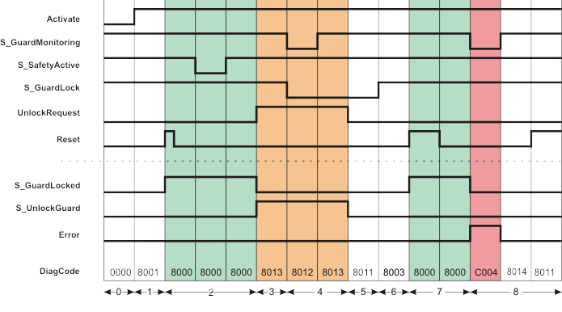

# Additional signal sequence diagrams

Temporary intermediate states are not illustrated in the signal sequence diagrams. Only typical input signal combinations are illustrated in these diagrams. Other signal combinations are possible.

The most significant areas within the signal sequence diagrams are highlighted in color.

**Further Information:**

Refer also to the diagram found in the [overview](sfguardlocking.html#sfguardlocking) for this function block.

**NOTE:**

The signal sequence diagrams in this documentation possibly omit particular diagnostic codes. For example, a diagnostic code is possibly not shown if the related function block state is a temporary transition state and only active for one cycle of the Safety Logic Controller.

Only typical input signal combinations are illustrated. Other signal combinations are possible.

The diagram below shows the signal sequence of a typical application, based on the following assumptions:

**S\_StartReset = SAFEFALSE:** Start-up inhibit after the function block has been activated and the Safety Logic Controller has started up

**S\_AutoReset = SAFEFALSE:** Restart inhibit after the guard locking on the closed safety equipment has been locked (i.e., once the SAFETRUE signal has returned at the S\_GuardLock input).

|  |  |
| --- | --- |
| 0 | The function block is not yet activated (Activate = FALSE).  As a result, all outputs are FALSE or SAFEFALSE. |
| 1 | Function block activated by Activate = TRUE.  Even though the safety equipment is closed (S\_GuardMonitoring = SAFETRUE) and locked (S\_GuardLock = SAFETRUE) and the zone of operation signals the defined safe state (S\_SafetyActive = SAFETRUE), the S\_GuardLocked output = SAFEFALSE, as a start-up inhibit (S\_StartReset = SAFEFALSE) is specified. |
| 2 | A positive edge at the Reset input removes the start-up inhibit and the S\_GuardLocked output switches to SAFETRUE.  The S\_GuardLocked output remains SAFETRUE, although the S\_SafetyActive input is SAFEFALSE for some time (zone of operation is temporarily no longer in the defined safe state). |
| 3 | The request to unlock the guard locking triggered by UnlockRequest = TRUE and the confirmation that the zone of operation is in the defined safe state again (S\_SafetyActive = SAFETRUE) cause the S\_GuardLocked output to switch to SAFEFALSE and the S\_UnlockGuard output to SAFETRUE.  The S\_UnlockGuard output remains SAFETRUE for as long as the unlock request is present at the UnlockRequest input. |
| 4 | The safety equipment is opened (S\_GuardMonitoring and S\_GuardLock both become SAFEFALSE) and closed again (S\_GuardMonitoring becomes SAFETRUE again), but not locked after closing (S\_GuardLock remains SAFEFALSE). Therefore, the S\_GuardLocked output remains SAFEFALSE. |
| 5 | The S\_UnlockGuard output switches to SAFEFALSE, as input UnlockRequest is now also FALSE. The safety equipment is not yet locked (S\_GuardLock is still SAFEFALSE). |
| 6 | Even though the safety equipment is closed (S\_GuardMonitoring = SAFETRUE) and now locked again (S\_GuardLock = SAFETRUE) and the zone of operation signals the defined safe state (S\_SafetyActive = SAFETRUE), the S\_GuardLocked output remains SAFEFALSE, as a restart inhibit (S\_AutoReset = SAFEFALSE) is active. |
| 7 | A positive edge at the Reset input removes the restart inhibit and the S\_GuardLocked output switches to SAFETRUE. |
| 8 | The safety equipment signals it is open (input S\_GuardMonitoring becomes SAFEFALSE) without a request via UnlockRequest. Confirmation that the safety equipment is locked is also provided by S\_GuardLock = SAFETRUE.  S\_GuardLocked is then switched to SAFEFALSE and an error message is output (output Error = TRUE).  Once the error has been removed (input S\_GuardMonitoring becomes SAFETRUE again), the error state of the function block is left (Error output is switched to FALSE). This is possible because S\_GuardLock and S\_SafetyActive are still SAFETRUE. However, a positive signal edge at the Reset input is required to bring the function block back into normal operation state. |

EIO0000002269.01

© 2020

Schneider Electric.

All rights reserved.