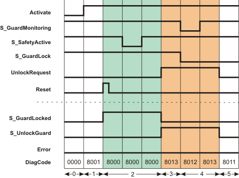
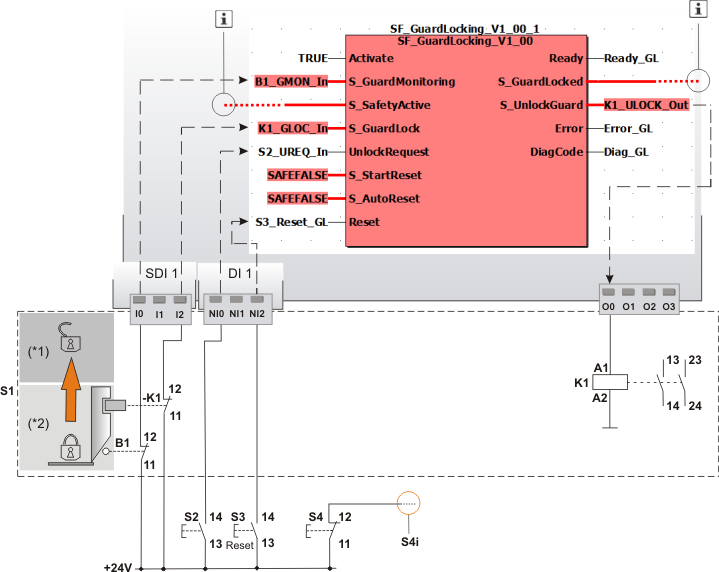

# SF\_GuardLocking

The following description is valid for the function block SF\_GuardLocking\_V1\_0z, Version 1.0z (where z = 0 to 9).

## Short description

|  |  |
| --- | --- |
| The safety-related SF\_GuardLocking function block supports the monitoring of a guard with guard locking (door monitoring with a four-stage interlocking according to the EN 1088 standard).  S\_StartReset can be used to specify a start-up inhibit and S\_AutoReset can be used to specify a restart inhibit. |  |

**NOTE:**

All the safety-related switches used in your application must meet the requirements of the EN 1088 standard.

## Function block inputs

Click the corresponding hyperlinks to obtain detailed information on the items below.

| Name | Short description | Value |
| --- | --- | --- |
| [Activate](act_GuardLocking.html#act_GuardLocking) | State-controlled input for activating the function block.  Data type: BOOL  Initial value: FALSE | * **FALSE**: Function block inactive * **TRUE**: Function block activated |
| [S\_GuardMonitoring](g_mon_GuardLocking.html#g_mon_GuardLocking) | State-controlled input for signaling open or closed safety equipment (e.g., by means of a position switch on the door).  Data type: SAFEBOOL  Initial value: SAFEFALSE | * **SAFEFALSE**: Safety equipment is open * **SAFETRUE**: Safety equipment is closed |
| [S\_SafetyActive](s_act_GuardLocking.html#s_act_GuardLocking) | State-controlled input for the status of the zone of operation.  This input indicates whether the zone of operation is in the defined safe state. (Monitoring using standstill monitor, for example).  Data type: SAFEBOOL  Initial value: SAFEFALSE | * **SAFEFALSE**: The zone of operation signals the non-safe state * **SAFETRUE**: The zone of operation signals the defined safe state |
| [S\_GuardLock](g_loc_GuardLocking.html#g_loc_GuardLocking) | State-controlled input for the status of the guard locking on the safety equipment. This input processes the feedback signal for locking/unlocking the safety equipment (single-channel or two-channel).  Data type: SAFEBOOL  Initial value: SAFEFALSE | * **SAFEFALSE**: The door is not locked. The safety equipment can be opened. * **SAFETRUE**: The door is locked |
| [UnlockRequest](u_req_GuardLocking.html#u_req_GuardLocking) | State-controlled and edge-triggered input for the request signal to unlock the door (or the guard locking).  Data type: BOOL  Initial value: FALSE | * **FALSE**: No request to unlock the door * Edge **FALSE > TRUE**: Request to unlock the door * **TRUE**: The TRUE signal must be maintained for as long as the guard locking is unlocked via S\_UnlockGuard (e.g., opening the safety equipment) |
| [S\_StartReset](prog_s_res_GuardLocking.html#prog_s_res_GuardLocking) | State-controlled input for specifying the start-up inhibit after the Safety Logic Controller has been started up or the function block has been activated.  Data type: SAFEBOOL  Initial value: SAFEFALSE  An active start-up inhibit must be removed manually by means of a positive signal edge at the Reset input. A deactivated start-up inhibit causes the S\_GuardLocked output to switch to SAFETRUE automatically when the function block is activated and the safety-related function is not requested.  Refer to the first hazard message below this table. | * **SAFEFALSE**: With start-up inhibit * **SAFETRUE**: Without start-up inhibit |
| [S\_AutoReset](prog_a_res_GuardLocking.html#prog_a_res_GuardLocking) | State-controlled input for specifying the restart inhibit after the safety equipment has been closed (S\_GuardMonitoring = SAFETRUE) and locked (S\_GuardLock = SAFETRUE).  Data type: SAFEBOOL  Initial value: SAFEFALSE  An active restart inhibit must be removed manually by means of a positive signal edge at the Reset input. A deactivated restart inhibit causes the S\_GuardLocked output to switch to SAFETRUE automatically when the function block is activated and the safety-related function is no longer requested.  Refer to the first hazard message below this table. | * **SAFEFALSE**: With restart inhibit * **SAFETRUE**: Without restart inhibit |
| [Reset](reset_GuardLocking.html#reset_GuardLocking) | Edge-triggered input for the reset signal:  * Resetting error messages when the cause of the error is no longer present. * Manual resetting of an active start-up/restart inhibit (specified by S\_StartReset and/or S\_AutoReset).  Refer to the second hazard message below this table.  Data type: BOOL  Initial value: FALSE  **NOTE:**  Resetting does not occur with a negative (falling) edge, as specified by standard EN ISO 13849-1, but with a positive (rising) edge. | * **FALSE**: Reset is not requested * Edge **FALSE > TRUE**: Reset is requested |

| WARNING | |
| --- | --- |
|  | **NON-CONFORMANCE TO SAFETY FUNCTION REQUIREMENTS**   * Verify the impact of a deactivated start-up inhibit (S\_StartReset = SAFETRUE) and/or restart inhibit (S\_AutoReset = SAFETRUE) on your machine or process prior to implementation. * Observe the regulations given by relevant sector standards regarding the start-up/restart inhibit. * Verify that a suitable start-up inhibit is in place at another location or using other means.   **Failure to follow these instructions can result in death, serious injury, or equipment damage.** |

Resetting the function block by means of a positive signal edge at the Reset input can cause the S\_GuardLocked output to switch to SAFETRUE immediately (depending on the status of the other inputs).

| WARNING | |
| --- | --- |
|  | **UNINTENDED START-UP**   * Include in your risk analysis the impact of the reset by means of a positive signal edge at the Reset input. * Make certain that appropriate procedures and measures (according to applicable sector standards) have been established to help avoid hazardous situations when resetting. * Do not enter the zone of operation when resetting. * Ensure that no other persons can access the zone of operation when resetting. * Use appropriate safety interlocks where personnel and/or equipment hazards exist.   **Failure to follow these instructions can result in death, serious injury, or equipment damage.** |

## Function block outputs

Click the corresponding hyperlinks to obtain detailed information on the items below.

| Name | Short description | Value |
| --- | --- | --- |
| [Ready](ready_GuardLocking.html#ready_GuardLocking) | Output for signaling "Function block activated/not activated".  Data type: BOOL | * **FALSE**: Function block is not activated (Activate = FALSE) and all outputs of the function block are switched to FALSE/SAFEFALSE. * **TRUE**: Function block is activated (Activate = TRUE) and the output parameters represent the state of the safety-related function. |
| [S\_GuardLocked](out_GuardLocking.html#out_GuardLocking) | Output for enable signal of the function block.  Data type: SAFEBOOL | * **SAFEFALSE**:    + Guard is open   + **or** closed but not locked   + **or** the function block is not activated   + **or** the start-up/restart inhibit is active   + **or** an error message is present. * **SAFETRUE**:    + Guard is closed **and** locked   + **and** function block is activated   + and the start-up/restart inhibit is not active   + **and** no error message is present. |
| [S\_UnlockGuard](ulock_GuardLocking.html#ulock_GuardLocking) | Output of the unlock signal for the guard locking on the safety equipment (used for controlling the coil on the door switch with guard locking).  Data type: SAFEBOOL | * **SAFEFALSE**: Request to lock the guard locking (safety equipment is guarded) * **SAFETRUE**: Request to unlock the guard locking (safety equipment is not guarded) |
| [Error](err_GuardLocking.html#err_GuardLocking) | Output for error message.  Data type: BOOL | * **FALSE**: No error is present. * **TRUE**: The function block has detected an error. The S\_GuardLocked and S\_UnlockGuard outputs are switched to SAFEFALSE as a result. |
| [DiagCode](diag_GuardLocking.html#diag_GuardLocking) | Output for diagnostic message.  Data type: WORD | Diagnostic message of the function block.  The possible values are listed and described in the topic "[Diagnostic codes](codes_GuardLocking.html#codes_GuardLocking)". |

## Signal sequence diagram

The diagram below shows the signal sequence of a typical application, based on the following assumptions:

**S\_StartReset = SAFEFALSE:** Start-up inhibit after the function block has been activated and the Safety Logic Controller has started up.

**S\_AutoReset = SAFEFALSE:** Restart inhibit after the guard locking on the closed safety equipment has been locked (i.e., once the SAFETRUE signal has returned at the S\_GuardLock input).

**NOTE:**

The signal sequence diagrams in this documentation possibly omit particular diagnostic codes. For example, a diagnostic code is possibly not shown if the related function block state is a temporary transition state and only active for one cycle of the Safety Logic Controller.

Only typical input signal combinations are illustrated. Other signal combinations are possible.

|  |  |
| --- | --- |
| 0 | The function block is not yet activated (Activate = FALSE).  As a result, all outputs are FALSE or SAFEFALSE. |
| 1 | Function block activated by Activate = TRUE.  Even though the safety equipment is closed (S\_GuardMonitoring = SAFETRUE) and locked (S\_GuardLock = SAFETRUE) and the zone of operation signals the defined safe state (S\_SafetyActive = SAFETRUE), the S\_GuardLocked output  = SAFEFALSE, as a start-up inhibit (S\_StartReset = SAFEFALSE) is specified. |
| 2 | A positive edge at the Reset input removes the start-up inhibit and the S\_GuardLocked output switches to SAFETRUE.  The S\_GuardLocked output remains SAFETRUE, although the S\_SafetyActive input is SAFEFALSE for some time (zone of operation is temporarily no longer in the defined safe state). |
| 3 | The request to unlock the guard locking triggered by UnlockRequest = TRUE and the confirmation that the zone of operation is in the defined safe state again (S\_SafetyActive = SAFETRUE) cause the S\_GuardLocked output to switch to SAFEFALSE and the S\_UnlockGuard output to SAFETRUE.  The S\_UnlockGuard output remains SAFETRUE for as long as the unlock request is present at the UnlockRequest input. |
| 4 | The safety equipment is opened (S\_GuardMonitoring and S\_GuardLock both become SAFEFALSE) and closed again (S\_GuardMonitoring becomes SAFETRUE again), but not locked after closing (S\_GuardLock remains SAFEFALSE). Therefore, the S\_GuardLocked output remains SAFEFALSE. |
| 5 | The S\_UnlockGuard output switches to SAFEFALSE, as input UnlockRequest is now also FALSE. The safety equipment is not yet locked (S\_GuardLock is still SAFEFALSE). |

**NOTE:**

The other [signal sequence diagram](signaldiagrams_GuardLocking.html#signaldiagrams_GuardLocking) can be taken into account.

## Application example: Single-channel connection of door switch and guard locking interlock

This example describes the connection of a single-channel guard with lockable guard locking to the safety-related SF\_GuardLocking function block. A start-up inhibit and a restart inhibit are specified.

In this example, the arrangement of the switch meets the requirements of EN 1088, Appendix M.

The door switch and the contact for confirmation of locking have a single-channel connection to the inputs of the Safety Logic Controller. The coil for opening the interlock also has a single-channel connection to an output of the Safety Logic Controller.

The sensors/actuators are connected to the Safety Logic Controller and function block as follows:

* The mechanically actuated position switch B1 (door switch) is connected to input terminal I0 of the safety-related input device SDI 1. Its signal is assigned to the global I/O variable B1\_GMON\_In and connected to the S\_GuardMonitoring input of the function block.
* The guard locking feedback signal is connected to input terminal I2 of the safety-related SDI 1 input device. Its signal is assigned to the global I/O variable K1\_GLOC\_In and connected to the S\_GuardLock input of the function block.
* Button S2 is connected to input terminal NI0 of the standard input device DI 1; the TRUE signal of this button triggers a request to unlock the door. The assigned global I/O variable S2\_UREQ\_In is connected to the UnlockRequest input of the function block.
* Reset button S3 is connected to the input terminal NI2 of the standard input device DI 1. Its signal is assigned to the global I/O variable S3\_Reset\_GL and connected to the Reset input of the function block. The signal of this button is used to reset error states of the function block and to remove the start-up inhibit/restart inhibit (see below).
* The S\_UnlockGuard output signal of the function block controls the coil for opening the interlock via the connected global I/O variable K1\_ULOCK\_Out. This coil K1 is connected to the output terminal O0 of the Safety Logic Controller, which is in turn assigned to K1\_ULOCK\_Out.

S\_StartReset and S\_AutoReset are both switched to SAFEFALSE, in other words:

* S\_StartReset = SAFEFALSE: Start-up inhibit after the Safety Logic Controller has been started up and the function block has been activated.
* S\_AutoReset = SAFEFALSE: Restart inhibit after the SAFETRUE signal has returned at the S\_GuardLock input.

**NOTE:**

The "Machine stopped"' signal is connected to input S\_SafetyActive of the SF\_GuardLocking function block; this signal originates from a standstill monitor, for example.

The enable output S\_GuardLocked of the SF\_GuardLocking function block is directly connected to a global I/O variable or to an output terminal of the application via further safety-related functions/function blocks.

Connect the S\_GuardLocked enable output of the SF\_GuardLocking function block to the S\_OutControl input of the SF\_EDM function block, for example, thus implementing a two-channel output connection.

|  |  |
| --- | --- |
| S1 | Safety-related switch with guard locking, contains     - Door switch (B1), single-channel     - Lock monitoring of the guard locking (contact -K1) and     - Coil (K1) for opening the interlock |
| (\*1) | Guard locking of S1: open |
| (\*2) | Guard locking of S1: closed |
| S2 | Request to unlock the door |
| S3 | Reset button for resetting errors and removing an active start-up inhibit/restart inhibit |
| S4 | Button for stopping the machine. |
| S4i | Signal for stopping the machine. |
|  | See note above the illustration. |

## Detailed information

Additional information is available in the following sections:

* [Functional description](function_guardLocking.html#function_guardLocking)
* [Additional signal sequence diagrams](signaldiagrams_GuardLocking.html#signaldiagrams_GuardLocking)
* [Exception avoidance](faultavoidance_guardLocking.html#faultavoidance_guardLocking)
* [Implementation of safety requirements from applicable standards](safetyrequirements_guardLocking.html#safetyrequirements_guardLocking)

EIO0000002269.01

© 2020

Schneider Electric.

All rights reserved.