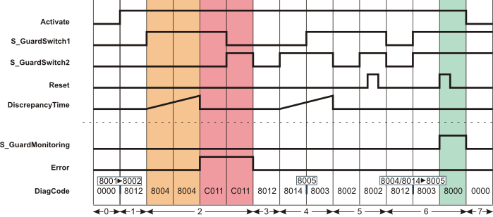

# Additional signal sequence diagrams

Temporary intermediate states are not illustrated in the signal sequence diagrams. Only typical input signal combinations are illustrated in these diagrams. Other signal combinations are possible.

The most significant areas within the signal sequence diagrams are highlighted in color.

**Further Information:**

Refer also to the diagram found in the [overview](sfguardmonitoring.html#sfguardmonitoring) for this function block.

**NOTE:**

The signal sequence diagrams in this documentation possibly omit particular diagnostic codes. For example, a diagnostic code is possibly not shown if the related function block state is a temporary transition state and only active for one cycle of the Safety Logic Controller.

Only typical input signal combinations are illustrated. Other signal combinations are possible.

## Errors after discrepancy time exceeded

This diagram is based on typical monitoring of a guard with two-stage interlocking, where both position switches connected to inputs S\_GuardSwitch1 and S\_GuardSwitch2 do **not** switch within the time set at DiscrepancyTime:

**S\_StartReset = SAFEFALSE:** Start-up inhibit after the function block has been activated and the Safety Logic Controller has started up

**S\_AutoReset = SAFEFALSE:** Restart inhibit after the safety equipment has been closed (in other words, after the SAFETRUE signals have returned at inputs S\_GuardSwitch1 and S\_GuardSwitch2).

|  |  |
| --- | --- |
| 0 | The function block is not yet activated (Activate = FALSE).  As a result, all outputs are FALSE or SAFEFALSE. |
| 1 | The function block is activated (input Activate = TRUE). The safety equipment is open (S\_GuardSwitch1 and S\_GuardSwitch2 = SAFEFALSE). |
| 2 | The safety equipment is closed, whereby S\_GuardSwitch1 switches to SAFETRUE first. This initiates measurement of the discrepancy time.  Since S\_GuardSwitch2 does not switch to SAFETRUE within the time set at DiscrepancyTime either, an error message is output after the discrepancy time has elapsed: Output Error = TRUE. The S\_GuardMonitoring output remains SAFEFALSE. |
| 3 | The door is opened again. This switches both inputs S\_GuardSwitch1 and S\_GuardSwitch2 to SAFEFALSE. This state causes the error message to be removed: The Error output becomes FALSE. |
| 4 | The safety equipment is closed again, which causes S\_GuardSwitch2 to switch to SAFETRUE first. This initiates measurement of the discrepancy time. S\_GuardSwitch1 also switches to SAFETRUE within the discrepancy time. The S\_GuardMonitoring output remains SAFEFALSE, however, as the restart inhibit has not yet been removed by a positive signal edge at the Reset input. |
| 5 | The S\_GuardSwitch2 input becomes SAFEFALSE. The function block interprets this as the safety equipment opening and expects S\_GuardSwitch1 to be switched to SAFEFALSE as well.  The switch back to SAFETRUE at S\_GuardSwitch2 does not initiate measurement of the discrepancy time, as S\_GuardSwitch1 was not SAFEFALSE at this time.  S\_GuardSwitch1 and S\_GuardSwitch2 are SAFETRUE, but a positive edge at Reset has no effect, because the function block only recognizes the closing of the safety equipment as valid once both S\_GuardSwitch1 and S\_GuardSwitch2 are SAFEFALSE (in other words, after the safety equipment has been fully opened). |
| 6 | The safety equipment is opened (S\_GuardSwitch1 and S\_GuardSwitch2 are SAFEFALSE).  The safety equipment is then closed. Both inputs S\_GuardSwitch1 and S\_GuardSwitch2 become SAFETRUE at the same time. A positive edge at the Reset input removes the restart inhibit (set with S\_AutoReset = SAFEFALSE) and the S\_GuardMonitoring output becomes SAFETRUE. |
| 7 | The S\_GuardMonitoring output becomes SAFEFALSE, as activation of the function block is reset at the Activate input (Activate = FALSE). |

EIO0000002269.01

© 2020

Schneider Electric.

All rights reserved.