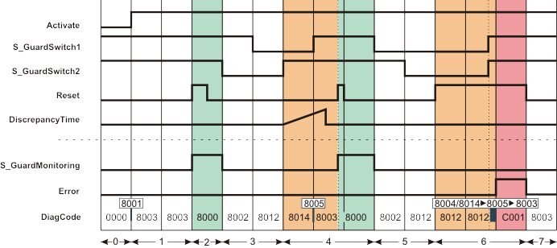
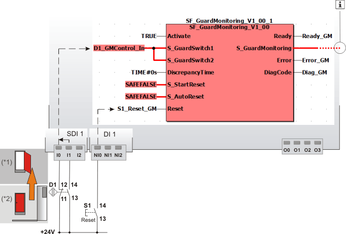

# SF\_GuardMonitoring

The following description is valid for the function block SF\_GuardMonitoring\_V1\_0z, Version 1.0z (where z = 0 to 9).

## Short description

|  |  |
| --- | --- |
| The safety-related SF\_GuardMonitoring function block monitors a guard (e.g., door) with two-stage interlocking according to the EN 1088 standard.  S\_StartReset can be used to specify a start-up inhibit and S\_AutoReset can be used to specify a restart inhibit. |  |

## Function block inputs

Click the corresponding hyperlinks to obtain detailed information on the items below.

| Name | Short description | Value |
| --- | --- | --- |
| [Activate](act_GuardMonitoring.html#act_GuardMonitoring) | State-controlled input for activating the function block.  Data type: BOOL  Initial value: FALSE | * **FALSE**: Function block inactive * **TRUE**: Function block activated |
| [S\_GuardSwitch1](s_12_GuardMonitoring.html#s_12_GuardMonitoring) and [S\_GuardSwitch2](s_12_GuardMonitoring.html#s_12_GuardMonitoring) | State-controlled inputs for the connected position switches of the door.  For the S\_GuardMonitoring output to switch to SAFETRUE, both inputs S\_GuardSwitch1 and S\_GuardSwitch2 must switch to SAFETRUE within the time set at DiscrepancyTime.  Data type: SAFEBOOL  Initial value: SAFEFALSE  **NOTE:**  If only one signal reports the status of the door (one position switch only), this must be connected in parallel to both inputs S\_GuardSwitch1 and S\_GuardSwitch2. Where this is the case, a time of 0 seconds must be set at DiscrepancyTime. | * **SAFEFALSE**: Position switch reports open state * **SAFETRUE**: Position switch reports closed state |
| [DiscrepancyTime](prog_dt_s_GuardMonitoring.html#prog_dt_s_GuardMonitoring) | Input for specifying the maximum permissible discrepancy time for the closing operation of the safety equipment.  Data type: TIME  Initial value: #0ms  If S\_GuardSwitch1 or S\_GuardSwitch2 switches to SAFETRUE, the respective other input (S\_GuardSwitch1 or S\_GuardSwitch2) must also switch to SAFETRUE within the time set at DiscrepancyTime for the switching operation to be considered as valid.  If not both inputs have switched to SAFETRUE after the time set at DiscrepancyTime has elapsed, an error message is generated (Error = TRUE) and the S\_GuardMonitoring output remains in the defined safe state SAFEFALSE. | Enter a time value according to your risk analysis.  Refer to the first hazard message below this table. |
| [S\_StartReset](prog_s_res_GuardMonitoring.html#prog_s_res_GuardMonitoring) | State-controlled input for specifying the start-up inhibit after the Safety Logic Controller has been started up or the function block has been activated.  Data type: SAFEBOOL  Initial value: SAFEFALSE  An active start-up inhibit must be removed manually by a positive signal edge at the Reset input. A deactivated start-up inhibit causes the S\_GuardMonitoring output to switch to SAFETRUE automatically when the function block is activated and the safety-related function is not requested.  Refer to the second hazard message below this table. | * **SAFEFALSE**: With start-up inhibit * **SAFETRUE**: Without start-up inhibit |
| [S\_AutoReset](prog_a_res_GuardMonitoring.html#prog_a_res_GuardMonitoring) | State-controlled input for specifying the restart inhibit after the previously opened safety equipment has been closed (in other words, after the SAFETRUE signal has returned at inputs S\_GuardSwitch1 and S\_GuardSwitch2).  Data type: SAFEBOOL  Initial value: SAFEFALSE  An active restart inhibit must be removed manually by a positive signal edge at the Reset input. A deactivated restart inhibit causes the S\_GuardMonitoring output to switch to SAFETRUE automatically when the function block is activated and the safety-related function is no longer requested.  Refer to the second hazard message below this table. | * **SAFEFALSE**: With restart inhibit * **SAFETRUE**: Without restart inhibit |
| [Reset](reset_GuardMonitoring.html#reset_GuardMonitoring) | Edge-triggered input for the reset signal:  * Resetting error messages when the cause of the error is no longer present. * Manual resetting of an active start-up/restart inhibit (specified by S\_StartReset and/or S\_AutoReset).  Refer to the third hazard message below this table.  Data type: BOOL  Initial value: FALSE  **NOTE:**  Resetting does not occur with a negative (falling) edge, as specified by standard EN ISO 13849-1, but with a positive (rising) edge. | * **FALSE**: Reset is not requested * Edge **FALSE > TRUE**: Reset is requested |

| WARNING | |
| --- | --- |
|  | **NON-CONFORMANCE TO SAFETY FUNCTION REQUIREMENTS**   * Verify that the time value set at DiscrepancyTime corresponds to your risk analysis. * Be sure that your risk analysis includes an evaluation for incorrectly setting the time value at the DiscrepancyTime parameter. * Validate the overall safety-related function with regard to the set DiscrepancyTime value and thoroughly test the application.   **Failure to follow these instructions can result in death, serious injury, or equipment damage.** |

| WARNING | |
| --- | --- |
|  | **NON-CONFORMANCE TO SAFETY FUNCTION REQUIREMENTS**   * Verify the impact of a deactivated start-up inhibit (S\_StartReset = SAFETRUE) and/or restart inhibit (S\_AutoReset = SAFETRUE) on your machine or process prior to implementation. * Observe the regulations given by relevant sector standards regarding the start-up/restart inhibit. * Verify that a suitable start-up inhibit is in place at another location or using other means.   **Failure to follow these instructions can result in death, serious injury, or equipment damage.** |

Resetting the function block by means of a positive signal edge at the Reset input can cause the S\_GuardMonitoring output to switch to SAFETRUE immediately (depending on the status of the other inputs).

| WARNING | |
| --- | --- |
|  | **UNINTENDED START-UP**   * Include in your risk analysis the impact of the reset by means of a positive signal edge at the Reset input. * Make certain that appropriate procedures and measures (according to applicable sector standards) have been established to help avoid hazardous situations when resetting. * Do not enter the zone of operation when resetting. * Ensure that no other persons can access the zone of operation when resetting. * Use appropriate safety interlocks where personnel and/or equipment hazards exist.   **Failure to follow these instructions can result in death, serious injury, or equipment damage.** |

## Function block outputs

| Name | Short description | Value |
| --- | --- | --- |
| [Ready](ready_GuardMonitoring.html#ready_GuardMonitoring) | Output for signaling "Function block activated/not activated".  Data type: BOOL | * **FALSE**: Function block is not activated (Activate = FALSE) and all outputs of the function block are switched to FALSE/SAFEFALSE. * **TRUE**: Function block is activated (Activate = TRUE) and the output parameters represent the state of the safety-related function. |
| [S\_GuardMonitoring](out_GuardMonitoring.html#out_GuardMonitoring) | Output for enable signal of the function block.  Data type: SAFEBOOL | * **SAFEFALSE**:  + The guard is not closed (S\_GuardSwitch1 and/or S\_GuardSwitch2 = SAFEFALSE)   + **or** the function block is not activated   + **or** the start-up/restart inhibit is active   + **or** an error message is present. * **SAFETRUE**:  + Guard closed (S\_GuardSwitch1 and S\_GuardSwitch2 = SAFETRUE)   + **and** the function block is activated   + **and** the start-up/restart inhibit is not active   + **and** no error message is present. |
| [Error](err_GuardMonitoring.html#err_GuardMonitoring) | Output for error message.  Data type: BOOL | * **FALSE**: No error is present. * **TRUE**: The function block has detected an error. The S\_GuardMonitoring output switches to SAFEFALSE as a result. |
| [DiagCode](diag_GuardMonitoring.html#diag_GuardMonitoring) | Output for diagnostic message.  Data type: WORD | Diagnostic message of the function block.  The possible values are listed and described in the topic "[Diagnostic codes](codes_GuardMonitoring.html#codes_GuardMonitoring)". |

## Signal sequence diagram

This diagram is based on typical monitoring of a guard with two-stage interlocking, where both position switches connected to inputs S\_GuardSwitch1 and S\_GuardSwitch2 switch within the time set at DiscrepancyTime.

Additional assumptions:

**S\_StartReset = SAFEFALSE:** Start-up inhibit after the function block has been activated and the Safety Logic Controller has started up

**S\_AutoReset = SAFEFALSE:** Restart inhibit after the previously opened safety equipment has been closed (i.e., after the SAFETRUE signals have returned at inputs S\_GuardSwitch1 and S\_GuardSwitch2).

**NOTE:**

The other [signal sequence diagram](signaldiagrams_guardMonitoring.html#signaldiagrams_guardMonitoring) can be taken into account.

**NOTE:**

The signal sequence diagrams in this documentation possibly omit particular diagnostic codes. For example, a diagnostic code is possibly not shown if the related function block state is a temporary transition state and only active for one cycle of the Safety Logic Controller.

Only typical input signal combinations are illustrated. Other signal combinations are possible.

|  |  |
| --- | --- |
| 0 | The function block is not yet activated (Activate = FALSE).  As a result, all outputs are FALSE or SAFEFALSE. |
| 1 | Both inputs S\_GuardSwitch1 and S\_GuardSwitch2 are SAFETRUE. However, the S\_GuardMonitoring output is still SAFEFALSE, since a start-up inhibit is specified after the Safety Logic Controller has been started up by S\_StartReset = SAFEFALSE. |
| 2 | A positive edge at the Reset input resets the start-up inhibit and the S\_GuardMonitoring output switches to SAFETRUE. |
| 3 | The safety equipment is opened. S\_GuardSwitch2 and S\_GuardSwitch1 switch to SAFEFALSE one after the other, and the S\_GuardMonitoring output becomes SAFEFALSE. |
| 4 | The safety equipment is closed. Measurement of the discrepancy time begins with the switch from SAFEFALSE to SAFETRUE at S\_GuardSwitch2. The second input S\_GuardSwitch1 also switches to SAFETRUE during the time set at DiscrepancyTime.  As a restart inhibit is specified by S\_AutoReset = SAFEFALSE after the safety equipment has been closed (S\_GuardSwitch1 and S\_GuardSwitch2 = SAFETRUE), the S\_GuardMonitoring output only becomes SAFETRUE once the restart inhibit has been removed by a positive edge at the Reset input. |
| 5 | The safety equipment is opened. S\_GuardSwitch1 and S\_GuardSwitch2 switch to SAFEFALSE one after the other, and the S\_GuardMonitoring output becomes SAFEFALSE. |
| 6 | The safety equipment is closed. Both inputs S\_GuardSwitch1 and S\_GuardSwitch2 become SAFETRUE at the same time. The function block detects the permanent TRUE signal at the Reset input as an error. Output Error becomes TRUE and output S\_GuardMonitoring remains SAFEFALSE. |
| 7 | The Reset input becomes FALSE; this causes the error message to be reset. |

## Application example: Door monitoring using a mechanical position switch, start-up inhibits activated

This example describes how a mechanically activated position switch with 2 N/C contacts is evaluated using the safety-related SF\_GuardMonitoring function block. Position switch B1 is connected to input terminals I0 and I1 of safety-related input device SDI 1.

The signals from position switch B1 are evaluated, based on two channels, for equivalence in the safety-related input device, which has been parameterized accordingly. The resulting signal is assigned to the global I/O variable B1\_GMControl\_In. This variable is connected to the inputs S\_GuardSwitch1 and S\_GuardSwitch2 of the safety-related SF\_GuardMonitoring function block for evaluation.

B1\_GMControl\_In is SAFETRUE if both inputs of the safety-related input device SDI 1 are SAFETRUE at the same time (safety equipment closed) and the safety-related input device SDI 1 does not report any errors as regards exceeding the time set at DiscrepancyTime.

**NOTE:**

Since only one signal reports the status of the door in this example (one position switch), this is connected in parallel to both inputs S\_GuardSwitch1 and S\_GuardSwitch2. In this case, a value of 0 seconds is set at input DiscrepancyTime.

The function block is perpetually activated by a TRUE constant at the Activate input.

S\_StartReset = SAFEFALSE specifies a start-up inhibit after the Safety Logic Controller has been started up or the function block has been activated. Furthermore, S\_AutoReset = SAFEFALSE specifies a restart inhibit for the function block after the door has been closed. Both inhibits are only removed when there is a positive signal edge at the Reset input.

To this end, the S1 reset button is connected to input terminal NI0 of the standard input device DI 1. The terminal is assigned to the global I/O variable S1\_Reset\_GM, which in turn is connected to the function block input Reset.

**NOTE:**

The enable signal at the S\_GuardMonitoring output of the SF\_GuardMonitoring function block is connected to additional safety-related function blocks or functions and controls the application accordingly.

|  |  |
| --- | --- |
| S1 | Reset |
| B1 | Door switch with two positively driven N/C contacts for positive opening operation  (SAFETRUE, if safety equipment closed). |
| (\*1) | Door: open |
| (\*2) | Door: closed |
|  | See note above the illustration. |

**Further Information:**

The [other application examples and the accompanying notes](applicationexample_guardMonitoring.html#applicationexample_guardMonitoring) can be taken into account.

## Detailed information

Additional information is available in the following sections:

* [Functional description](function_guardMonitoring.html#function_guardMonitoring)
* [Additional signal sequence diagrams](signaldiagrams_guardMonitoring.html#signaldiagrams_guardMonitoring)
* [Additional application examples](applicationexample_guardMonitoring.html#applicationexample_guardMonitoring)
* [Exception avoidance](faultavoidance_guardMonitoring.html#faultavoidance_guardMonitoring)
* [Implementation of safety requirements from applicable standards](safetyrequirements_guardMonitoring.html#safetyrequirements_guardMonitoring)

EIO0000002269.01

© 2020

Schneider Electric.

All rights reserved.