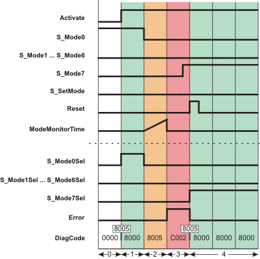

# Additional signal sequence diagrams

Temporary intermediate states are not illustrated in the signal sequence diagrams. Only typical input signal combinations are illustrated in these diagrams. Other signal combinations are possible.

The most significant areas within the signal sequence diagrams are highlighted in color.

**Further Information:**

Refer also to the diagram found in the [overview](sfmodeselector.html#sfmodeselector) for this function block.

**NOTE:**

The signal sequence diagrams in this documentation possibly omit particular diagnostic codes. For example, a diagnostic code is possibly not shown if the related function block state is a temporary transition state and only active for one cycle of the Safety Logic Controller.

Only typical input signal combinations are illustrated. Other signal combinations are possible.

## Exceeding the set monitoring time

The following diagram shows the signal sequence in the event of an invalid operating mode switchover as a result of the set monitoring time being exceeded. The pending error message is then reset.

* **AutoSetMode = TRUE:** Acceptance of the set operating mode does **not** require manual confirmation via a positive edge at the S\_SetMode input.
* **S\_Unlock = SAFETRUE:** Operating mode switchover is possible.

|  |  |
| --- | --- |
| 0 | The function block is not yet activated (Activate = FALSE).  As a result, all outputs are FALSE or SAFEFALSE. |
| 1 | The function block is activated (Activate = TRUE); the inputs are now evaluated.  Operating mode 0 is requested at the inputs (input S\_Mode0 is SAFETRUE). Since manual confirmation of the operating mode switchover (at the S\_SetMode input) is not required by means of the setting AutoSetMode = TRUE, the S\_Mode0Sel output is immediately switched to SAFETRUE. |
| 2 | The mode selector switch is actuated, there is a request to switch to operating mode 7:  Input S\_Mode0 and output S\_Mode0Sel become SAFEFALSE; this switchover initiates measurement of the monitoring time. |
| 3 | As the S\_Mode7 input does not become SAFETRUE within the time set at ModeMonitorTime, an error message is output once ModeMonitorTime has elapsed: The Error output becomes TRUE. Outputs S\_Mode0Sel to S\_Mode7Sel all remain in the defined safe state (SAFEFALSE). |
| 4 | The fact that S\_Mode7 has switched to SAFETRUE means there is now a valid signal combination at inputs S\_Mode0 to S\_Mode7.  The error message is reset (Error becomes FALSE) when the positive signal edge applies at the Reset input.  The new operating mode immediately becomes active when the error is reset (S\_Mode7Sel = SAFETRUE), as the setting AutoSetMode = TRUE means that the operating mode does **not** have to be confirmed by a positive edge at the S\_SetMode input. |

EIO0000002269.01

© 2020

Schneider Electric.

All rights reserved.