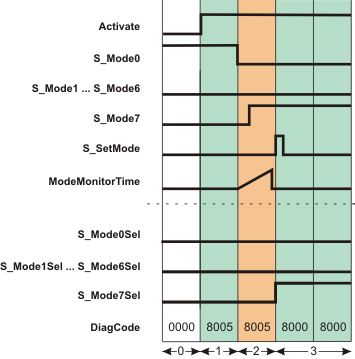

# SF\_ModeSelector

The following description is valid for the function block SF\_ModeSelector\_V1\_0z, Version 1.0z (where z = 0 to 9).

## Short description

|  |  |
| --- | --- |
| The safety-related SF\_ModeSelector function block evaluates the states of a mode selector switch with up to eight positions.  A mechanical mode selector switch can be used to set a specific operating mode (e.g., service mode, setup mode, cleaning mode, etc.). Each operating mode can have a different safety-related function. |  |

## Function block inputs

Click the corresponding hyperlinks to obtain detailed information on the items below.

| Name | Short description | Value |
| --- | --- | --- |
| [Activate](act_ModeSelector.html#act_ModeSelector) | State-controlled input for activating the function block.  Data type: BOOL  Initial value: FALSE | * **FALSE**: Function block inactive * **TRUE**: Function block activated |
| [S\_Mode0](m_x_ModeSelector.html#m_x_ModeSelector) to [S\_Mode7](m_x_ModeSelector.html#m_x_ModeSelector) | State-controlled inputs for the status of the connected mode selector switch. There must only ever be one SAFETRUE signal at one of the inputs.  Data type: SAFEBOOL  Initial value: SAFEFALSE  If more than one operating mode is detected at the mode selector switch, this behavior immediately leads to an error. If no operating mode is selected (S\_Mode0 to S\_Mode7 = SAFEFALSE), this leads to an error after the time set at ModeMonitorTime has elapsed.  **NOTE:**  If the set operating mode is locked by S\_Unlock = SAFEFALSE, the signal combination at the inputs (S\_Mode0 to S\_Mode7) is not evaluated. | * **SAFEFALSE**: Operating mode not selected * **SAFETRUE**: Operating mode selected |
| [S\_Unlock](ulock_ModeSelector.html#ulock_ModeSelector) | State-controlled input for locking/unlocking mode selector switching (S\_Mode0 to S\_Mode7) with, for example, a key switch.  Data type: SAFEBOOL  Initial value: SAFEFALSE | * **SAFEFALSE**: Operating mode switchover disabled * **SAFETRUE**: Operating mode switchover possible |
| [S\_SetMode](setm_ModeSelector.html#setm_ModeSelector) | Edge-triggered input for confirming or enabling the operating mode set at S\_Mode0 to S\_Mode7.  Data type: SAFEBOOL  Initial value: SAFEFALSE  Manual confirmation is required (via a SAFEFALSE > SAFETRUE edge at the S\_SetMode input) if AutoSetMode is set to FALSE. | * **SAFEFALSE**: Manual enabling of the set operating mode not requested * Edge **SAFEFALSE > SAFETRUE**: Manual enabling of the operating mode set at S\_Mode0 to S\_Mode7 |
| [AutoSetMode](prog_autom_ModeSelector.html#prog_autom_ModeSelector) | State-controlled input for specifying the automatic acceptance of the operating mode set at inputs S\_Mode0 to S\_Mode7.  Data type: BOOL  Initial value: FALSE  **NOTE:**  If the set operating mode is locked by S\_Unlock = SAFEFALSE, no switchover to another operating mode is performed.  Automatic acceptance of the set operating mode (AutoSetMode = TRUE) must only be used if it is certain that starting up the machine/system will not lead to a hazardous situation or that a start-up will be prevented in a suitable manner at another location or using other means.  Refer to the first hazard message below this table. | * **FALSE**: The set operating mode is not accepted automatically. Manual confirmation is required via a positive edge at the S\_SetMode input.  * **TRUE**: The set operating mode is accepted automatically. **This assumes** that  + the function block is activated (Activate = TRUE)   + **and** no error is reported (Error = FALSE)   + **and** mode selector switching not being locked (S\_Unlock = SAFETRUE). |
| [ModeMonitorTime](prog_mt_s_ModeSelector.html#prog_mt_s_ModeSelector) | Input for specifying the maximum permissible switchover time for switching the operating mode.  Data type: TIME  Initial value: #0ms  All inputs may show a SAFEFALSE signal simultaneously during the time set at ModeMonitorTime. After this, a simultaneous SAFEFALSE signal at S\_Mode0 to S\_Mode7 leads to an error (Error = TRUE).  If more than one operating mode is detected at the mode selector switch, this behavior immediately leads to an error. | Enter a time value according to your risk analysis.  Refer to the second hazard message below this table. |
| [Reset](reset_ModeSelector.html#reset_ModeSelector) | Edge-triggered input for the reset signal:  Resetting error messages when the cause of the error is no longer present.  Resetting an error by means of a positive signal edge at the Reset input can cause the S\_Mode0Sel to S\_Mode7Sel output to switch to SAFETRUE immediately (depending on the status of the other inputs).  Refer to the third hazard message below this table.  Data type: BOOL  Initial value: FALSE  **NOTE:**  Resetting does not occur with a negative (falling) edge, as specified by standard EN ISO 13849-1, but with a positive (rising) edge. | * **FALSE**: Reset is not requested * Edge **FALSE > TRUE**: Reset is requested |

| WARNING | |
| --- | --- |
|  | **UNINTENDED EQUIPMENT OPERATION**   * Verify the impact of an automatic acceptance of the set operating mode on your machine or process prior to implementation. * Observe the regulations given by relevant sector standards regarding the automatic acceptance of the set operating mode. * Verify that a suitable start-up inhibit is in place at another location or using other means.   **Failure to follow these instructions can result in death, serious injury, or equipment damage.** |

| WARNING | |
| --- | --- |
|  | **NON-CONFORMANCE TO SAFETY FUNCTION REQUIREMENTS**   * Verify that the time value set at ModeMonitorTime corresponds to your risk analysis. * Be sure that your risk analysis includes an evaluation for incorrectly setting the time value for the ModeMonitorTime parameter. * Validate the overall safety-related function with regard to the set ModeMonitorTime value and thoroughly test the application.   **Failure to follow these instructions can result in death, serious injury, or equipment damage.** |

| WARNING | |
| --- | --- |
|  | **UNINTENDED START-UP**   * Include in your risk analysis the impact of the reset by means of a positive signal edge at the Reset input. * Make certain that appropriate procedures and measures (according to applicable sector standards) have been established to help avoid hazardous situations when resetting. * Do not enter the zone of operation when resetting. * Ensure that no other persons can access the zone of operation when resetting. * Use appropriate safety interlocks where personnel and/or equipment hazards exist.   **Failure to follow these instructions can result in death, serious injury, or equipment damage.** |

## Function block outputs

| Name | Short description | Value |
| --- | --- | --- |
| [Ready](ready_ModeSelector.html#ready_ModeSelector) | Output for signaling "Function block activated/not activated".  Data type: BOOL | * **FALSE**: Function block is not activated (Activate = FALSE) and all outputs of the function block are switched to FALSE/SAFEFALSE. * **TRUE**: Function block is activated (Activate = TRUE) and the output parameters represent the state of the safety-related function. |
| [S\_Mode0Sel](out_x_ModeSelector.html#out_x_ModeSelector) to [S\_Mode7Sel](out_x_ModeSelector.html#out_x_ModeSelector) | Outputs for signaling the set operating mode.  There can only ever be one output showing a SAFETRUE signal at any one time.  Data type: SAFEBOOL | * **SAFEFALSE**  + **One** of the S\_ModeXSel outputs  = SAFEFALSE: The corresponding operating mode is not active.   + **All** outputs (S\_Mode0Sel **to** S\_Mode7Sel) = SAFEFALSE: No operating mode is active      - or the function block is not activated     - or the error message is present. * **SAFETRUE**  **One** of the S\_ModeXSel outputs  = SAFETRUE:  The corresponding operating mode is active    + and the function block is activated   + and no error message is present. |
| [S\_AnyModeSel](anyModeSel_ModeSelector.html#anyModeSel_ModeSelector) | Output for signaling whether a signal combination is output at the S\_Mode0Sel to S\_Mode7Sel outputs. | * **SAFEFALSE**: Only SAFEFALSE signals are output at the S\_Mode0Sel to S\_Mode7Sel outputs. * **SAFETRUE**: A SAFETRUE signal is output at one of the S\_Mode0Sel to S\_Mode7Sel outputs to control a specific operating mode in the subsequent application. |
| [Error](err_ModeSelector.html#err_ModeSelector) | Output for error message.  Data type: BOOL | * **FALSE**: No error is present. * **TRUE**: The function block has detected an error. The S\_ModeXSel output switches to SAFEFALSE as a result. |
| [DiagCode](diag_ModeSelector.html#diag_ModeSelector) | Output for diagnostic message.  Data type: WORD | Diagnostic message of the function block.  The possible values are listed and described in the topic "[Diagnostic codes](codes_ModeSelector.html#codes_ModeSelector)". |

## Signal sequence diagram

The diagram shows the signal sequence for a valid operating mode switchover within the monitoring time set at ModeMonitorTime.

* **AutoSetMode = FALSE:** Acceptance of the set operating mode requires manual confirmation via a positive edge at the S\_SetMode input.
* **S\_Unlock = SAFETRUE:** Operating mode switchover is possible.

**NOTE:**

The other [signal sequence diagram](signaldiagrams_modeselector.html#signaldiagrams_modeselector) can be taken into account.

**NOTE:**

The signal sequence diagrams in this documentation possibly omit particular diagnostic codes. For example, a diagnostic code is possibly not shown if the related function block state is a temporary transition state and only active for one cycle of the Safety Logic Controller.

Only typical input signal combinations are illustrated. Other signal combinations are possible.

|  |  |
| --- | --- |
| 0 | The function block is not yet activated (Activate = FALSE).  As a result, all outputs are FALSE or SAFEFALSE. |
| 1 | The function block is activated (Activate = TRUE); the inputs are now evaluated.  The specification for operating mode 0 is present at the inputs (input S\_Mode0 is SAFETRUE). However, as no manual confirmation for the operating mode switchover is detected at the S\_SetMode input (this is necessary since AutoSetMode = FALSE), the S\_Mode0Sel output remains SAFEFALSE in spite of the specification (S\_Mode0 = SAFETRUE). |
| 2 | The mode selector switch is actuated, there is a request to switch to operating mode 7.  Input S\_Mode0 becomes SAFEFALSE; this switch initiates measurement of the monitoring time.  S\_Mode7 switches to SAFETRUE before the time set at ModeMonitorTime has elapsed. Although operating mode 7 has now been set as the new mode, it is not yet active, as a manual acceptance was specified with AutoSetMode = FALSE.  A positive edge is required at S\_SetMode to activate the operating mode at the S\_Mode7Sel output. |
| 3 | The positive signal edge at the S\_SetMode input enables the set operating mode 7, and the S\_Mode7Sel output becomes SAFETRUE. |

## Application example

This example uses a five-stage mode selector switch S1 to show how operating modes are selected.

The signals of the five N/O contacts of the mode selector switch are connected to the five input terminals I0 to I4 of safety-related input device SDI 1. The signals are assigned to the global I/O variables and the function block inputs are connected as follows:

| Terminal | Global I/O variable | Function block input |
| --- | --- | --- |
| I0 | S1\_M0\_In | S\_Mode0 |
| I1 | S1\_M1\_In | S\_Mode1 |
| I2 | S1\_M2\_In | S\_Mode2 |
| I3 | S1\_M3\_In | S\_Mode3 |
| I4 | S1\_M4\_In | S\_Mode4 |

As a five-stage mode selector switch is evaluated, the function block inputs S\_Mode5 to S\_Mode7 remain unconnected.

A key switch S2 is connected to input terminal I5 of the safety-related input device SDI 1. The input signal is assigned to the global I/O variable S2\_Ulck\_In, which in turn is connected to the S\_Unlock input of the function block. Closing the key switch (S\_Unlock = SAFEFALSE) locks the operating mode that has been set.

A FALSE constant is connected to the AutoSetMode input, which means that a manual confirmation of the set operating mode is required at the S\_SetMode input. Button S3 is connected to input terminal I6 of the safety-related input device SDI 1 for this purpose. Its input signal is assigned to the global I/O variable S3\_SetM\_In, which in turn is connected to the S\_SetMode input of the function block.

A reset button S4, which is connected to input terminal NI0 of the standard input device DI 1 is used for resetting error messages (positive signal edge at the Reset input of the function block). Its signal is assigned to the global I/O variable S4\_Reset\_MS, which in turn is connected to the Reset input of the function block.

**NOTE:**

The S\_Mode0Sel to S\_Mode4Sel enable outputs of the SF\_ModeSelector function block are connected to the inputs of other safety-related functions/function blocks. As a five-stage mode selector switch is evaluated, the function block outputs S\_Mode5Sel to S\_Mode7Sel are not relevant and can remain unconnected.

|  |  |
| --- | --- |
| S1 | Mode selector switch with 5 switch positions |
| S2 | Key switch (blocking the mode selection) |
| S3 | Confirmation |
| S4 | Reset |
|  | See note above the illustration. |

**Further Information:**

The [second application example and the accompanying notes](applicationexample_modeselector.html#applicationexample_modeselector) can be taken into account.

## Detailed information

Additional information is available in the following sections:

* [Functional description](function_modeselector.html#function_modeselector)
* [Details of the application example](applicationexample_modeselector.html#applicationexample_modeselector)
* [Exception avoidance](faultavoidance_modeselector.html#faultavoidance_modeselector)
* [Implementation of safety requirements from applicable standards](safetyrequirements_modeselector.html#safetyrequirements_modeselector)

EIO0000002269.01

© 2020

Schneider Electric.

All rights reserved.