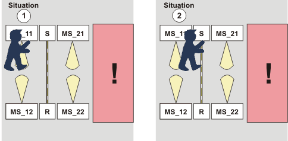
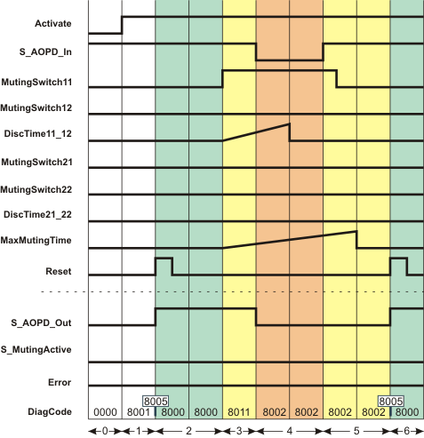

# Additional signal sequence diagram

Temporary intermediate states are not illustrated in the signal sequence diagram. Only typical input signal combinations are illustrated in the diagram. Other signal combinations are possible.

The most significant areas within the signal sequence diagram are highlighted in color.

**Further Information:**

The diagram in the [overview](sfmutingpar.html#sfmutingpar__sfmutingpar_OverviewSignal) for this function block must also be taken into account.

**NOTE:**

The signal sequence diagrams in this documentation possibly omit particular diagnostic codes. For example, a diagnostic code is possibly not shown if the related function block state is a temporary transition state and only active for one cycle of the Safety Logic Controller.

Only typical input signal combinations are illustrated. Other signal combinations are possible.

**NOTE:**

Only the material flow direction from muting sensors MutingSwitch11/MutingSwitch12 to muting sensors MutingSwitch21/MutingSwitch22 is described in the following. This means the muting sensor pair MutingSwitch11/MutingSwitch12 is positioned **before** the safety-related equipment and MutingSwitch21/MutingSwitch22 is **behind** the safety-related equipment. This is illustrated in the [graphic in the function block overview](sfmutingpar.html#sfmutingpar__MutingPar_ShortDescr).

The function block also supports the opposite material flow direction from muting sensors MutingSwitch21/MutingSwitch22 to muting sensors MutingSwitch11/MutingSwitch12. The functional sequence remains identical.

## Person in zone of operation, muting inactive, stop request via safety-related equipment, start-up inhibit active

The signal sequence diagram shown below illustrates what happens if, for example, a person interrupts the light beam of a muting sensor of the first parallel sensor pair (see situation (1)) and then moves forward to enter the zone of operation of the protected machine, i.e., the person also interrupts the light beam of the safety-related equipment, thus triggering a stop request (see situation (2)).

**MS\_11, MS\_12**: First muting sensor pair, connected to function block inputs MutingSwitch11 and MutingSwitch12 (the "yellow light beams" symbolize the detection area)

**MS\_21, MS\_22**: Second muting sensor pair, connected to function block inputs MutingSwitch21 and MutingSwitch22

Additional assumptions:

* **S\_StartReset = SAFEFALSE:** Start-up inhibit after the function block has been activated and after the Safety Logic Controller has started up.
* **MutingEnable = TRUE (constant):** No separate enable signal required for the muting operation.

|  |  |
| --- | --- |
| 0 | The function block is not yet activated (Activate = FALSE).  As a result, all outputs are FALSE or SAFEFALSE. |
| 1 | After the function block has been activated by Activate = TRUE, the start-up inhibit is active at first. Therefore, the S\_AOPD\_Out enable output remains SAFEFALSE. |
| 2 | A positive signal edge at the Reset input resets the start-up inhibit.  The S\_AOPD\_Out output becomes SAFETRUE immediately because  1. the muting lamp reports its operational readiness through a SAFETRUE signal at the S\_MutingLamp input and 2. the light grid is not interrupted either (input S\_AOPD\_In = SAFETRUE). |
| 3 | The person in our example interrupts the light beam of the muting sensor at input MutingSwitch11, thus switching the signal to TRUE (situation (1) in the graphic above).  This change in state at MutingSwitch11 initiates measurement of the discrepancy time set at DiscTime11\_12 (maximum permissible time for the second muting sensor to signal TRUE as well) and the time measurement for the overall muting duration set at MaxMutingTime. |
| 4 | Before muting can be activated (for which the MutingSwitch12 input must also switch to TRUE within DiscTime11\_12), the person also interrupts the light grid of the safety-related equipment (situation (2) in the graphic above), i.e., S\_AOPD\_In switches to SAFEFALSE.  As a result, the S\_AOPD\_Out enable output switches to SAFEFALSE, as an object (in this case, a person) has been detected inside the zone of operation and muting has not previously been activated. The machine is stopped.  When S\_AOPD\_In switches to SAFEFALSE, the muting operation is canceled. |
| 5 | The person has now left the detection area of the safety-related equipment (i.e., of the light grid). S\_AOPD\_In switches back to SAFETRUE (temporary situation (1) in the graphic above).  A short time later, the signal of muting sensor MutingSwitch11 also switches back to FALSE, as the person has left the detection area of the muting sensor too.  Although the light beams of all sensors are no longer interrupted, the S\_AOPD\_Out enable output remains SAFEFALSE, as a positive edge is first expected at the Reset input.  As the muting operation has already been canceled, it is of no relevance that the time set at MaxMutingTime elapses without a result. The function block does not detect an error, the Error output remains FALSE. |
| 6 | A positive signal edge at the Reset input resets the start-up inhibit. As S\_AOPD\_In = SAFETRUE (light beam of the safety-related equipment is not interrupted), the S\_AOPD\_Out output switches to SAFETRUE. |

EIO0000002269.01

© 2020

Schneider Electric.

All rights reserved.