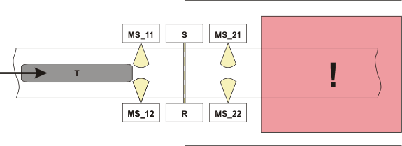
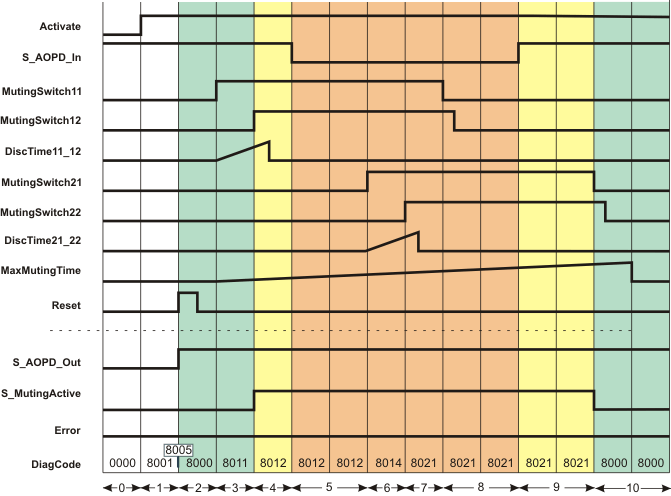
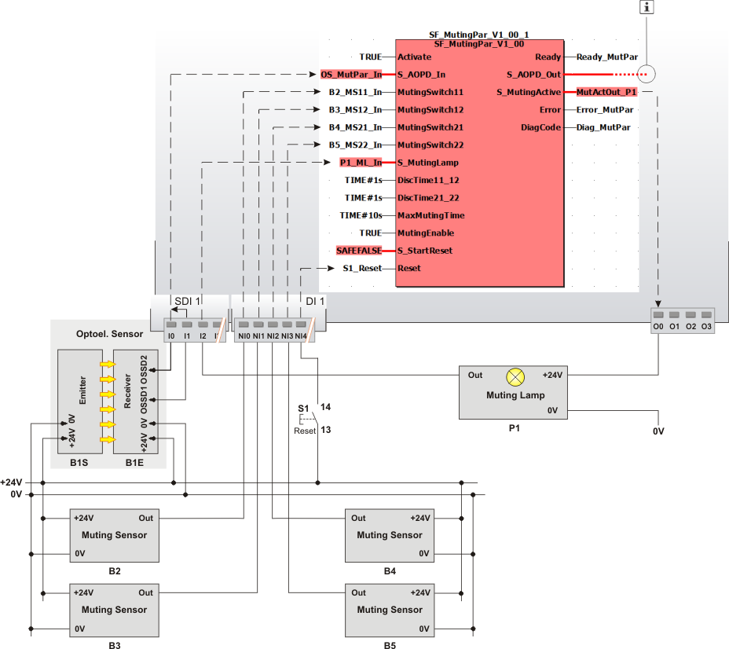

# SF\_MutingPar

The following description is valid for the function block SF\_MutingPar\_V1\_0z, Version 1.0z (where z = 0 to 9).

## Short description

|  |  |
| --- | --- |
| The safety-related SF\_MutingPar function block evaluates the signals of four muting sensors and an optoelectronic safety-related equipment (a light grid, for example) in an application for parallel muting with four sensors and switches the enable signal at the S\_AOPD\_Out output.  The signal at the S\_AOPD\_Out output is the enable signal for the entire process. A SAFEFALSE signal at the S\_AOPD\_Out output stops the application in the zone of operation.  This function can be used to temporarily deactivate (or "mute") safety-related equipment in the form of a light grid, for example, in order to allow an object which has been identified by the muting sensors as permissible (for the muting operation) to pass through on an assembly conveyor.  In such a case, the interruption of the light grid does not have any effect on the S\_AOPD\_Out output.  By contrast, if the safety-related equipment is engaged by an object which has not been identified by the muting sensors as permissible, the S\_AOPD\_Out output switches to SAFEFALSE.  For example, if the hand of a worker passes through an assembly conveyer interrupting a light grid, the S\_AOPD\_Out output would be used to signal the actions necessary to set the zone of operation to its defined safe state.  The maximum allowable time for the muting operation is monitored using the four muting sensors. Refer to the following representation to view the arrangement of the muting sensors.  A start-up inhibit can be specified at S\_StartReset. |  |

**NOTE:**

Depending on the result of the risk analysis, optical, mechanical or inductive sensors such as reflection light sensors, mechanical or inductive switches can be used as muting sensors. Optical sensors serve as examples in the help information.

**NOTE:**

Only the material flow direction from muting sensors MutingSwitch11/MutingSwitch12 to muting sensors MutingSwitch21/MutingSwitch22 is described in the following. The function block also supports the opposite material flow direction from muting sensors MutingSwitch21/MutingSwitch22 to muting sensors MutingSwitch11/MutingSwitch12. The functional sequence remains identical.

The following graphic illustrates an application for the SF\_MutingPar function block.

**Further Information:**

The entire muting operation is divided into different muting sequences. For more detailed information, see the [functional description](function_mutingPar.html#function_mutingPar).

The material flow direction in the example shown is from left to right.

**MS\_11, MS\_12**: First muting sensor pair, positioned **before** the safety-related equipment connected to the function block inputs MutingSwitch11 and MutingSwitch12 (the "yellow light beams" symbolize the detection area).

**MS\_21, MS\_22**: Second muting sensor pair, positioned **behind** the safety-related equipment, connected to function block inputs MutingSwitch21 and MutingSwitch22.

**S, R**: Transmitter and receiver of the light grid (safety-related equipment)

**T**: Goods to be transported on an assembly conveyor

**!**: Zone of operation

## Function block inputs

Click the corresponding hyperlinks to obtain detailed information on the items below.

| Name | Short description | Value |
| --- | --- | --- |
| [Activate](act_MutingPar.html#act_MutingPar) | State-controlled input for activating the function block.  Data type: BOOL  Initial value: FALSE | * **FALSE**: Function block inactive * **TRUE**: Function block activated |
| [S\_AOPD\_In](a_in_MutingPar.html#a_in_MutingPar) | State-controlled input for the status of the safety-related equipment (e.g., light grid).  Data type: SAFEBOOL  Initial value: SAFEFALSE | * **SAFEFALSE**: Light beam of the optoelectronic safety-related equipment (e.g., light barrier) interrupted.  **NOTE:**  The S\_AOPD\_Out output becomes SAFEFALSE when the muting operation is not active (S\_MutingActive = SAFEFALSE).  * **SAFETRUE**: Light beam of the optoelectronic safety-related equipment (e.g., light barrier) not interrupted. |
| [MutingSwitch11](ms_1112_mutingPar.html#ms_1112_mutingPar) and [MutingSwitch12](ms_1112_mutingPar.html#ms_1112_mutingPar) | State-controlled inputs for the muting sensors of the first parallel sensor pair.  Data type: BOOL  Initial value: FALSE  For the material flow direction  * from **left to right**, both of these sensors are positioned **before** the safety-related equipment. * from **right to left**, both of these sensors are positioned **behind** the safety-related equipment. | * **FALSE**: Light beam of the muting sensor not interrupted * **TRUE**: Light beam of the muting sensor interrupted |
| [MutingSwitch21](ms_2122_mutingPar.html#ms_2122_mutingPar) and [MutingSwitch22](ms_2122_mutingPar.html#ms_2122_mutingPar) | State-controlled inputs for the muting sensors of the second parallel sensor pair.  Data type: BOOL  Initial value: FALSE  For the material flow direction  * from **left to right**, both of these sensors are positioned **behind** the safety-related equipment. * from **right to left**, both of these sensors are positioned **before** the safety-related equipment. | * **FALSE**: Light beam of the muting sensor not interrupted * **TRUE**: Light beam of the muting sensor interrupted |
| [S\_MutingLamp](mlamp_MutingPar.html#mlamp_MutingPar) | State-controlled input for the feedback signal from the muting lamp.  Data type: SAFEBOOL  Initial value: SAFEFALSE | * **SAFEFALSE**: Muting lamp non-functional * **SAFETRUE**: Muting lamp in working order |
| [DiscTime11\_12](prog_dt1_MutingPar.html#prog_dt1_MutingPar) | Specification of the permissible discrepancy time in seconds for the muting sensors at the MutingSwitch11 and MutingSwitch12 inputs.  Data type: TIME  Initial value: #0ms  Once the first input has switched to TRUE, the second input must follow within this time. If it does not, the S\_AOPD\_Out output is switched to the defined safe state SAFEFALSE (e.g., "switch off machine"). | **Minimum value:** 0 s  **Maximum value:** 4 s  Enter a time value according to your risk analysis.  Refer to the first hazard message below this table. |
| [DiscTime21\_22](prog_dt2_MutingPar.html#prog_dt2_MutingPar) | Specification of the permissible discrepancy time in seconds for the muting sensors at the MutingSwitch21 and MutingSwitch22 inputs.  Data type: TIME  Initial value: #0ms  Once the first input has switched to TRUE, the second input must follow within this time. If it does not, the S\_AOPD\_Out output is switched to the defined safe state SAFEFALSE (e.g., "switch off machine"). | **Minimum value:** 0 s  **Maximum value:** 4 s  Enter a time value according to your risk analysis.  Refer to the first hazard message below this table. |
| [MaxMutingTime](prog_mmt_MutingPar.html#prog_mmt_MutingPar) | Specification of the maximum permissible time (in seconds) for the entire [muting operation](function_mutingPar.html#function_mutingPar__MutingVorgang_Par4S). If the muting operation is not completed within this time, the S\_AOPD\_Out output is switched to the defined safe state SAFEFALSE (e.g., "switch off machine").  Data type: TIME  Initial value: #0ms  The following is valid for a **material flow direction from left to right**:  * This timer starts when at least one muting sensor of the first parallel sensor pair (in this case, input MutingSwitch11 or MutingSwitch12 **before** the safety-related equipment) provides a TRUE signal (i.e., there is an object inside the detection area of the sensor). * The muting operation is complete when at least one muting sensor of the second parallel sensor pair (MutingSwitch21 or MutingSwitch22, i.e., **after** the safety-related equipment) provides FALSE again.  The following is valid for a **material flow direction from right to left**:  * This timer starts when at least one muting sensor of the first parallel sensor pair (in this case, input MutingSwitch21 or MutingSwitch22 **before** the safety-related equipment) provides a TRUE signal (i.e., there is an object inside the detection area of the sensor). * The muting operation is complete when at least one muting sensor of the second parallel sensor pair (MutingSwitch11 or MutingSwitch12, i.e., **after** the safety-related equipment) provides FALSE again. | **Minimum value:** 0 s  **Maximum value:** 600 s  Enter a time value according to your risk analysis.  Refer to the first hazard message below this table. |
| [MutingEnable](enab_MutingPar.html#enab_MutingPar) | State-controlled input for enabling the muting operation.  Data type: BOOL  Initial value: FALSE | * **FALSE**: No enable for the muting operation * **TRUE**: Enable for the muting operation |
| [S\_StartReset](prog_s_res_MutingPar.html#prog_s_res_MutingPar) | Specification of the start-up inhibit after the Safety Logic Controller has been started up or after the function block has been activated.  Data type: SAFEBOOL  Initial value: SAFEFALSE  An active start-up inhibit must be removed manually by a positive signal edge at the Reset input. A deactivated start-up inhibit causes the S\_AOPD\_Out output to switch to SAFETRUE automatically when the function block is activated and the safety-related function is not requested.  Refer to the second hazard message below this table. | * **SAFEFALSE**: With start-up inhibit * **SAFETRUE**: Without start-up inhibit |
| [Reset](reset_mutingPar.html#reset_mutingPar) | Edge-triggered input for the reset signal:  * Resetting error messages when the cause of the error is no longer present. * Manual resetting of an active start-up inhibit (specified by S\_StartReset).  Refer to the third hazard message below this table.  Data type: BOOL  Initial value: FALSE  **NOTE:**  Resetting does not occur with a negative (falling) edge, as specified by standard EN ISO 13849-1, but with a positive (rising) edge. | * **FALSE**: Reset is not requested * Edge **FALSE > TRUE**: Reset is requested |

| WARNING | |
| --- | --- |
|  | **NON-CONFORMANCE TO SAFETY FUNCTION REQUIREMENTS**   * Verify that the time value set at the time input corresponds to your risk analysis. * Be sure that your risk analysis includes an evaluation for incorrectly setting the time value at the time input. * Validate the overall safety-related function with regard to the set time value and thoroughly test the application.   **Failure to follow these instructions can result in death, serious injury, or equipment damage.** |

| WARNING | |
| --- | --- |
|  | **NON-CONFORMANCE TO SAFETY FUNCTION REQUIREMENTS**   * Be sure that your risk analysis includes an evaluation if the start-up inhibit is deactivated (S\_StartReset = SAFETRUE). * Observe the regulations given by relevant sector standards regarding the start-up inhibit. * Verify that a suitable start-up inhibit is in place at another location or using other means if the start-up inhibit is deactivated by setting S\_StartReset = SAFETRUE.   **Failure to follow these instructions can result in death, serious injury, or equipment damage.** |

Resetting the function block by means of a positive signal edge at the Reset input can cause the S\_AOPD\_Out output to switch to SAFETRUE immediately (depending on the status of the other inputs).

| WARNING | |
| --- | --- |
|  | **UNINTENDED START-UP**   * Include in your risk analysis the impact of the reset by means of a positive signal edge at the Reset input. * Make certain that appropriate procedures and measures (according to applicable sector standards) have been established to help avoid hazardous situations when resetting. * Do not enter the zone of operation when resetting. * Ensure that no other persons can access the zone of operation when resetting. * Use appropriate safety interlocks where personnel and/or equipment hazards exist.   **Failure to follow these instructions can result in death, serious injury, or equipment damage.** |

## Function block outputs

| Name | Short description | Value |
| --- | --- | --- |
| [Ready](ready_MutingPar.html#ready_MutingPar) | Output for signaling "Function block activated/not activated".  Data type: BOOL | * **FALSE**: Function block is not activated (Activate = FALSE) and all outputs of the function block are switched to FALSE/SAFEFALSE. * **TRUE**: Function block is activated (Activate = TRUE) and the output parameters represent the state of the safety-related function. |
| [S\_AOPD\_Out](out_mutingPar.html#out_mutingPar) | Output for enable signal of the function block.  Data type: SAFEBOOL | * **SAFEFALSE**:  + The [muting operation](function_mutingPar.html#function_mutingPar__MutingVorgang_Par4S) is not active and the light grid detects an object   + **or** the muting operation is active and the function block detects an error   + **or** the function block is not activated   + **or** the start-up inhibit is active. * **SAFETRUE**:    + The muting operation is not active and the light grid does not detect an object   + **or** the muting operation is active and the function block does not detect an error. |
| [S\_MutingActive](m_act_MutingPar.html#m_act_MutingPar) | Output for the status of the muting operation.  Data type: SAFEBOOL | * **SAFEFALSE**:    + The muting operation is not active   + **or** the function block is not activated   + **or** the start-up inhibit is active   + **or** an error message is present. * **SAFETRUE**:    + The muting operation is active   + **and** the function block is activated   + **and** the start-up inhibit is not active   + **and** no error message is present. |
| [Error](err_MutingPar.html#err_MutingPar) | Output for error message.  Data type: BOOL | * **FALSE**: No error is present. * **TRUE**: The function block has detected an error. The S\_AOPD\_Out output switches to SAFEFALSE as a result. |
| [DiagCode](diag_MutingPar.html#diag_MutingPar) | Output for diagnostic message.  Data type: WORD | Diagnostic message of the function block.  The possible values are listed and described in the topic "[Diagnostic codes](codes_MutingPar.html#codes_MutingPar)". |

## Signal sequence diagram

The signal sequence diagram shown below illustrates a muting operation (parallel muting with four sensors), using the example of an assembly conveyor that ends at a zone of operation with a running machine.

The material flow direction of the conveyor is from left to right, i.e., the muting sensor pair MutingSwitch11/MutingSwitch12 is positioned **before** the safety-related equipment and MutingSwitch21/MutingSwitch22 is **behind** the safety-related equipment (as represented in the graphic at the beginning of this topic).

Additional assumptions:

* **S\_StartReset = SAFEFALSE:** Start-up inhibit after the function block has been activated and the Safety Logic Controller has started up.
* **MutingEnable = TRUE (constant):** No separate enable signal required for the muting operation.

**NOTE:**

The other [signal sequence diagram](signaldiagrams_mutingPar.html#signaldiagrams_mutingPar) can be taken into account.

**NOTE:**

The signal sequence diagrams in this documentation possibly omit particular diagnostic codes. For example, a diagnostic code is possibly not shown if the related function block state is a temporary transition state and only active for one cycle of the Safety Logic Controller.

Only typical input signal combinations are illustrated. Other signal combinations are possible.

|  |  |
| --- | --- |
| 0 | The function block is not yet activated (Activate = FALSE).  As a result, all outputs are FALSE or SAFEFALSE. |
| 1 | After the function block has been activated by Activate = TRUE, the start-up inhibit is active at first. The S\_AOPD\_Out output therefore first remains SAFEFALSE. |
| 2 | A positive signal edge at the Reset input resets the start-up inhibit.  The S\_AOPD\_Out output switches to SAFETRUE immediately (normal operation) because   1. the muting lamp reports its operational readiness through a SAFETRUE signal at the S\_MutingLamp input and 2. the light grid does not detect an object either (input S\_AOPD\_In = SAFETRUE). |
| 3 | The first muting sensor of the first parallel sensor pair (**before** the safety-related equipment) at input MutingSwitch11 detects an object and switches to TRUE.  This change of state at MutingSwitch11 initiates   1. the measurement of the discrepancy time set at DiscTime11\_12. The maximum permissible period within which the second muting sensor of the first parallel sensor pair must also detect the object is set at DiscTime11\_12. 2. the time measurement for the overall muting duration. The maximum permissible period is specified at MaxMutingTime. |
| 4 | The second muting sensor of the first parallel sensor pair also detects the object (input MutingSwitch12 switches to TRUE) within the permissible discrepancy time (DiscTime11\_12).  This means that the object is identified as permissible and the S\_MutingActive output switches to SAFETRUE as a result: **Muting is active**. |
| 5 | The object reaches the light grid: the S\_AOPD\_In input switches to SAFEFALSE ("light grid interrupted").  As muting is active (MutingSwitch11 and MutingSwitch12 are still TRUE), the machine may continue to run in the zone of operation: The S\_AOPD\_Out output remains SAFETRUE. |
| 6 | The object reaches the first muting sensor of the second parallel sensor pair (**behind** the safety-related equipment): the MutingSwitch21 input switches to TRUE.  The measurement of the discrepancy time set at DiscTime21\_22 starts when the state at MutingSwitch21 switches. The maximum permissible period within which the second muting sensor of the second parallel sensor pair must also detect the object is set at DiscTime21\_22.  The muting sequence is valid because both muting sensors of the first parallel sensor pair are still TRUE. As a result, outputs S\_AOPD\_Out and S\_MutingActive both remain SAFETRUE. The time measurement for the overall muting duration (timer MaxMutingTime) continues to run. |
| 7 | The second muting sensor of the second parallel sensor pair also detects the object (input MutingSwitch22 switches to TRUE) within the permissible discrepancy time (DiscTime21\_22).  As TRUE signals are still also present at MutingSwitch11 and MutingSwitch12, the object is identified as permissible and muting remains active: Output S\_AOPD\_Out and S\_MutingActive both remain SAFETRUE and timer MaxMutingTime continues to run. |
| 8 | The object leaves the detection area of both muting sensors of the first parallel sensor pair (before the safety-related equipment). The MutingSwitch11 and MutingSwitch12 inputs switch, one after the other, from TRUE to FALSE.  This meets the requirements of a valid muting sequence, i.e., muting remains active. As a result, outputs S\_AOPD\_Out and S\_MutingActive both remain SAFETRUE. The time measurement for the overall muting duration (timer MaxMutingTime) continues to run. |
| 9 | The object has passed the light grid (S\_AOPD\_In switches back to SAFETRUE). MutingSwitch21 and MutingSwitch22 are still TRUE, muting is still active (S\_MutingActive remains SAFETRUE). |
| 10 | The object moves out of the detection area of the two muting sensors of the second parallel sensor pair and towards the zone of operation; the sensors at the MutingSwitch21 and MutingSwitch22 inputs switch, one after another, from TRUE to FALSE.  If the first sensor switches to FALSE (at MutingSwitch21) within the time set at MaxMutingTime, the muting operation has been completed successfully (S\_MutingActive becomes SAFEFALSE).  As no object is detected now **and** the muting operation has been completed within the specified time MaxMutingTime, no error is reported (Error remains FALSE) and the S\_AOPD\_Out output remains SAFETRUE ("machine continues to run"). |

## Application example

The graphic below illustrates the connection of four muting sensors (B2, B3, B4, and B5) to the safety-related SF\_MutingPar function block. The sensors are positioned parallel to the material flow direction before and behind the safety-related equipment.

The material flow direction of the conveyor is from left to right, i.e., the muting sensor pair MutingSwitch11/MutingSwitch12 is positioned **before** the safety-related equipment and MutingSwitch21/MutingSwitch22 is **behind** the safety-related equipment (as represented in the graphic at the beginning of this topic).

**Further Information:**

The [description and notes for this application example](applicationexample_mutingPar.html#applicationexample_mutingPar) can be taken into account.

**NOTE:**

The S\_AOPD\_Out enable output of the SF\_MutingPar function block is connected to an output terminal of the application via a global I/O variable or via other safety-related functions/function blocks.

|  |  |
| --- | --- |
| B1 | Two-channel light grid (B1S = optoelectronic transmitter, B1E = optoelectronic receiver) |
| B2, B3 | Optoelectronic muting sensors (first parallel sensor pair), each single-channel, positioned **before** the light grid |
| B4, B5 | Optoelectronic muting sensors (second parallel sensor pair), each single-channel, positioned **behind** the light grid |
| P1 | Muting lamp with single-channel feedback signal, monitored by safety logic |
| S1 | Reset button (single-channel) to reset function block errors and to remove the start-up inhibit |
|  | See note above the illustration. |

## Detailed information

Additional information is available in the following sections:

* [Functional description](function_mutingPar.html#function_mutingPar)
* [Additional signal sequence diagram](signaldiagrams_mutingPar.html#signaldiagrams_mutingPar)
* [Further details of the application example](applicationexample_mutingPar.html#applicationexample_mutingPar)
* [Exception avoidance](faultavoidance_mutingPar.html#faultavoidance_mutingPar)
* [Implementation of safety requirements from applicable standards](safetyrequirements_mutingPar.html#safetyrequirements_mutingPar)

EIO0000002269.01

© 2020

Schneider Electric.

All rights reserved.