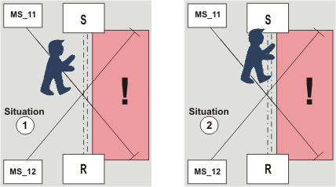
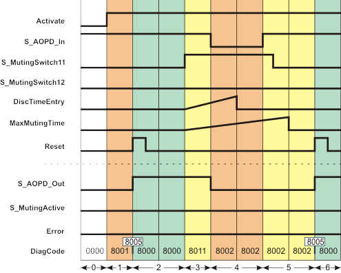

# Additional signal sequence diagram

Temporary intermediate states are not illustrated in the signal sequence diagram. Only typical input signal combinations are illustrated in this diagram. Other signal combinations are possible.

The most significant areas within the signal sequence diagrams are highlighted in color.

**Further Information:**

The diagram in the [overview](sfMutingPar_2Sensor.html#sfMutingPar_2Sensor) for this function block must also be taken into account.

**NOTE:**

The signal sequence diagrams in this documentation possibly omit particular diagnostic codes. For example, a diagnostic code is possibly not shown if the related function block state is a temporary transition state and only active for one cycle of the Safety Logic Controller.

Only typical input signal combinations are illustrated. Other signal combinations are possible.

## Person in zone of operation, muting inactive, stop request via safety-related equipment, start-up inhibit active

The signal sequence diagram shown below illustrates what happens if, for example, a person interrupts the light beam of just one of the two muting sensors (see situation (1) in the graphic below) and then moves forward to enter the zone of operation of the protected machine, i.e., the person also interrupts the light beam of the safety-related equipment, thus triggering a stop request (see situation (2) in the graphic).

**MS\_11**: Muting sensor, connected to the S\_MutingSwitch11 function block input

**MS\_12**: Muting sensor, connected to the S\_MutingSwitch12 function block input

Additional assumptions:

* **S\_StartReset = SAFEFALSE:** Start-up inhibit after the function block has been activated and after the Safety Logic Controller has started up.
* **MutingEnable = TRUE (constant):** No separate enable signal required for the muting operation.

|  |  |
| --- | --- |
| 0 | The function block is not yet activated (Activate = FALSE).  As a result, all outputs are FALSE or SAFEFALSE. |
| 1 | After the function block has been activated by Activate = TRUE, the start-up inhibit is active at first. Therefore, the S\_AOPD\_Out enable output remains SAFEFALSE. |
| 2 | A positive signal edge at the Reset input resets the start-up inhibit.  The S\_AOPD\_Out output becomes SAFETRUE immediately because  1. the light beams of the muting sensors are not interrupted (S\_MutingSwitch11 = SAFEFALSE and S\_MutingSwitch12 = SAFEFALSE) 2. the light grid is not interrupted either (input S\_AOPD\_In = SAFETRUE). |
| 3 | The person in our example interrupts the light beam of the muting sensor at input S\_MutingSwitch11, thus switching the signal to SAFETRUE (situation (1) in the graphic above).  This change in state at S\_MutingSwitch11 initiates measurement of the discrepancy time DiscTimeEntry (maximum permissible time for the second muting sensor to signal SAFETRUE as well) and the time measurement for the overall muting duration MaxMutingTime. |
| 4 | Before muting can be activated (for which the S\_MutingSwitch12 input must also switch to SAFETRUE within DiscTimeEntry), the person also interrupts the light grid of the safety-related equipment (situation (2) in the graphic above), i.e., S\_AOPD\_In switches to SAFEFALSE.  As a result, the S\_AOPD\_Out enable output switches to SAFEFALSE, as an object (in this case, a person) has been detected inside the zone of operation and muting has not previously been activated. The machine is stopped.  When S\_AOPD\_In switches to SAFEFALSE, the muting operation is canceled. As a result, the function block does not signal an error, although the second muting sensor has **not** also signaled a SAFETRUE signal at the S\_MutingSwitch12 input within the discrepancy time set at DiscTimeEntry. |
| 5 | The person has now left the detection area of the safety-related equipment (i.e., of the light grid). S\_AOPD\_In switches back to SAFETRUE (temporary situation (1) in the graphic above).  A short time later, the signal of muting sensor S\_MutingSwitch11 also switches back to SAFEFALSE, as the person has left the detection area of the muting sensor too.  Although the light beams of all sensors are no longer interrupted, the S\_AOPD\_Out enable output remains SAFEFALSE, as a positive edge is first expected at the Reset input.  As the muting operation has already been canceled, it is of no relevance that the MaxMutingTime time measurement elapses without a result. The function block does not detect an error, the Error output remains FALSE. |
| 6 | Pressing the connected reset button applies the expected positive edge to the Reset input. As S\_AOPD\_In is still SAFETRUE (light beam of the safety-related equipment is not interrupted), the S\_AOPD\_Out output switches to SAFETRUE ("machine running again"). |

EIO0000002269.01

© 2020

Schneider Electric.

All rights reserved.