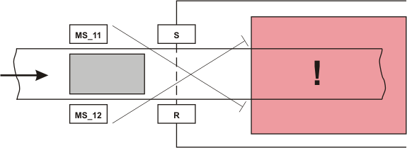
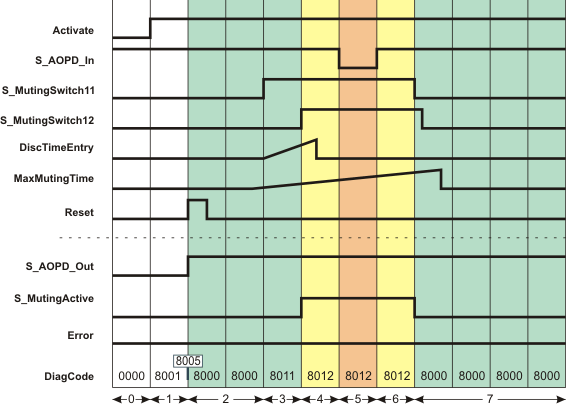
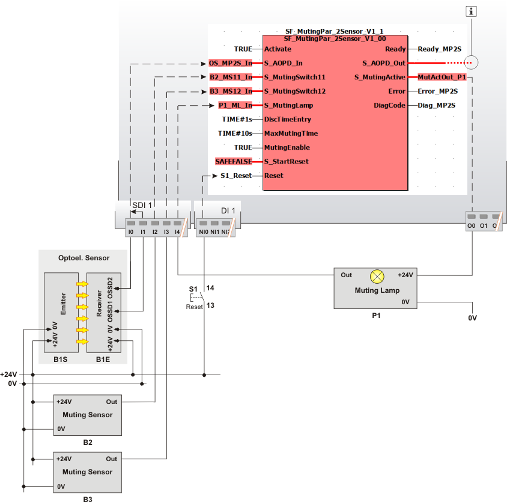

# SF\_MutingPar\_2Sensor

The following description is valid for the function block SF\_MutingPar\_2Sensor, Version 1.0z (where z = 0 to 9).

## Short description

|  |  |
| --- | --- |
| The safety-related SF\_MutingPar\_2Sensor function block evaluates the signals of two muting sensors and an optoelectronic safety-related equipment (a light grid, for example) in an application for parallel muting with two sensors and switches the enable signal at the S\_AOPD\_Out output.  The signal at the S\_AOPD\_Out output is the enable signal for the entire process. A SAFEFALSE signal at the S\_AOPD\_Out output stops the application in the zone of operation.  This function can be used to temporarily deactivate (or "mute") safety-related equipment in the form of a light grid, for example, in order to allow an object which has been identified by the muting sensors as permissible (for the muting operation) to pass through on an assembly conveyor.  In such a case, the interruption of the light grid does not have any effect on the S\_AOPD\_Out output.  By contrast, if the safety-related equipment is engaged by an object which has not been identified by the muting sensors as permissible, the S\_AOPD\_Out output switches to SAFEFALSE.  For example, if the hand of a worker passes through an assembly conveyer interrupting a light curtain, the S\_AOPD\_Out output would be used to signal the actions necessary to set the zone of operation to its defined safe state.  A start-up inhibit can be specified at S\_StartReset. |  |

The graphic below illustrates an application for the SF\_MutingPar\_2Sensor function block.

**Further Information:**

The entire muting operation is divided into different muting sequences. For more detailed information, see the [functional description](function_MutingPar_2Sensor.html#function_MutingPar_2Sensor).

**MS\_11**: Muting sensor, connected to the S\_MutingSwitch11 function block input

**MS\_12**: Muting sensor, connected to the S\_MutingSwitch12 function block input

**S, R**: Transmitter and receiver of the light grid

**!**: Zone of operation

## Function block inputs

Click the corresponding hyperlinks to obtain detailed information on the items below.

| Name | Short description | Value |
| --- | --- | --- |
| [Activate](act_MutingPar_2Sensor.html#act_MutingPar_2Sensor) | State-controlled input for activating the function block.  Data type: BOOL  Initial value: FALSE | * **FALSE**: Function block inactive * **TRUE**: Function block activated |
| [S\_AOPD\_In](a_in_MutingPar_2Sensor.html#a_in_MutingPar_2Sensor) | State-controlled input for the status of the safety-related equipment (e.g., light grid).  Data type: SAFEBOOL  Initial value: SAFEFALSE | * **SAFEFALSE**: Light beam of the optoelectronic safety-related equipment (e.g., light barrier) interrupted.  **NOTE:**  The S\_AOPD\_Out output becomes SAFEFALSE when the muting operation is not active (S\_MutingActive = SAFEFALSE).  * **SAFETRUE**: Light beam of the optoelectronic safety-related equipment (e.g., light barrier) not interrupted. |
| [S\_MutingSwitch11](ms_1112_MutingPar_2Sensor.html#ms_1112_MutingPar_2Sensor) and [S\_MutingSwitch12](ms_1112_MutingPar_2Sensor.html#ms_1112_MutingPar_2Sensor) | State-controlled inputs for the muting sensors.  Data type: SAFEBOOL  Initial value: SAFEFALSE | * **SAFEFALSE**: Light beam of the muting sensor not interrupted * **SAFETRUE**: Light beam of the muting sensor interrupted |
| [S\_MutingLamp](mlamp_MutingPar_2Sensor.html#mlamp_MutingPar_2Sensor) | State-controlled input for the feedback signal from the muting lamp.  Data type: SAFEBOOL  Initial value: SAFEFALSE | * **SAFEFALSE**: Muting lamp non-functional * **SAFETRUE**: Muting lamp in working order |
| [DiscTimeEntry](prog_dte_MutingPar_2Sensor.html#prog_dte_MutingPar_2Sensor) | Specification of the permissible discrepancy time for the switching operation of the muting sensors at the S\_MutingSwitch11 and S\_MutingSwitch12 inputs.  Data type: TIME  Initial value: #0ms  Once the first input has switched to SAFETRUE, the second input must follow within this time. If it does not, the S\_AOPD\_Out output is switched to the defined safe state SAFEFALSE (e.g., "switch off machine"). | **Minimum value:** 0 s  **Maximum value:** 4 s  Enter a time value according to your risk analysis.  Refer to the first hazard message below this table. |
| [MaxMutingTime](prog_mmt_MutingPar_2Sensor.html#prog_mmt_MutingPar_2Sensor) | Specification of the maximum permissible time for the entire muting operation.  Data type: TIME  Initial value: #0ms  If the muting operation is not completed within this time, the S\_AOPD\_Out output is switched to the defined safe state SAFEFALSE (e.g., "switch off machine").  This timer starts when at least one of the two muting sensors provides a SAFETRUE signal.  The muting operation is complete when at least one of the muting sensors provides SAFEFALSE again. | **Minimum value:** 0 s  **Maximum value:** 600 s  Enter a time value according to your risk analysis.  Refer to the first hazard message below this table. |
| [MutingEnable](enab_MutingPar_2Sensor.html#enab_MutingPar_2Sensor) | State-controlled input for enabling the muting operation.  Data type: BOOL  Initial value: FALSE | * **FALSE**: No enable for the muting operation * **TRUE**: Enable for the muting operation |
| [S\_StartReset](prog_s_res_MutingPar_2Sensor.html#prog_s_res_MutingPar_2Sensor) | Specification of the start-up inhibit after the Safety Logic Controller has been started up or after the function block has been activated.  An active start-up inhibit must be removed manually by a positive signal edge at the Reset input. A deactivated start-up inhibit causes the S\_AOPD\_Out output to switch to SAFETRUE automatically when the function block is activated and the safety-related function is not requested.  Data type: SAFEBOOL  Initial value: SAFEFALSE  Refer to the second hazard message below this table. | * **SAFEFALSE**: With start-up inhibit * **SAFETRUE**: Without start-up inhibit |
| [Reset](reset_MutingPar_2Sensor.html#reset_MutingPar_2Sensor) | Edge-triggered input for the reset signal:  * Resetting error messages when the cause of the error is no longer present. * Manual resetting of an active start-up inhibit (specified by S\_StartReset).  Refer to the third hazard message below this table.  Data type: BOOL  Initial value: FALSE  **NOTE:**  Resetting does not occur with a negative (falling) edge, as specified by standard EN ISO 13849-1, but with a positive (rising) edge. | * **FALSE**: Reset is not requested * Edge **FALSE > TRUE**: Reset is requested |

| WARNING | |
| --- | --- |
|  | **NON-CONFORMANCE TO SAFETY FUNCTION REQUIREMENTS**   * Verify that the time value set at the time input corresponds to your risk analysis. * Be sure that your risk analysis includes an evaluation for incorrectly setting the time value at the time input. * Validate the overall safety-related function with regard to the set time value and thoroughly test the application.   **Failure to follow these instructions can result in death, serious injury, or equipment damage.** |

| WARNING | |
| --- | --- |
|  | **NON-CONFORMANCE TO SAFETY FUNCTION REQUIREMENTS**   * Be sure that your risk analysis includes an evaluation if the start-up inhibit is deactivated (S\_StartReset = SAFETRUE). * Observe the regulations given by relevant sector standards regarding the start-up inhibit. * Verify that a suitable start-up inhibit is in place at another location or using other means if the start-up inhibit is deactivated by setting S\_StartReset = SAFETRUE.   **Failure to follow these instructions can result in death, serious injury, or equipment damage.** |

Resetting the function block by means of a positive signal edge at the Reset input can cause the S\_AOPD\_Out output to switch to SAFETRUE immediately (depending on the status of the other inputs).

| WARNING | |
| --- | --- |
|  | **UNINTENDED START-UP**   * Include in your risk analysis the impact of the reset by means of a positive signal edge at the Reset input. * Make certain that appropriate procedures and measures (according to applicable sector standards) have been established to help avoid hazardous situations when resetting. * Do not enter the zone of operation when resetting. * Ensure that no other persons can access the zone of operation when resetting. * Use appropriate safety interlocks where personnel and/or equipment hazards exist.   **Failure to follow these instructions can result in death, serious injury, or equipment damage.** |

## Function block outputs

| Name | Short description | Value |
| --- | --- | --- |
| [Ready](ready_MutingPar_2Sensor.html#ready_MutingPar_2Sensor) | Output for signaling "Function block activated / not activated".  Data type: BOOL | * **FALSE**: Function block is not activated (Activate = FALSE) and all outputs of the function block are switched to FALSE/SAFEFALSE. * **TRUE**: Function block is activated (Activate = TRUE) and the output parameters represent the state of the safety-related function. |
| [S\_AOPD\_Out](out_MutingPar_2Sensor.html#out_MutingPar_2Sensor) | Output for enable signal of the function block.  Data type: SAFEBOOL | * **SAFEFALSE**:  + The muting operation is not active and the light grid detects an object   + **or** the muting operation is active and the function block detects an error   + **or** the function block is not activated   + **or** the start-up inhibit is active. * **SAFETRUE**:    + The muting operation is not active and the light grid does not detect an object   + **or** the muting operation is active and the function block does not detect an error. |
| [S\_MutingActive](m_act_MutingPar_2Sensor.html#m_act_MutingPar_2Sensor) | Output for the status of the muting operation.  Data type: SAFEBOOL | * **SAFEFALSE**:    + The muting operation is not active   + **or** the function block is not activated   + **or** the start-up inhibit is active   + **or** an error message is present. * **SAFETRUE**:    + The muting operation is active   + **and** the function block is activated   + **and** the start-up inhibit is not active   + **and** no error message is present. |
| [Error](err_MutingPar_2Sensor.html#err_MutingPar_2Sensor) | Output for error message.  Data type: BOOL | * **FALSE**: No error is present. * **TRUE**: The function block has detected an error. The S\_AOPD\_Out output switches to SAFEFALSE as a result. |
| [DiagCode](diag_MutingPar_2Sensor.html#diag_MutingPar_2Sensor) | Output for diagnostic message.  Data type: WORD | Diagnostic message of the function block.  The possible values are listed and described in the topic "[Diagnostic codes](codes_MutingPar_2Sensor.html#codes_MutingPar_2Sensor)". |

## Signal sequence diagram

The signal sequence diagram shown below illustrates a muting operation (parallel muting), using the example of an assembly conveyor that ends in the zone of operation with a running machine (as represented in the graphic at the beginning of this topic).

Additional assumptions:

* **S\_StartReset = SAFEFALSE:** Start-up inhibit after the function block has been activated and the Safety Logic Controller has started up.
* **MutingEnable = TRUE (constant):** No separate enable signal required for the muting operation.

**NOTE:**

The other [signal sequence diagram](signaldiagrams_MutingPar_2Sensor.html#signaldiagrams_MutingPar_2Sensor) can be taken into account.

**NOTE:**

The signal sequence diagrams in this documentation possibly omit particular diagnostic codes. For example, a diagnostic code is possibly not shown if the related function block state is a temporary transition state and only active for one cycle of the Safety Logic Controller.

Only typical input signal combinations are illustrated. Other signal combinations are possible.

|  |  |
| --- | --- |
| 0 | The function block is not yet activated (Activate = FALSE).  As a result, all outputs are FALSE or SAFEFALSE. |
| 1 | After the function block has been activated by Activate = TRUE, the start-up inhibit is active at first. |
| 2 | A positive signal edge at the Reset input resets the start-up inhibit.  The S\_AOPD\_Out output switches to SAFETRUE immediately (normal operation) because   1. the light beams of the muting sensors are not interrupted (S\_MutingSwitch11 = SAFEFALSE and S\_MutingSwitch12 = SAFEFALSE) and 2. the light grid does not detect an object either (input S\_AOPD\_In = SAFETRUE). |
| 3 | The muting sensor at input S\_MutingSwitch11 detects an object and switches to SAFETRUE.  This change of state at S\_MutingSwitch11 initiates   1. the measurement of the discrepancy time set at DiscTimeEntry. The maximum permissible period within which the second muting sensor must also detect the object is set at DiscTimeEntry. 2. the time measurement for the overall muting duration. The maximum permissible period is specified at MaxMutingTime. |
| 4 | The second muting sensor also detects the object (input S\_MutingSwitch12 switches to SAFETRUE) within the permissible discrepancy time (DiscTimeEntry).  This means that the object is identified as permissible and the S\_MutingActive output switches to SAFETRUE as a result: **Muting is active**. |
| 5 | The object reaches the light grid: the S\_AOPD\_In input switches to SAFEFALSE ("light grid interrupted").  As muting is active (S\_MutingSwitch11 and S\_MutingSwitch12 are still SAFETRUE), the machine may continue to run in the zone of operation: The S\_AOPD\_Out output remains SAFETRUE. |
| 6 | The object has passed the light grid (S\_AOPD\_In switches back to SAFETRUE). S\_MutingSwitch11 and S\_MutingSwitch12 are still SAFETRUE, muting is still active (S\_MutingActive remains SAFETRUE). |
| 7 | The object moves out of the detection area of the two muting sensors and toward the zone of operation; the sensors switch to SAFEFALSE one after the other.  If the first sensor switches to SAFEFALSE within the time set at MaxMutingTime, the muting operation has been completed successfully (S\_MutingActive becomes SAFEFALSE).  As no object is detected now **and** the muting operation has been completed within the specified time MaxMutingTime, no error is reported (Error remains FALSE) and the S\_AOPD\_Out output remains SAFETRUE ("machine continues to run"). |

## Application example

The graphic below illustrates the evaluation of two parallel muting sensors using the SF\_MutingPar\_2Sensor function block.

**Further Information:**

The [description and notes for this application example](applicationexample_MutingPar_2Sensor.html#applicationexample_MutingPar_2Sensor) can be taken into account.

**NOTE:**

The S\_AOPD\_Out enable output of the SF\_MutingPar\_2Sensor function block is connected to an output terminal of the application via a global I/O variable or via other safety-related functions/function blocks.

|  |  |
| --- | --- |
| B1 | Two-channel light grid (B1S = optoelectronic transmitter, B1E = optoelectronic receiver) |
| B2, B3 | Optoelectronic muting sensors, single-channel, located in front of the light grid |
| P1 | Muting lamp with single-channel feedback signal, monitored by safety logic |
|  | See note above the illustration. |

## Detailed information

Additional information is available in the following sections:

* [Functional description](function_MutingPar_2Sensor.html#function_MutingPar_2Sensor)
* [Additional signal sequence diagram](signaldiagrams_MutingPar_2Sensor.html#signaldiagrams_MutingPar_2Sensor)
* [Further details of the application example](applicationexample_MutingPar_2Sensor.html#applicationexample_MutingPar_2Sensor)
* [Exception avoidance](faultavoidance_MutingPar_2Sensor.html#faultavoidance_MutingPar_2Sensor)
* [Implementation of safety requirements from applicable standards](safetyrequirements_MutingPar_2Sensor.html#safetyrequirements_MutingPar_2Sensor)

EIO0000002269.01

© 2020

Schneider Electric.

All rights reserved.