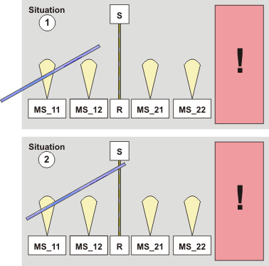
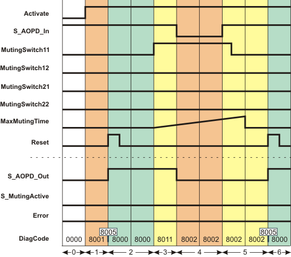

# Additional signal sequence diagram

Temporary intermediate states are not illustrated in the signal sequence diagram. Only typical input signal combinations are illustrated in this diagram. Other signal combinations are possible.

The most significant areas within the signal sequence diagram are highlighted in color.

**Further Information:**

The diagram in the [overview](sfmutingseq.html#sfmutingseq) for this function block must also be taken into account.

**NOTE:**

The signal sequence diagrams in this documentation possibly omit particular diagnostic codes. For example, a diagnostic code is possibly not shown if the related function block state is a temporary transition state and only active for one cycle of the Safety Logic Controller.

Only typical input signal combinations are illustrated. Other signal combinations are possible.

**NOTE:**

Only the material flow direction from muting sensors MutingSwitch11MutingSwitch12 to muting sensors MutingSwitch21MutingSwitch22 is described in the following. This means the sequential muting sensor pair MutingSwitch11/MutingSwitch12 is positioned **before** the safety-related equipment and MutingSwitch21/MutingSwitch22 is **behind** the safety-related equipment. This is illustrated in the [graphic in the function block overview](sfmutingseq.html#sfmutingseq__MutingSeq_ShortDescr).

The function block also supports the opposite material flow direction from muting sensors MutingSwitch22MutingSwitch21 to muting sensors MutingSwitch12MutingSwitch11. The functional sequence remains identical.

## Object in zone of operation, muting inactive, stop request via safety-related equipment, start-up inhibit active

The signal sequence diagram shown below indicates what happens if an object (e.g., a rod) interrupts the light beam of the first muting sensor located before the safety-related equipment (see situation (1)) and then moves forward to enter the zone of operation of the protected machine, i.e., also interrupts the light beam of the safety-related equipment (see situation (2)). This triggers a stop request because muting is not active. To activate muting for the material flow direction mentioned, the muting sensors at the inputs MutingSwitch11 and MutingSwitch12 must switch to TRUE in the correct sequence, i.e., MutingSwitch11 must first detect the object and then MutingSwitch12, i.e., switch to TRUE.

**MS\_11, MS\_12**: First sequential muting sensor pair, connected to function block inputs MutingSwitch11 and MutingSwitch12 (the "yellow light beams" symbolize the detection area)

**MS\_21, MS\_22**: Second sequential muting sensor pair, connected to function block inputs MutingSwitch21 and MutingSwitch22

Additional assumptions:

* **S\_StartReset = SAFEFALSE:** Start-up inhibit after the function block has been activated and after the Safety Logic Controller has started up.
* **MutingEnable = TRUE (constant):** No separate enable signal required for the muting operation.

|  |  |
| --- | --- |
| 0 | The function block is not yet activated (Activate = FALSE).  As a result, all outputs are FALSE or SAFEFALSE. |
| 1 | After the function block has been activated by Activate = TRUE, the start-up inhibit is active at first. Therefore, the S\_AOPD\_Out enable output remains SAFEFALSE. |
| 2 | A positive signal edge at the Reset input resets the start-up inhibit.  The S\_AOPD\_Out output becomes SAFETRUE immediately because  1. the muting lamp reports its operational readiness through a SAFETRUE signal at the S\_MutingLamp input and 2. the light grid is not interrupted either (input S\_AOPD\_In = SAFETRUE). |
| 3 | The object in our example interrupts the light beam of the muting sensor at the MutingSwitch11 input, thus switching the signal to TRUE (situation (1) in the graphic above).  The time measurement for the overall muting duration set at MaxMutingTime starts after this state change at MutingSwitch11. |
| 4 | Before muting can be activated (for which the signal at the MutingSwitch12 input must also switch to TRUE), the rod also interrupts the light grid of the safety-related equipment (situation (2) in the graphic above), i.e., S\_AOPD\_In switches to SAFEFALSE.  When S\_AOPD\_In switches to SAFEFALSE, the muting operation is canceled. As a result, the enable output S\_AOPD\_Out is switched to SAFEFALSE. |
| 5 | The rod has been removed from the detection area of the safety-related equipment and the muting sensor. This switches S\_AOPD\_In to SAFETRUE and MutingSwitch11 to FALSE again.  Although the light beams of all sensors are no longer interrupted, the S\_AOPD\_Out enable output remains SAFEFALSE, as a positive edge is first expected at the Reset input. |
| 6 | A positive signal edge at the Reset input resets the start-up inhibit. As S\_AOPD\_In = SAFETRUE (light beam of the safety-related equipment is not interrupted), the S\_AOPD\_Out output switches to SAFETRUE. |

EIO0000002269.01

© 2020

Schneider Electric.

All rights reserved.