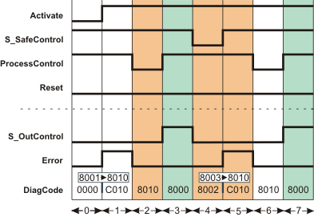
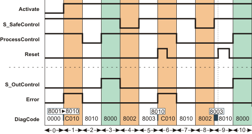

# Additional signal sequence diagrams

Temporary intermediate states are not illustrated in the signal sequence diagrams. Only typical input signal combinations are illustrated in these diagrams. Other signal combinations are possible.

The significant areas within the signal sequence diagrams are highlighted in color.

**Further Information:**

Refer also to the diagram found in the [overview](sfoutcontrol.html#sfoutcontrol) for this function block.

**NOTE:**

The signal sequence diagrams in this documentation possibly omit particular diagnostic codes. For example, a diagnostic code is possibly not shown if the related function block state is a temporary transition state and only active for one cycle of the Safety Logic Controller.

Only typical input signal combinations are illustrated. Other signal combinations are possible.

## No start-up inhibit, no restart inhibit, with additional operation stop

**StaticControl = FALSE**: Specification of an additional operation stop before removal of the request for the safety-related function (return of the SAFETRUE signal at the S\_SafeControl input) by deactivation of the emergency-stop control device and before function block activation.

**S\_StartReset = SAFETRUE**: No start-up inhibit after the Safety Logic Controller has been started up and the function block has been activated.

**S\_AutoReset = SAFETRUE**: No active restart inhibit following removal of the request for the safety-related function (return of the SAFETRUE signal at the S\_SafeControl input).

|  |  |
| --- | --- |
| 0 | The function block is not yet activated (Activate = FALSE). As a result, all outputs are FALSE or SAFEFALSE. |
| 1 | When activating the function block with Activate = TRUE, input ProcessControl = TRUE ("running operation" is signaled). However, the FALSE constant at the StaticControl input specifies an additionally required operation stop of the standard controller, which is monitored via the ProcessControl input. The function block thus considers the permanent TRUE at ProcessControl as an error.  The S\_OutControl enable output thus remains in the defined safe state (SAFEFALSE), although no request for the safety-related function is displayed at the safety-related input S\_SafeControl with the SAFETRUE value. |
| 2 | The error is removed with the standard controller executing an operation stop (ProcessControl = FALSE). Error switches to FALSE. The S\_OutControl enable output remains SAFEFALSE. |
| 3 | The operation start of the standard controller is signaled by a positive edge at the ProcessControl input. The S\_OutControl enable output switches to SAFETRUE: normal operation. |
| 4 | Request of the safety-related function, e.g., by pressing an emergency-stop control device (S\_SafeControl = SAFEFALSE). The S\_OutControl output immediately switches to SAFEFALSE. |
| 5 | Following the removal of the request for the safety-related function (S\_SafeControl = SAFETRUE), the function block returns an error, as the request for an additional operation stop (StaticControl = FALSE) is not met: Instead, "running operation" is signaled from the standard controller with ProcessControl = TRUE.  Error switches to TRUE and S\_OutControl remains in the defined safe state (SAFEFALSE). |
| 6 | ProcessControl becomes FALSE due to the operation stop of the standard controller and the error is removed. Error switches to FALSE. The S\_OutControl enable output remains SAFEFALSE. |
| 7 | With a positive signal edge (FALSE > TRUE) at ProcessControl, S\_OutControl switches to SAFETRUE. Normal operation. |

## No start-up inhibit, with active restart inhibit, with additional operation stop

**StaticControl = FALSE**: Specification of an additional operation stop before removal of the request for the safety-related function (return of the SAFETRUE signal at the S\_SafeControl input) by deactivation of the emergency-stop control device and before function block activation.

**S\_StartReset = SAFETRUE**: No start-up inhibit after the Safety Logic Controller has been started up and the function block has been activated.

**S\_AutoReset = SAFEFALSE**: Active restart inhibit following removal of the request for the safety-related function (return of the SAFETRUE signal at the S\_SafeControl input).

|  |  |
| --- | --- |
| 0 | The function block is not yet activated (Activate = FALSE). As a result, all outputs are FALSE or SAFEFALSE. |
| 1 | When activating the function block with Activate = TRUE, input ProcessControl = TRUE ("running operation" is signaled). However, the FALSE constant at the StaticControl input specifies an additionally required operation stop of the standard controller, which is monitored via the ProcessControl input. The function block thus considers the permanent TRUE at ProcessControl as an error.  The S\_OutControl enable output thus remains in the defined safe state (SAFEFALSE), although no request for the safety-related function is displayed at the safety-related input S\_SafeControl with the SAFETRUE value. |
| 2 | The error is removed with the standard controller executing an operation stop (ProcessControl = FALSE). Error switches to FALSE. The S\_OutControl enable output remains SAFEFALSE. |
| 3 | The operation start of the standard controller is signaled by a positive edge at the ProcessControl input. The S\_OutControl enable output switches to SAFETRUE: Normal operation. |
| 4 | Request of the safety-related function, e.g., by pressing an emergency-stop control device (S\_SafeControl = SAFEFALSE). The S\_OutControl output immediately switches to SAFEFALSE. |
| 5 | Following removal of the request for the safety-related function (S\_SafeControl = SAFETRUE), the restart inhibit is active. S\_OutControl remains in the defined safe state (SAFEFALSE). |
| 6 | The restart inhibit is removed with a positive edge at Reset.  The function block now returns an error, as the request for an additional operation stop (StaticControl = FALSE) is not met: Instead, "running operation" is signaled from the standard controller with ProcessControl = TRUE.  Irrespective of this, the error remains. |
| 7 | ProcessControl becomes FALSE due to the operation stop of the standard controller and the error is removed. Error switches to FALSE. The S\_OutControl enable output remains SAFEFALSE. |
| 8 | New request of the safety-related function (S\_SafeControl = SAFEFALSE). |
| 9 | Removal of the request for the safety-related function and active restart inhibit. Furthermore, the restart inhibit is removed with a positive edge at Reset.  There is no error, as an operation stop is still signaled (ProcessControl = FALSE). |
| 10 | The S\_OutControl enable output switches back to SAFETRUE with a positive signal edge at ProcessControl (operation start signaled from the standard controller). Normal operation. |

EIO0000002269.01

© 2020

Schneider Electric.

All rights reserved.