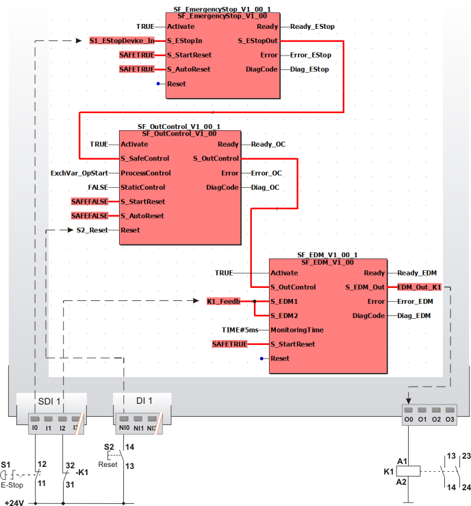

# Additional application example

In this chapter you will find another possible application, in which the function block can be used for realization of a signal acknowledgement from the standard controller.

The function block must only be used in an actual application once a risk analysis has been conducted.

Details of the risk category/SIL/PL have not been included here, as classification is always based on the application in which the function block is used.

**NOTE:**

The use of the function block alone is not sufficient to execute the safety-related function according to the Cat./SIL/PL determined by the risk analysis. In conjunction with the safety-related I/O device used, additional measures must be taken to meet the requirements of the safety-related function. These include, for example, the appropriate wiring and parameterization of the inputs and outputs as well as measures to exclude (design out) errors that cannot be detected. For additional information, refer to the documentation provided with the safety-related I/O device used.

**NOTE:**

Refer to the notes in the User Manual on proper electrical connection of the Safety Logic Controller and the extension modules (e.g., connecting the emergency-stop control device).

**Further Information:**

Refer also to the application example in the [overview](sfoutcontrol.html#sfoutcontrol) for this function block.

## Control of a backreadable output, additionally required operation stop configured

This example shows the control of a safety-related output with the safety-related SF\_OutControl function block for monitoring a connected contactor. An additional operation stop of the standard controller is required by applying the FALSE constant at the StaticControl input.

**NOTE:**

As a **backreadable** output is to be controlled in this example, the S\_OutControl enable output **must** be connected to the safety-related output in the application via the SF\_EDM function block.

Direct control of backreadable outputs with the enable output of the SF\_OutControl function block is **not** permitted.

All function blocks involved are perpetually activated by means of TRUE constants at the Activate input.

An emergency-stop control device S1 is connected as single-channel to the input terminal I0 of the safety-related input device SDI 1 and assigned to the global I/O variable S1\_EStopDevice\_In. This global I/O variable is connected to the S\_EStopIn function block input of the SF\_EmergencyStop function block. Neither a start-up inhibit nor a restart inhibit is specified for the SF\_EmergencyStop function block (SAFETRUE constant at both inputs S\_StartReset and S\_AutoReset).

Instead, both inhibits are configured at the SF\_OutControl function block: The S\_StartReset = SAFEFALSE input specifies a start-up inhibit after the Safety Logic Controller has been started up or the function block has been activated. S\_AutoReset = SAFEFALSE configures a restart inhibit after the request for the safety-related function has been removed, i.e., after the SAFETRUE signal has returned at the S\_SafeControl function block input. Both inhibits are only removed when there is a positive signal edge at the Reset input. To this end, the S2 reset button is connected to input NI0 of the standard input device DI 1. Its signal is assigned to the global I/O variable S2\_Reset, which is connected to the Reset input of the SF\_OutControl function block.

Further connection of the **SF\_OutControl** function block:

* The S\_EStopOut enable output of the SF\_EmergencyStop function block signals the status of the safety-related function and is directly connected to the S\_SafeControl function block input.
* The ProcessControl input of the SF\_OutControl function block is controlled by a signal from the standard controller. The operation start/stop is signaled by the ExchVar\_OpStart exchange variable. ProcessControl signals whether or not the standard controller requests to switch the S\_OutControl enable output to SAFETRUE.
* A FALSE constant is applied to the StaticControl input, i.e., an additional operation stop of the standard controller is required. This means the signal at ProcessControl **must** be FALSE and then change to TRUE before the request for the safety-related function has been removed (S\_SafeControl input) by deactivation of the emergency-stop control device and before function block activation. A permanent TRUE at ProcessControl results in an error in this situation. In case of an error, the S\_OutControl enable output remains in the defined safe state (SAFEFALSE) and the Error output switches to TRUE.
* The S\_OutControl function block output is directly connected to the S\_OutControl input of the SF\_EDM function block.

The **SF\_EDM** function block **must** be used to control a backreadable output. SF\_EDM is connected as follows:

* The S\_OutControl input is directly connected to the S\_OutControl enable output of the SF\_OutControl function block.
* One-channel feedback via input terminal I2 of the safety-related input device SDI 1 (one-channel up to cat. 2) is provided from contactor K1 via an N/C contact. The resulting signal of the input terminal is assigned to the global I/O variable K1\_Feedb, which is connected to the inputs S\_EDM1 and S\_EDM2.
* The global I/O variable EDM\_OUT\_K1 is connected to the S\_EDM\_Out output, which in turn is assigned to the output terminal O0 of the Safety Logic Controller. Contactor K1 is connected to this terminal.

**Further Information:**

For more detailed information, refer to the description of the corresponding safety-related function block.

|  |  |
| --- | --- |
| S1 | Emergency-stop |
| S2 | Reset |
| K1 | Contactor or relay with positively driven contacts |

EIO0000002269.01

© 2020

Schneider Electric.

All rights reserved.