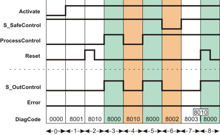
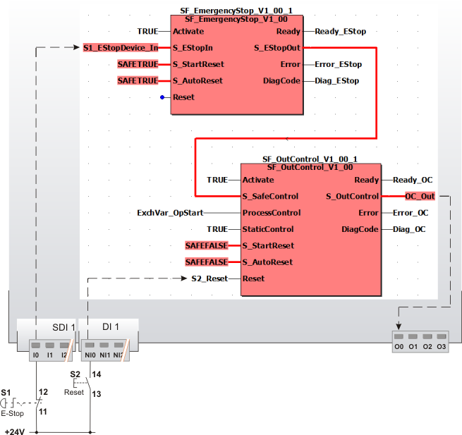

# SF\_OutControl

The following description is valid for the function block SF\_OutContrl\_V1\_0z, Version 1.0z (where z = 0 to 9).

## Short description

|  |  |
| --- | --- |
| The safety-related SF\_OutControl function block controls the output of a safety-related device. The safety-related output is controlled depending on a signal from the standard controller (operation start/stop) **and** a safety-related signal (monitoring of a safety-related function, e.g., emergency-stop).  S\_StartReset can be used to specify a start-up inhibit and S\_AutoReset can be used to specify a restart inhibit. Both inhibits refer to the start or restart of the Safety Logic Controller or safety-related function.  Furthermore, the StaticControl input enables the specification of an additionally required operation stop of the standard controller with requested safety-related function and before activating the function block. |  |

## Function block inputs

Click the corresponding hyperlinks to obtain detailed information on the items below.

| Name | Short description | Value |
| --- | --- | --- |
| [Activate](act_OutControl.html#act_OutControl) | State-controlled input for activating the function block.  Data type: BOOL  Initial value: FALSE | * **FALSE**: Function block inactive * **TRUE**: Function block activated |
| [S\_SafeControl](safecontr.html#safecontr) | State-controlled input for the status of the upstream safety-related function.  Data type: SAFEBOOL  Initial value: SAFEFALSE | * **SAFEFALSE**: Upstream safety-related function triggered * **SAFETRUE**: Upstream safety-related function not triggered |
| [ProcessControl](procontr.html#procontr) | State-controlled input (if input StaticControl = TRUE) or edge-triggered input (if input StaticControl = FALSE) which evaluates the request of the process coming from the standard controller.  Data type: BOOL  Initial value: FALSE | * **FALSE**: Request to switch the enable output S\_OutControl to SAFEFALSE * **TRUE**: Request to switch the enable output S\_OutControl to SAFETRUE * Edge **FALSE > TRUE**: A positive signal edge represents a start of operation in the standard controller |
| [StaticControl](statcontr.html#statcontr) | Specification of an additionally required operation stop with triggered safety-related function and/or before function block activation.  Data type: BOOL  Initial value: FALSE | * **FALSE**: Additional operation stop required * **TRUE**: No additional operation stop required |
| [S\_StartReset](s_res_OutControl.html#s_res_OutControl) | State-controlled input for specifying the start-up inhibit after the Safety Logic Controller has been started up or the function block has been activated.  An active start-up inhibit must be removed manually by means of a positive signal edge at the Reset input. A deactivated start-up inhibit causes the S\_OutControl output to automatically switch to SAFETRUE if the function block is enabled and the safety-related function is not requested and the request from the standard controller is signaled at the ProcessControl input.  Data type: SAFEBOOL  Initial value: SAFEFALSE  Refer to the first hazard message below this table. | * **SAFEFALSE**: With start-up inhibit * **SAFETRUE**: Without start-up inhibit |
| [S\_AutoReset](a_res_OutControl.html#a_res_OutControl) | State-controlled input for specifying the restart inhibit after the SAFETRUE signal has returned at the S\_SafeControl input.  An active restart inhibit must be removed manually by means of a positive signal edge at the Reset input. A deactivated restart inhibit causes the S\_OutControl output to automatically switch to SAFETRUE if the function block is enabled and the safety-related function is not requested and the request from the standard controller is signaled at the ProcessControl input.  Data type: SAFEBOOL  Initial value: SAFEFALSE  Refer to the first hazard message below this table. | * **SAFEFALSE**: With restart inhibit * **SAFETRUE**: Without restart inhibit |
| [Reset](reset_OutControl.html#reset_OutControl) | Edge-triggered input for the reset signal:  * Resetting error messages when the cause of the error is no longer present. * Manual resetting of an active start-up/restart inhibit (specified by S\_StartReset and/or S\_AutoReset).  Data type: BOOL  Initial value: FALSE  **NOTE:**  Resetting does not occur with a negative (falling) edge, as specified by standard EN ISO 13849-1, but with a positive (rising) edge.  Refer to the second hazard message below this table. | * **FALSE**: Reset is not requested * Edge **FALSE > TRUE**: Reset is requested |

The start-up inhibit and/or restart inhibit must only be deactivated if it is certain that starting up/restarting the machine/system will not lead to a hazardous situation or that a suitable start-up/restart inhibit is in place at another location or using other means.

| WARNING | |
| --- | --- |
|  | **NON-CONFORMANCE TO SAFETY FUNCTION REQUIREMENTS**   * Verify the impact of a deactivated start-up inhibit (S\_StartReset = SAFETRUE) and/or restart inhibit (S\_AutoReset = SAFETRUE) on your machine or process prior to implementation. * Observe the regulations given by relevant sector standards regarding the start-up/restart inhibit. * Verify that a suitable start-up inhibit is in place at another location or using other means.   **Failure to follow these instructions can result in death, serious injury, or equipment damage.** |

Resetting the function block by means of a positive signal edge at the Reset input can cause the S\_OutControl output to switch to SAFETRUE immediately (depending on the status of the other inputs).

| WARNING | |
| --- | --- |
|  | **UNINTENDED START-UP**   * Include in your risk analysis the impact of the reset by means of a positive signal edge at the Reset input. * Make certain that appropriate procedures and measures (according to applicable sector standards) have been established to help avoid hazardous situations when resetting. * Do not enter the zone of operation when resetting. * Ensure that no other persons can access the zone of operation when resetting. * Use appropriate safety interlocks where personnel and/or equipment hazards exist.   **Failure to follow these instructions can result in death, serious injury, or equipment damage.** |

## Function block outputs

Click the corresponding hyperlinks to obtain detailed information on the items below.

| Name | Short description | Value |
| --- | --- | --- |
| [Ready](ready_OutControl.html#ready_OutControl) | Output for signaling "Function block activated/not activated".  Data type: BOOL | * **FALSE**: Function block is not activated (Activate = FALSE) and all outputs of the function block are switched to FALSE/SAFEFALSE. * **TRUE**: Function block is activated (Activate = TRUE) and the output parameters represent the state of the safety-related function. |
| [S\_OutControl](out_OutControl.html#out_OutControl) | Output for enable signal of the function block.  Data type: SAFEBOOL | * **SAFEFALSE**:    + Function block not activated (Activate = FALSE)   + or an upstream triggered safety-related function was detected by the function block (S\_SafeControl = SAFEFALSE)   + or a start-up/restart inhibit is active   + or an operation stop is requested at ProcessControl (FALSE) from the standard controller   + or an error has been detected. * **SAFETRUE**:    + Function block is activated (Activate = TRUE)   + and the function block did not detect a triggered safety-related function (S\_SafeControl = SAFETRUE)   + and no start-up/restart inhibit is active   + and running operation is requested at ProcessControl (TRUE) from the standard controller   + and no error has been detected. |
| [Error](err_OutControl.html#err_OutControl) | Output for error message.  Data type: BOOL | * FALSE: No error is present. * TRUE: The function block has detected an error. The S\_OutControl output switches to SAFEFALSE as a result. |
| [DiagCode](diag_OutControl.html#diag_OutControl) | Output for diagnostic message.  Data type: WORD | Diagnostic message of the function block.  The possible values are listed and described in the topic "[Diagnostic codes](codes_OutControl.html#codes_OutControl)". |

## Signal sequence diagram

This diagram relates to a typical output control with specified start-up inhibit and restart inhibit. No additionally required operation stop of the standard controller is configured.

* **StaticControl = TRUE**: No specification of an additional operation stop.
* **S\_StartReset = SAFEFALSE:** Start-up inhibit after the function block has been activated and after the Safety Logic Controller has started up.
* **S\_AutoReset = SAFEFALSE:** Restart inhibit following a removal of the request for the safety-related function (return of the SAFETRUE signal at the S\_SafeControl input).

**NOTE:**

The other [signal sequence diagram](signaldiagrams_OutControl.html#signaldiagrams_OutControl) can be taken into account.

**NOTE:**

The signal sequence diagrams in this documentation possibly omit particular diagnostic codes. For example, a diagnostic code is possibly not shown if the related function block state is a temporary transition state and only active for one cycle of the Safety Logic Controller.

Only typical input signal combinations are illustrated. Other signal combinations are possible.

|  |  |
| --- | --- |
| 0 | The function block is not yet activated (Activate = FALSE). As a result, all outputs are FALSE or SAFEFALSE. |
| 1 | After the function block has been activated due to Activate = TRUE, the start-up inhibit is active at first. |
| 2 | A positive signal edge at the Reset input resets the start-up inhibit. |
| 3 | Request from the standard controller at the ProcessControl function block input to switch the S\_OutControl enable output to SAFETRUE. Taking the other inputs into account the following applies: If ProcessControl = TRUE, output S\_OutControl = SAFETRUE. |
| 4 | ProcessControl switches to FALSE: Operation stop request from the standard controller. The S\_OutControl enable output thus switches to SAFEFALSE. |
| 5 | New request at ProcessControl to switch the S\_OutControl enable output to SAFETRUE (start of operation in the standard controller).  As no safety-related function is requested (S\_SafeControl = SAFETRUE) and no additionally required operation stop is configured (StaticControl = TRUE), the S\_OutControl output switches to SAFETRUE. This is followed by normal operation. |
| 6 | Request of the safety-related function, e.g., by pressing an emergency-stop control device (S\_SafeControl = SAFEFALSE). The S\_OutControl output immediately switches to SAFEFALSE. |
| 7 | After the request for the safety-related function has been removed (e.g., deactivation of the emergency-stop control device, S\_SafeControl becomes SAFETRUE again), the restart inhibit is active. S\_OutControl thus remains SAFEFALSE. |
| 8 | Removing the restart inhibit by means of the rising edge at the Reset input. As no additional operation stop of the standard controller is required (ProcessControl input) with StaticControl = TRUE and ProcessControl remains TRUE, S\_OutControl switches to SAFETRUE. |

## Application example

This example shows the control of a safety-related output with the safety-related SF\_OutControl function block. The TRUE constant at the StaticControl input specifies that no additional operation stop of the standard controller is required.

All function blocks involved are perpetually activated by means of TRUE constants at the Activate input.

An emergency-stop control device S1 is connected as single-channel to the input terminal I0 of the safety-related input device SDI 1 and assigned to the global I/O variable S1\_EStopDevice\_In. This global I/O variable is connected to the S\_EStopIn function block input of the SF\_EmergencyStop function block. Neither a start-up inhibit nor a restart inhibit is specified for the SF\_EmergencyStop function block (SAFETRUE constant at both inputs S\_StartReset and S\_AutoReset).

Instead, both inhibits are configured at the SF\_OutControl function block: The S\_StartReset = SAFEFALSE input specifies a start-up inhibit after the Safety Logic Controller has been started up or the function block has been activated. S\_AutoReset = SAFEFALSE configures a restart inhibit after the request for the safety-related function has been removed, i.e., after the SAFETRUE signal has returned at the S\_SafeControl function block input. Both inhibits are only removed when there is a positive signal edge at the Reset input. To this end, the S2 reset button is connected to input NI0 of the standard input device DI 1. Its signal is assigned to the global I/O variable S2\_Reset, which is connected to the Reset input of the SF\_OutControl function block.

Further connection of the **SF\_OutControl** function block:

* The S\_EStopOut enable output of the SF\_EmergencyStop function block signals the status of the safety-related function and is directly connected to the S\_SafeControl function block input.
* The ProcessControl input of the SF\_OutControl function block is controlled by a signal from the standard controller. The operation start/stop is signaled by the ExchVar\_OpStart exchange variable. ProcessControl signals whether or not the standard controller requests to switch the S\_OutControl enable output to SAFETRUE.
* A TRUE constant is applied to the StaticControl input, i.e., no additional operation stop of the standard controller is required. With this, the signal at ProcessControl may be TRUE when the request for the safety-related function is removed (S\_SafeControl input) and when the function block is activated without this resulting in an error.
* The S\_OutControl function block output is assigned to the global I/O variable OC\_Out, which in turn is connected to the O0 output terminal of the safety-related device.

|  |  |
| --- | --- |
| S1 | Emergency-stop |
| S2 | Reset |

**Further Information:**

The [other application example and the accompanying notes](applicationexample_OutControl.html#applicationexample_OutControl) can be taken into account.

## Detailed information

Additional information is available in the following sections:

* [Functional description](function_OutControl.html#function_OutControl)
* [Additional signal sequence diagrams](signaldiagrams_OutControl.html#signaldiagrams_OutControl)
* [Additional application example](applicationexample_OutControl.html#applicationexample_OutControl)
* [Exception avoidance](faultavoidance_OutControl.html#faultavoidance_OutControl)
* [Implementation of safety requirements from applicable standards](safetyrequirements_OutControl.html#safetyrequirements_OutControl)

EIO0000002269.01

© 2020

Schneider Electric.

All rights reserved.