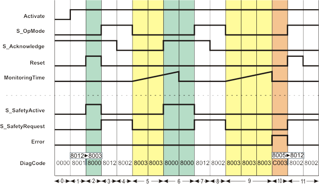

# Details about the signal sequence diagram

Temporary intermediate states are not illustrated in the signal sequence diagram. Only typical input signal combinations are illustrated in this diagram. Other signal combinations are possible.

The most significant areas within the signal sequence diagram are highlighted in color.

**NOTE:**

The signal sequence diagrams in this documentation possibly omit particular diagnostic codes. For example, a diagnostic code is possibly not shown if the related function block state is a temporary transition state and only active for one cycle of the Safety Logic Controller.

Only typical input signal combinations are illustrated. Other signal combinations are possible.

|  |  |
| --- | --- |
| 0 | The function block is not yet activated (Activate = FALSE). As a result, all outputs are FALSE or SAFEFALSE. |
| 1 | The function block is activated (input Activate = TRUE). First of all, the mandatory start-up inhibit of the function block is active. |
| 2 | Removing the start-up inhibit by means of the rising edge at the Reset input.  The request of the safety-related function is signaled from the connected safety-related periphery by S\_OpMode = SAFEFALSE. At the same time, the safety-related periphery confirms execution of the requested safety-related function with S\_Acknowledge = SAFETRUE.  As a consequence, the S\_SafetyActive output switches to SAFETRUE. |
| 3 | The safety-related function of the connected safety-related periphery is no longer requested (S\_OpMode = SAFETRUE). The signal at the S\_OpMode input controls the S\_SafetyRequest output synchronously, independent of the states at the other inputs.  As the request for the safety-related function was removed, the S\_SafetyActive output switches to SAFEFALSE. |
| 4 | The safety-related function is still not requested (S\_OpMode remains SAFETRUE). The feedback signal of the safety-related periphery connected at the S\_Acknowledge input now no longer signals the defined safe state (S\_Acknowledge = SAFEFALSE). |
| 5 | The safety-related function is requested with S\_OpMode = SAFEFALSE. This request outputs S\_SafetyRequest synchronously.  The time monitoring of the function block is started: The SAFETRUE state is expected at the S\_Acknowledge input within the time configured at the MonitoringTime input. |
| 6 | The feedback signal of the safety-related periphery connected to the S\_Acknowledge input is switched to SAFETRUE by the safety-related periphery within the specified time interval, confirming that the request for the safety-related function is executed there.  As a consequence, the S\_SafetyActive output switches to SAFETRUE. |
| 7 | The safety-related function of the connected safety-related periphery is no longer requested (S\_OpMode = SAFETRUE). The signal at the S\_OpMode input controls the S\_SafetyRequest output synchronously, independent of the states at the other inputs.  As the request for the safety-related function was canceled, the S\_SafetyActive output switches to SAFEFALSE. |
| 8 | The signal of the safety-related periphery connected at the S\_Acknowledge input now no longer signals the defined safe state (S\_Acknowledge = SAFEFALSE). |
| 9 | The safety-related function is requested again with S\_OpMode = SAFEFALSE. This request is output synchronously at S\_SafetyRequest. The time monitoring (MonitoringTime) is started again. |
| 10 | The feedback signal of the safety-related periphery connected to the S\_Acknowledge input is not switched to SAFETRUE by the safety-related periphery within the permitted time interval. As a result of this time being exceeded, the safety-related function block switches the Error output to TRUE. Both outputs S\_SafetyActive and S\_SafetyRequest remain SAFEFALSE as long as Error = TRUE (mandatory restart inhibit). |
| 11 | The error is reset and the active restart inhibit is removed with a rising edge at the Reset input.  At the same time, the request of the safety-related function in the connected periphery is removed (S\_OpMode = SAFETRUE). In the meantime, the S\_Acknowledge input remains SAFEFALSE, signaling that there is no confirmation by the connected safety-related periphery about execution of the safety-related function. The S\_SafetyActive output thus remains SAFEFALSE. |

EIO0000002269.01

© 2020

Schneider Electric.

All rights reserved.