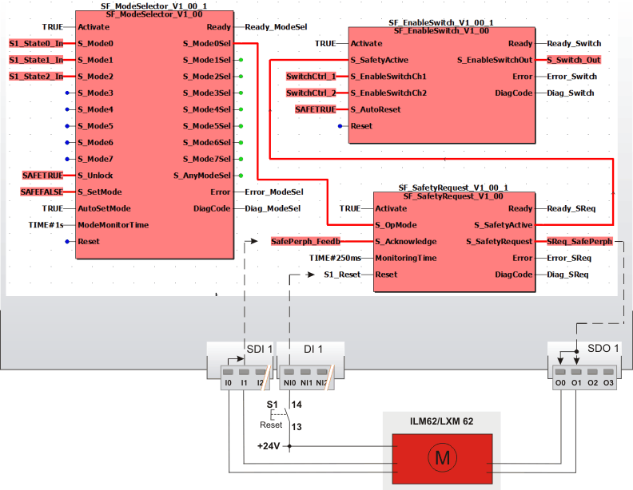

# Details of the application example

In this chapter, a possible application is described of how the safety-related SF\_SafetyRequest function block can be used to support a safety-related function request.

The function block must only be used in an actual application once a risk analysis has been conducted.

Details of the risk category/SIL/PL have not been included here, as classification is always based on the application in which the function block is used.

**NOTE:**

The use of the function block alone is not sufficient to execute the safety-related function according to the Cat./SIL/PL determined by the risk analysis. In conjunction with the safety-related I/O device used, additional measures must be taken to meet the requirements of the safety-related function. These include, for example, the appropriate wiring and parameterization of the inputs and outputs as well as measures to exclude (design out) errors that cannot be detected. For additional information, refer to the documentation provided with the safety-related I/O device used.

**NOTE:**

Refer to the notes in the User Manual on proper electrical connection of the Safety Logic Controller and the extension modules (e.g., connecting the emergency-stop control device).

## Connection of safety-related drive using two channels

This example shows the use of the SF\_SafetyRequest function block when requesting the safety-related function "safely limited speed" (SLS).

The function blocks involved are perpetually activated by the TRUE constant at the Activate input.

The request of the safety-related function originates from the upstream function block **SF\_ModeSelector**, which evaluates a connected three-stage mode selector switch. This is connected to the S\_Mode0 to S\_Mode2 inputs via three assigned global I/O variables. No lock for the selected operating mode as well as automatic switching of the operating mode is parameterized for SF\_ModeSelector.

Connecting the safety-related **SF\_SafetyRequest** function block:

* The **S\_OpMode** input of the SF\_SafetyRequest function block is directly connected to the S\_Mode0Sel enable signal of the upstream SF\_ModeSelector function block. The request for the safety-related function (of the evaluated mode selector switch) is consequently the selection of the operating mode 0. In our example this is the commissioning or maintenance mode in which the drive is operated with safely limited speed.
* The **S\_SafetyRequest** output is connected to the global I/O variable SReq\_SafePerph, which in turn is assigned to the output O0 of the safety-related output device SDO 1. The safety-related drive module is connected to the output terminals O0 and O1 using two channels here.
* The feedback signal for confirming the selected operating mode of the safety-related drive is connected as two-channel signal to the inputs I0 and I1 of the safety-related input device SDI 1. The signal evaluated for equivalence by the safety-related input device is assigned to the global I/O variable SafePerph\_Feedb and connected to the **S\_Acknowledge** input of the SF\_SafetyRequest function block for evaluation.
* The **S\_SafetyActive** enable output is connected to the S\_SafetyActive input of the SF\_EnableSwitch function block. If the requested safely limited speed is confirmed by the safety-related drive at the S\_Acknowledge input within the time interval specified at MonitoringTime, S\_SafetyActive switches to SAFETRUE and thus signals the safe mode to the subsequent SF\_EnableSwitch function block.
* A time value of 250 ms is set at MonitoringTime for the permitted time interval between request and confirmation of a safety-related function.
* The SF\_SafetyRequest function block provides a start-up inhibit and restart inhibit which cannot be deactivated. Both inhibits are only removed with a positive signal edge at the Reset input. To this end, the S1 reset button is connected to input NI0 of the standard input device DI 1.

The subsequent function block **SF\_EnableSwitch** evaluates the output signal S\_SafetyActive of SF\_SafetyRequest (status of the safety-related function). Its output S\_EnableSwitchOut is assigned to the global I/O variable S\_Switch\_Out, which is further processed in the safety-related application and used to control the process.

**Further Information:**

For more detailed information, refer to the description of the corresponding safety-related function block.

EIO0000002269.01

© 2020

Schneider Electric.

All rights reserved.