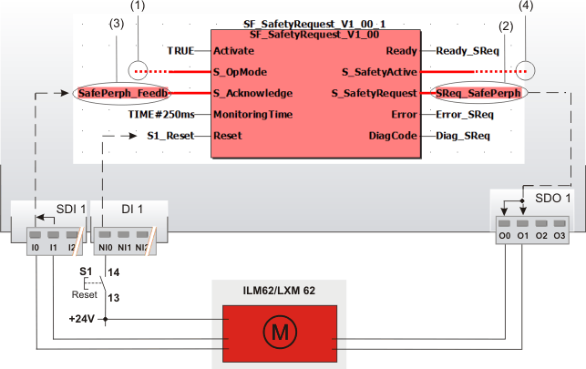

# SF\_SafetyRequest

The following description is valid for the function block SF\_SafetyRequest\_V1\_0z, Version 1.0z (where z = 0 to 9).

## Short description

|  |  |
| --- | --- |
| The safety-related SF\_SafetyRequest function block supports the function "Request of a safety-related function" in an application (e.g., safe stop or safely limited speed).  Depending on the status at input S\_OpMode, the safety-related function block requests the safety-related function at the periphery.  Based on the signal for requesting a safety-related function (at the S\_OpMode input) and the feedback signal about its correct execution (at the S\_Acknowledge input), the S\_SafetyActive output signal is controlled. This output signal is typically used to send a signal confirming the requested operating mode being activated to a subsequent safety-related function block.  The maximum permissible response time within which confirmation is expected must be parameterized at the MonitoringTime input and is monitored by the safety-related function block. |  |

The function block thus serves as interface between the functional safety system (consisting of the Safety Logic Controller and safety-related input/output modules) and the connected safety-related periphery, for example a safety-related drive.

**NOTE:**

A start-up inhibit and restart inhibit which cannot be deactivated are specified in the safety-related SF\_SafetyRequest function block (see topic "[Functional description](function_SafetyRequest.html#function_SafetyRequest)"). An active start-up inhibit/restart inhibit must be removed manually by a positive signal edge at the Reset input.

## Function block inputs

Click the corresponding hyperlinks to obtain detailed information on the items below.

| Name | Short description | Value |
| --- | --- | --- |
| [Activate](act_SafetyRequest.html#act_SafetyRequest) | State-controlled input for activating the function block.  Data type: BOOL  Initial value: FALSE | * **FALSE**: Function block inactive * **TRUE**: Function block activated |
| [S\_OpMode](opmode_SafetyRequest.html#opmode_SafetyRequest) | State-controlled input for requesting the execution of a safety-related function in the connected safety-related periphery.  Data type: SAFEBOOL  Initial value: SAFEFALSE | * **SAFEFALSE**: Request of the safety-related function in the connected safety-related periphery * **SAFETRUE**: No request of the safety-related function in the connected safety-related periphery |
| [S\_Acknowledge](ackn_SafetyRequest.html#ackn_SafetyRequest) | State-controlled input which processes the status feedback of the connected safety-related periphery.  Data type: SAFEBOOL  Initial value: SAFEFALSE | * **SAFEFALSE**: Feedback of the connected safety-related periphery that **no** safety-related function is executed * **SAFETRUE**: Feedback of the connected safety-related periphery about execution of the safety-related function |
| [MonitoringTime](mt_SafetyRequest.html#mt_SafetyRequest) | Input for specifying the maximum permissible response time between the request of the safety-related function at the S\_OpMode input and confirmation of its execution at the S\_Acknowledge feedback input.  Data type: TIME  Initial value: #0ms  If the specified time value is exceeded, the Error output switches to TRUE and the S\_Acknowledge enable output switches to SAFEFALSE. | The time value to be configured depends on the safety response time of the functional safety system. The safety response time is the time between arrival of the signal at the input channel and output of the switch-off signal at the device output.  In order to calculate the safety response time of your functional safety system, select the menu item 'Project > Response time calculator' in EcoStruxure Machine Expert - Safety. More information can be found in the chapter "Safe response time" of the EcoStruxure Machine Expert - Safety Online Help.  Enter a time value according to your risk analysis.  Refer to the first hazard message below this table. |
| [Reset](reset_SafetyRequest.html#reset_SafetyRequest) | Edge-triggered input for the reset signal:  * Resetting error messages when the cause of the error is no longer present. * Manual resetting of an active start-up inhibit or restart inhibit. (Both inhibits are mandatory and cannot be deactivated.)  Data type: BOOL  Initial value: FALSE  **NOTE:**  Resetting does not occur with a negative (falling) edge, as specified by standard EN ISO 13849-1, but with a positive (rising) edge.  Refer to the second hazard message below this table. | * **FALSE**: Reset is not requested * Edge **FALSE > TRUE**: Reset is requested |

| WARNING | |
| --- | --- |
|  | **NON-CONFORMANCE TO SAFETY FUNCTION REQUIREMENTS**   * Verify that the time value set at MonitoringTime corresponds to your risk analysis. * Be sure that your risk analysis includes an evaluation for incorrectly setting the time value for the MonitoringTime parameter. * Validate the overall safety-related function with regard to the set MonitoringTime value and thoroughly test the application.   **Failure to follow these instructions can result in death, serious injury, or equipment damage.** |

If the safety-related function is no longer requested (S\_OpMode = SAFETRUE) before or during the rising signal edge at the Reset input (for resetting errors), this can signal to the system/machine that a request for the safety-related function is no longer present. This can lead to a risk, for example with the machine/system starting up immediately.

| WARNING | |
| --- | --- |
|  | **UNINTENDED START-UP**   * Include in your risk analysis the impact of the reset by means of a positive signal edge at the Reset input. * Make certain that appropriate procedures and measures (according to applicable sector standards) have been established to help avoid hazardous situations when resetting. * Do not enter the zone of operation when resetting. * Ensure that no other persons can access the zone of operation when resetting. * Use appropriate safety interlocks where personnel and/or equipment hazards exist.   **Failure to follow these instructions can result in death, serious injury, or equipment damage.** |

## Function block outputs

Click the corresponding hyperlinks to obtain detailed information on the items below.

| Name | Short description | Value |
| --- | --- | --- |
| [Ready](ready_SafetyRequest.html#ready_SafetyRequest) | Output for signaling "Function block activated/not activated".  Data type: BOOL | * **FALSE**: Function block is not activated (Activate = FALSE) and all outputs of the function block are switched to FALSE/SAFEFALSE. * **TRUE**: Function block is activated (Activate = TRUE) and the output parameters represent the state of the safety-related function. |
| [S\_SafetyActive](out_SafetyActive.html#out_SafetyActive) | Output for confirming the correct feedback from the connected safety-related periphery.  Data type: SAFEBOOL | * **SAFEFALSE**: **No** confirmation of the defined safe state.  The feedback of the connected safety-related periphery about correct execution of the requested safety-related function is **not** present at the S\_Acknowledge input. * **SAFETRUE**: Confirmation of the defined safe state.  The feedback of the connected safety-related periphery about correct execution of the requested safety-related function within the MonitoringTime is present at the S\_Acknowledge input.  **NOTE:**  The safety-related periphery controls the defined safe state autonomously and independent of the function block. |
| [S\_SafetyRequest](out_SafetyRequest.html#out_SafetyRequest) | Output for the request of the connected safety-related periphery to execute a safety-related function.  Data type: SAFEBOOL | * **SAFEFALSE**: Safety-related function requested * **SAFETRUE**: Safety-related function not requested |
| [Error](err_SafetyRequest.html#err_SafetyRequest) | Output for error message.  Data type: BOOL | * **FALSE**: No error is present. * **TRUE**: The function block has detected an error. As a consequence, the S\_SafetyActive and S\_SafetyRequest outputs switch to SAFEFALSE. |
| [DiagCode](diag_SafetyRequest.html#diag_SafetyRequest) | Output for diagnostic message.  Data type: WORD | Diagnostic message of the function block.  The possible values are listed and described in the topic "[Diagnostic codes](codes_SafetyRequest.html#codes_SafetyRequest)". |

## Signal sequence diagram:

This diagram refers to a typical signal sequence, in which the request of a safety-related function is supported.

**NOTE:**

The signal sequence diagrams in this documentation possibly omit particular diagnostic codes. For example, a diagnostic code is possibly not shown if the related function block state is a temporary transition state and only active for one cycle of the Safety Logic Controller.

Only typical input signal combinations are illustrated. Other signal combinations are possible.

The incoming request of a safety-related function by a SAFEFALSE signal at input S\_OpMode controls the S\_SafetyRequest output directly and without additional dependencies for a request for the safety-related function at the connected safety-related periphery. In the example shown, two requests for the safety-related function occur. Consequently, the time monitoring between the request of a safety-related function and the confirmation message from the safety-related periphery is started twice.

During the first time monitoring, feedback occurs through S\_Acknowledge = SAFETRUE within the time parameterized at MonitoringTime, and the S\_SafetyActive enable output switches to SAFETRUE (phases 5 and 6 in the diagram).

In the second case, the parameterized time value is exceeded. The function block then detects an error (Error = TRUE) and S\_SafetyActive = SAFEFALSE signals that the safety-related periphery is not executing the requested safety-related function (phases 9 to 11 in the diagram).

**Further Information:**

A detailed description of the individual phases can be found in the [details about this signal sequence diagram](signaldiagrams_SafetyRequest.html#signaldiagrams_SafetyRequest).

## Application example

This example shows the exemplary use of the safety-related SF\_SafetyRequest function block in case of request and feedback of the safety-related function "safely limited speed" (SLS) of a safety-related drive.

The function block is perpetually activated by the TRUE constant at the Activate input. Reset button S1 is connected to the input NI0 of the standard input device DI 1.

The relevant inputs and outputs are connected as follows:

* The **S\_OpMode** input of the SF\_SafetyRequest function block is directly connected to the S\_Mode0Sel enable signal of the upstream SF\_ModeSelector function block. The request for the safety-related function (of the evaluated mode selector switch) is consequently the selection of the operating mode 0. In our example this is the commissioning or maintenance mode in which the drive is operated with safely limited speed. (See digit **(1)** in the graphic below.)
* The **S\_SafetyRequest** output is connected to the global I/O variable SReq\_SafePerph, which in turn is assigned to the output O0 of the safety-related output device SDO 1 (see **(2)** in the graphic below). The safety-related drive module is connected to the output terminals O0 and O1 using two channels here.
* The feedback signal for confirming the selected operating mode of the safety-related drive is connected as two-channel signal to the inputs I0 and I1 of the safety-related input device SDI 1. The signal evaluated for equivalence by the safety-related input device is assigned to the global I/O variable SafePerph\_Feedb and connected to the **S\_Acknowledge** input of the SF\_SafetyRequest function block for evaluation (**(3)** in the graphic).
* The **S\_SafetyActive** enable output is connected to the S\_SafetyActive input of the SF\_EnableSwitch function block (see **(4)**). If the requested safely limited speed is confirmed by the safety-related drive at the S\_Acknowledge input within the monitoring time specified at MonitoringTime, the S\_SafetyActive enable output switches to SAFETRUE and thus signals the safe mode to the subsequent SF\_EnableSwitch function block.

**Further Information:**

Refer to the detailed description and notes in the topic entitled "[Details of the application example](applicationexample_SafetyRequest.html#applicationexample_SafetyRequest)".

## Detailed information

Additional information is available in the following sections:

* [Functional description](function_SafetyRequest.html#function_SafetyRequest)
* [Details about the signal sequence diagram](signaldiagrams_SafetyRequest.html#signaldiagrams_SafetyRequest)
* [Further details of the application example](applicationexample_SafetyRequest.html#applicationexample_SafetyRequest)
* [Exception avoidance](faultavoidance_SafetyRequest.html#faultavoidance_SafetyRequest)
* [Implementation of safety requirements from applicable standards](safetyrequirements_SafetyRequest.html#safetyrequirements_SafetyRequest)

EIO0000002269.01

© 2020

Schneider Electric.

All rights reserved.