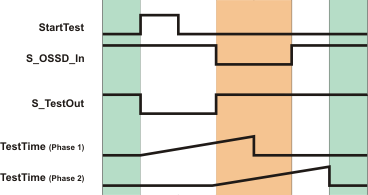

# TestTime input

Specification of the permissible response time for the signal changes of the individual sensor test phases.

Data type: TIME

Initial value: #10ms

Permissible maximum value: #150ms

Sensor test phases are described using the following signal sequence diagram.

**NOTE:**

The diagram only shows the inputs and outputs relevant for the description, and only a successful test is displayed.

**Sensor test phase 1:** A rising edge at the StartTest input causes the S\_TestOut output to switch to SAFEFALSE and the monitoring time set at TestTime (phase 1) to begin. The sensor must switch the S\_OSSD\_In input to SAFEFALSE within the period specified at TestTime.

**Sensor test phase 2:** Once there is a SAFEFALSE at the S\_OSSD\_In input, the S\_TestOut output is switched to SAFETRUE and a second monitoring time measurement (phase 2) begins with the time set at TestTime. The sensor must switch the S\_OSSD\_In to SAFETRUE within this period.

If one of the two time monitoring periods is exceeded, the function block switches the S\_OSSD\_Out output to SAFEFALSE and outputs an error (Error = TRUE) at the Error output.

**Connection**: Connect this input to a time literal, i.e., to a constant of the data type TIME.

**NOTE:**

An automatic test cycle **extends the total response time for the safety-related function**. This means the value for TestTime depends on the safety-related application involved and must be established as part of a risk analysis. Do not enter any other value than this.

| WARNING | |
| --- | --- |
|  | **NON-CONFORMANCE TO SAFETY FUNCTION REQUIREMENTS**   * Verify that the time value set at TestTime corresponds to your risk analysis. * Be sure that your risk analysis includes an evaluation for incorrectly setting the time value for the TestTime parameter. * Validate the overall safety-related function with regard to the set TestTime value and thoroughly test the application.   **Failure to follow these instructions can result in death, serious injury, or equipment damage.** |

EIO0000002269.01

© 2020

Schneider Electric.

All rights reserved.