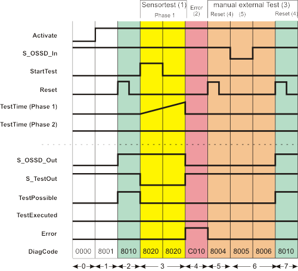

# Additional signal sequence diagrams

Temporary intermediate states are not illustrated in the signal sequence diagrams. Only typical input signal combinations are illustrated in these diagrams. Other signal combinations are possible.

The most significant areas within the signal sequence diagrams are highlighted in color.

**Further Information:**

The diagram found in the [overview](testablesafetysensor.html#testablesafetysensor) for this function block must also be taken into account.

**NOTE:**

The signal sequence diagrams in this documentation possibly omit particular diagnostic codes. For example, a diagnostic code is possibly not shown if the related function block state is a temporary transition state and only active for one cycle of the Safety Logic Controller.

Only typical input signal combinations are illustrated. Other signal combinations are possible.

## Unsuccessful sensor test followed by external manual sensor test, start-up inhibit and restart inhibit active

This diagram is based on a typical method of connecting the safety-related SF\_TestableSafetySensor function block. An unsuccessful sensor test is shown, followed by a manual test.

The following assumptions apply:

* **S\_StartReset = SAFEFALSE:** Start-up inhibit after the function block has been activated and the Safety Logic Controller has started up
* **S\_AutoReset = SAFEFALSE:** Restart inhibit if the light beam of the safety-related sensor is no longer interrupted (SAFETRUE signal returns at the S\_OSSD\_In input).
* **NoExternalTest = FALSE:** When a sensor test is unsuccessful, the external manual sensor test is supported and requested.

|  |  |
| --- | --- |
| (1) | Sensor test with one test phase: Phase 1 |
| (2) | Errors |
| (3) | Manual external test |
| (4) | Reset |
| (5) | Light beam interrupted |

|  |  |
| --- | --- |
| 0 | The function block is not yet activated (Activate = FALSE). |
| 1 | The function block is activated (Activate = TRUE).  Even though at the time of function block activation, the S\_OSSD\_In input (status of the connected sensor) is SAFETRUE, the S\_OSSD\_Out output remains SAFEFALSE, as a start-up inhibit (S\_StartReset = SAFEFALSE) is specified.  As there is no active sensor test, the S\_TestOut output is SAFETRUE.  The TestPossible output remains FALSE as the active start-up inhibit means sensor tests are not possible. |
| 2 | The start-up inhibit is removed by a positive edge at the Reset input.  Since input S\_OSSD\_In = SAFETRUE (the light beam of the connected sensor is not interrupted), the S\_OSSD\_Out output switches to SAFETRUE: The sensor does not request a safety-related function (e.g., shutdown).  It also becomes possible to perform sensor tests when the start-up inhibit is removed (TestPossible output becomes TRUE). |
| 3 | The sensor test starts with sensor test phase 1 when there is a positive edge at the StartTest input.  The S\_OSSD\_Out output remains SAFETRUE during the sensor test to avoid interrupting operation.  The S\_TestOut output becomes SAFEFALSE to start the test for the connected sensor. The TestPossible output is FALSE during the active test, as two sensor tests cannot be performed at the same time. |
| 4 | The set monitoring time TestTime elapses without the connected sensor providing the correct response (i.e., a SAFEFALSE signal at the S\_OSSD\_In input). S\_OSSD\_In remains SAFETRUE instead.  The function block concludes the unsuccessful sensor test after the end of sensor test phase 1, outputs an error message (Error = TRUE), and switches the S\_OSSD\_Out output to SAFEFALSE. The S\_TestOut output also becomes SAFETRUE again at this point. |
| 5 | The NoExternalTest = FALSE setting means that an external manual sensor test (see phases 5 to 7) needs to be carried out following an unsuccessful sensor test.  This manual sensor test is initiated by a positive edge at the Reset input.  This causes the Error error output to switch back to FALSE.  The S\_OSSD\_Out output remains SAFEFALSE, however, as the manual sensor test is still outstanding.  The TestPossible output also remains FALSE, as sensor test requests are not permitted under these circumstances. |
| 6 | The light beam of the sensor is interrupted **manually**, the S\_OSSD\_In input becomes SAFEFALSE.  This interruption of the light beam is part of the manual sensor test, which means that the S\_OSSD\_Out output first remains SAFEFALSE.  The TestPossible output also remains FALSE, as sensor test requests are still not permitted. |
| 7 | Manual interruption of the light beam ceases and the S\_OSSD\_In input becomes SAFETRUE again.  The reset button connected to the Safety Logic Controller is pressed once more to end the manual external sensor test. This means the manual sensor test has been completed successfully and the restart inhibit is removed.  The S\_OSSD\_Out output becomes SAFETRUE immediately.  The TestPossible output also becomes TRUE, thereby signaling that a new sensor test can be requested.  **NOTE:**  After the manual external sensor test, a new sensor test must be requested by a positive edge at the StartTest input. |

EIO0000002269.01

© 2020

Schneider Electric.

All rights reserved.