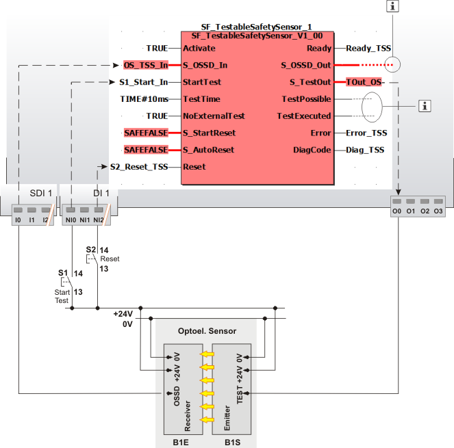

# Details of the application example

This section describes a possible application where the function block is used to implement a test function for a safety-related sensor during operation.

The function block must only be used in an actual application once a risk analysis has been conducted.

Details of the risk category/SIL/PL have not been included here, as classification is always based on the application in which the function block is used.

**NOTE:**

The use of the function block alone is not sufficient to execute the safety-related function according to the Cat./SIL/PL determined by the risk analysis. In conjunction with the safety-related I/O device used, additional measures must be taken to meet the requirements of the safety-related function. These include, for example, the appropriate wiring and parameterization of the inputs and outputs as well as measures to exclude (design out) errors that cannot be detected. For additional information, refer to the documentation provided with the safety-related I/O device used.

**NOTE:**

Refer to the notes in the User Manual on proper electrical connection of the Safety Logic Controller and the extension modules (e.g., connecting the safety-related sensor).

## Light curtain with single-channel connection

This example describes how a light curtain is connected to the safety-related SF\_TestableSafetySensor function block using a single-channel arrangement. The function block is connected as follows:

* The function block is perpetually activated by the TRUE constant at the Activate input.
* The function block output S\_TestOut outputs the start signal for the sensor test to the sensor. The global I/O variable TOut\_OS is assigned to the output terminal O0, to which the test input of the sensor is connected in turn.
* The status signal of the sensor is connected to input terminal I0 of the safety-related input device SDI 1 and assigned to the global I/O variable OS\_TSS\_In, which is connected in turn to the function block input S\_OSSD\_In.
* An S1 button for requesting the sensor test is connected to input terminal NI0 of the standard input device. The signal is assigned to the global I/O variable S1\_Start\_In, which in turn is connected to the StartTest input of the function block.
* The input S\_StartReset = SAFEFALSE specifies a start-up inhibit after the Safety Logic Controller has been started up and/or after the function block has been activated. In addition, S\_AutoReset = SAFEFALSE specifies a restart inhibit for the function block after the SAFETRUE signal returns at the S\_OSSD\_In input (light beam of the safety-related sensor is no longer interrupted). Both inhibits are only removed when there is a positive signal edge at the Reset input.

  To this end, the S2 reset button is connected to input terminal NI2 of the standard input device DI 1. Its signal is assigned to the global I/O variable S2\_Reset\_TSS, which in turn is connected to the Reset input of the function block.

**NOTE:**

The **enable output** S\_OSSD\_Out of the safety-related SF\_TestableSafetySensor function block is directly connected to a global I/O variable or to an output terminal of the application via additional safety-related functions/function blocks.

The function block output TestPossible signals whether a test is possible and the TestExecuted output indicates whether the test was performed successfully or is currently in progress. Both outputs are connected to standard variables and can thus be processed in the higher-level standard controller.

|  |  |
| --- | --- |
| S1 | Start test |
| S2 | Reset |
| B1 | ESPE - optoelectronic sensor |
| B1S | Emitter |
| B1E | Receiver |
|  | See note above the illustration. |

EIO0000002269.01

© 2020

Schneider Electric.

All rights reserved.