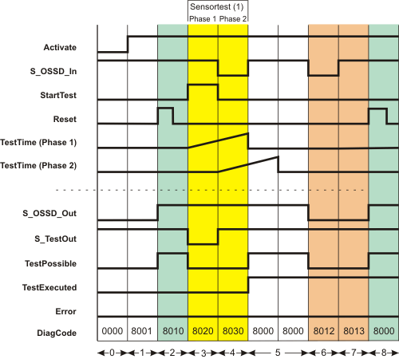

# SF\_TestableSafetySensor

The following description is valid for the function block SF\_TestableSafetySensor\_V1\_0z, Version 1.0z (where z = 0 to 9).

## Short description

|  |  |
| --- | --- |
| The safety-related SF\_TestableSafetySensor function block evaluates the status of connected optoelectronic safety equipment (e.g., light curtain).  The function block additionally has a test function for verifying the connected safety equipment.  **NOTE:**  The safety equipment is referred to as a safety-related sensor in this documentation.  **NOTE:**  The safety-related sensor connected to the function block must meet the requirements of type 2 ESPE (**E**lectro-**S**ensitive **P**rotective **E**quipment) as stipulated by IEC 61496-1. This concerns the ability of a safety-related sensor to support a test function.  **NOTE:**  Since the safety equipment to be connected belongs to type 2, Cat. 2 is the highest category that can be achieved. |  |

## Function block inputs

Click the corresponding hyperlinks to obtain detailed information on the items below.

| Name | Short description | Value |
| --- | --- | --- |
| [Activate](act_TSS.html#act_TSS) | State-controlled input for activating the function block.  Data type: BOOL  Initial value: FALSE | * **FALSE**: Function block inactive * **TRUE**: Function block activated |
| [S\_OSSD\_In](ossd_tss.html#ossd_tss) | State-controlled input for the status of the connected safety-related sensor.  Data type: SAFEBOOL  Initial value: SAFEFALSE | * **SAFEFALSE**: The light beam of the safety-related sensor has been interrupted or the safety-related sensor is performing a test. * **SAFETRUE**: The light beam of the safety-related sensor has not been interrupted (normal operation). |
| [StartTest](start_tss.html#start_tss) | Edge-triggered input for requesting the start of the sensor test.  Data type: BOOL  Initial value: FALSE | * **FALSE**: The test of the connected safety-related sensor is not requested. * Edge **FALSE > TRUE**: The test of the connected safety-related sensor is requested.  **NOTE:**  The S\_OSSD\_Out output remains SAFETRUE while the test is being carried out. |
| [TestTime](prog_tts.html#prog_tts) | Input for specifying the maximum response time for the signal changes of the individual test phases between the S\_TestOut output and the S\_OSSD\_In input during the safety-related sensor test.  Data type: TIME  Initial value: #10ms | **NOTE:**  The maximum permissible response time is 150 ms.  Enter a time value according to your risk analysis.  Refer to the first hazard message below this table. |
| [NoExternalTest](prog_no_et_tss.html#prog_no_et_tss) | State-controlled input for specifying a required manual sensor test in the event of an error during the automatic sensor test phases.  Data type: BOOL  Initial value: FALSE | * **TRUE**: No additional manual sensor test is required in the event of an error occurring during the sensor test phases performed by the function block. * **FALSE**: A manual sensor test is required in the event of an error occurring during the sensor test phases performed by the function block. |
| [S\_StartReset](prog_s_res_tss.html#prog_s_res_tss) | State-controlled input for specifying the start-up inhibit after the Safety Logic Controller has been started up or the function block has been activated.  An active start-up inhibit must be removed manually by means of a positive signal edge at the Reset input. A deactivated start-up inhibit causes the S\_OSSD\_Out output to switch to SAFETRUE automatically when the function block is activated and the safety-related function is not requested.  Data type: SAFEBOOL  Initial value: SAFEFALSE  Refer to the second hazard message below this table. | * **SAFEFALSE**: With start-up inhibit * **SAFETRUE**: Without start-up inhibit |
| [S\_AutoReset](prog_a_res_tss.html#prog_a_res_tss) | State-controlled input for specifying the restart inhibit after the SAFETRUE signal has returned at the S\_OSSD\_In input (i.e., the light beam of the safety-related sensor is no longer interrupted).  Data type: SAFEBOOL  Initial value: SAFEFALSE  An active restart inhibit must be removed manually by means of a positive signal edge at the Reset input. A deactivated restart inhibit causes the S\_OSSD\_Out output to switch to SAFETRUE automatically when the function block is activated and the safety-related function is no longer requested.  Refer to the second hazard message below this table. | * **SAFEFALSE**: With restart inhibit * **SAFETRUE**: Without restart inhibit |
| [Reset](reset_tss.html#reset_tss) | Edge-triggered input for the reset signal:  * Resetting error messages when the cause of the error is no longer present. * Manual resetting of an active start-up/restart inhibit (specified by S\_StartReset and/or S\_AutoReset).  Refer to the third hazard message below this table.  Data type: BOOL  Initial value: FALSE  **NOTE:**  Resetting does not occur with a negative (falling) edge, as specified by standard EN ISO 13849-1, but with a positive (rising) edge. | * **FALSE**: Reset is not requested * Edge **FALSE > TRUE**: Reset is requested |

| WARNING | |
| --- | --- |
|  | **NON-CONFORMANCE TO SAFETY FUNCTION REQUIREMENTS**   * Verify that the time value set at TestTime corresponds to your risk analysis. * Be sure that your risk analysis includes an evaluation for incorrectly setting the time value for the TestTime parameter. * Validate the overall safety-related function with regard to the set TestTime value and thoroughly test the application.   **Failure to follow these instructions can result in death, serious injury, or equipment damage.** |

The start-up inhibit and/or restart inhibit must only be deactivated if it is certain that starting up the machine/system will not lead to a hazardous situation or that a suitable start-up inhibit is in place at another location or using other means.

| WARNING | |
| --- | --- |
|  | **NON-CONFORMANCE TO SAFETY FUNCTION REQUIREMENTS**   * Verify the impact of a deactivated start-up inhibit (S\_StartReset = SAFETRUE) and/or restart inhibit (S\_AutoReset = SAFETRUE) on your machine or process prior to implementation. * Observe the regulations given by relevant sector standards regarding the start-up/restart inhibit. * Verify that a suitable start-up inhibit is in place at another location or using other means.   **Failure to follow these instructions can result in death, serious injury, or equipment damage.** |

Resetting the function block by means of a positive signal edge at the Reset input can cause the S\_OSSD\_Out output to switch to SAFETRUE immediately (depending on the status of the other inputs).

| WARNING | |
| --- | --- |
|  | **UNINTENDED START-UP**   * Include in your risk analysis the impact of the reset by means of a positive signal edge at the Reset input. * Make certain that appropriate procedures and measures (according to applicable sector standards) have been established to help avoid hazardous situations when resetting. * Do not enter the zone of operation when resetting. * Ensure that no other persons can access the zone of operation when resetting. * Use appropriate safety interlocks where personnel and/or equipment hazards exist.   **Failure to follow these instructions can result in death, serious injury, or equipment damage.** |

## Function block outputs

| Name | Short description | Value |
| --- | --- | --- |
| [Ready](ready_TSS.html#ready_TSS) | Output for signaling "Function block activated/not activated".  Data type: BOOL | * **FALSE**: Function block is not activated (Activate = FALSE) and all outputs of the function block are switched to FALSE/SAFEFALSE. * **TRUE**: Function block is activated (Activate = TRUE) and the output parameters represent the state of the safety-related function. |
| [S\_OSSD\_Out](out_tss.html#out_tss) | Output for enable signal of the function block.  Data type: SAFEBOOL | * **SAFEFALSE**:    + Light beam of the safety-related sensor is interrupted   + **or** the function block is not activated   + **or** the start-up/restart inhibit is active   + **or** an error message is present. * **SAFETRUE**:    + Light beam of the safety-related sensor is not interrupted   + **and** the function block is activated   + **and** the start-up/restart inhibit is not active   + **and** no error message is present. |
| [S\_TestOut](testOut_tss.html#testOut_tss) | Output for the signal for controlling the test input of the type 2 safety-related sensor connected.  Data type: SAFEBOOL | * **SAFEFALSE**: Phase 1 of sensor test active. * **SAFETRUE**: Sensor test not active  **or**  phase 2 of sensor test |
| [TestPossible](tposs_tss.html#tposs_tss) | Output for the signaling whether an automatic sensor test is possible.  Data type: BOOL | * **TRUE**: Automatic sensor test is possible and can be requested by a positive edge at the StartTest input. * **FALSE**: Automatic sensor test is not possible. A positive edge at the StartTest input has no effect. |
| [TestExecuted](tdone_tss.html#tdone_tss) | Output for signaling the status of the sensor test.  Data type: BOOL  **NOTE:**  The enable signal at the S\_OSSD\_Out output can be SAFETRUE even if there is no TRUE signal at TestExecuted.  The automatic test has to be performed with positive results for the safety-related sensor to function correctly. | * **TRUE**: The automatic sensor test has been performed successfully. * **FALSE**: The automatic sensor test    + has not yet been performed.   + **or** is currently in progress   + **or** has been carried out with errors. |
| [Error](err_tss.html#err_tss) | Output for error message.  Data type: BOOL | * **FALSE**: No error is present. * **TRUE**: The function block has detected an error. The S\_OSSD\_Out output switches to SAFEFALSE as a result.  **NOTE:**  The S\_TestOut output also remains SAFETRUE during an error message. |
| [DiagCode](diag_TSS.html#diag_TSS) | Output for diagnostic message.  Data type: WORD | Diagnostic message of the function block.  The possible values are listed and described in the topic "[Diagnostic codes](codes_TestableSafetySensor.html#codes_TestableSafetySensor)". |

## Signal sequence diagram

This diagram is based on a typical method of connecting the safety-related SF\_TestableSafetySensor function block. The following assumptions apply:

* **S\_StartReset = SAFEFALSE:** Start-up inhibit after the function block has been activated and the Safety Logic Controller has started up.
* **S\_AutoReset = SAFEFALSE:** Restart inhibit if the safety light beam of the sensor is no longer interrupted (SAFETRUE signal returns at the S\_OSSD\_In input).
* **NoExternalTest = TRUE:** No additional manual sensor test is required in the event of an error occurring during the sensor test phases performed by the function block.

**NOTE:**

The other [signal sequence diagram](signaldiagrams_tss.html#signaldiagrams_tss) can be taken into account.

**NOTE:**

The signal sequence diagrams in this documentation possibly omit particular diagnostic codes. For example, a diagnostic code is possibly not shown if the related function block state is a temporary transition state and only active for one cycle of the Safety Logic Controller.

Only typical input signal combinations are illustrated. Other signal combinations are possible.

|  |  |
| --- | --- |
| (1) | Sensor test with two test phases: Phase 1 and phase 2 |

|  |  |
| --- | --- |
| 0 | The function block is not yet activated (Activate = FALSE). |
| 1 | The function block is activated (Activate = TRUE).  Even though at the time of function block activation, the S\_OSSD\_In input (status of the connected sensor) is SAFETRUE, the S\_OSSD\_Out output remains SAFEFALSE, as a start-up inhibit (S\_StartReset = SAFEFALSE) is specified.  As there is no active sensor test, the S\_TestOut output is SAFETRUE.  The TestPossible output remains FALSE as the active start-up inhibit means sensor tests are not possible. |
| 2 | The start-up inhibit is removed by a positive edge at the Reset input.  Since input S\_OSSD\_In = SAFETRUE (the light beam of the connected sensor is not interrupted), the S\_OSSD\_Out output switches to SAFETRUE: The sensor does not request a safety-related function (e.g., shutdown).  It also becomes possible to perform sensor tests when the start-up inhibit is removed (TestPossible output becomes TRUE). |
| 3 | The sensor test starts with sensor test phase 1 when there is a positive edge at the StartTest input.  The S\_OSSD\_Out output remains SAFETRUE during the sensor test to avoid interrupting operation.  The S\_TestOut output becomes SAFEFALSE to start the test for the connected sensor. The TestPossible output is FALSE during the active test, as two sensor tests cannot be performed at the same time. |
| 4 | The connected sensor reports the SAFEFALSE state at the S\_OSSD\_In input within the set monitoring time TestTime. This is in line with correct behavior. As a result, the S\_OSSD\_Out output remains SAFETRUE and no error message is output (the Error output remains FALSE).  The switch from SAFETRUE to SAFEFALSE at the S\_OSSD\_In input starts the second monitoring timer TestTime (2).  Phase 2 of the sensor test is now active, which means that the S\_TestOut output switches back to SAFETRUE.  As before, the enable output is SAFETRUE (normal operation). |
| 5 | The connected sensor reports the SAFETRUE state again at the S\_OSSD\_In input within the set monitoring time TestTime. This is in line with correct behavior.  The function test has now been successfully completed, which means that the sensor is functioning correctly. The TestExecuted output is switched to TRUE as a result.  The S\_OSSD\_Out output also remains SAFETRUE, as the light beam of the sensor is not interrupted (no shutdown required). |
| 6 | The light beam of the sensor is interrupted, the S\_OSSD\_In input becomes SAFEFALSE. The S\_OSSD\_Out output immediately switches to SAFEFALSE.  This also causes the TestPossible output to become FALSE, as sensor tests are not permitted under these circumstances. |
| 7 | Although the safety-related function request is reset once more (the S\_OSSD\_In input is SAFETRUE again), the S\_OSSD\_Out enable output and TestPossible output remain FALSE, as the restart inhibit has been specified at S\_AutoReset = SAFEFALSE. |
| 8 | Pressing the connected reset button creates a positive edge at the Reset input. This removes the restart inhibit. Since the connected light beam of the sensor is not interrupted (S\_OSSD\_In = SAFETRUE), the S\_OSSD\_Out output switches to SAFETRUE. The TestPossible output also becomes TRUE, thereby signaling that a new sensor test can be requested. |

## Application example

The following figure shows how a light curtain is connected to the safety-related SF\_TestableSafetySensor function block using a single-channel arrangement.

The test signal (start/stop of the sensor test) is output to the sensor at output O0 of the Safety Logic Controller. The status signal of the sensor is connected to input I0 of the safety-related input device SDI 1.

**Further Information:**

The [description and notes for this application example](applicationexample_tss.html#applicationexample_tss) must also be taken into account.

**NOTE:**

The **enable output** S\_OSSD\_Out of the SF\_TestableSafetySensor function block is directly connected to a global I/O variable or to an output terminal of the application via additional safety-related functions/function blocks.

The function block output TestPossible signals whether a test is possible and the TestExecuted output indicates whether the test was performed successfully or is currently in progress. Both outputs are connected to standard variables and can thus be processed in the higher-level standard controller.

|  |  |
| --- | --- |
| S1 | Start test |
| S2 | Reset |
| B1 | ESPE - optoelectronic sensor |
| B1S | Emitter |
| B1E | Receiver |
|  | See note above the illustration. |

## Detailed information

Additional information is available in the following sections:

* [Functional description](function_tss.html#function_tss)
* [Additional signal sequence diagrams](signaldiagrams_tss.html#signaldiagrams_tss)
* [Details of the application example](applicationexample_tss.html#applicationexample_tss)
* [Exception avoidance](faultavoidance_tss.html#faultavoidance_tss)
* [Implementation of safety requirements from applicable standards](safetyrequirements_tss.html#safetyrequirements_tss)

EIO0000002269.01

© 2020

Schneider Electric.

All rights reserved.