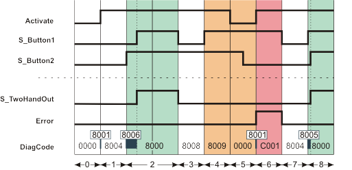
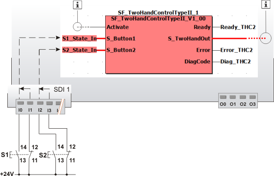

# SF\_TwoHandControlTypeII

The following description is valid for the function block SF\_TwoHandControlTypeII\_V1\_0z, Version 1.0z (where z = 0 to 9).

## Short description

|  |  |
| --- | --- |
| The safety-related SF\_TwoHandControlTypeII function block evaluates the switching behavior of a type II two-hand control device connected to the Safety Logic Controller.  This involves evaluating the switching states of both the buttons on the two-hand control device. The S\_TwoHandOut output only becomes SAFETRUE if both inputs switch from SAFEFALSE to SAFETRUE, either simultaneously or consecutively (if both buttons on the two-hand control device are pressed after being not actuated before).  **NOTE:**  Unlike the type III two-hand control device, type II does **not** evaluate whether both buttons are actuated within a period of 500 ms. |  |

**NOTE:**

The used type II two-hand control device must comply with the requirements set out by EN 574.

## Function block inputs

Click the corresponding hyperlinks to obtain detailed information on the items below.

| Name | Short description | Value |
| --- | --- | --- |
| [Activate](act_THC2.html#act_THC2) | State-controlled input for activating the function block.  Data type: BOOL  Initial value: FALSE  **NOTE:**  While function block activation is taking place (with input Activate = TRUE), both inputs must show the SAFEFALSE state. This means that none of the buttons on the two-hand control device must be actuated. Otherwise, the function block detects this as an error (output Error = TRUE). | * **FALSE**: Function block inactive * **TRUE**: Function block activated |
| [S\_Button1](s_12_THC2.html#s_12_THC2) and [S\_Button2](s_12_THC2.html#s_12_THC2) | State-controlled inputs for evaluating the connected two-hand control device.  Data type: SAFEBOOL  Initial value: SAFEFALSE | * **SAFEFALSE**: Button not pressed * **SAFETRUE**: Button pressed |

## Function block outputs

| Name | Short description | Value |
| --- | --- | --- |
| [Ready](ready_THC2.html#ready_THC2) | Output for signaling "Function block activated/not activated".  Data type: BOOL | * **FALSE**: Function block is not activated (Activate = FALSE) and all outputs of the function block are switched to FALSE/SAFEFALSE. * **TRUE**: Function block is activated (Activate = TRUE) and the output parameters represent the state of the safety-related function. |
| [S\_TwoHandOut](out_THC2.html#out_THC2) | Control signal for stopping (stop request) or starting and maintaining machine operation.  Data type: SAFEBOOL | * **SAFEFALSE**: S\_TwoHandOut switches to SAFEFALSE if  + the function block has not been activated   + **or** the buttons have not been actuated or have been actuated incorrectly   + **or** an error has been detected. * **SAFETRUE**: S\_TwoHandOut is SAFETRUE if  + the function block has been activated   + **and** the buttons have been actuated correctly   + **and** no errors have been detected. |
| [Error](err_THC2.html#err_THC2) | Output for error message.  Data type: BOOL | * **FALSE**: No error is present. * **TRUE**: The function block has detected an error: During function block activation (with input Activate = TRUE), at least one input was in the SAFETRUE state.  The S\_TwoHandOut output switches to SAFEFALSE as a result.  To leave the error state, both inputs S\_Button1 and S\_Button2 must show the SAFEFALSE state. |
| [DiagCode](diag_THC2.html#diag_THC2) | Output for diagnostic message.  Data type: WORD | Diagnostic message of the function block.  The possible values are listed and described in the topic "[Diagnostic codes](codes_THC2.html#codes_THC2)". |

## Signal sequence diagram

This diagram is based on a typical type II two-hand control application.

**NOTE:**

The signal sequence diagrams in this documentation possibly omit particular diagnostic codes. For example, a diagnostic code is possibly not shown if the related function block state is a temporary transition state and only active for one cycle of the Safety Logic Controller.

Only typical input signal combinations are illustrated. Other signal combinations are possible.

|  |  |
| --- | --- |
| 0 | The function block is not yet activated (Activate = FALSE).  As a result, all outputs are FALSE or SAFEFALSE. |
| 1 | Function block activated by Activate = TRUE. At this point, the two buttons are **not actuated** (S\_Button1 and S\_Button2 = SAFEFALSE). Both inputs must be SAFEFALSE during activation of the function block, so the Error output remains FALSE. |
| 2 | If both buttons are actuated, inputs S\_Button2 and S\_Button1 change one after the other from SAFEFALSE to SAFETRUE. When S\_Button1 switches to SAFETRUE, the condition for two-hand control is met and the S\_TwoHandOut output becomes SAFETRUE. |
| 3 | The S\_TwoHandOut output becomes SAFEFALSE, as S\_Button1 switches to SAFEFALSE (button is released). |
| 4 | Although the button at S\_Button1 is now actuated again, the S\_TwoHandOut output remains SAFEFALSE, as a change in state has only occurred at input S\_Button1, with input S\_Button2 remaining SAFETRUE throughout. |
| 5 | The function block is deactivated: Activate switches to FALSE.  While the function block is inactive, S\_Button2 returns to SAFEFALSE (button 2 is released). This change in state has no effect on the function block outputs, as the function block is not activated. |
| 6 | Function block is activated again (Activate becomes TRUE again). The signal combination at the inputs (S\_Button1 = SAFETRUE and S\_Button2 = SAFEFALSE) at the time when the function block is activated again leads to an error message (Error = TRUE, S\_TwoHandOut = SAFEFALSE). Both inputs must be SAFEFALSE when the function block is being activated. |
| 7 | The error message is "reset", as S\_Button1 and S\_Button2 are now in the SAFEFALSE state (neither button is actuated). |
| 8 | Both buttons are actuated again, the condition for two-hand control is met, and S\_TwoHandOut switches to SAFETRUE again. |

## Application example

This example shows the connection of a type II two-hand control device with the safety-related SF\_TwoHandControlTypeII function block.

Each of the two buttons has both an N/C and an N/O contact and is connected to safety-related input device SDI 1 via a two-channel arrangement.

The two resulting signals monitored for antivalence are each assigned to global I/O variables and connected to the function block inputs S\_Button1 and S\_Button2 for evaluation

**Further Information:**

The [details and notes for this application example](applicationexample_2hand2.html#applicationexample_2hand2) must also be taken into account.

**NOTE:**

The S\_TwoHandOut enable output of the SF\_TwoHandControlTypeII function block is connected to an output terminal of the application via a global I/O variable or via other safety-related functions/function blocks.

Connect the S\_TwoHandOut enable output of the SF\_TwoHandControlTypeII function block to the S\_OutControl input of the SF\_EDM function block, for example, thus implementing a two-channel output connection.

**Further Information:**

For more detailed information, refer to the description of the corresponding safety-related function block.

**NOTE:**

The SF\_TwoHandControlTypeII function block **must not** be activated by means of a TRUE constant at its Activate input, but the activation must be done by the application of the higher-level standard controller.

Possible measure for the activation of the SF\_TwoHandControlTypeII function block at its Activate input:

At each device involved in the safety-related function, one input is fixed to "1". These inputs are AND combined and then used for activating the safety-related function. The safety-related function is not activated until all safety-related devices involved deliver valid process data. For that purpose, one safety-related input must be used per input module. With this measure, operation with partial configurations is possible.

|  |  |
| --- | --- |
| S1 | Button 1 |
| S2 | Button 2 |
|  | See second note above the illustration. |

## Detailed information

Additional information is available in the following sections:

* [Functional description](THC2_function.html#THC2_function)
* [Details of the application example](applicationexample_2hand2.html#applicationexample_2hand2)
* [Exception avoidance](faultavoidance.html#faultavoidance)
* [Implementation of safety requirements from applicable standards](safetyrequirements_THC2.html#safetyrequirements_THC2)

EIO0000002269.01

© 2020

Schneider Electric.

All rights reserved.