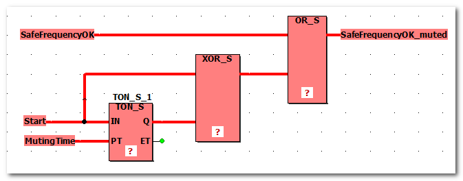

# TM5SDC1FS Digital Counter Safety Module (SLCv1)

**NOTE:**

This topic applies to an SLCv1 generation module (in a safety-related system with an SLC100 or SLC200 device). Which device generation is configured in your project is visible at the end of the short device description above the parameter grid (while the device is selected in the tree on the left).

Module type/safety-related fields of application

Digital counter safety-related module

1 safety-related digital counter channel, max. input frequency 7 kHz, 24 VDC

Timebase (input filter) configurable by software

Schneider Electric safety-related modules can be used in safety-related applications according to:

* EN ISO 13849, PL e
* IEC 62061, SIL 3
* IEC 61508, SIL 3

## Group: Basic

Parameter: MinRequiredFWRev

|  |  |
| --- | --- |
| Default value | Basic Release |
| Unit | -/- |
| Description | This parameter is only relevant in case of implementing other firmware versions than the manufacturer-loaded version.  To enter the operational state, the firmware version parameterized here or a newer version must be installed on the module.  * Basic Release: select this option when running the device with the initially released firmware version. * Test Version: select this option when using a device firmware version which is not yet released. A safety-related application cannot get approval if devices with a firmware test version are involved.  The firmware version selected here is particularly important with regard to parameters or process data items that have been implemented with a particular firmware version. If the device you are currently working with has new parameters or process data items, the following applies: if MinRequiredFWRev is set to an incorrect value, either the SLC will not enter the operational run status or the new parameters/process data items will not be taken into account by the SLC.  Refer to the hazard message below this table.  **Further Information:**  Information on newly added parameters or process data items can be found in the Release Notes you received with the firmware package. The Release Notes also describe how to determine the firmware version that is currently installed on the safety-related device. |

| WARNING | |
| --- | --- |
|  | **UNINTENDED EQUIPMENT OPERATION**   * Verify that the selected value for MinRequiredFWRev corresponds to the firmware version installed on the safety-related devices involved. * Verify by means of functional tests that each newly implemented parameter or process data item of safety-related modules is taken into the account by the SLC where this is required by your safety-related application.   **Failure to follow these instructions can result in death, serious injury, or equipment damage.** |

Parameter: Optional

|  |  |
| --- | --- |
| Default value | No |
| Unit | -/- |
| Description | The module can be configured as optional using this parameter. Optional modules do not have to be available (physically present or communicative), i.e., if an optional module is unavailable, this is not signaled by the Safety LogicController.  This parameter does not influence the module signal or status data. |
| Possible values | * No: This module is not optional.  This module has to go to Operational mode after start-up and safety-related communication to the Safety Logic Controller has to be established successfully (indicated by SafeModulOK = SAFETRUE). Processing of the safety-related application on the Safety Logic Controller is delayed after start-up until this state is achieved for the modules set to 'Optional = No'.  After start-up, errors on such safety-related modules are indicated by a fast flashing MXCHG LED on the Safety Logic Controller. Furthermore, an entry is made in the logbook. * Yes: This module is optional, i.e.,not necessary for the safety-related application.  This module is not taken into consideration during start-up, which means that the safety-related application is started even if the modules with 'Optional = Yes' are not in Operational mode or if safety-related communication is unsuccessful.  After start-up, errors on such safety-related modules are NOT indicated on the Safety Logic Controller. NO entry is made in the logbook. * Start-up: This module is optional, decisions regarding its further behavior are made during start-up:  If, during start-up, it is determined that the module is physically present (even if it is not in Operational mode), then the module behaves as if 'Optional = No' was set.  If, during start-up, it is determined that the module is not physically present, the module behaves as if 'Optional = Yes' was set. |

The Optional parameter is a mechanism to scale your safety-related system for various configurations of your machine design. However, it may be the case that the module(s) that you have designated as optional may be required in some of your alternative machine configurations.

| WARNING | |
| --- | --- |
|  | **UNINTENDED EQUIPMENT OPERATION**  Verify by means of functional tests that those modules that have the Optional parameter set to 'Yes' or 'Start-up' are available if and when required in alternative machine configurations.  **Failure to follow these instructions can result in death, serious injury, or equipment damage.** |

Parameter: FunctionMode

|  |  |
| --- | --- |
| Default value | Mode A-B |
| Unit | -/- |
| Description | Specifies the mode for input signal evaluation. |
| Possible values | For each mode (see list below), the following applies:   * The pulse frequency of the input signal is determined. * The pulse frequency on the relevant inputs is tested for equality. If it differs, a channel error is triggered (SafeChannelOK = SAFEFALSE).  The state of the input pulses can be monitored by evaluating the process data items SafeChannelOK and SafeFrequencyOK in the safety-related application as they switch to SAFEFALSE if the frequency evaluation detects any invalid or deviating input pulse signals.  The following modes can be selected, depending on the used encoder.   * Mode A-A * Mode A-B * Mode A-A/-B-B/  Each mode is described in a separate section below. |

**Characteristics of the function modes**

Mode A-A

|  |  |
| --- | --- |
| Function mode A-A with single-channel encoder | |
| Safe measurement of input signal pulse frequency, i.e, rotational speed | Yes, if rotational speed > 0 |
| Safe comparison of rotational speed | No |
| Safe detection of direction of rotation | No  Only positive frequency values are permitted in this mode. |
| Safe standstill detection | No |
|  | |

|  |  |
| --- | --- |
| Function mode A-A with two-channel encoder | |
| Safe measurement of input signal pulse frequency, i.e, rotational speed | Yes, if rotational speed > 0 |
| Safe comparison of rotational speed | Yes  Permissible tolerance: 5 counter pulses per 'Timebase'.  Monitoring of the rotational speed comparison is possible by evaluating the SafeFrequencyOK process data item for the module in the safety-related application. Refer to section "Error detection" below. |
| Safe detection of direction of rotation | No  Only positive frequency values are permitted in this mode. |
| Safe standstill detection | No |
|  | |

Mode A-B

|  |  |
| --- | --- |
| Function mode A-B with single-channel quadrature encoder | |
| Safe measurement of input signal pulse frequency, i.e, rotational speed | Yes, if rotational speed > 0 |
| Safe comparison of rotational speed | Yes  Permissible tolerance: 5 counter pulses per 'Timebase'.  Monitoring of the rotational speed comparison is possible by evaluating the SafeFrequencyOK process data item for the module in the safety-related application. Refer to section "Error detection" below. |
| Safe detection of direction of rotation | No  Only positive frequency values are permitted in this mode. |
| Safe standstill detection | No |
|  | |

Mode A-A/-B-B/

|  |  |
| --- | --- |
| Function mode A-A/-B-B/ with single-channel quadrature encoder with reverse channels | |
| Safe measurement of input signal pulse frequency, i.e, rotational speed | Yes, if rotational speed > 0 |
| Safe comparison of rotational speed | No |
| Safe detection of direction of rotation | Yes |
| Safe standstill detection | Yes |
|  | |

Error detection in function modes A-A and A-B

In function modes A-A and A-B, the module analyses a safety-related frequency input signal. Error detection in the module only functions properly while dynamic input signals are applied, but not with static input signals. Thus, the evaluation of input signals is not permitted during standstill of the drive.

The SafeFrequencyOK process data item of the module indicates the validity of the frequency input signal as follows:

* SafeFrequencyOK = SAFETRUE if pulses are detected at the input channels within the time interval specified using the 'Timebase' parameter.
* SafeFrequencyOK = SAFEFALSE if no pulses are detected at the input channels within the time interval specified using the 'Timebase' parameter (or in case of any other exception in the module).

As input signal evaluation is not permitted during standstill of the drive, a deadlock situation may occur in the application, for example, when starting up the drive: the drive cannot start because SafeFrequencyOK = SAFEFALSE, and the SafeFrequencyOK signal cannot become SAFETRUE because the drive does not start.

In the safety-related application, this situation can be solved by temporarily muting the input signal evaluation as shown in the following code example:

* The SafeFrequencyOK variable (process data item of the data type SAFEBOOL, generated by the module) indicates the validity of the frequency input signal.
* A rising edge of the Start variable (user-defined, data type SAFEBOOL) indicates that a start-up request has been sent to the drive.
* The MutingTime variable (user-defined, data type SAFETIME) sets the maximum time the drive needs to detect valid pulses on its counter channels. The 'Timebase' parameter must also be taken into consideration during this time.

  **NOTE:**

  Monitoring functions are not active during this time. Refer to the hazard message below.
* Use the SafeFrequencyOK\_muted variable (user-defined, data type SAFEBOOL) to further evaluate the rotary movement.

| WARNING | |
| --- | --- |
|  | **UNINTENDED EQUIPMENT OPERATION**   * Do not enter the zone of operation while monitoring is deactivated during the drive start-up phase. * Ensure that no other persons can access the zone of operation while monitoring is deactivated during the drive start-up phase. * Observe the regulations given by relevant sector standards while the machine is running in any other operating mode than "operational". * Use appropriate safety interlocks where personnel and/or equipment hazards exist.   **Failure to follow these instructions can result in death, serious injury, or equipment damage.** |

Parameter: Unit

|  |  |
| --- | --- |
| Default value | Increments / s |
| Unit | -/- |
| Description | Specifies the unit in which the recorded frequency is output by the module. |
| Possible values | * Increments / s: Number of measured increments per second * Increments / min: Number of measured increments per minute * Increments / h: Number of measured increments per hour |

Parameter: Timebase

|  |  |
| --- | --- |
| Default value | 10 |
| Unit | ms |
| Description | Specifies the time interval for counting input signal pulses.  The 'Timebase' value and the number of detected pulses within the timebase interval are used for calculating the frequency value. Observe the examples below this table.  The 'Timebase' value must be selected suitable for the frequency to be recorded. If the set timebase is too short, possibly no pulses are detected during some intervals. In this case, the SafeFrequencyOK process data item of the module switches to SAFEFALSE indicating an invalid frequency input signal.  The value directly influences the signal processing time of the module and consequently the safety response time of the entire input-output channel of the safety-related application.  Refer to the information below this table. |
| Possible values | Selectable from drop-down list:  10; 50; 100; 500; 1,000; 5,000; 10,000; 50,000; 100,000; |

Examples

|  |
| --- |
| Timebase = 500 ms  Period of input signal: 50 ms (low/high = 1:1)  Although the input frequency is constant, the output measured value differs depending on the number of pulses counted within the timebase interval. The actual frequency value is not determined exactly until the input signal has been applied during an entire interval.  Therefore, the frequency value output via the SafeFrequency signal may change during the first interval, although it is constant. |
| After t = 0 ms: timebase interval has elapsed before the input signal is applied.    Number of pulses counted during timebase interval: 0  This is indicated by switching the diagnostic signal SafeFrequencyOK of the module to SAFEFALSE.  Measured frequency in Hz, output via the SafeFrequency signal: 0 |
| After t = 250 ms: input signal is applied within the running timebase interval.    Number of pulses counted during timebase interval: 5  Calculation: 5 pulses detected in 500 ms (5/0.5 = 10)  Measured frequency in Hz, output via the SafeFrequency signal: 10 |
| After t = 500 ms: input signal has applied during the entire timebase interval.    Number of pulses counted during timebase interval: 10  Calculation: 10 pulses detected in 500 ms (10/0.5 = 20)  Measured frequency in Hz, output via the SafeFrequency signal: 20 |

**Impact of the set 'Timebase' value on the safety response time**

The following table lists the signal processing time of the module resulting from the set 'Timebase' value (update interval).

| WARNING | |
| --- | --- |
|  | **UNINTENDED EQUIPMENT OPERATION**  Verify that the signal processing time of the input module is included correctly in the safety response time calculations in Machine Expert – Safety.  **Failure to follow these instructions can result in death, serious injury, or equipment damage.** |

| Configured 'Timebase' value | I/O update time | Time + I/O update time  Modes A-A and A-B | Time + I/O update time  Mode A-A/-B-B/ |
| --- | --- | --- | --- |
| 10 ms | 2 ms | 12 ms | 22 ms |
| 50 ms | 2 ms | 52 ms | 102 ms |
| 100 ms | 2 ms | 102 ms | 202 ms |
| 500 ms | 5 ms | 505 ms | 1005 ms |
| 1 s | 10 ms | 1010 ms | 2010 ms |
| 5 s | 50 ms | 5050 ms | 10050 ms |
| 10 s | 100 ms | 10.1 s | 20.1 s |
| 50 s | 500 ms | 50.5 s | 100.5 s |
| 100 s | 1 s | 101 s | 201 s |

## Group: SafetyResponseTime

The safety response time is the time between the arrival of the sensor signal on the input channel of a safety-related input module and the shut-off signal at the output channel of a safety-related module. For further and detailed background information, refer to the topic "Safety Response Time for SLCv1 " in the "Machine Expert – Safety - User Guide".

The parameters in this group influence the safety response time of the Safety Logic Controller system. The parameters CommunicationWatchdog, MinDataTransportTime, and MaxDataTransportTime in this group are only applied to the module if ManualConfiguration is set to 'Yes'.

Parameter: ManualConfiguration

|  |  |
| --- | --- |
| Default value | No |
| Unit | -/- |
| Description | Specifies whether the module uses its safety response time-relevant parameters (CommunicationWatchdog, MinDataTransportTime, and MaxDataTransportTime) or the values specified in the 'SafetyResponseTimeDefaults' parameter group of the Safety Logic Controller.  Managing parameters per module optimizes the system to application-specific requirements regarding the safety response time. |
| Parameter value | * No: The module inherits the CommunicationWatchdog, MinDataTransportTime, and MaxDataTransportTime values from the 'SafetyResponseTimeDefaults' parameter group of the Safety Logic Controller. * Yes: The module uses its own parameter values. |

Parameter: MinDataTransportTime

|  |  |
| --- | --- |
| Default value | 12 |
| Value range  Step size | 12...500  1 |
| Unit | 100 µs |
| Description | Defines the **minimum** time that is required to transmit a data telegram from a producer to a consumer. If a telegram is received **earlier** (by the consumer) than specified by this parameter value, communication is considered as invalid.  Machine Expert – Safety provides a calculator dialog to determine this parameter value.  Term definition and background information  According to the openSAFETY specification, devices (safety-related I/O modules as well as the Safety Logic Controller) communicate by sending and receiving cyclic data, referred to as openSAFETY telegrams. A telegram generating (sending) device is designated as producer, a receiving device is a consumer.  Each telegram includes a time stamp for time validation of the communication. On receipt of a telegram, the consumer compares this time stamp with the current time. If the schedule is kept, the communication is considered as valid.  If a telegram is received earlier than defined by this parameter, communication is considered as invalid and is not further processed. The 'SafeModuleOK' process data item also becomes SAFEFALSE indicating that the safety-related communication of the module is no longer valid. The implications for the rest of the safety-related systems depend on the defined safety-related function. |
| Value calculation | How to calculate the module-specific MinDataTransportTime value  1. Select 'Project > Response Time Relevant Parameters'. 2. In the appearing dialog, open the 'Manual' tab. 3. Section 'Variable Parameters':  If a differing Sercos III cycle time than set in Machine Expert is used to calculate the MinDataTransportTime (e.g., to take cycle time modifications by the application program into account), check 'Make Selectable' and select or enter the desired 'Sercos III Cycle Time'.  The 'Ring/Double Line' checkbox only influences the MaxDataTransportTime value. The 'Ring/Double Line' checkbox does not influence the MinDataTransportTime value.  An entered 'Network Package Loss' does not influence the MinDataTransportTime but only the CommunicationWatchdog value.  The 'System Parameters' section is read-only and displays system/module properties set in Machine Expert. When modifying these parameters while the dialog is open, the values are updated automatically without closing the calculator dialog. 4. The calculated module-specific MinDataTransportTime value is displayed in the 'Result' section.  Note the resulting value and enter the value for the MinDataTransportTime parameter in the module parameter grid. |
| Practical values | Entering the MinDataTransportTime value calculated in Machine Expert – Safety results in a stable running system. |

Parameter: MaxDataTransportTime

|  |  |
| --- | --- |
| Default value | 200 |
| Value range  Step size | 12...65,000  1 |
| Unit | 100 µs |
| Description | Defines the **maximum** time that is allowed to transmit a data telegram from a producer to a consumer. If a telegram is received **later** (by the consumer) than specified by this parameter value, communication is considered as invalid.  Machine Expert – Safety provides a calculator dialog to determine this parameter value.  **NOTE:**  The parameter value influences the safety response time calculated by Machine Expert – Safety.  Term definition and background information  According to the openSAFETY specification, devices (safety-related I/O modules as well as the Safety Logic Controller) communicate by sending and receiving cyclic data, referred to as openSAFETY telegrams. A telegram generating (sending) device is designated as producer, a receiving device is a consumer.  Each telegram includes a time stamp for time validation of the communication. On receipt of a telegram, the consumer compares this time stamp with the current time. If the schedule is kept, the communication is considered as valid.  If a telegram is received later than defined by this parameter, communication is considered as invalid and is not further processed. The implications for the rest of the safety-related systems depend on the defined safety-related function. |
| Value calculation | How to calculate the module-specific MaxDataTransportTime value  1. Select 'Project > Response Time Relevant Parameters'. 2. In the appearing dialog, open the 'Manual' tab. 3. Section 'Variable Parameters':  If a differing Sercos III cycle time than set in Machine Expert is to be used to calculate the MaxDataTransportTime (e.g., to take cycle time modifications by the application program into account), check 'Make Selectable' and select or enter the desired 'Sercos III Cycle Time'.  'Ring/Double Line' checkbox: Ring and double line bus structures require greater parameter values in order to implement a stable running system. Check 'Ring/Double Line' to take into account the bus structure.  It is activated by default which is suitable for a ring bus structure and a double line bus structure. If you are implementing a line structure, the checkbox can be deactivated to decrease the resulting parameter value. Values calculated for a ring/double line structure can be used for a line structure but not vice versa.  An entered 'Network Package Loss' does not influence the MaxDataTransportTime but only the CommunicationWatchdog value. 4. The calculated MaxDataTransportTime value is displayed for the module.  Module-specific parameters (such as cycle times, set in Machine Expert) are also displayed in the grid for information purposes. When modifying these parameters while the dialog is open, the values are updated automatically without closing the calculator dialog.  Note the resulting value for the module and enter the appropriate value into the MaxDataTransportTime parameter grid field of the module. |
| Practical values | Entering the MaxDataTransportTime value calculated in Machine Expert – Safety results in a stable running system. |

Parameter: CommunicationWatchdog

|  |  |
| --- | --- |
| Default value | 200 |
| Value range  Step size | 1...65,535  1 |
| Unit | 100 µs |
| Description | Defines the maximum time period within which a consumer must receive a valid data telegram from a producer in order to consider the safety-related communication as valid and continue the application. The parameter sets a watchdog timer which then monitors whether a consumer receives telegrams from a producer in time. If the watchdog expires, communication is considered as invalid.  Machine Expert – Safety provides a calculator to determine this parameter value.  **NOTE:**  The parameter value influences the safety response time calculated by Machine Expert – Safety.  Term definition and background information  According to the openSAFETY specification, devices (safety-related I/O modules as well as the Safety Logic Controller) communicate by sending and receiving cyclic data, referred to as openSAFETY telegrams. A telegram generating (sending) device is designated as producer, a receiving device is a consumer.  The CommunicationWatchdog value physically depends on the transport time needed for the telegram to be transmitted from a producer to a consumer and influences the worst case response time of the system. The calculated parameter value therefore depends on the MaxDataTransportTime parameter value.  If the consumer receives the telegram **in time** (communication watchdog is not yet expired **and** the transmission time is within the period specified by the parameters MinDataTransportTime and MaxDataTransportTime), the watchdog timer is restarted and communication is considered as valid. The time stamp contained in the received telegram is not evaluated, only the receipt of a valid telegram is relevant.  If no telegram is received (due to delay or loss) and the **communication watchdog expires** in the consumer, the module is set to the defined safe-state. The 'SafeModuleOK' process data item also becomes SAFEFALSE indicating that the safety-related communication of the module is no longer valid. |
| Value calculation | How to calculate the module-specific CommunicationWatchdog value  1. Select 'Project > Response Time Relevant Parameters'. 2. In the appearing dialog, open the 'Manual' tab. 3. Section 'Variable Parameters':  If a differing Sercos III cycle time than set in Machine Expert is to be used to calculate the CommunicationWatchdog value (e.g., to take cycle time modifications by the application program into account), check 'Make Selectable' and select or enter the desired 'Sercos III Cycle Time'.  'Ring/Double Line' checkbox: Ring and double line bus structures require greater parameter values in order to implement a stable running system. Check 'Ring/Double Line' to take into account the bus structure.  It is activated by default which is suitable for a ring or double line bus structure. If you are implementing a line structure, the checkbox can be deactivated to decrease the resulting parameter value. Values calculated for a ring/double line structure can be used for a line structure but not vice versa. 4. By increasing the number of allowed package losses, the system can be more tolerant. This increases the calculated minimum watchdog interval. Enter an integer value (range 0..99) for the number of telegrams that can be lost for the present module. The entered value is applied to the safety-related modules involved. 5. The calculated CommunicationWatchdog value is displayed for the module.  Module-specific parameters (such as cycle times, set in Machine Expert) are also displayed in the grid for information purposes. When modifying these parameters while the dialog is open, the values are updated automatically without closing the calculator dialog.  Note the resulting value for the module and enter the appropriate value into the CommunicationWatchdog parameter grid field of the module. |
| Practical values | For the CommunicationWatchdog value which you must enter in the parameter grid ('Devices' window), the following applies:   * For commissioning a system, the CommunicationWatchdog value should be equal to or greater than the largest cycle time of the system (for example, the SercosIII cycle time). * A value greater than the calculated CommunicationWatchdog value increases the system availability but also increases the overall worst case response time (thus increasing the required physical distances for mounting safety barrier and perimeter equipment at the machine). |

## Process data items of the module

Purpose and use of process data items

Each module provides process data items (signals). Process data items can be:

* I/O signals delivered from or written to a module terminal.
* diagnostic signals for evaluating the status of input/output channels or the entire module.
* control signals, for example, for enabling a channel or adjusting the module.

The available process data items of a module are listed under the module node in the tree on the left of the 'Devices' window. To display and use the process data items, expand the module node in the tree by clicking the '+' symbol.

Example

The module with the ID SL1.SM3 provides (among others) the diagnostic signal SafeModuleOK and the input signal SafeDigitalInput01.

From the devices tree, process data items can be inserted into the safety-related FBD/LD code by drag & drop (see following procedure). On insertion into the code, a standard (non-safety-related) or safety-related global variable is created (depending on the data type of the process data item).

Procedure: How to insert process data items into the code

1. Open the code worksheet where you want to insert the process data item and create/use the global variable assigned to it.
2. In the 'Devices' window, open the devices tree on the left and expand the module (tree node) which contains the process data item to be used.
3. Drag the process data item into the code worksheet. When releasing the mouse button, the 'Variable' dialog appears.

   To insert a Boolean variable as a contact into the graphical code, hold the <CTRL> key down when releasing the mouse button after dragging the variable from the device terminal grid into the code worksheet.
4. In the 'Variable' dialog, a default name is proposed which is derived from the process data item name. Accept the proposed name, select an existing global variable, or declare a new global variable by entering a new 'Name', defining the 'Data Type' and selecting a 'Group'.
5. Confirm the 'Variable' dialog by clicking 'OK'.

   The rectangle shape of the variable is now added to the cursor. It can be dropped at the desired position with a click. You can directly connect the variable to another object (e.g., a formal parameter as shown in the following example) or dropped at any free position.

**Data direction depends on the signal type**

Input signals can only be read and output signals can be written by the safety-related application.

Diagnostic signals can be used to evaluate and monitor the status of the safety-related module or individual I/O channels, for example. Therefore, global variables created for and assigned to diagnostic signals can be read by the application.

Control signals can be used to enable the module operation or to adjust/adapt the module for the present use case (for example, by setting a measurement range or a particular module behavior). The global variables created for and assigned to control signals can be written by the application, thus controlling the module.

Representation of the process data items in the devices tree:

| Icon | Signal type | Access type |
| --- | --- | --- |
|  | Safety-related input signal or diagnostic signal. | read |
|  | Non-safety-related input signal (only available for the Safety Logic Controller). | read |
|  | Non-safety-related output signal (only available for the Safety Logic Controller) or control signal. | write |
|  | Safety-related output or control signal. | write |

**NOTE:**

If a standard (non-safety-related) signal is connected to a physical input or output, the data type of the corresponding global variable must be modified from safety-related to standard (e.g., from SAFEBOOL to BOOL) to rule out an incorrect use of the signal in the code. The same applies if a safety-related signal is used only as standard signal in the code. Modifying the data type can either be done in the appropriate variables worksheet or using type converter functions.

| WARNING | |
| --- | --- |
|  | **UNINTENDED EQUIPMENT OPERATION**   * Verify the impact of standard (non-safety-related) signals on safety-related outputs. * Verify that "standard to safety-related" converters are used correctly in the code.   **Failure to follow these instructions can result in death, serious injury, or equipment damage.** |

In the following, the I/O, diagnostic and control signals of the present module are listed and described in the order they are listed in the devices tree.

SafeModuleOK

|  |  |
| --- | --- |
| Description | Indicates the status of the communication between the safety-related module and the Safety Logic Controller and therefore, from safety-related application perspective, the module status itself. |
| Signal type | Diagnostic |
| Data type | SAFEBOOL |
| Access type | Variable can be read by the safety-related application |
| Possible values | **SAFEFALSE**:   * Safety-related module is not in an operational state, or * the communication with the Safety Logic Controller has not been established correctly, or * the module has detected an error with the communication channel.  **SAFETRUE**:   * Safety-related module is in an operational state, and * the communication with the Safety Logic Controller is established correctly, and * the module has not detected an error with the communication channel. |

**Mandatory assignment validation for the SafeModuleOK data item:**

The verification/validation of the assignment of each process data item to a global I/O variable is mandatory. This particularly applies to the SafeModuleOK process data item which is available for each safety-related module and indicates its status. As the SafeModuleOK data item cannot be written to, e.g., by applying a signal to a module input, the module to be verified must be physically removed from the TM5 bus. As a result, SafeModuleOK switches to SAFEFALSE and the assigned global I/O variable must follow. For further information on the steps to remove and reinsert a module, refer to the user manual of the module.

| WARNING | |
| --- | --- |
|  | **UNINTENDED EQUIPMENT OPERATION**   * Physically remove each safety-related module from the TM5 bus in order to test for SafeModuleOK. * Verify that the global I/O variable assigned to the SafeModuleOK process data item of the removed safety-related module switches to SAFEFALSE.   **Failure to follow these instructions can result in death, serious injury, or equipment damage.** |

SafeChannelOK

|  |  |
| --- | --- |
| Description | Diagnostic signal which indicates the status of the safety-related input channel.  This diagnostic signal confirms the validity of the measured frequency signal. Depending on the results of the risk analysis you carried out for your application, the diagnostic signal must be evaluated each time the input signal is used in the safety-related application. The value SAFEFALSE of the diagnostic signal indicates an invalid frequency value. In this case, the input signal must not be further used, processed, or evaluated in the safety-related application.  Refer to the hazard message below this table.  **NOTE:**  To detect error status conditions of modules/channels within your application, diagnostic signals must be evaluated in the safety-related code. A programming example and further information can be found in the topic ["Monitoring/evaluating diagnostic information of the machine"](SE_DiagInformationMonitoring.html#SE_DiagInformationMonitoring). |
| Signal type | Diagnostic signal |
| Data type | SAFEBOOL |
| Access type | Variable can be read by the safety-related application |
| Possible values | **SAFEFALSE**:   * SafeModuleOK = SAFEFALSE, or * incorrect wiring between sensor and module, or * signal loss at the input due to cable break or an encode which is not functioning correctly, or * module is parameterized incorrectly.  Verify the values set for the parameters FunctionMode, Unit, and Timebase.  Or * the input signal does not comply with the electrical requirements of the module.  **SAFETRUE**:   * SafeModuleOK = SAFETRUE, and * input channel works correctly, and * module is parameterized correctly, and * the input value is within the measurement range.  **NOTE:**  Also observe the respective LED indicator(s) of the affected modules for the error indication. |

| WARNING | |
| --- | --- |
|  | **UNINTENDED EQUIPMENT OPERATION**   * Verify that the input signal is only used in the safety-related application as long as the related diagnostic signals are SAFETRUE if demanded by the results of your risk analysis. * Validate the overall safety-related function with respect to the processing of input values, and thoroughly test the application.   **Failure to follow these instructions can result in death, serious injury, or equipment damage.** |

SafeFrequencyOK

|  |  |
| --- | --- |
| Description | Diagnostic signal which indicates the status of the frequency measurement.  This diagnostic signal confirms the validity of the incoming analog signal and of the SafeFrequency process data item (output measurement value). Depending on the results of the risk analysis you carried out for your application, the diagnostic signal must be evaluated each time the SafeFrequency signal is used in the safety-related application. The value SAFEFALSE of the diagnostic signal indicates an invalid SafeFrequency value. In this case, the SafeFrequency signal must not be further used, processed, or evaluated in the safety-related application.  Refer to the hazard message below this table.  **NOTE:**  To detect error status conditions of modules/channels within your application, diagnostic signals must be evaluated in the safety-related code. A programming example and further information can be found in the topic ["Monitoring/evaluating diagnostic information of the machine"](SE_DiagInformationMonitoring.html#SE_DiagInformationMonitoring).  **Further Information:**  Also refer to the description of the FunctionMode parameter above, in particular to the section "Error detection in function modes A-A and A-B". |
| Signal type | Diagnostic signal |
| Data type | SAFEBOOL |
| Access type | Variable can be read by the safety-related application |
| Possible values | **SAFEFALSE**: the SafeFrequency signal is invalid and must not be used in the safety-related application due to one of the following reasons.   * SafeModuleOK = SAFEFALSE, or * no pulses are detected at the input channels within the time interval specified using the 'Timebase' parameter (or in case of any other exception in the module).  **SAFETRUE**: the SafeFrequency signal is valid.   * SafeModuleOK = SAFETRUE, and * pulses are detected at the input channels within the time interval specified using the 'Timebase' parameter.  **NOTE:**  Also observe the respective LED indicator(s) of the affected modules for the error indication. |
| Relevant module parameters | * FunctionMode * Unit * TimeBase  The related parameter descriptions can be found above in this topic. |

| WARNING | |
| --- | --- |
|  | **UNINTENDED EQUIPMENT OPERATION**   * Verify that the SafeFrequency signal is only used in the safety-related application as long as the related diagnostic signals are SAFETRUE if demanded by the results of your risk analysis. * Validate the overall safety-related function with respect to the processing of input values, and thoroughly test the application.   **Failure to follow these instructions can result in death, serious injury, or equipment damage.** |

SafeFrequency

|  |  |
| --- | --- |
| Description | Frequency of the pulse signal connected to the module input channel.  **NOTE:**  The frequency determination is based on the length of the Timebase interval and the number of pulses detected within this interval. The frequency value is not determined exactly until the input signal has been applied during an entire interval. Observe the example provided in the description of the Timebase parameter above.  The validity of this input signal is confirmed by the related diagnostic signal SafeFrequencyOK. Depending on the results of the risk analysis you carried out for your application, the diagnostic signal must be evaluated each time the SafeFrequency signal is used in the safety-related application. The value SAFEFALSE of the diagnostic signal indicates an invalid SafeFrequency value. In this case, the SafeFrequency signal must not be further used, processed, or evaluated in the safety-related application.  Refer to the hazard message below this table.  **Further Information:**  Also refer to the description of the FunctionMode parameter above, in particular to the section "Error detection in function modes A-A and A-B". |
| Signal type | I/O signal |
| Data type | SAFEINT |
| Access type | Variable can be read by the safety-related application |
| Possible values | If SafeModuleOK = SAFETRUE and SafeFrequencyOK = SAFETRUE, the measured frequency is output as SAFEINT value. The unit of this value can be specified via the Unit parameter in the 'Basic' parameter group.  **NOTE:**  Refer to the hardware manual of the module for details on the safety-oriented measurement precision. |
| Relevant module parameters | * FunctionMode * Unit * TimeBase  The related parameter descriptions can be found above in this topic. |

| WARNING | |
| --- | --- |
|  | **UNINTENDED EQUIPMENT OPERATION**   * Verify that the SafeFrequency signal is only used in the safety-related application as long as the related diagnostic signals are SAFETRUE if demanded by the results of your risk analysis. * Validate the overall safety-related function with respect to the processing of input values, and thoroughly test the application.   **Failure to follow these instructions can result in death, serious injury, or equipment damage.** |

Reset

|  |  |
| --- | --- |
| Description | Enable signal for the TM5SDC1FS Digital Counter Safety module.  Enabling is required after the diagnostic status signal SafeFrequencyOK of the module has switched to SAFEFALSE due to an invalid input signal.  **NOTE:**  If the safety-related module enters the defined safe-state and SafeModuleOK = SAFEFALSE, the Reset signal cannot be used to enable the module. In that case, the entire module must be restarted. |
| Signal type | Control signal |
| Data type | SAFEBOOL |
| Access type | Variable can be written by the safety-related application |
| Possible values | * **SAFEFALSE**: input channel of the module remains disabled. * Edge **SAFEFALSE > SAFETRUE**: Enables the input channel and resets the module. |

EIO0000002265.07