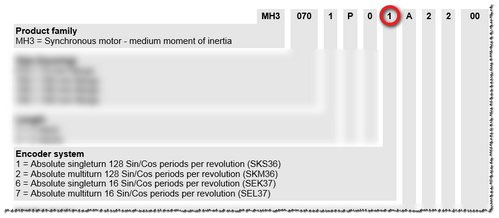
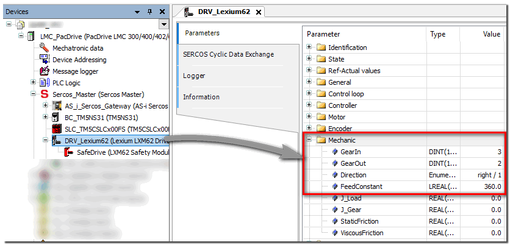
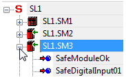

# LXM62FS - Safety Module for Lexium LXM62 Drives (SLCv1)

**NOTE:**

This topic applies to an SLCv1 generation module (in a safety-related system with an SLC100 or SLC200 device). Which device generation is configured in your project is visible at the end of the short device description above the parameter grid (while the device is selected in the tree on the left).

Module type/safety-related fields of application

The following safety-related functions are supported:

* [STO - Safe Torque Off function](HWModuleParameters_STO.html#HWModuleParameters_STO)
* [SOS - Safe Operation Stop function](HWModuleParameters_SOS.html#HWModuleParameters_SOS)
* [SS1 - Safe Stop 1 function](HWModuleParameters_SS1.html#HWModuleParameters_SS1)
* [SS2 - Safe Stop 2 function](HWModuleParameters_SS2.html#HWModuleParameters_SS2)
* [SLS1 to SLS4 - four Safely Limited Speed functions](HWModuleParameters_SLS.html#HWModuleParameters_SLS)
* [SDIneg and SDIpos - Safe Direction Negative/Positive function](HWModuleParameters_SDI.html#HWModuleParameters_SDI)
* [SMS - Safe Maximum Speed function](HWModuleParameters_SMS.html#HWModuleParameters_SMS)

The safety concept is based upon the general consideration that the required safety-related movement is performed by the standard (non-safety-related) controller and the drive. That is, the safety-related functions only monitor the movement of the axis but they do not control it.

If the safety-related system detects the incorrect execution of the motion or an internal drive error, the following will be initiated:

* the drive will terminate the on-going safety-related function, and
* the safety-related system will initiate the required fall-back level (for example, the defined safe-state), and
* the power stage of the drive will be deactivated. As a result, the motor will be torque free and it will come to a stop.

**Example**: the safety-related SLS function (Safely Limited Speed) monitors the configured speed limit of the drive. When exceeding the defined speed limit, the fallback function SS1, followed by STO will switch the motor into a torque free state.

The implementation of the safety-related monitoring is to be done in the safety-related application program (SLC program) using the safety-related Preventa SF\_SafeMotionControl function block.

**NOTE:**

If a Safety Module is part of the Sercos bus structure, the safety-related Machine Expert – Safety project cannot be compiled successfully if no safety-related Preventa SF\_SafeMotionControl function block is used.

**Further Information:**

Refer to the help chapter "Preventa SF\_SafeMotionControl function block" for further information.

Schneider Electric safety-related modules can be used in safety-related applications according to:

* EN ISO 13849, PL e
* IEC 62061, SIL 3
* IEC 61508, SIL 3

## Group: Basic

Parameter: MinRequiredFWRev

|  |  |
| --- | --- |
| Default value | Basic Release |
| Unit | -/- |
| Description | This parameter is only relevant in case of implementing other firmware versions than the manufacturer-loaded version.  To enter the operational state, the firmware version parameterized here or a newer version must be installed on the module.  * Basic Release: select this option when running the device with the initially released firmware version. * Test Version: select this option when using a device firmware version which is not yet released. A safety-related application cannot get approval if devices with a firmware test version are involved.  The firmware version selected here is particularly important with regard to parameters or process data items that have been implemented with a particular firmware version. If the device you are currently working with has new parameters or process data items, the following applies: if MinRequiredFWRev is set to an incorrect value, either the SLC will not enter the operational run status or the new parameters/process data items will not be taken into account by the SLC.  Refer to the hazard message below this table.  **Further Information:**  Information on newly added parameters or process data items can be found in the Release Notes you received with the firmware package. The Release Notes also describe how to determine the firmware version that is currently installed on the safety-related device. |

| WARNING | |
| --- | --- |
|  | **UNINTENDED EQUIPMENT OPERATION**   * Verify that the selected value for MinRequiredFWRev corresponds to the firmware version installed on the safety-related devices involved. * Verify by means of functional tests that each newly implemented parameter or process data item of safety-related modules is taken into the account by the SLC where this is required by your safety-related application.   **Failure to follow these instructions can result in death, serious injury, or equipment damage.** |

Parameter: Optional

|  |  |
| --- | --- |
| Default value | No |
| Unit | -/- |
| Description | The module can be configured as optional using this parameter. Optional modules do not have to be available (physically present or communicative), i.e., if an optional module is unavailable, this is not signaled by the Safety LogicController.  This parameter does not influence the module signal or status data. |
| Possible values | * No: This module is not optional.  This module has to go to Operational mode after start-up and safety-related communication to the Safety Logic Controller has to be established successfully (indicated by SafeModulOK = SAFETRUE). Processing of the safety-related application on the Safety Logic Controller is delayed after start-up until this state is achieved for the modules set to 'Optional = No'.  After start-up, errors on such safety-related modules are indicated by a fast flashing MXCHG LED on the Safety Logic Controller. Furthermore, an entry is made in the logbook. * Yes: This module is optional, i.e.,not necessary for the safety-related application.  This module is not taken into consideration during start-up, which means that the safety-related application is started even if the modules with 'Optional = Yes' are not in Operational mode or if safety-related communication is unsuccessful.  After start-up, errors on such safety-related modules are NOT indicated on the Safety Logic Controller. NO entry is made in the logbook. * Start-up: This module is optional, decisions regarding its further behavior are made during start-up:  If, during start-up, it is determined that the module is physically present (even if it is not in Operational mode), then the module behaves as if 'Optional = No' was set.  If, during start-up, it is determined that the module is not physically present, the module behaves as if 'Optional = Yes' was set. |

The Optional parameter is a mechanism to scale your safety-related system for various configurations of your machine design. However, it may be the case that the module(s) that you have designated as optional may be required in some of your alternative machine configurations.

| WARNING | |
| --- | --- |
|  | **UNINTENDED EQUIPMENT OPERATION**  Verify by means of functional tests that those modules that have the Optional parameter set to 'Yes' or 'Start-up' are available if and when required in alternative machine configurations.  **Failure to follow these instructions can result in death, serious injury, or equipment damage.** |

Parameter: HW\_STO\_Config

|  |  |
| --- | --- |
| Default value | HW\_STO used |
| Unit | -/- |
| Description | Specifies whether the [STO safety function](HWModuleParameters_STO.html#HWModuleParameters_STO) can be requested only via software or **additionally** via the hard-wired signal link of the drive. |
| Possible values | * HW\_STO used: the hard-wired signal link can also be used. This means, the STO function can be requested via the Preventa SF\_SafeMotionControl function block (S\_STO\_Request input = SAFEFALSE) as well as via the direct hard-wired signal link of the drive.    With this parameter value, the output S\_HW\_STO\_Active of the SF\_SafeMotionControl function block is set to SAFETRUE. * HW\_STO ignored - Attention: the hard-wired signal link **cannot** be used. The STO function can solely be requested via the Preventa Motion SF\_SafeMotionControl function block (S\_STO\_Request input = SAFEFALSE).  In the tables above, SW means "software STO request via the S\_STO\_Request input of the function block" and HW means "hard-wired STO request". |

| WARNING | |
| --- | --- |
|  | **UNINTENDED EQUIPMENT OPERATION**   * Include in your risk analysis the impact of activating or deactivating the possibility of using the hard-wired signal link for requesting the STO safety function. * Verify that the Preventa SF\_SafeMotionControl function block is implemented correctly and the STO function can be called properly via the S\_STO\_Request input parameter of the function block after deactivating the hard-wired STO signal link.   **Failure to follow these instructions can result in death, serious injury, or equipment damage.** |

Parameter: SafeFeedbackConfig

|  |  |
| --- | --- |
| Default value | SafeSpeed [units/s] |
| Unit | -/- |
| Description | Specifies whether the axis velocity or the increment value provided by the encoder is output via the safety-related SafeFeedback process data item and can be read by the safety-related application.  Refer to the section below for a description of the process data item. |
| Possible values | * SafeSpeed [units/s]: the safety-related speed in [units/s] is output via the SafeFeedback process data item. The calculation of the velocity value is based on the increment value provided by the encoder. * Safe increment: the safety-related increment value from the encoder is output via the SafeFeedback process data item.  After switching on the safety-related drive, the value starts with "0" and then it indicates the relative position change of the drive (since it was energized) in increments.  The value range corresponds to the data type of the SafeFeedback signal, which is a SAFEDINT.  (-231 ... 231-1 = -2,147,483,648 up to 2,147,483,647).  One rotation of the encoder equates to 219 increments. |

## Group: SafetyResponseTime

The safety response time is the time between the arrival of the sensor signal on the input channel of a safety-related input module and the shut-off signal at the output channel of a safety-related module. For further and detailed background information, refer to the topic "Safety Response Time for SLCv1 " in the "Machine Expert – Safety - User Guide".

The parameters in this group influence the safety response time of the Safety Logic Controller system. The parameters CommunicationWatchdog, MinDataTransportTime, and MaxDataTransportTime in this group are only applied to the module if ManualConfiguration is set to 'Yes'.

Parameter: ManualConfiguration

|  |  |
| --- | --- |
| Default value | No |
| Unit | -/- |
| Description | Specifies whether the module uses its safety response time-relevant parameters (CommunicationWatchdog, MinDataTransportTime, and MaxDataTransportTime) or the values specified in the 'SafetyResponseTimeDefaults' parameter group of the Safety Logic Controller.  Managing parameters per module optimizes the system to application-specific requirements regarding the safety response time. |
| Parameter value | * No: The module inherits the CommunicationWatchdog, MinDataTransportTime, and MaxDataTransportTime values from the 'SafetyResponseTimeDefaults' parameter group of the Safety Logic Controller. * Yes: The module uses its own parameter values. |

Parameter: MinDataTransportTime

|  |  |
| --- | --- |
| Default value | 12 |
| Value range  Step size | 12...65,535  1 |
| Unit | 100 µs |
| Description | Defines the **minimum** time that is required to transmit a data telegram from a producer to a consumer. If a telegram is received **earlier** (by the consumer) than specified by this parameter value, communication is considered as invalid.  Machine Expert – Safety provides a calculator dialog to determine this parameter value.  Term definition and background information  According to the openSAFETY specification, devices (safety-related I/O modules as well as the Safety Logic Controller) communicate by sending and receiving cyclic data, referred to as openSAFETY telegrams. A telegram generating (sending) device is designated as producer, a receiving device is a consumer.  Each telegram includes a time stamp for time validation of the communication. On receipt of a telegram, the consumer compares this time stamp with the current time. If the schedule is kept, the communication is considered as valid.  If a telegram is received earlier than defined by this parameter, communication is considered as invalid and is not further processed. The 'SafeModuleOK' process data item also becomes SAFEFALSE indicating that the safety-related communication of the module is no longer valid. The implications for the rest of the safety-related systems depend on the defined safety-related function. |
| Value calculation | How to calculate the module-specific MinDataTransportTime value  1. Select 'Project > Response Time Relevant Parameters'. 2. In the appearing dialog, open the 'Manual' tab. 3. Section 'Variable Parameters':  If a differing Sercos III cycle time than set in Machine Expert is used to calculate the MinDataTransportTime (e.g., to take cycle time modifications by the application program into account), check 'Make Selectable' and select or enter the desired 'Sercos III Cycle Time'.  The 'Ring/Double Line' checkbox only influences the MaxDataTransportTime value. The 'Ring/Double Line' checkbox does not influence the MinDataTransportTime value.  An entered 'Network Package Loss' does not influence the MinDataTransportTime but only the CommunicationWatchdog value.  The 'System Parameters' section is read-only and displays system/module properties set in Machine Expert. When modifying these parameters while the dialog is open, the values are updated automatically without closing the calculator dialog. 4. The calculated module-specific MinDataTransportTime value is displayed in the 'Result' section.  Note the resulting value and enter the value for the MinDataTransportTime parameter in the module parameter grid. |
| Practical values | Entering the MinDataTransportTime value calculated in Machine Expert – Safety results in a stable running system. |

Parameter: MaxDataTransportTime

|  |  |
| --- | --- |
| Default value | 200 |
| Value range  Step size | 12...65,535  1 |
| Unit | 100 µs |
| Description | Defines the **maximum** time that is allowed to transmit a data telegram from a producer to a consumer. If a telegram is received **later** (by the consumer) than specified by this parameter value, communication is considered as invalid.  Machine Expert – Safety provides a calculator dialog to determine this parameter value.  **NOTE:**  The parameter value influences the safety response time calculated by Machine Expert – Safety.  Term definition and background information  According to the openSAFETY specification, devices (safety-related I/O modules as well as the Safety Logic Controller) communicate by sending and receiving cyclic data, referred to as openSAFETY telegrams. A telegram generating (sending) device is designated as producer, a receiving device is a consumer.  Each telegram includes a time stamp for time validation of the communication. On receipt of a telegram, the consumer compares this time stamp with the current time. If the schedule is kept, the communication is considered as valid.  If a telegram is received later than defined by this parameter, communication is considered as invalid and is not further processed. The implications for the rest of the safety-related systems depend on the defined safety-related function. |
| Value calculation | How to calculate the module-specific MaxDataTransportTime value  1. Select 'Project > Response Time Relevant Parameters'. 2. In the appearing dialog, open the 'Manual' tab. 3. Section 'Variable Parameters':  If a differing Sercos III cycle time than set in Machine Expert is to be used to calculate the MaxDataTransportTime (e.g., to take cycle time modifications by the application program into account), check 'Make Selectable' and select or enter the desired 'Sercos III Cycle Time'.  'Ring/Double Line' checkbox: Ring and double line bus structures require greater parameter values in order to implement a stable running system. Check 'Ring/Double Line' to take into account the bus structure.  It is activated by default which is suitable for a ring bus structure and a double line bus structure. If you are implementing a line structure, the checkbox can be deactivated to decrease the resulting parameter value. Values calculated for a ring/double line structure can be used for a line structure but not vice versa.  An entered 'Network Package Loss' does not influence the MaxDataTransportTime but only the CommunicationWatchdog value. 4. The calculated MaxDataTransportTime value is displayed for the module.  Module-specific parameters (such as cycle times, set in Machine Expert) are also displayed in the grid for information purposes. When modifying these parameters while the dialog is open, the values are updated automatically without closing the calculator dialog.  Note the resulting value for the module and enter the appropriate value into the MaxDataTransportTime parameter grid field of the module. |
| Practical values | Entering the MaxDataTransportTime value calculated in Machine Expert – Safety results in a stable running system. |

Parameter: CommunicationWatchdog

|  |  |
| --- | --- |
| Default value | 200 |
| Value range  Step size | 1...65,535  1 |
| Unit | 100 µs |
| Description | Defines the maximum time period within which a consumer must receive a valid data telegram from a producer in order to consider the safety-related communication as valid and continue the application. The parameter sets a watchdog timer which then monitors whether a consumer receives telegrams from a producer in time. If the watchdog expires, communication is considered as invalid.  Machine Expert – Safety provides a calculator to determine this parameter value.  **NOTE:**  The parameter value influences the safety response time calculated by Machine Expert – Safety.  Term definition and background information  According to the openSAFETY specification, devices (safety-related I/O modules as well as the Safety Logic Controller) communicate by sending and receiving cyclic data, referred to as openSAFETY telegrams. A telegram generating (sending) device is designated as producer, a receiving device is a consumer.  The CommunicationWatchdog value physically depends on the transport time needed for the telegram to be transmitted from a producer to a consumer and influences the worst case response time of the system. The calculated parameter value therefore depends on the MaxDataTransportTime parameter value.  If the consumer receives the telegram **in time** (communication watchdog is not yet expired **and** the transmission time is within the period specified by the parameters MinDataTransportTime and MaxDataTransportTime), the watchdog timer is restarted and communication is considered as valid. The time stamp contained in the received telegram is not evaluated, only the receipt of a valid telegram is relevant.  If no telegram is received (due to delay or loss) and the **communication watchdog expires** in the consumer, the module is set to the defined safe-state. The 'SafeModuleOK' process data item also becomes SAFEFALSE indicating that the safety-related communication of the module is no longer valid. |
| Value calculation | How to calculate the module-specific CommunicationWatchdog value  1. Select 'Project > Response Time Relevant Parameters'. 2. In the appearing dialog, open the 'Manual' tab. 3. Section 'Variable Parameters':  If a differing Sercos III cycle time than set in Machine Expert is to be used to calculate the CommunicationWatchdog value (e.g., to take cycle time modifications by the application program into account), check 'Make Selectable' and select or enter the desired 'Sercos III Cycle Time'.  'Ring/Double Line' checkbox: Ring and double line bus structures require greater parameter values in order to implement a stable running system. Check 'Ring/Double Line' to take into account the bus structure.  It is activated by default which is suitable for a ring or double line bus structure. If you are implementing a line structure, the checkbox can be deactivated to decrease the resulting parameter value. Values calculated for a ring/double line structure can be used for a line structure but not vice versa. 4. By increasing the number of allowed package losses, the system can be more tolerant. This increases the calculated minimum watchdog interval. Enter an integer value (range 0..99) for the number of telegrams that can be lost for the present module. The entered value is applied to the safety-related modules involved. 5. The calculated CommunicationWatchdog value is displayed for the module.  Module-specific parameters (such as cycle times, set in Machine Expert) are also displayed in the grid for information purposes. When modifying these parameters while the dialog is open, the values are updated automatically without closing the calculator dialog.  Note the resulting value for the module and enter the appropriate value into the CommunicationWatchdog parameter grid field of the module. |
| Practical values | For the CommunicationWatchdog value which you must enter in the parameter grid ('Devices' window), the following applies:   * For commissioning a system, the CommunicationWatchdog value should be equal to or greater than the largest cycle time of the system (for example, the SercosIII cycle time). * A value greater than the calculated CommunicationWatchdog value increases the system availability but also increases the overall worst case response time (thus increasing the required physical distances for mounting safety barrier and perimeter equipment at the machine). |

## Group: Mechanic

Parameter: EncoderType

|  |  |
| --- | --- |
| Default value | Rotary encoder |
| Unit | -/- |
| Description | Specifies the enocder type. |
| Possible values | * Rotary encoder: the safety module is connected to a rotary encoder. * Linear encoder: the safety module is connected to a linear encoder. |

Parameter: EncoderResolutionRotary

|  |  |
| --- | --- |
| Default value | 128 |
| Unit | Sin/Cos periods per revolution |
| Value range  Step size | 16...1024  1 |
| Description | Specifies the encoder resolution for rotary encoders.  **NOTE:**  The parameter value is only applicable if parameter EncoderType is set to `Rotary encoder`. |

**NOTE:**

For information on the encoder resolution of the motor used, refer to the SH3/MH3 motor user manual which is part of the Machine Expert online help (Lexium SH3 Motor - Product Manual or Lexium MH3 Motor - Product Manual).

Determine the resolution as follows:

* Digit 10 in the type code of the motor indicates the implemented encoder system.
* Section "Type code" in chapter 1 of the motor manual provides information on the number of Sin/Cos periods per revolution.

Motor manual example

Parameter: FeedConstantRotary

|  |  |
| --- | --- |
| Default value | 360 |
| Unit | units per revolution |
| Value range  Step size | 1...4,294,967,295  1 |
| Description | Specifies the feed constant for rotary encoders. The feed constant is the path (in units) which is covered by one rotation of the drive shaft.  Enter the same value as specified in the related drive parameters in Machine Expert (see figure below).  **NOTE:**  The parameter value is only applicable if parameter EncoderType is set to `Rotary encoder`.  For more information on this parameter, refer to the relevant drive help chapter of the Machine Expert online help system. |

Location of the related drive parameter in Machine Expert:

Parameter: GearIn

|  |  |
| --- | --- |
| Default value | 1 |
| Unit | units per revolution |
| Value range  Step size | -2,147,483,646...2,147,483,647  1 |
| Description | Specifies the number of teeth at the gear input on motor side (IN in the figure below).  Together with the GearOut parameter (see description below), this parameter defines the gear ratio between motor and load.    Enter the same value as specified in the related drive parameters in Machine Expert (see figure below).  For more information on this parameter and how to calculate it, refer to the relevant drive help chapter of the Machine Expert online help system. |

Location of the related drive parameter in Machine Expert:

Parameter: GearOut

|  |  |
| --- | --- |
| Default value | 1 |
| Unit | units per revolution |
| Value range  Step size | -2,147,483,646...2,147,483,647  1 |
| Description | Specifies the number of teeth at the gear output on machine side (OUT in the figure below).  Together with the GearIn parameter (see description above), this parameter defines the gear ratio between motor and load.    Enter the same value as specified in the related drive parameters in Machine Expert (see figure below).  For more information on this parameter and how to calculate it, refer to the relevant drive help chapter of the Machine Expert online help system. |

Location of the related drive parameter in Machine Expert:

Parameter: EncoderResolutionLinear

|  |  |
| --- | --- |
| Default value | 1000 |
| Unit | Length of one period in µm |
| Value range  Step size | 100...100000  1 |
| Description | Specifies the encoder resolution for linear encoders.  1 unit = defined period length in µm.  **NOTE:**  The parameter value is only applicable if parameter EncoderType is set to `Linear encoder`. |

Parameter: FeedConstantLinear

|  |  |
| --- | --- |
| Default value | 1000 |
| Unit | units/m |
| Value range  Step size | 1..4294967295  1 |
| Description | Specifies the feed constant for linear encoders in units/m.  The feed constant is the path (in units) which covers the length of 1m.  Enter the same value as specified in the related drive parameters in Machine Expert (see figure below).  **NOTE:**  The parameter value is only applicable if parameter EncoderType is set to `Linear encoder`. |

Location of the related drive parameter in Machine Expert:

Parameter: EncoderDirection

|  |  |
| --- | --- |
| Default value | not inverted |
| Unit | -/- |
| Description | Specifies the enocder direction (depending on the encoder type). |
| Possible values | * inverted: the encoder direction is inverted. * not inverted: the encoder direction is not inverted. |

Parameter: PositionFilter

|  |  |
| --- | --- |
| Default value | 2 |
| Unit | ms |
| Description | Defines the filter time for the position value which is calculated from the encoder inputs.  Using the filter, undesired interference pulses or noise in the encoder signal can be suppressed. The higher the value, the more tolerant the Safety Module operates. However, a filter time value, which is set too high, may result in missed (wanted) encoder pulses.  As the calculation of the velocity depends on the encoder position, the filter time also affects the calculated velocity value. The calculated velocity value is, in turn, used as input for the safety-related functions SOS, SS2 and SDI. Furthermore, the velocity value is required for monitoring the deceleration ramp in all safety-related functions and for monitoring the speed limits of SLS and SMS. |
| Possible values | The parameter values can be selected from a drop-down list (ENUM data type). Selectable values are:  2, 4, 8, 16, 32, 64.  Observe the hazard message below this table. |

| WARNING | |
| --- | --- |
|  | **UNINTENDED EQUIPMENT OPERATION**   * Verify that the selected time value corresponds to your risk analysis. * Verify that the selected time value matches the requirements for the safety response time of your application. * Be sure that your risk analysis includes an evaluation for incorrectly setting the time value at this parameter. * Validate the overall safety-related function with regard to the set time value and thoroughly test the application.   **Failure to follow these instructions can result in death, serious injury, or equipment damage.** |

## Group: SafeStop1

The parameters in this group are used to define the [Safe Stop 1 (SS1) safety function](HWModuleParameters_SS1.html#HWModuleParameters_SS1).

Parameter: SS1\_StartDelayTime[t1]

|  |  |
| --- | --- |
| Default value | 0 |
| Value range  Step size | 0...300,000  1 |
| Unit | ms |
| Description | Specifies the delay time after which the monitoring of the safety-related function is started.  This value must correspond to the time period, the entire motion control system needs to react, i.e., the time after which the standard (non-safety-related) controller is able to initiate the requested safety-related function after receiving the request coded as process data control word via the SERCOS bus. |
| Possible values | The value set here must be equal or greater than the entire system response time including the standard system response time. The value must not be smaller than the shortest possible total response time of the involved components, i.e., the earliest point in time, when the drive is able to decelerate. |

Parameter: SS1\_RampMonitoring

|  |  |
| --- | --- |
| Default value | Deactivated |
| Unit | -/- |
| Description | Activates or deactivates the ramp monitoring, i.e., the monitoring of the deceleration curve. |
| Possible values | * Deactivated: No ramp monitoring. Standstill has to be achieved at the time specified with `SS1_RampMonitoringTime[t2]`. As the deceleration curve is not monitored, even acceleration is allowed during the deceleration period. * Activated: Ramp monitoring. The deceleration curve must follow the parameterized ramp.  The gradient of the ramp is automatically calculated by the system using the parameters `SS1_StartDelayTime[t1]`, `SS1_MaxRampVelocity[v1]`, `SS1_MinRampVelocity[v2]` and `SS1_RampMonitoringTime[t2]`. |

Parameter: SS1\_MaxRampVelocity[v1]

|  |  |
| --- | --- |
| Default value | 0 |
| Value range  Step size | 0...65,535  1 |
| Unit | units/s |
| Description | Parameter is only relevant if ramp monitoring is activated (see previous parameter).  The value influences the gradient of the deceleration ramp (see parameter `SS1_RampMonitoring`). |

Parameter: SS1\_RampMonitoringTime[t2]

|  |  |
| --- | --- |
| Default value | 0 |
| Value range  Step size | 0...300,000  1 |
| Unit | units/s |
| Description | Specifies the duration in milliseconds after which speed zero has to be achieved (t2 in the figure) and STO is activated.    If ramp monitoring is activated, the value influences the gradient of the deceleration ramp (see parameter `SS1_RampMonitoring`). |

Parameter: SS1\_MinRampVelocity[v2]

|  |  |
| --- | --- |
| Default value | 0 |
| Value range  Step size | 0...65,535  1 |
| Unit | units/s |
| Description | Specifies the allowed velocity deviation (i.e., maximum speed) during standstill (v2 in the figure). If the deviation exceeds the defined value, the STO function is activated as the fallback function.    For the SS1 function, the position is monitored after zero speed has been achieved and while t2 has not yet elapsed, i.e., as long as STO is not yet active.  If ramp monitoring is activated, the value influences the gradient of the deceleration ramp (see parameter `SS1_RampMonitoring`). |

**NOTE:**

The SS1 function operates like an STO function if no values are specified in the related device parameter section or if `SS1_StartDelayTime[t1]` and `SS1_RampMonitoringTime[t2]` are set to 0.

## Group: SafeStop2

The parameters in this group are used to define the [Safe Stop 2 (SS2) safety function](HWModuleParameters_SS2.html#HWModuleParameters_SS2).

Parameter: SS2\_StartDelayTime[t1]

|  |  |
| --- | --- |
| Default value | 0 |
| Value range  Step size | 0...300,000  1 |
| Unit | ms |
| Description | Specifies the delay time after which the monitoring of the safety-related function is started.  This value must correspond to the time period, the entire motion control system needs to react, i.e., the time after which the standard (non-safety-related) controller is able to initiate the requested safety-related function after receiving the request coded as process data control word via the SERCOS bus. |
| Possible values | The value set here must be equal or greater than the entire system response time including the standard system response time. The value must not be smaller than the shortest possible total response time of the involved components, i.e., the earliest point in time, when the drive is able to decelerate. |

Parameter: SS2\_RampMonitoring

|  |  |
| --- | --- |
| Default value | Deactivated |
| Unit | -/- |
| Description | Activates or deactivates the ramp monitoring, i.e., the monitoring of the deceleration curve. |
| Possible values | * Deactivated: No ramp monitoring. Standstill has to be achieved at the time specified with `SS2_RampMonitoringTime[t2]`. As the deceleration curve is not monitored, even acceleration is allowed during the deceleration period. * Activated: Ramp monitoring. The deceleration curve must follow the parameterized ramp.  The gradient of the ramp is automatically calculated by the system using the parameters `SS2_StartDelayTime[t1]`, `SS2_MaxRampVelocity[v2]`, `SS2_MinRampVelocity[v2]` and `SS2_RampMonitoringTime[t2]`. |

Parameter: SS2\_MaxRampVelocity[v1]

|  |  |
| --- | --- |
| Default value | 0 |
| Value range  Step size | 0...65,535  1 |
| Unit | units/s |
| Description | Parameter is only relevant if ramp monitoring is activated (see previous parameter).  The value influences the gradient of the deceleration ramp (see parameter `SS2_RampMonitoring`). |

Parameter: SS2\_RampMonitoringTime[t2]

|  |  |
| --- | --- |
| Default value | Deactivated |
| Value range  Step size | 0...300,000  1 |
| Unit | units/s |
| Description | Specifies the duration in milliseconds after which speed zero has to be achieved (t2 in the figure) and SS2 standstill monitoring (similar to SOS) is activated.    If ramp monitoring is activated, the value influences the gradient of the deceleration ramp (see parameter `SS2_RampMonitoring`). |

Parameter: SS2\_MinRampVelocity[v2]

|  |  |
| --- | --- |
| Default value | 0 |
| Value range  Step size | 0...65,535  1 |
| Unit | units/s |
| Description | Specifies the allowed velocity deviation (i.e., maximum speed) during standstill (v2 in the figure). If the deviation exceeds the defined value, the STO function is activated as the fallback function.    For the SS2 function, the position is monitored after zero speed has been achieved and while t2 has not yet elapsed, i.e., as long as SS2 standstill monitoring (similar to SOS) is not yet active.  If ramp monitoring is activated, the value influences the gradient of the deceleration ramp (see parameter `SS2_RampMonitoring`). |

Parameter: SS2\_PositionTolerance[sTol]

|  |  |
| --- | --- |
| Default value | 0 |
| Value range  Step size | 0...65,535  1 |
| Unit | units |
| Description | Specifies the allowed deviation from the monitored standstill position. If the deviation exceeds the defined value, the STO function is activated as the fallback function. |

**NOTE:**

The SS2 function operates like an SOS function if no values are specified in the related device parameter section.

## Group: SafeLimitedSpeed

The parameters in this group are used to define the [Safe Limited Speed (SLS) safety function](HWModuleParameters_SLS.html#HWModuleParameters_SLS).

The Safety Module provides four separate SLS functions: **SLS1 to SLS4**. They can be configured with separate parameters, i.e., each parameter is available for each SLS function. In the following descriptions, `*` stands as placeholder for SLS1 up to SLS4.

Parameter: SLS\*\_StartDelayTime[t1]

|  |  |
| --- | --- |
| Default value | 0 |
| Value range  Step size | 0...300,000  1 |
| Unit | ms |
| Description | Specifies the delay time after which the monitoring of the safety-related function is started.  This value must correspond to the time period, the entire motion control system needs to react, i.e., the time after which the standard (non-safety-related) controller is able to initiate the requested safety-related function after receiving the request coded as process data control word via the SERCOS bus. |
| Possible values | The value set here must be equal or greater than the entire system response time including the standard system response time. The value must not be smaller than the shortest possible total response time of the involved components, i.e., the earliest point in time, when the drive is able to decelerate. |

Parameter: SLS\*\_RampMonitoring

|  |  |
| --- | --- |
| Default value | Deactivated |
| Unit | -/- |
| Description | Activates or deactivates the ramp monitoring, i.e., the monitoring of the deceleration curve. |
| Possible values | * Deactivated: No ramp monitoring. Target speed has to be achieved at the time specified with `SLS*_RampMonitoringTime[t2]`. As the deceleration curve is not monitored, even acceleration is allowed during the deceleration period. * Activated: Ramp monitoring. The deceleration curve must follow the parameterized ramp.  The gradient of the ramp is automatically calculated by the system using the parameters `SLS*_StartDelayTime[t1]`, `SLS*_MaxRampVelocity[v1]`, `SLS*_Speed[v2]` and `SLS*_RampMonitoringTime[t2]`. |

Parameter: SLS\*\_MaxRampVelocity[v1]

|  |  |
| --- | --- |
| Default value | 0 |
| Value range  Step size | 0...65,535  1 |
| Unit | units/s |
| Description | Parameter is only relevant if ramp monitoring is activated (see previous parameter).  The value influences the gradient of the deceleration ramp (see parameter `SLS*_RampMonitoring`). |

Parameter: SLS\*\_RampMonitoringTime[t2]

|  |  |
| --- | --- |
| Default value | Deactivated |
| Value range  Step size | 0...300,000  1 |
| Unit | units/s |
| Description | Specifies the duration in milliseconds after which the target speed (parameter `SLS*_Speed[v2]`) has to be achieved (t2 in the figure).    If ramp monitoring is activated, the value influences the gradient of the deceleration ramp (see parameter `SLS*_RampMonitoring`). |

Parameter: SLS\*\_Speed[v2]

|  |  |
| --- | --- |
| Default value | 0 |
| Value range  Step size | 0...65,535  1 |
| Unit | units/s |
| Description | Defines the final target speed which must be achieved at time t2 the latest and then be monitored as long as SLS remains active.  The `unit` value depends on the resolution of the shaft encoder.  If ramp monitoring is activated, the value influences the gradient of the deceleration ramp (see parameter `SLS*_RampMonitoring`). |

**NOTE:**

For information on the encoder resolution of the motor used, refer to the SH3/MH3 motor user manual which is part of the Machine Expert online help (Lexium SH3 Motor - Product Manual or Lexium MH3 Motor - Product Manual).

Determine the resolution as follows:

* Digit 10 in the type code of the motor indicates the implemented encoder system.
* Section "Type code" in chapter 1 of the motor manual provides information on the number of Sin/Cos periods per revolution.

Motor manual example

**NOTE:**

When using the SLS function, also the SS1 function must be parameterized.

## Group: SafeOperatingStop

The parameters in this group are used to define the [Safe Operating Stop (SOS) safety function](HWModuleParameters_SOS.html#HWModuleParameters_SOS).

Parameter: SOS\_StartDelayTime[t1]

|  |  |
| --- | --- |
| Default value | 0 |
| Value range  Step size | 0...300,000  1 |
| Unit | ms |
| Description | Specifies the delay time after which the monitoring of the safety-related function is started.  This value must correspond to the time period, the entire motion control system needs to react, i.e., the time after which the standard (non-safety-related) controller is able to initiate the requested safety-related function after receiving the request coded as process data control word via the SERCOS bus. |
| Possible values | The value set here must be equal or greater than the entire system response time including the standard system response time. The value must not be smaller than the shortest possible total response time of the involved components, i.e., the earliest point in time, when the drive is able to decelerate. |

Parameter: SOS\_PositionTolerance[sTol]

|  |  |
| --- | --- |
| Default value | 0 |
| Value range  Step size | 0...65,535  1 |
| Unit | units |
| Description | Defines the allowed deviation from the monitored standstill position (STol in the figure). If the deviation exceeds the defined value, the STO function is activated as the fallback function. |

## Group: SafeMaximumSpeed

The parameters in this group are used to define the [Safe Maximum Speed (SMS) safety function](HWModuleParameters_SMS.html#HWModuleParameters_SMS).

Parameter: SMS\_MaxSpeed

|  |  |
| --- | --- |
| Default value | 100 |
| Value range  Step size | 0...65,535  1 |
| Unit | units/s |
| Description | Defines the safe maximum speed which must not be exceeded at any point of time.  The `units/s` value depends on the resolution of the shaft encoder. |

**NOTE:**

For information on the encoder resolution of the motor used, refer to the SH3/MH3 motor user manual which is part of the Machine Expert online help (Lexium SH3 Motor - Product Manual or Lexium MH3 Motor - Product Manual).

Determine the resolution as follows:

* Digit 10 in the type code of the motor indicates the implemented encoder system.
* Section "Type code" in chapter 1 of the motor manual provides information on the number of Sin/Cos periods per revolution.

Motor manual example

## Group: SafeDirection

The parameters in this group are used to define the [Safe Direction (SDI) safety function](HWModuleParameters_SDI.html#HWModuleParameters_SDI). They are used to configure both the SDIneg and SDIpos functions. Although they are parameterized identically, they can be requested independently of each other.

Parameter: SDI\_StartDelayTime[t1]

|  |  |
| --- | --- |
| Default value | 0 |
| Value range  Step size | 0...300,000  1 |
| Unit | ms |
| Description | Specifies the delay time after which the monitoring of the safety-related function is started.  This value must correspond to the time period, the entire motion control system needs to react, i.e., the time after which the standard (non-safety-related) controller is able to initiate the requested safety-related function after receiving the request coded as process data control word via the SERCOS bus. |
| Possible values | The value set here must be equal or greater than the entire system response time including the standard system response time. The value must not be smaller than the shortest possible total response time of the involved components, i.e., the earliest point in time, when the drive is able to decelerate. |

Parameter: SDI\_PositionTolerance[sTol]

|  |  |
| --- | --- |
| Default value | 0 |
| Value range  Step size | 0...65,535  1 |
| Unit | units |
| Description | Defines the allowed deviation from the monitored position to determine the direction (STol in the figure above).  If the deviation exceeds the defined value after t1 has elapsed, the SS1 function is activated as the defined fallback function. |

## Process data items of the module

Purpose and use of process data items

Each module provides process data items (signals). Process data items can be:

* I/O signals delivered from or written to a module terminal.
* diagnostic signals for evaluating the status of input/output channels or the entire module.
* control signals, for example, for enabling a channel or adjusting the module.

The available process data items of a module are listed under the module node in the tree on the left of the 'Devices' window. To display and use the process data items, expand the module node in the tree by clicking the '+' symbol.

Example

The module with the ID SL1.SM3 provides (among others) the diagnostic signal SafeModuleOK and the input signal SafeDigitalInput01.

From the devices tree, process data items can be inserted into the safety-related FBD/LD code by drag & drop (see following procedure). On insertion into the code, a standard (non-safety-related) or safety-related global variable is created (depending on the data type of the process data item).

Procedure: How to insert process data items into the code

1. Open the code worksheet where you want to insert the process data item and create/use the global variable assigned to it.
2. In the 'Devices' window, open the devices tree on the left and expand the module (tree node) which contains the process data item to be used.
3. Drag the process data item into the code worksheet. When releasing the mouse button, the 'Variable' dialog appears.

   To insert a Boolean variable as a contact into the graphical code, hold the <CTRL> key down when releasing the mouse button after dragging the variable from the device terminal grid into the code worksheet.
4. In the 'Variable' dialog, a default name is proposed which is derived from the process data item name. Accept the proposed name, select an existing global variable, or declare a new global variable by entering a new 'Name', defining the 'Data Type' and selecting a 'Group'.
5. Confirm the 'Variable' dialog by clicking 'OK'.

   The rectangle shape of the variable is now added to the cursor. It can be dropped at the desired position with a click. You can directly connect the variable to another object (e.g., a formal parameter as shown in the following example) or dropped at any free position.

**Data direction depends on the signal type**

Input signals can only be read and output signals can be written by the safety-related application.

Diagnostic signals can be used to evaluate and monitor the status of the safety-related module or individual I/O channels, for example. Therefore, global variables created for and assigned to diagnostic signals can be read by the application.

Control signals can be used to enable the module operation or to adjust/adapt the module for the present use case (for example, by setting a measurement range or a particular module behavior). The global variables created for and assigned to control signals can be written by the application, thus controlling the module.

Representation of the process data items in the devices tree:

| Icon | Signal type | Access type |
| --- | --- | --- |
|  | Safety-related input signal or diagnostic signal. | read |
|  | Non-safety-related input signal (only available for the Safety Logic Controller). | read |
|  | Non-safety-related output signal (only available for the Safety Logic Controller) or control signal. | write |
|  | Safety-related output or control signal. | write |

**NOTE:**

If a standard (non-safety-related) signal is connected to a physical input or output, the data type of the corresponding global variable must be modified from safety-related to standard (e.g., from SAFEBOOL to BOOL) to rule out an incorrect use of the signal in the code. The same applies if a safety-related signal is used only as standard signal in the code. Modifying the data type can either be done in the appropriate variables worksheet or using type converter functions.

| WARNING | |
| --- | --- |
|  | **UNINTENDED EQUIPMENT OPERATION**   * Verify the impact of standard (non-safety-related) signals on safety-related outputs. * Verify that "standard to safety-related" converters are used correctly in the code.   **Failure to follow these instructions can result in death, serious injury, or equipment damage.** |

In the following, the I/O, diagnostic and control signals of the present module are listed and described in the order they are listed in the devices tree.

SafeModuleOK

|  |  |
| --- | --- |
| Description | Indicates the status of the communication between the safety-related module and the Safety Logic Controller and therefore, from safety-related application perspective, the module status itself. |
| Signal type | Diagnostic |
| Data type | SAFEBOOL |
| Access type | Variable can be read by the safety-related application |
| Possible values | **SAFEFALSE**:   * Safety-related module is not in an operational state, or * the communication with the Safety Logic Controller has not been established correctly, or * the module has detected an error with the communication channel.  **SAFETRUE**:   * Safety-related module is in an operational state, and * the communication with the Safety Logic Controller is established correctly, and * the module has not detected an error with the communication channel. |

**Mandatory assignment validation for the SafeModuleOK data item:**

The verification/validation of the assignment of each process data item to a global I/O variable is mandatory. This particularly applies to the SafeModuleOK process data item which is available for each safety-related module and indicates its status. As the SafeModuleOK data item cannot be written to, e.g., by applying a signal to a module input, the module to be verified must be physically removed from the TM5 bus. As a result, SafeModuleOK switches to SAFEFALSE and the assigned global I/O variable must follow. For further information on the steps to remove and reinsert a module, refer to the user manual of the module.

| WARNING | |
| --- | --- |
|  | **UNINTENDED EQUIPMENT OPERATION**   * Physically remove each safety-related module from the TM5 bus in order to test for SafeModuleOK. * Verify that the global I/O variable assigned to the SafeModuleOK process data item of the removed safety-related module switches to SAFEFALSE.   **Failure to follow these instructions can result in death, serious injury, or equipment damage.** |

SafeAxisIn

|  |  |
| --- | --- |
| Description | Indicates the identifier of the monitored axis.  Connect this signal to the S\_AxisIN input data of the Preventa SF\_SafeMotionControl function block in your safety-related application.  This way, a unique link between the function block and the corresponding axis is created and consequently a unique link between the axis and the controller. |
| Signal type | Diagnostic |
| Data type | SAFEDWORD  Initial value: 0x0 |
| Access type | Variable can be read by the safety-related application |

| WARNING | |
| --- | --- |
|  | **UNINTENDED EQUIPMENT OPERATION**   * Inspect and correct as necessary the assignment of the correct SafeAxisIn data item of the used Safety Module thus making sure that the correct axis is controlled. * Validate your safety-related architecture and thoroughly test the application.   **Failure to follow these instructions can result in death, serious injury, or equipment damage.** |

SafeFeedback

|  |  |
| --- | --- |
| Description | Indicates either the calculated velocity (in [units/s]) or the number of increments delivered from the encoder for the monitored axis. Which value is output depends on the setting of the SafeFeedbackConfig parameter identifier (see description above).  * If the SafeSpeed [units/s] is output, the calculation of the velocity value is based on the increment value provided by the encoder. * If the increment value from the encoder is output the following applies: After switching on the safety-related drive, the value starts with "0" and then it indicates the relative position change of the drive (since it was energized) in increments.  One rotation of the encoder equates to 219 increments.  Evaluate this process datum in your safety-related application to monitor the motion of the axis. |
| Signal type | Diagnostic |
| Data type | SAFEDINT  Initial value: 0 |
| Access type | Variable can be read by the safety-related application |

| WARNING | |
| --- | --- |
|  | **UNINTENDED EQUIPMENT OPERATION**  Verify that the correct value (speed or encoder increments) is mapped to the SafeFeedback process data item using the SafeFeedbackConfig parameter of the module.  **Failure to follow these instructions can result in death, serious injury, or equipment damage.** |

SafeAxisOut

|  |  |
| --- | --- |
| Description | Specifies the axis to be controlled and monitored.  Connect this signal to the S\_AxisOUT output formal parameter of the Preventa SF\_SafeMotionControl function block in your safety-related application.  **NOTE:**  This output must not remain unconnected. |
| Signal type | Control signal |
| Data type | SAFEDWORD  Initial value: 0x0 |
| Access type | Variable can be written by the safety-related application |

| WARNING | |
| --- | --- |
|  | **UNINTENDED EQUIPMENT OPERATION**   * Inspect and correct as necessary the assignment of the correct SafeAxisOut data item of the used Safety Module thus making sure that the correct axis is controlled. * Validate your safety-related architecture and thoroughly test the application.   **Failure to follow these instructions can result in death, serious injury, or equipment damage.** |

## Function status indication

Whether a safety-related function is active or not is indicated at the output formal parameters of the Preventa Motion FB SF\_SafeMotionControl function block (not by process data items). One SAFEBOOL output is available for each function which can be read and evaluated in the safety-related application. Furthermore, outputs are provided to indicate the status of the ramp monitoring and the overall safety function status.

**Further Information:**

Refer to the help chapter "Preventa Motion FB SF\_SafeMotionControl" for further information on the status indication outputs.

EIO0000002265.07