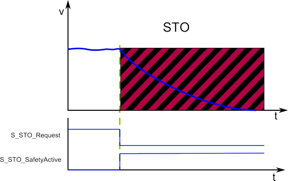

# STO - Safe Torque Off function

## General function description

The STO function is the most common and basic drive integrated safety-related function. If STO is activated, no more power, which can cause rotation or motion, is applied to the motor. The power stage of the drive will not provide any energy to the motor which can generate torque or force in case of a linear motor.

An active STO function results in a subsequent start-up/restart inhibit (see section below).

The STO function prevents an unintended start according to the standard EN 60204-1, section 5.4. With the designated STO function activated, the power stage of the drive is deactivated. The drive is then torque-free. This state is monitored internally in the drive.

## Requesting/monitoring by the safety-related FB/Safety Module

Immediately with the STO activation the drive is set torque-free and the axis then coasts down until speed is zero.

When requesting STO, the safety-related function is executed immediately. STO can be requested by switching the signal at input S\_STO\_Request to SAFEFALSE (if input Activate = TRUE) or via the hard-wired link (if Safety Module device parameter `HW_STO = Activated`). Refer to the section below.

The torque-free status of the drive is indicated by switching the function block output S\_STO\_SafetyActive to SAFETRUE.

After indicating the active STO function, the axis coasts down. Therefore, S\_STO\_SafetyActive = SAFETRUE does not necessarily imply the standstill of the axis. The coast down time depends on physical properties of the used components, such as weight, torque, friction, etc.

| WARNING | |
| --- | --- |
|  | **UNINTENDED EQUIPMENT OPERATION**   * Make certain that no hazards can arise for persons or material during the coast down period of the axis/machine. * Do not enter the zone of operation during the coast down period. * Ensure that no other persons can access the zone of operation during the coast down period. * Use appropriate safety interlocks where personnel and/or equipment hazards exist.   **Failure to follow these instructions can result in death, serious injury, or equipment damage.** |

## Application

As the STO function of the drive disables the power stage to the motor, it is suitable to be used in applications where the axis comes to a stop by itself in a sufficiently short time through its load torque or friction or when the "coast down" of the axis has no safety-related relevance.

**STO as general functional safe-state**: The STO function is defined as the default functional safe-state. Therefore, the STO function is the final fallback function of the other safety-related functions described in this documentation.

## How to implement the safety function

To implement this safety function in your safety-related application proceed as follows:

1. In Machine Expert 'Devices' window, insert a safety module for the drive used.
2. In Machine Expert – Safety, insert a Preventa Motion FB SF\_SafeMotionControl into the safety-related code and connect it accordingly.
3. In the Machine Expert – Safety 'Devices' window, mark the safety module in the devices tree and edit the `HW_STO_Config` parameter ('Basic' group ) in the safety-related device parameterization.

For details, refer to the parameter description of the [Lexium 62 LXM Safety Option Module](SoSafeHWModuleParameters_LXM62.html#SoSafeHWModuleParameters_LXM62__LXM62_Basic)/[Lexium 62 ILM Safety Option Module](SoSafeHWModuleParameters_ILM62.html#SoSafeHWModuleParameters_ILM62__ILM62_Basic).

EIO0000002265.07