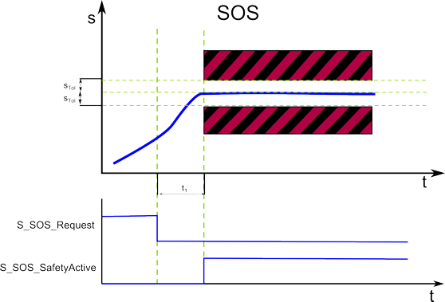

# SOS - Safe Operation Stop function

## General function description

The SOS function monitors the drive at standstill with active position control (performed by the standard (non-safety-related) controller) and position monitoring (performed by the Safety Module).

The SOS function prevents the motor from deviating more than a defined amount from the stopped position (device parameter `SOS_PositionTolerance[sTol]` (see below), shown as STol in the graphic below). The drive module provides energy to the motor to enable it to resist external forces.

## Monitoring by the safety-related FB/Safety Module

The request of the safety-related function occurs at the beginning of the  t1 time interval ('S\_SOS\_Request' signal in the diagram). t1 is set with the device parameter `SOS_StartDelayTime[t1].`

Within the t1 time interval, the standard (non-safety-related) controller also receives the request from the connected process and initiates the motion control function according to the logic and drive parameterization defined in the standard (non-safety-related) application.

After t1 has elapsed, position S0 is captured and SOS is monitored.

SOS performs a safe standstill monitoring. The position control remains in operation. Thus, the motor can deliver full torque to maintain the current position. The actual position will be monitored and must remain within the parameterized position tolerance values (STol).

If the parameterized STol values are not exceeded after t1, the function block switches S\_SOS\_SafetyActive to SAFETRUE.

## Fallback function

If the standstill monitoring detects that the position deviates more than the defined position tolerance from the standstill position (STol in the figure), the STO function is automatically executed as the fallback function.

## Application

SOS is useful for applications where machines for specific operations or parts of the machinery must stay at standstill where the drive must provide a holding torque. The method of the drive is to provide power to the motor to counter any torque applied from external forces.

## How to implement the safety function

To implement this safety function in your safety-related application proceed as follows:

1. In Machine Expert 'Devices' window, insert a safety module for the drive used.
2. In Machine Expert – Safety, insert a Preventa Motion FB SF\_SafeMotionControl into the safety-related code and connect it accordingly.
3. In the Machine Expert – Safety 'Devices' window, mark the safety module in the devices tree and edit the safety-related parameters in the 'Mechanic' group.

For details, refer to the parameter description of the [Lexium 62 LXM Safety Option Module](SoSafeHWModuleParameters_LXM62.html#SoSafeHWModuleParameters_LXM62__LXM62_Mechanic)/[Lexium 62 ILM Safety Option Module](SoSafeHWModuleParameters_ILM62.html#SoSafeHWModuleParameters_ILM62__ILM62_Mechanic).

EIO0000002265.07