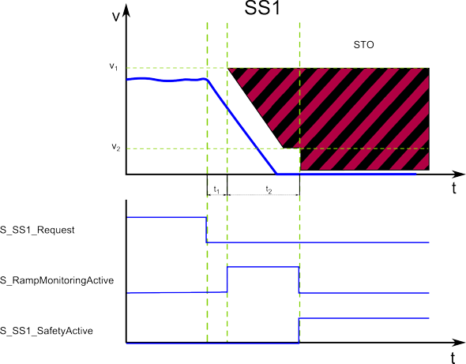

# SS1 - Safe Stop 1 function

## General function description

The Safe Stop 1 function causes a rapid and safe stopping of a drive. It controls the drive to decelerate autonomously and finally activates the drive-internal Safe Torque Off (STO) safety-related function. As a result, the drive remains torque-free and the motor is no longer supplied with power. (In contrast, the Safe Stop 2 function finally monitors the standstill (similar to the SOS function) instead of STO.)

The active STO function results in a subsequent start-up/restart inhibit (see section below).

SS1 realizes a functional safety-related stop in accordance with **stop category 1** according to EN 60204-1.

SS1 is the defined fallback function of the safety-related functions SLS1 to SLS4, SMS, SDIneg and SDIpos.

## Monitoring by the safety-related FB/Safety Module

The monitoring behavior by the function block depends on the parameterization of the Safety Module:

* If ramp monitoring is **deactivated**, monitoring is passive until the t2 time interval has elapsed (see figure and description below).
* If ramp monitoring is **activated**, the Safety Module monitors the motor deceleration rate specified by the deceleration ramp.

In both cases, the SS1 function stops the motor and then initiates the STO function to set the drive torque-free.

The request of the safety-related function occurs at the beginning of the  t1 time interval ('S\_SS1\_Request' signal in the diagram). t1 is set with the device parameter `SS1_StartDelayTime[t1].`

Within the t1 time interval, the standard (non-safety-related) controller also receives the request from the connected process and initiates the motion control function according to the logic and drive parameterization defined in the standard (non-safety-related) application.

After t1 has elapsed, the deceleration of the drive is executed. The maximum allowed duration t2 of this ramp-down phase is defined by the device parameter `SS1_RampMonitoringTime[t2]`.

At the end of t2, STO is activated.

During t2, the deceleration can be monitored by setting the device parameter `SS1_RampMonitoring = Activated.`

If ramp monitoring is **deactivated**, the deceleration curve is not monitored. Even acceleration is allowed during the t2 interval. Standstill is enforced when t2 elapses by engaging the STO function.

If ramp monitoring is **activated**, the deceleration curve is monitored and must follow the parameterized ramp (as shown in the figure). Otherwise, STO is activated as the defined fallback function.

If zero speed has been achieved while t2 has not yet elapsed, a defined **velocity tolerance** (parameter `SS1_MinRampVelocity[v2]`) of the axis is allowed and monitored in respect with v2.

If the torque-free status of the drive has been achieved by the correct execution of the SS1 function, the function block switches S\_SS1\_SafetyActive = SAFETRUE (see diagram).

Otherwise, if the STO fallback function has been activated due to an error detected as described above, this is indicated by S\_STO\_SafetyActive = SAFETRUE.

## Fallback function

If the parameterized `SS1_RampMonitoringTime[t2]` value is exceeded, or (in case of activated ramp monitoring) if the parameterized deceleration ramp is not respected as defined, or if the velocity tolerance (v2 in the figure) is exceeded, the STO function is automatically executed as the fallback function.

## Application

The SS1 function is used if a controlled deceleration of the drive with a following torque-free standstill state is required, e.g., after a safety-relevant event.

SS1 is suitable to bring a large flywheel mass as quickly as possible to a halt or to slow down and come to a standstill from high drive speeds as fast as possible. Typical examples are grinding spindles, centrifuges, storage and retrieval devices.

## Restart inhibit following SS1

After removing an SS1 function request by switching the S\_SS1\_Request input from SAFEFALSE to SAFETRUE, a restart inhibit is automatically activated to prevent the unintended restart of the axis. The restart inhibit is only removed if there is a positive signal edge at the Reset input of the safety-related function block.

**Background**: According to the relevant IEC 60204-1 standard, the SS1 function executes **stop category 1**. This stop category implies a subsequent restart inhibit.

## How to implement the safety function

To implement this safety function in your safety-related application proceed as follows:

1. In Machine Expert 'Devices' window, insert a safety module for the drive used.
2. In Machine Expert – Safety, insert a Preventa Motion FB SF\_SafeMotionControl into the safety-related code and connect it accordingly.
3. In the Machine Expert – Safety 'Devices' window, mark the safety module in the devices tree and edit the safety-related parameters in the 'Mechanic' group and in the 'SafeStop1' group.

For details, refer to the parameter description of the [Lexium 62 LXM Safety Option Module](SoSafeHWModuleParameters_LXM62.html#SoSafeHWModuleParameters_LXM62__LXM62_SS1)/[Lexium 62 ILM Safety Option Module](SoSafeHWModuleParameters_ILM62.html#SoSafeHWModuleParameters_ILM62__ILM62_SS1).

EIO0000002265.07