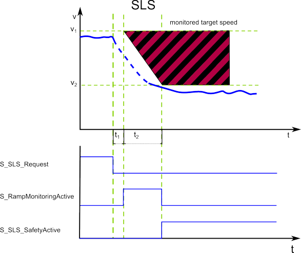

# SLS1 to SLS4 - four Safely Limited Speed functions

## General function description

A Safely Limited Speed function causes the controlled deceleration of a motor to a defined target speed. The drive is decelerated until a defined final limited speed has been achieved which is then monitored. SLS therefore prevents the motor to exceed the defined limited speed.

The function block provides **four separate** SLS monitoring functions: **SLS1 to SLS4**. They work identically but can be parameterized and requested independent of each other, thus enabling four different speeds to be monitored.

**NOTE:**

If several SLS functions are requested at the same time, SLS1 has the highest and SLS4 the lowest priority.

When requesting several SLS functions, you must parameterize the slowest target speed v2 for the SLS with the highest priority:

v2(SLS**1**) <= v2(SLS**2**) <= v2(SLS**3**) <= v2(SLS**4**)

Exception: any v2 value = 0 is ignored and does not result in an error.

Other configurations will be considered a configuration error and the module will not attain operational state.

Example: the following configuration is valid:

v2(SLS1) = 600, v2(SLS2) = 600, v2(SLS3) = 800 v2(SLS4) = 0

## Monitoring by the safety-related FB/Safety Module

The monitoring behavior by the function block depends on the parameterization of the Safety Module:

* If ramp monitoring is **deactivated**, monitoring is passive until the t2 time interval has elapsed (see figure and description below).
* If ramp monitoring is **activated**, the Safety Module monitors the motor deceleration rate specified by the deceleration ramp.

After the deceleration of the motor (controller by the standard controller), the SLS function then monitors the defined target speed (`SLS*_Speed[v2]`), thus preventing overspeeding.

The request of the safety-related function occurs at the beginning of the  t1 time interval ('S\_SLS\*\_Request' signal in the diagram). t1 is set with the device parameter `SLS*_StartDelayTime[t1].`

Within the t1 time interval, the standard (non-safety-related) controller also receives the request from the connected process and initiates the motion control function according to the logic and drive parameterization defined in the standard (non-safety-related) application.

After t1 has elapsed, the deceleration of the drive is executed. The maximum allowed duration t2 of this ramp-down phase is defined by the device parameter `SLS*_RampMonitoringTime[t2]`.

At the end of t2, the defined limited target speed `SLS*_Speed[v2]` must be achieved. Speed V2 is then monitored as long as SLS remains active.

During t2, the deceleration can be monitored by setting the device parameter `SLS*_RampMonitoring = Activated.`

If ramp monitoring is **deactivated**, the deceleration curve is not monitored. Even acceleration is allowed during the t2 interval. The target speed must be achieved before the elapse of t2.

If ramp monitoring is **activated**, the deceleration curve is monitored and must follow the parameterized ramp (as shown in the figure).

If the SLS targeted speed is successfully achieved, the function block switches S\_SLS\*\_SafetyActive = SAFETRUE (see diagram).

If the SS1 fallback function has been activated due to an error detected as described above, this is indicated by S\_SS1\_SafetyActive = SAFETRUE.

## Fallback function

Which function is activated as fallback depends on whether the ramp monitoring is activated or not.

If ramp monitoring is **deactivated**, the deceleration curve is not monitored. Even acceleration is allowed during the t2 interval. The target speed must be achieved before the elapse of t2. Otherwise, SS1 is activated as the defined fallback function.

If ramp monitoring is **activated**, the deceleration curve is monitored and must follow the parameterized ramp (as shown in the figure). Otherwise, STO is activated as the defined fallback function.

## Application

The SLS function is used when personnel has to access the zone of operation. With the help of the SLS function, the speed is first reduced and then safety-related speed monitoring is activated in order to prevent accidental exceeding of the parameterized speed limit.

By providing four separate SLS functions, the safety-related function could be, for example, extended in a way that several approaching zones could be defined: the closer a person comes to the zone of operation, the more the speed is reduced.

**NOTE:**

For information on the encoder resolution of the motor used, refer to the SH3/MH3 motor user manual which is part of the Machine Expert online help (Lexium SH3 Motor - Product Manual or Lexium MH3 Motor - Product Manual).

Determine the resolution as follows:

* Digit 10 in the type code of the motor indicates the implemented encoder system.
* Section "Type code" in chapter 1 of the motor manual provides information on the number of Sin/Cos periods per revolution.

Motor manual example

## How to implement the safety function

To implement this safety function in your safety-related application proceed as follows:

1. In Machine Expert 'Devices' window, insert a safety module for the drive used.
2. In Machine Expert – Safety, insert a Preventa Motion FB SF\_SafeMotionControl into the safety-related code and connect it accordingly.
3. In the Machine Expert – Safety 'Devices' window, mark the safety module in the devices tree and edit the safety-related parameters in the 'Mechanic' group and in the 'SafeLimitedSpeed' group.

For details, refer to the parameter description of the [Lexium 62 LXM Safety Option Module](SoSafeHWModuleParameters_LXM62.html#SoSafeHWModuleParameters_LXM62__LXM62_SLS)/[Lexium 62 ILM Safety Option Module](SoSafeHWModuleParameters_ILM62.html#SoSafeHWModuleParameters_ILM62__ILM62_SLS).

EIO0000002265.07