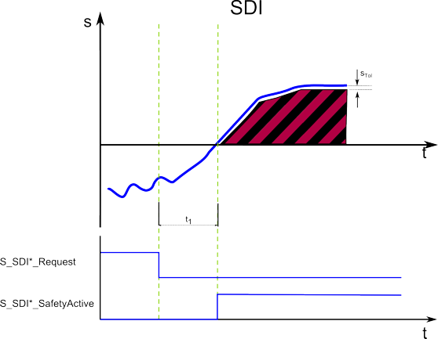

# SDIneg and SDIpos - Safe Direction Negative/Positive function

## General function description

The Safe Direction safety-related function ensures that rotation/movement is only possible in the permitted (parameterized) direction.

The function block distinguishes two rotation/movement directions by providing separate inputs for requesting the SDI Negative or SDI Positive monitoring function: **SDIneg and SDIpos**. Both SDI monitoring functions are configured using the same parameters but can be requested independent of each other.

**NOTE:**

In which physical rotation/movement direction SDIpos or SDIneg actually results, depends on your application.

**NOTE:**

If SDIpos and SDIneg are requested at the same time, the SS1 function is automatically executed as the defined fallback function.

The SDIneg/SDIpos function prevents the motor from rotating more than a defined amount into the incorrect direction (device parameter `SDI_PositionTolerance[sTol]`, see below).

## Monitoring by the safety-related FB/Safety Module

The request of the safety-related function occurs at the beginning of the  t1 time interval ('S\_SDI\*\_Request' signal in the diagram). t1 is set with the device parameter `SDI_StartDelayTime[t1].`

Within the t1 time interval, the standard (non-safety-related) controller also receives the request from the connected process and initiates the motion control function according to the logic and drive parameterization defined in the standard (non-safety-related) application.

After t1 has elapsed, the direction is monitored by capturing the actual position. Moving/rotating a certain distance against the allowed direction is permitted if it does not exceed the defined position tolerance STol.

If the SDI function is executed successfully, the function block switches S\_SDI\*\_SafetyActive = SAFETRUE (see diagram).

If the SS1 fallback function has been activated due to an error detected of the position tolerance as described below, this is indicated by S\_SS1\_SafetyActive = SAFETRUE.

## Fallback function

If the actual position moves more than the set position tolerance (parameter `SDI_PositionTolerance[sTol]`) into the wrong direction, the SS1 function is automatically executed as the fallback function.

## Application

The SDI function is used to ensure that rotation or movement is not possible towards a prohibited direction, e.g., when personnel accesses the zone of operation of a machine.

## How to implement the safety function

To implement this safety function in your safety-related application proceed as follows:

1. In Machine Expert 'Devices' window, insert a safety module for the drive used.
2. In Machine Expert – Safety, insert a Preventa Motion FB SF\_SafeMotionControl into the safety-related code and connect it accordingly.
3. In the Machine Expert – Safety 'Devices' window, mark the safety module in the devices tree and edit the safety-related parameters in the 'Mechanic' group and in the 'SafeDirection' group.

For details, refer to the parameter description of the [Lexium 62 LXM Safety Option Module](SoSafeHWModuleParameters_LXM62.html#SoSafeHWModuleParameters_LXM62__LXM62_SDI)/[Lexium 62 ILM Safety Option Module](SoSafeHWModuleParameters_ILM62.html#SoSafeHWModuleParameters_ILM62__ILM62_SDI).

EIO0000002265.07