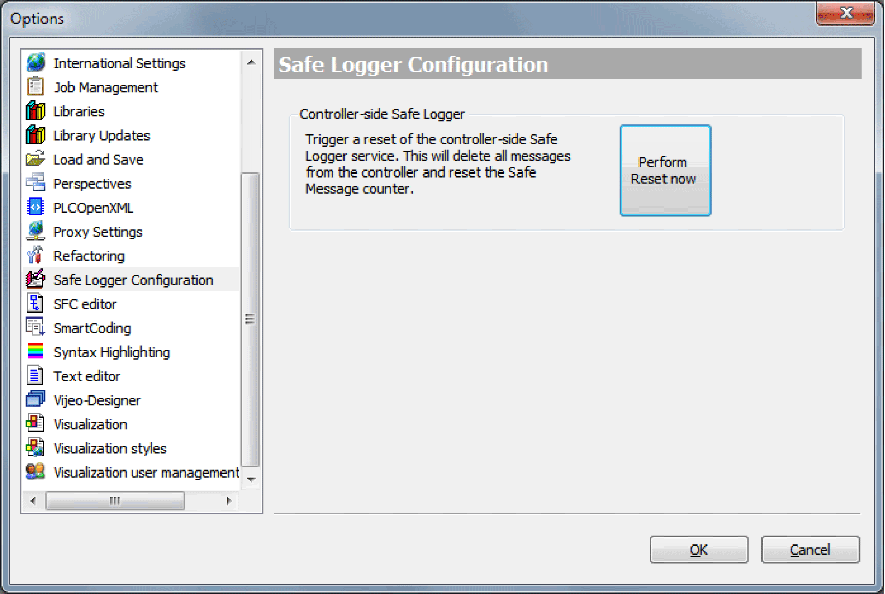

# Safe Logger Configuration

## Safe Logger Configuration

The Safe Logger Configuration allows you to reset the Safe Logger service on the SLC. Such a reset also deletes the messages from the SLC and restarts the message counter.

Opening the Safe Logger Configuration dialog box:

| Step | Action |
| --- | --- |
| 1 | In Machine Expert Logic Builder, click Tools  > Options  > Safe Logger Configuration. |

Deleting the messages and resetting the message counter:

| Step | Action |
| --- | --- |
| 1 | In the dialog box **Safe Logger Configuration**, click the button **Perform Reset now**. |

| NOTICE | |
| --- | --- |
|  | LOSS OF DATA  Ensure that you have reviewed all of the messages before deleting them and resetting the message counter.  Failure to follow these instructions can result in equipment damage. |

EIO0000002596.03