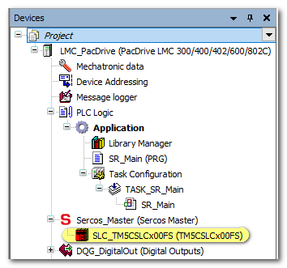
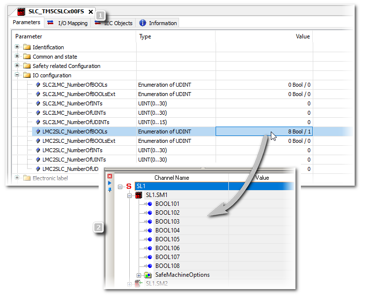
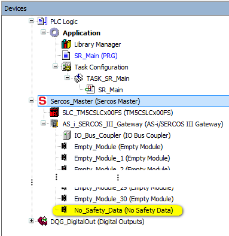
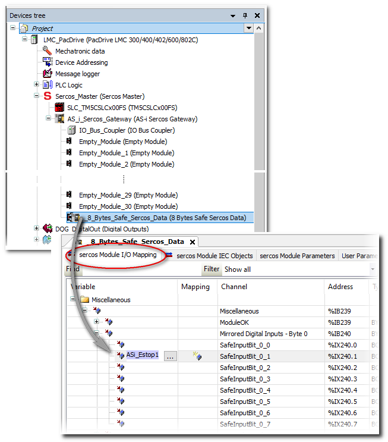
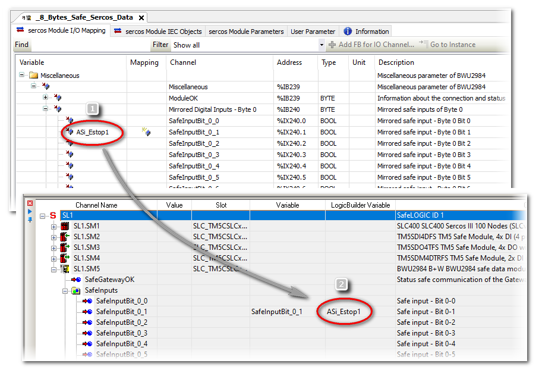

# Adding/Parameterizing ASi Gateways in EcoStruxure Machine Expert™

This topic describes how to add ASi Gateway devices to the bus structure in EcoStruxure Machine Expert™ and parameterize them.

The following applies to the '8 Bytes Safe Sercos Data' device object (that is to say, for the BWU2984 ASi-3 Gateway). For the ASi-5/ASi-3 Gateway with its '12 Bytes Safe Sercos Data' device object, other values for the device object size, bit numbers etc. apply accordingly.

It contains the following information:

* [Preparations](Gateway_SoMM_Parameterization.html#Gateway_SoMM_Parameterization__Gateway_SoMM_Preconditions)
* [Adding an ASi Gateway and inserting the '8 Bytes Safe Sercos Data' device object](Gateway_SoMM_Parameterization.html#Gateway_SoMM_Parameterization__Gateway_SoMM_AddDevice)
* [Parameterizing the ASi Gateways](Gateway_SoMM_Parameterization.html#Gateway_SoMM_Parameterization__Gateway_SoMM_Param)
* [Mapping ASi I/O safety-related data to standard (non-safety-related) variables (mirrored bits)](Gateway_SoMM_Parameterization.html#Gateway_SoMM_Parameterization__Gateway_SoMM_Mapping2Vars)
* [Download of parameterization data to the ASi Gateway](Gateway_SoMM_Parameterization.html#Gateway_SoMM_Parameterization__Gateway_SoMM_Download)

## Preparations for integrating the ASi Gateway

For the described integration procedure, the following should apply to your EcoStruxure Machine Expert™ application project:

* A Safety Logic Controller is already inserted in the Devices tree.

  Example:

  
* The IP addresses of LMC and SLC are set in the respective 'Parameters' editor (section 'General' for the LMC and section 'Identification' for the SLC).
* The value 'LMC2SLCNumberOfBOOLs' is set to '8 Bool / 1' in the 'IO Configuration' section of the SLC 'Parameters'. This value defines the non-safety-related communication between standard (non-safety-related) LMC controller and safety-related SLC. It defines the number of Boolean data items that are transferred between LMC and SLC. In EcoStruxure Machine Expert™ – Safety, each of these Boolean data items is available as standard input signal under the SLC node in the 'Devices' window.

  Example

  
* Communication between LMC and SLC via the Sercos bus has been successfully established.

## Adding an ASi Gateway and inserting the '8 Bytes Safe Sercos Data' device object

The following applies to the '8 Bytes Safe Sercos Data' device object (that is to say, for the BWU2984 ASi-3 Gateway). For the ASi-5/ASi-3 Gateway with its '12 Bytes Safe Sercos Data' device object, other values for the device object size, bit numbers etc. apply accordingly.

Assuming that the preparations mentioned (in [Preparations for integrating the ASi Gateway](Gateway_SoMM_Parameterization.html#Gateway_SoMM_Parameterization__Gateway_SoMM_Preconditions)) are done, proceed as follows:

1. **Add an ASi Gateway in EcoStruxure Machine Expert™.**

   1. In the 'Devices tree', right-click 'Sercos\_Master (Sercos Master)' and select 'Add Device...' from the contextual menu.

      (Alternative: use 'Insert device...'. Refer to the EcoStruxure Machine Expert™ online help for details.)
   2. In the 'Add Device' dialog box, select 'Bihl+Wiedemann' from the 'Vendor' drop-down list.

      Select the 'ASi/Sercos III Gateway'.

      (Select the correct device version. Select the 'Display all versions' checkbox, if necessary.)
   3. Click the 'Add Device' button to confirm the selection and insert the ASi Gateway device into the 'Devices tree'.

      Close the 'Add Device' dialog box.

   The ASi Gateway is now visible under the Sercos\_Master node in the tree like a usual Sercos bus device.

   The gateway node contains:

   * One slot referred to as 'No\_Safety\_Data' into which the '8 Bytes Safe Sercos Data' device object must be inserted. This device object represents the safety-related extension of the Bihl+Wiedemann system and is used in the PacDrive 3 system to access the input/output data bits read from/written to the ASi Gateway. See section ["ASi/Sercos Data Exchange..."](Gateway_Intro.html#Gateway_Intro__Gateway_IOMapping_Basics) for details.
   * 30 'EmptyModule' slots for inserting standard (non-safety-related) ASi devices. The 'Empty\_Module' slots are **not** for safety-related ASi devices. See step 5 in this procedure.

   Example:

   
2. **Insert the '8 Bytes Safe Sercos Data' device object**

   If you are using a ASi-5/ASi-3 Gateway, you have to plug in a '12 Bytes Safe Sercos Data' device object instead (as the gateway provides 96-bit I/O data).

   1. Right-click the 'No\_Safety\_Data' node and select 'Plug Device...' from the contextual menu.
   2. In the 'Plug Device' dialog box, select 'Bihl+Wiedemann GmbH' from the 'Vendor' drop-down list.

      Select the entry '8 Bytes Safe Sercos Data'.

      (Make sure that the correct device version is selected for insertion. Select the 'Display all versions' checkbox, if necessary.)
   3. Click the 'Plug Device' button to confirm the selection and insert the device object into the 'Devices tree'.

      Close the 'Plug Device' dialog box.

   The node is renamed to '8 Bytes Safe Sercos Data'. This device object is handled like a safety-related 64-bit I/O module, independently of what ASi data are mapped to it.

   **Result of the insertion of the '8 Bytes Safe Sercos Data' device object...**

   * ... in the EcoStruxure Machine Expert™ – Safety project: the ASi Gateway is integrated into the list of safety-related devices. The data bits provided by the device object are then available as safety-related input and output bits. These bits can be inserted into the safety-related application.
   * ... in the EcoStruxure Machine Expert™ project: these bits are available as **mirrored bits** of the safety-related data bits with read-only access. They are represented as 8\*8 bytes input data and 8\*8 bytes output data. By mapping these mirrored bits to standard (non-safety-related) variables in the standard application, the LMC is informed about the safety-related operations of the SLC and the ASi Gateway. See section ["Mapping ASi I/O safety-related data to standard (non-safety-related) variables (mirrored bits)"](Gateway_SoMM_Parameterization.html#Gateway_SoMM_Parameterization__Gateway_SoMM_Mapping2Vars) for an example.
3. Parameterize the ASi Gateway device and the '8 Bytes Safe Sercos Data' device object as described in the procedure below.
4. In EcoStruxure Machine Expert™, you can map the ASi input/output bits (mirrored bits) to standard (non-safety-related) variables as described below.
5. Optional: insert standard (non-safety-related) ASi I/Os or other device objects into the empty module slots. Refer to the section "[Integrating standard ASi devices](Gateway_SoMM_Parameterization.html#Gateway_SoMM_Parameterization__StandardSlaves)" for details.

   **NOTE:**

   **Do not use the communication telegram bits of safety-related devices in EcoStruxure Machine Expert™.**

   According to the ASi standard, ASi devices communicate using telegrams composed of 4 bits of user data. Safety-related ASi devices only use one data bit which is derived from the ASi telegram (4 bits) by means of a special, device-specific algorithm. This resulting (safety-related) data bit can be mapped to the '8 Bytes Safe Sercos Data' device object and is available as mirrored bit in the standard (non-safety-related) application.

   Nevertheless, the 4 bits of a safety-related device are visible in the I/O Mapping table in EcoStruxure Machine Expert™. Do not use these 4 telegram bits of safety-related ASi devices in the device I/O Mapping because none of these single bits represents the derived safety-related bit mentioned above. Instead, only use the data bit of the safety-related device which is available as mirrored bit in the '8 Bytes Safe Sercos Data' device object.

   | WARNING | |
   | --- | --- |
   |  | **UNINTENDED EQUIPMENT OPERATION**  Do not use the 4 bits of the safety-related communication telegram for any other purposes in your application.  **Failure to follow these instructions can result in death, serious injury or equipment damage.** |

## Parameterizing the ASi Gateways

**NOTE:**

Observe the notes given in section ["Notes on distributed automation systems"](Gateway_Intro.html#Gateway_Intro__GatewayIntro_NotesDistributedSystem) when parameterizing the ASi devices.

Set the Sercos parameters of the ASi Gateway as follows:

1. In the EcoStruxure Machine Expert™ 'Devices tree', double-click the ASi Gateway device to be parameterized.

   The editors of the device are opened in the editors area.
2. Click the 'Sercos III Parameters' editor.
3. Expand the structure in the editor grid and locate the parameters to be set.
4. Double-click into a 'Value' field to be edited and enter a value or, if applicable, select one after clicking the browse button '...'.

Sercos parameters of the ASi Gateway:

Parameter section 'Identification'

| Parameter | Meaning | Default | Data type |
| --- | --- | --- | --- |
| Parameter section 'Identification' | | | |
| WorkingMode | Sets the working mode of the device.  Traceable: yes.  Possible values:   * virtual / 0: device is operated virtually. * real / 1: device is being searched for in the Sercos network. If the device is found, it is used. Otherwise, a diagnostic message is output and Sercos phase up is not possible. * deactivated / 2: deactivated devices can remain in the controller configuration like virtual devices, although they do not physically exist. In contrast to virtual devices, deactivated devices are not simulated in cyclical real-time processing. This may reduce processing time, thus allowing you to enter a larger total of unused devices in the controller configuration. * optional / 3: device is being searched for in the Sercos network. If the device is found, it is used. Otherwise, the device is operated in working mode 'virtual / 0'. | virtual / 0 | DINT Enumeration |
| IdentificationMode | Displays the identification mode, that is to say, which criterion is used to automatically assign a Sercos device to an object in the LMC Configuration.  Traceable: yes.  Possible values:   * SerialNumberController / 0: device is assigned using the serial number of the controller (see parameter SerialNumber). * SerialNumberMotor / 1: device is assigned using the serial number of the motor (see parameter SerialMotorNumber). * TopologyAddress / 2 (default): device is assigned via its topological address (see parameter TopologyAddress). * ApplicationType / 3: device is assigned via the ApplicationType (see parameter ApplicationType). * SercosAddress / 4: device is assigned via the Sercos address (see parameter SercosAddress). | TopologyAddress / 2 | DINT Enumeration |
| ConfiguredSercosAddress | Displays the configured Sercos address of the device.  Traceable: yes. | 100 | UINT |
| ConfiguredSerialNumber | Displays the configured serial number of the device. | (empty) | STRING(80) |
| IPConfigMode | Defines whether Sercos devices are to be configured manually or automatically.  Traceable: yes.  Possible values:   * Automatic IP addressing / 0: the device settings are done automatically. The automatically generated configuration is displayed in IPAddress, Subnetmask, and Gateway.  Access type: read/write * Manual IP addressing (hardware) / 1: the settings are read from the device and displayed in IPAddress, Subnetmask, and Gateway. The settings must be done on the hardware (for example, using switches) or via the drive assistant.  Access type: read/write * Manual IP addressing (software) / 2: the settings IPAddress, Subnetmask, and Gateway are transferred to the device.  Access type: read/write | Automatic IP addressing / 0 | DINT Enumeration |
| IPAddress | Specifies the IP address of the ASi Gateway.  Traceable: yes. | 172.20.0.3 | STRING(15) |
| Subnetmask | Defines the subnet mask of the device.  Can only be set if: IPConfigMode = manual IP addressing (software) / 2.  Access type: read/write  Traceable: no.  While the value for this parameter is being entered, the parameter is verified for the following:   * Format `[a1].[a2].[a3].[a4]` * The subnet mask consists of exactly 2 parts from a binary point of view: `[t1][t2]`, with `[t1]` consisting of binary ones and `[t2]` of binary zeros. For example, 255.255.245.0 is not permitted, since the third digit (245) is `1111 0101` in binary, that is to say, the first zero on the left is followed by more ones. * The entered value is not `255.255.255.255`. | 255.255.252.0 | STRING(15) |
| Gateway | Defines the gateway of the device.  Can only be set if: IPConfigMode = manual IP addressing (software) / 2.  Access type: read/write  Traceable: no.  While the value for this parameter is being entered, the parameter is verified for the following:   * Format `[a1].[a2].[a3].[a4]` * Is the first position (`[a1]`) greater 0 and unequal 127? (`127.x.x.x` would be the local host)  During the setting of the configuration, the following is verified for this parameter:   * Is the gateway within the network specified by NetID? (is only verified if IPConfigMode = manual IP addressing (hardware) / 1 or manual IP addressing (software) / 2) | 172.20.0.1 | STRING(15) |
| Section 'Common and state' | | | |
| ProducerCycleTime | Displays the cycle time in ns at which the cyclic data of a Sercos device are compared to the terminal. This parameter is taken over during Sercos start-up. This parameter must be an integer multiple of the Sercos cycle time for Sercos I/O devices.  Example:  ProducerCycleTime = 1000000 ns  Sercos III.CycleTime = 4000000 ns  Used ProducerCycleTime during start-up: 4000000 ns  If a value which is not supported by the Sercos device is entered, error 8508 "Sercos run-up not possible" occurs with the ExtDiagMsg "C\_Time=20000" | 1000000 [ns] | DINT |
| Section 'System internals' | | | |
|  | System internals are parameters that are reserved and must not be used by the application or accessed during configuration. |  |  |

| WARNING | |
| --- | --- |
|  | **UNINTENDED EQUIPMENT OPERATION**  Do not use nor modify System internal parameters.  **Failure to follow these instructions can result in death, serious injury, or equipment damage.** |

Then, parameterize the device object '8 Bytes Safe Sercos Data' as follows:

1. In the EcoStruxure Machine Expert™ 'Devices tree', double-click the '8 Bytes Safe Sercos Data' device object.

   The editors of the device are opened in the editors area.
2. Click the 'Sercos Module I/O Mapping' editor.
3. Expand the byte structure in the editor grid and locate the mirrored bit to be mapped.
4. Double-click into the grid field (in the 'Mapping' column) and enter a variable name or select an already declared variable with the browse button '...'.

Sercos parameters of the '8 Bytes Safe Sercos Data' device object:

Both parameters are located in the 'Safety-related Configuration' section of the 'sercos Module Parameters' tab.

| Parameter | Meaning | Default | Data type |
| --- | --- | --- | --- |
| SafeLogicID | Unique number of the SLC (Safety Logic Controller) | 1 | WORD |
| SafeModuleID | Unique number of the safety-related module | 2 | WORD |

## Mapping ASi I/O safety-related data to standard (non-safety-related) variables (mirrored bits)

The following applies to the '8 Bytes Safe Sercos Data' device object (that is to say, for the BWU2984 ASi-3 Gateway). For the ASi-5/ASi-3 Gateway with its '12 Bytes Safe Sercos Data' device object, other values for the device object size, bit numbers etc. apply accordingly.

After having inserted the '8 Bytes Safe Sercos Data' device object, **mirrored bits** of the safety-related data bits are available in the standard (non-safety-related) application. By mapping these mirrored bits to standard variables in the standard application in EcoStruxure Machine Expert™, the LMC is informed about the safety-related operations of the SLC and the ASi Gateway. In EcoStruxure Machine Expert™, these mirrored bits of ASi data are organized as 8\*8 bytes input data and 8\*8 bytes output data (unlike to the representation in EcoStruxure Machine Expert™ – Safety, where the bits are grouped as input and output bits).

Proceed as follows:

1. In the EcoStruxure Machine Expert™ 'Devices tree', double-click the '8 Bytes Safe Sercos Data' device object.

   The editors of the device are opened in the editors area.
2. Click the 'sercos Module I/O Mapping' editor.
3. Expand the byte structure in the editor grid and locate the mirrored bit to be mapped.
4. Double-click into the grid field (in the 'Mapping' column) and enter a variable name or select an already declared variable with the browse button '...'.

Example for a ASi Gateway BWU2984

**Further Information:**

Further information on mapping I/O data can be found in the EcoStruxure Machine Expert™ online help.

After mapping an input/output bit to a Boolean variable in EcoStruxure Machine Expert™, the safety-related project is updated accordingly by entering the name of the mapped variable in the column 'LogicBuilder Variable' in EcoStruxure Machine Expert™ – Safety. See topic ["Reading and Writing to ASi I/O Devices in EcoStruxure Machine Expert™ – Safety"](Gateway_ProcessData_SoSafe.html#Gateway_ProcessData_SoSafe).

Example for a ASi Gateway BWU2984

EcoStruxure Machine Expert™: in the 'sercos Module I/O Mapping' editor of the '8 Bytes Safe Sercos Data' device object, the variable 'ASi\_Estop1' is mapped to the input bit 0-1 (number (1) in the figure below).

In EcoStruxure Machine Expert™ – Safety: the 'ASi\_Estop1' variable is visible in the 'LogicBuilder Variable' column in the 'Devices' window (number (2) in the figure below). In this example, input bit 0-1 is already used in the safety-related application under the variable name 'SafeInputBit\_0\_1'. This variable name has automatically been created when dragging the bit into the safety-related application.

## Optional: integrating standard ASi devices

Standard (non-safety-related) devices connected to the ASi field bus can be inserted into the 'EmptyModule' slots under the ASi Gateway. This way, their process data can be accessed in the non-safety-related LMC application. These standard slots/devices are not relevant for the safety-related aspect covered by this documentation. Therefore, their use is not part of this documentation.

1. To insert standard devices into the empty modules slot, proceed in the same way as for inserting the safety-related device object. See section "[Adding an ASi Gateway and inserting the '8 Bytes Safe Sercos Data' device object](Gateway_SoMM_Parameterization.html#Gateway_SoMM_Parameterization__Gateway_SoMM_AddDevice)" for details.
2. To parameterize an inserted standard ASi device, double-click its tree node in the 'Devices tree' and select the desired editor.
3. To map the I/O data of a standard ASi device:

   1. In the EcoStruxure Machine Expert™ 'Devices tree', double-click the device to edited. The editors of the device are opened in the editors area.
   2. Click the 'sercos Module I/O Mapping' editor.
   3. Expand the data structure in the editor grid and locate the signal to be mapped.
   4. Double-click into the grid field (in the 'Mapping' column) and enter a variable name or select an already declared variable with the browse button '...'.

**Further Information:**

Refer to the EcoStruxure Machine Expert™ online help for details how to insert, parameterize, and use standard I/O devices. Information on the ASi standard I/Os can be found in the related documentation provided by Bihl+Wiedemann.

**NOTE:**

If standard ASi devices are inserted into the 'EmptyModule' slots under the gateway node, this does not reduce the size of the '8 Bytes Safe Sercos Data' device object. This device object has always the length of 64 bits, independently of the number of bits which are used by safety-related devices. However, after connecting standard devices to the ASi bus, some of the 64 safety-related data bits in the device object may be unused. Refer to the project documentation of your ASi application (ASIMON360 project) to determine which safety-related data bits are actually used.

## Download of parameterization data to the ASi Gateway

After having inserted and parameterized the ASi Gateway as described above, the related data are part of the EcoStruxure Machine Expert™ project. Therefore, they are included into the usual project download and then transferred from the LMC to the ASi Gateway; no separate download to the ASi Gateway is required.

The ASi application configuration developed using ASIMON360 has to be commissioned separately as described in the ASIMON360 user documentation.

Observe the following safety notes before commissioning the system including the coupled ASi field bus:

| WARNING | |
| --- | --- |
|  | **UNINTENDED EQUIPMENT OPERATION**   * Verify the interaction between the applications programmed for the ASi Gateway (with its connected I/O devices) and the PacDrive 3 application (LMC and SLC programs). * Verify the mapping of ASi I/O data to the '8 Bytes Safe Sercos Data' device object and the use of ASi input/output data bits in the safety-related SLC application. * Verify that the safety response time of the entire system includes the response time specific to the ASi Gateway with its connected ASi I/Os. * Be sure that the functional testing you perform comprises the entire system including the ASi Gateway and I/O devices, and corresponds to your risk analysis, and considers each possible operating mode and scenario the safety-related application should cover. * Observe the local regulations given by relevant sector standards for the distributed automation system. * Use appropriate safety interlocks where personnel and/or equipment hazards exist.   **Failure to follow these instructions can result in death, serious injury, or equipment damage.** |

EIO0000002594.02