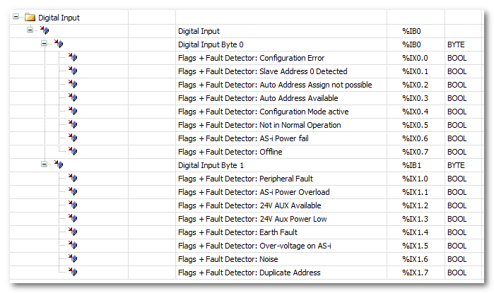
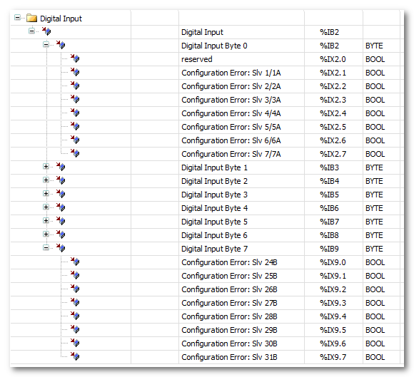

# ASi Gateway Diagnostics

The ASi Gateway provides diagnostic bits which can be read and evaluated in the standard EcoStruxure Machine Expert™ application.

These diagnostic bits are separately available for gateway circuit 1 and circuit 2 and can be included into the cyclic SERCOS communication channel. This is done by inserting special device objects into the ASi Gateway device in the EcoStruxure Machine Expert™ Devices tree.

## Available device objects for diagnostics

The following device objects are available:

'C1: Flags and Fault Detector' device objects provides channel-related diagnostic bits.

'C1: Delta List (List of Configuration Errors)' device object provides diagnostic bits for detecting configuration errors of ASi devices.

## How to include and use the device objects with diagnostic bits in EcoStruxure Machine Expert™

The following steps are done in the 'Devices' window in EcoStruxure Machine Expert™ under the ASi Gateway node.

1. Right-click an 'Empty\_Module' node and select 'Plug Device...' from the contextual menu.
2. In the 'Plug Device' dialog box, select 'Bihl+Wiedemann GmbH' from the 'Vendor' drop-down list.

   Select the desired diagnostic device object to be inserted: 'C1: Flags and Fault Detector' or 'C1: Delta List (List of Configuration Errors)'.

   (Make sure that the correct device version is selected for insertion. Select the 'Display all versions' checkbox, if necessary.)
3. Click the 'Plug Device' button to confirm the selection and insert the device object into the 'Devices tree'. The node is renamed accordingly.
4. Repeat the steps 1 to 3 to insert further diagnostic device objects, then close the 'Plug Device' dialog box.
5. Double-click the newly inserted device object to open its properties in the parameter editor on the right.
6. Map the diagnostic bits provided by the device object in your application.

   1. Click the 'sercos Module I/O Mapping' editor.
   2. Expand the byte structure in the editor grid and locate the diagnostic bit to be mapped.
   3. Double-click into the grid field (in the 'Mapping' column) and enter a variable name or select an already declared variable with the browse button '...'.

EIO0000002594.02