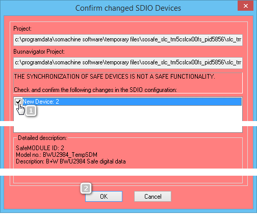
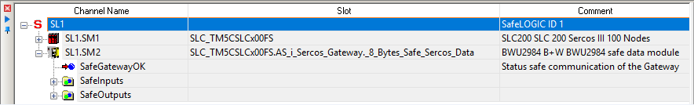
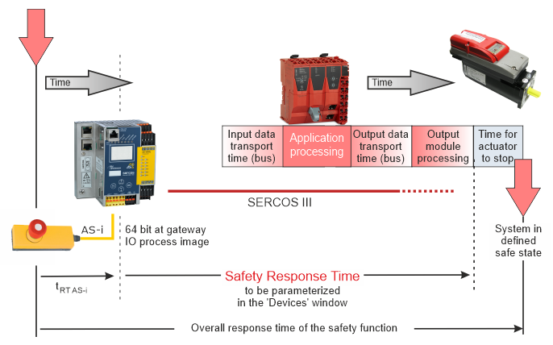
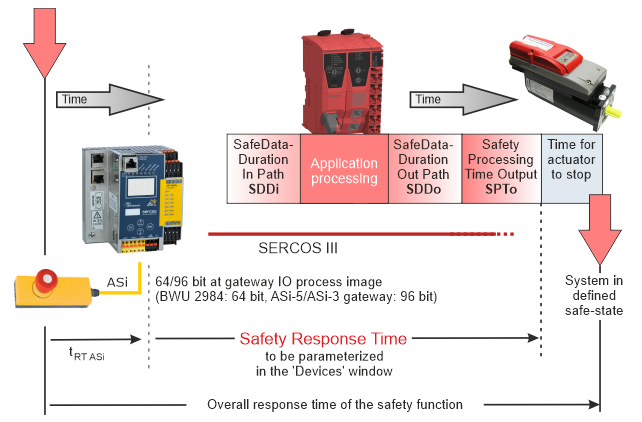

# Parameterizing ASi Gateways in EcoStruxure Machine Expert™ – Safety

This topic describes the ASi Gateway-related settings to be made in EcoStruxure Machine Expert™ – Safety. It contains the following information:

* [Confirming added ASi Gateways](Gateway_Params_SoSafe.html#Gateway_Params_SoSafe__Gateway_SoSafe_ConfirmDevice) in EcoStruxure Machine Expert™ – Safety
* [How to parameterize an ASi Gateway in EcoStruxure Machine Expert™ – Safety](Gateway_Params_SoSafe.html#Gateway_Params_SoSafe__Gateway_SoSafe_ParamProc)
* [Parameter group: Basic](Gateway_Params_SoSafe.html#Gateway_Params_SoSafe__Gateway_SoSafe_BasicParams)
* [Safety response time - general information](Gateway_Params_SoSafe.html#Gateway_Params_SoSafe__Gateway_SRT_General)
* [Parameter group: SafetyResponseTime (only valid with SLCv1)](Gateway_Params_SoSafe.html#Gateway_Params_SoSafe__Gateway_SoSafe_SRTParams)
* [Parameter group: SafetyResponseTime (only valid with SLCv2)](Gateway_Params_SoSafe.html#Gateway_Params_SoSafe__Gateway_SLCv2_SRTParams)
* [Parameter group: SafetyConfiguration](Gateway_Params_SoSafe.html#Gateway_Params_SoSafe__Gateway_SoSafe_BWParams)

**NOTE:**

Observe the notes given in section ["Notes on distributed automation systems"](Gateway_Intro.html#Gateway_Intro__GatewayIntro_NotesDistributedSystem) when parameterizing ASi Gateway devices.

## Confirming added ASi Gateways in EcoStruxure Machine Expert™ – Safety

**Further Information:**

**Term definition**: In the following, the term 'x Bytes Safe Sercos Data' designates both, the 8 and 12 bytes object, depending on the gateway type. (x = 8 for the BWU2984 and x = 12 for the ASi-5/ASi-3 Gateway.)

After having added an ASi Gateway to the bus structure in EcoStruxure Machine Expert™ and inserting the 'x Bytes Safe Sercos Data' device object, the ASi Gateway is automatically integrated into the safety-related project. When opening the safety-related project, the list of safety-related devices is synchronized between EcoStruxure Machine Expert™ and EcoStruxure Machine Expert™ – Safety. This device synchronization is repeated cyclically as long as the project remains open in EcoStruxure Machine Expert™ – Safety. When inserting safety-related ASi Gateways, this insertion must be manually confirmed in EcoStruxure Machine Expert™ – Safety.

Proceed as follows:

1. In EcoStruxure Machine Expert™, start EcoStruxure Machine Expert™ – Safety by right-clicking the Safety Logic Controller icon in the 'Devices tree', and selecting 'Machine Expert – Safety > Edit project [ LMC PacDrive > SLC\_TM5CSLCx00FS ]' from the context menu.
2. Login to EcoStruxure Machine Expert™ – Safety at development access level (or define a new password).
3. The 'Confirm changed SDIO Devices' dialog box appears.

   Confirm each inserted ASi Gateway by selecting the corresponding checkbox and then confirm the dialog box with 'OK'. (See numbers (1) and (2) in the following example.)

   If you reject the modifications in the device list by clicking 'Cancel', EcoStruxure Machine Expert™ – Safety is closed.

   Example

   

   After the confirmation, the added ASi Gateways appear as Safety Logic Controller subslots in the EcoStruxure Machine Expert™ – Safety Devices tree ('Devices' window).

   Example: ASi Gateway with device ID SL1.SM2

   
4. Parameterize the ASi Gateway device(s) as described in the following section.

**Further Information:**

How to insert the input and output bits provided by the 'x Bytes Safe Sercos Data' device object into the safety-related code (thus reading the ASi device status and writing their outputs) is described in the topic ["Evaluating and Writing to ASi I/O Devices in EcoStruxure Machine Expert™ – Safety"](Gateway_ProcessData_SoSafe.html#Gateway_ProcessData_SoSafe)

## How to parameterize an ASi Gateway in EcoStruxure Machine Expert™ – Safety

You set up a highly distributed system which consists of an ASi application executed by the ASi Gateway, a standard (non-safety-related) LMC (PacDrive3) application, and a safety-related SLC application. Keep in mind that the extension of your safety-related application by the ASi field bus level may influence the function, performance, and overall response time of your system application. There is no superordinate, controller-spanning verification instance (or compiler) that verifies whether the various logics (Gateway, LMC, SLC) in the distributed controller application interact correctly.

The overall response time of the safety function has to be inspected and verified precisely as the integration of the ASi field bus with connected ASi devices extends the overall response time.

| WARNING | |
| --- | --- |
|  | **UNINTENDED EQUIPMENT OPERATION**   * Verify that the safety-related parameters correspond to your risk analysis and consider each possible operating mode and scenario the safety-related application should cover. * Verify that the overall response time of the safety function includes the response time specific to the ASi Gateway with its connected ASi I/Os. * Validate the overall safety function with regard to the resulting overall response time and thoroughly test the application.   **Failure to follow these instructions can result in death, serious injury, or equipment damage.** |

**NOTE:**

The Safety Logic Controller does not recognize the ASi I/O devices connected to the ASi field bus. It only communicates with the ASi Gateway as a Sercos subscriber. Therefore, the safety-related parameters to be set in EcoStruxure Machine Expert™ – Safety only relate to the functionality of the ASi Gateway as a Sercos bus device. The ASi I/Os cannot be parameterized in EcoStruxure Machine Expert™ – Safety.

1. In the Devices tree ('Devices' window), left-click the ASi Gateway to be parameterized. The parameters are now visible in the Device Parameterization editor on the right of the Devices tree in the 'Devices' window.
2. Set the parameters in the groups 'Basic', 'SafetyResponseTime', and 'SafetyConfiguration'. These parameters are described in the sections below.

## Parameter group: Basic

Parameter: MinRequiredFWRev

|  |  |
| --- | --- |
| Default value | Basic Release |
| Unit | -/- |
| Description | This parameter is only relevant in case of implementing other firmware versions than the manufacturer-loaded version.  To enter the operational state, the firmware version parameterized here or a newer version must be installed on the module.  The entry 'Test Version' identifies a device firmware version which is not yet released. A safety-related application cannot get approval if devices with a firmware test version are involved. |

Parameter: Optional

|  |  |
| --- | --- |
| Default value | No |
| Unit | -/- |
| Description | The module can be configured as optional using this parameter. Optional modules do not have to be available (physically present or communicative), that is to say, if an optional module is unavailable, this is not signaled by the Safety Logic Controller.  This parameter does not influence the module signal or status data. |
| Possible values | * No: This module is not optional.  This module has to go to Operational mode after start-up and safety-related communication to the Safety Logic Controller has to be established successfully (indicated by SafeModulOK = SAFETRUE). Processing of the safety-related application on the Safety Logic Controller is delayed after start-up until this state is achieved for the modules set to 'Optional = No'.  After start-up, errors detected on such safety-related modules are indicated by a fast flashing MXCHG LED on the Safety Logic Controller. Furthermore, an entry is made in the logbook. * Yes: This module is optional, that is to say, not necessary for the safety-related application.  This module is not taken into consideration during start-up, which means that the safety-related application is started even if the modules with 'Optional = Yes' are not in Operational mode or if safety-related communication is unsuccessful.  After start-up, errors detected on such safety-related modules are NOT indicated on the Safety Logic Controller. NO entry is made in the logbook. * Start-up: This module is optional, decisions regarding its further behavior are made during start-up:  If, during start-up, it is determined that the module is physically present (even if it is not in Operational mode), then the module behaves as if 'Optional = No' was set.  If, during start-up, it is determined that the module is not physically present, the module behaves as if 'Optional = Yes' was set. |

The Optional parameter is a mechanism to scale your safety-related system for various configurations of your machine design. However, it may be the case that the module(s) that you have designated as optional may be required in some of your alternate machine configurations.

| WARNING | |
| --- | --- |
|  | **UNINTENDED EQUIPMENT OPERATION**  Verify by means of functional tests that those modules that have the Optional parameter set to 'Yes' or 'Start-up' are available if and when required in alternate machine configurations.  **Failure to follow these instructions can result in death, serious injury, or equipment damage.** |

## Safety response time - general information

The safety response time is the time between the arrival of the sensor signal on the input channel of a safety-related input module and the shut-off signal at the output channel of a safety-related module.

The response time calculated in EcoStruxure Machine Expert™ – Safety does **not** include response time specific to the ASi Gateway with its connected ASi I/Os. It only considers the response time of the PacDrive 3 system until the transfer of the I/O image within the ASi Gateway.

This means that by integrating an ASi Gateway with connected ASi devices, the overall response time of the safety function is extended.

The parameters relevant for the Safety Response Time differ depending on the controller/device generation (SLCv1 and SLCv2).

**NOTE:**

Which device generation (selected in EcoStruxure Machine Expert™) you are configuring is displayed at the end of the short device description above the parameter grid (while the corresponding device is selected in the tree on the left).

Details on the Safety Response Time calculation and the difference between the SLC generations are described in the EcoStruxure Machine Expert - Safety - User Guide. There, a separate chapter is provided for each device generation:

* Safety Response Time for SLCv1
* Safety Response Time for SLCv2

In the 'Response Time Calculator' dialog box in EcoStruxure Machine Expert™ – Safety ('Project > Response time calculator' menu item), this is indicated as follows: after selecting an ASi Gateway (third-party device) as input or/and output module, a message appears in the dialog box informing you that the response times of the ASi Gateway and the connected ASi devices have to be **added manually** to the calculated response time in order to determine the overall response time of the safety function.

This ASi specific response time is referred to as tRT ASi in the following figure. tRT ASi must include the ASi bus cycle time, transfer times between Sercos and ASi bus, processing time in sensor, and application processing in ASi Gateway (depending on your application).

**Further Information:**

Refer to the documentation provided by Bihl+Wiedemann for details regarding the calculation and determination of ASi specific response times.

Safety response time for a safety-related system with an **SLCv1** generation device

Safety response time for a safety-related system with an **SLCv2** generation device

| WARNING | |
| --- | --- |
|  | **UNINTENDED EQUIPMENT OPERATION**   * Verify that the overall response time of the safety function includes the response time specific to the ASi Gateway with its connected ASi I/Os. * Validate the overall safety function with regard to the resulting overall response time and thoroughly test the application.   **Failure to follow these instructions can result in death, serious injury, or equipment damage.** |

## Parameter group: SafetyResponseTime (only valid with SLCv1)

**NOTE:**

This section applies to a safety-related system with an SLCv1 generation device (SLC100 or SLC200). Which device generation is configured in your project is visible at the end of the short device description above the parameter grid (while the device is selected in the tree on the left).

The parameters in this group influence the safety response time of the Safety Logic Controller system.

The parameters CommunicationWatchdog, MinDataTransportTime, and MaxDataTransportTime in this group are only applied to the module if ManualConfiguration is set to 'Yes'.

Parameter: ManualConfiguration

|  |  |
| --- | --- |
| Default value | No |
| Unit | -/- |
| Description | Specifies whether the module uses its safety response time-relevant parameters (CommunicationWatchdog, MinDataTransportTime, and MaxDataTransportTime) or the values specified in the 'SafetyResponseTimeDefaults' parameter group of the Safety Logic Controller.  Managing parameters per module can optimize the system to application-specific requirements regarding the safety response time. |
| Parameter value | * No: The module inherits the CommunicationWatchdog, MinDataTransportTime, and MaxDataTransportTime values from the 'SafetyResponseTimeDefaults' parameter group of the Safety Logic Controller. * Yes: The module uses its own parameter values. |

Parameter: MinDataTransportTime

|  |  |
| --- | --- |
| Default value | 12 |
| Unit | 100 µs |
| Description | Defines the **minimum** time that is required to transmit a data telegram from a producer to a consumer. If a telegram is received **earlier** (by the consumer) than specified by this parameter value, communication is considered as invalid.  EcoStruxure Machine Expert™ – Safety provides a calculator dialog box to determine this parameter value.  Term definition and background information  According to the openSAFETY specification, devices (safety-related I/O modules as well as the Safety Logic Controller) communicate by sending and receiving cyclic data, referred to as openSAFETY telegrams. A telegram generating (sending) device is designated as producer, a receiving device is a consumer.  Each telegram includes a time stamp for time validation of the communication. On receipt of a telegram, the consumer compares this time stamp with the current time. If the schedule is kept, the communication is considered as valid.  If a telegram is received earlier than defined by this parameter, communication is considered as invalid and is not further processed. The 'SafeModuleOK' process data item also becomes SAFEFALSE indicating that the safety-related communication of the module is no longer valid. The implications for the rest of the safety-related systems depend on the defined safety-related function. |
| Value calculation | How to calculate the module-specific MinDataTransportTime value  1. Select 'Project > Response Time Relevant Parameters'. 2. In the appearing dialog box, open the 'Manual' tab. 3. Section 'Variable Parameters':  If a differing Sercos III cycle time than set in EcoStruxure Machine Expert™ is used to calculate the MinDataTransportTime (for example, to take cycle time modifications by the application program into account), activate 'Make Selectable' and select or enter the desired 'Sercos III Cycle Time'.  The 'Ring/Double Line' checkbox only influences the MaxDataTransportTime value. The 'Ring/Double Line' checkbox does not influence the MinDataTransportTime value.  An entered 'Network Package Loss' does not influence the MinDataTransportTime but only the CommunicationWatchdog value.  The 'System Parameters' section is read-only and displays system/module properties set in EcoStruxure Machine Expert™. When modifying these parameters while the dialog box is open, the values are updated automatically without closing the calculator dialog box. 4. The calculated module-specific MinDataTransportTime value is displayed in the 'Result' section.  Note the resulting value and enter the value for the MinDataTransportTime parameter in the module parameter grid. |
| Practical values | Entering the MinDataTransportTime value calculated in EcoStruxure Machine Expert™ – Safety helps building a stable running system.  Permissible value range: 12-500 |

Parameter: MaxDataTransportTime

|  |  |
| --- | --- |
| Default value | 250 |
| Unit | 100 µs |
| Description | Defines the **maximum** time that is allowed to transmit a data telegram from a producer to a consumer. If a telegram is received **later** (by the consumer) than specified by this parameter value, communication is considered as invalid.  EcoStruxure Machine Expert™ – Safety provides a calculator dialog box to determine this parameter value.  **NOTE:**  The parameter value influences the safety response time calculated by EcoStruxure Machine Expert™ – Safety.  Term definition and background information  According to the openSAFETY specification, devices (safety-related I/O modules as well as the Safety Logic Controller) communicate by sending and receiving cyclic data, referred to as openSAFETY telegrams. A telegram generating (sending) device is designated as producer, a receiving device is a consumer.  Each telegram includes a time stamp for time validation of the communication. On receipt of a telegram, the consumer compares this time stamp with the current time. If the schedule is kept, the communication is considered as valid.  If a telegram is received later than defined by this parameter, communication is considered as invalid and is not further processed. The implications for the rest of the safety-related systems depend on the defined safety-related function. |
| Value calculation | How to calculate the module-specific MaxDataTransportTime value  1. Select 'Project > Response Time Relevant Parameters'. 2. In the appearing dialog box, open the 'Manual' tab. 3. Section 'Variable Parameters':  If a differing Sercos III cycle time than set in EcoStruxure Machine Expert™ is used to calculate the MaxDataTransportTime (for example, to take cycle time modifications by the application program into account), activate 'Make Selectable' and select or enter the desired 'Sercos III Cycle Time'.  'Ring/Double Line' checkbox: Ring and double line bus structures require greater parameter values to help build a stable running system. Activate 'Ring/Double Line' to take into account the bus structure.  It is activated by default which is suitable for a ring bus structure and a double line bus structure. If you are implementing a line structure, the checkbox can be deactivated to decrease the resulting parameter value. Values calculated for a ring/double line structure can be used for a line structure but not vice versa.  An entered 'Network Package Loss' does not influence the MaxDataTransportTime but only the CommunicationWatchdog value. 4. The calculated MaxDataTransportTime value is displayed for the module.  Module-specific parameters (such as cycle times, set in EcoStruxure Machine Expert™) are also displayed in the grid for information purposes. When modifying these parameters while the dialog box is open, the values are updated automatically without closing the calculator dialog box.  Note the resulting value for the module and enter the appropriate value into the MaxDataTransportTime parameter grid field of the module. |
| Practical values | Entering the MaxDataTransportTime value calculated in EcoStruxure Machine Expert™ – Safety helps building a stable running system.  Permissible value range: 12-65,000 |

Parameter: CommunicationWatchdog

|  |  |
| --- | --- |
| Default value | 200 |
| Unit | 100 µs |
| Description | Defines the maximum time period within which a consumer must receive a valid data telegram from a producer in order to consider the safety-related communication as valid and continue the application. The parameter sets a watchdog timer which then monitors whether a consumer receives telegrams from a producer in time. If the watchdog expires, communication is considered as invalid.  EcoStruxure Machine Expert™ – Safety provides a calculator to determine this parameter value.  **NOTE:**  The parameter value influences the safety response time calculated by EcoStruxure Machine Expert™ – Safety.  Term definition and background information  According to the openSAFETY specification, devices (safety-related I/O modules as well as the Safety Logic Controller) communicate by sending and receiving cyclic data, referred to as openSAFETY telegrams. A telegram generating (sending) device is designated as producer, a receiving device is a consumer.  The CommunicationWatchdog value physically depends on the transport time needed for the telegram to be transmitted from a producer to a consumer and is used in the calculation of the worst case response time of the system. The calculated parameter value therefore depends on the MaxDataTransportTime parameter value.  If the consumer receives the telegram **in time** (communication watchdog is not expired **and** the transmission time is within the period specified by the parameters MinDataTransportTime and MaxDataTransportTime), the watchdog timer is restarted and communication is considered as valid. The time stamp contained in the received telegram is not evaluated, only the receipt of a valid telegram is relevant.  If no telegram is received (due to delay or loss) and the **communication watchdog expires** in the consumer, the module is set to the defined safe state. The 'SafeModuleOK' process data item also becomes SAFEFALSE indicating that the safety-related communication of the module is no longer valid. |
| Value calculation | How to calculate the module-specific CommunicationWatchdog value  1. Select 'Project > Response Time Relevant Parameters'. 2. In the appearing dialog box, open the 'Manual' tab. 3. Section 'Variable Parameters':  If a differing Sercos III cycle time than set in EcoStruxure Machine Expert™ is used to calculate the CommunicationWatchdog value (for example, to take cycle time modifications by the application program into account), activate 'Make Selectable' and select or enter the desired 'Sercos III Cycle Time'.  'Ring/Double Line' checkbox: Ring and double line bus structures require greater parameter values to help build a stable running system. Activate 'Ring/Double Line' to take into account the bus structure.  It is activated by default which is suitable for a ring or double line bus structure. If you are implementing a line structure, the checkbox can be deactivated to decrease the resulting parameter value. Values calculated for a ring/double line structure can be used for a line structure but not vice versa. 4. By increasing the number of allowed package losses, the system can be more tolerant. This increases the calculated minimum watchdog interval. Enter an integer value (range 0..99) for the number of telegrams that can be lost for the present module. The entered value is applied to the safety-related modules involved. 5. The calculated CommunicationWatchdog value is displayed for the module.  Module-specific parameters (such as cycle times, set in EcoStruxure Machine Expert™) are also displayed in the grid for information purposes. When modifying these parameters while the dialog box is open, the values are updated automatically without closing the calculator dialog box.  Note the resulting value for the module and enter the appropriate value into the CommunicationWatchdog parameter grid field of the module. |
| Practical values | For the CommunicationWatchdog value which you have to enter in the parameter grid ('Devices' window), the following applies:   * For commissioning a system, the CommunicationWatchdog value should be equal to or greater than the largest cycle time of the system (for example, the Sercos III cycle time). * A value greater than the calculated CommunicationWatchdog value increases the system availability but also increases the overall worst case response time (thus increasing the required physical distances for mounting safety barriers and perimeter equipment at the machine).  Permissible value range: 1-65,535 |

## Parameter group: SafetyResponseTime (only valid with SLCv2)

**NOTE:**

This section applies to a safety-related system with an SLCv2 generation device (SLC300 or SLC400). Which device generation is configured in your project is visible at the end of the short device description above the parameter grid (while the device is selected in the tree on the left).

The parameters in this group influence the safety response time of the Safety Logic Controller system. The parameters SafeDataDuration and ToleratedPacketLoss in this group are only applied to the module if ManualConfiguration is set to 'Yes'.

Parameter: ManualConfiguration

|  |  |
| --- | --- |
| Default value | No |
| Unit | -/- |
| Description | Specifies whether the module uses its safety response time-relevant parameters (SafeDataDuration and ToleratedPacketLoss) or the values specified in the 'SafetyResponseTimeDefaults' parameter group of the Safety Logic Controller.  Managing parameters per module can optimize the system to application-specific requirements regarding the safety response time. |
| Parameter value | * No: The module inherits the SafeDataDuration and ToleratedPacketLoss values from the 'SafetyResponseTimeDefaults' parameter group of the Safety Logic Controller. * Yes: The module uses its own parameter values. |

Parameter: SafeDataDuration

|  |  |
| --- | --- |
| Default value | 200 |
| Value range  Step size | 25...9,380  1 |
| Unit | 100 µs |
| Description | This parameter influences the safety response time of the safety-related application.  Specifies the **maximum** permissible time for data transmission from a safety-related producer to a consumer, that is to say, from an input module to the SLC, or from the SLC to an output module.  Based on this parameter value and the value of the 'ToleratedPacketLoss' parameter (described below), and further module-specific processing times, the Safety Response Time (SRT) is calculated.  Verify the SRT resulting from the parameter values entered here using the 'Response Time Calculator' dialog box in EcoStruxure Machine Expert™ – Safety (menu item 'Project > Response Time Calculator'). |
| Value calculation | The risk analysis you have performed for your safety-related application delivers the maximum allowed overall response time of the safety function and, as part of this, the safety function response time (SRT) of the signal chain.  The SRT for the ASi Gateway is composed of the following time values:  `SRT = SDDi * (TPL +1) + SDDo * (TPL +1) + SPTo`  with  `SDDi` = SafeDataDuration time input path,  `SDDo` = SafeDataDuration time output path,  `SPTo` = safety processing time in safety-related output module,               (including configured delay times),  `TPL` = number of tolerated packet losses.  This allowed SRT value is the basis for the calculation of the SafeDataDuration (SDD) and the ToleratedPacketLoss (TPL) value you must enter as the parameter value in the grid.  From the allowed SRT, deduct the processing time of the safety-related output module (SPTo). The result is the total maximum permissible time for the safety-related data transmission on the complete safety-related path, that is to say, from the ASi Gateway to the output module.  As the SafeDataDuration parameter relates to only one transmission path (ASi Gateway -> SLC or SLC -> output module), you must divide the value by 2 to get the required value to be entered in the parameter grid. If a packet loss is tolerated, this must also be considered.  The calculation equation is as follows:  `SDD = (SRT - SPTo) / (2* (TPL + 1))` |

Parameter: ToleratedPacketLoss

|  |  |
| --- | --- |
| Default value | 1 |
| Value range  Step size | 0...10  1 |
| Unit | Data packets |
| Description | Specifies the maximum allowed number of lost packets during data transmission. The number of tolerated packet losses affects the safety response time.  Based on this parameter value and the value of the 'SafeDataDuration' parameter, the Safety Response Time (SRT) of the system is calculated.  Verify the SRT resulting from the parameter values entered here using the 'Response Time Calculator' dialog box in EcoStruxure Machine Expert™ – Safety (menu item 'Project > Response Time Calculator'). |

## Parameter group: SafetyConfiguration

Parameter: ConfigID

Each ASi application is verified by a unique checksum which is generated in ASIMON360 before copying the configuration data to the ASi Gateway and commissioning the ASi application. In ASIMON360, this checksum is called ConfigID.

The checksum is used in EcoStruxure Machine Expert™ – Safety for verifying that the configuration loaded in the ASi Gateway is valid and corresponds to the ASi configuration entered in EcoStruxure Machine Expert™ – Safety.

**NOTE:**

Each modification in the ASi application results in a newly calculated unique ConfigID. After a modification of the ASi application, and consequently entering the new ConfigID value in EcoStruxure Machine Expert™ – Safety, and rebuilding the safety-related SLC application, also the 'Project CRC' of the SLC application is modified. (The 'Project CRC' is indicated in the 'Project Info' dialog box in EcoStruxure Machine Expert™ – Safety.) Note that a changed 'Project CRC' implies a new **acceptance procedure** for the entire safety-related project.

Read the ConfigID checksum from the ASIMON360 configuration tool and enter it as ConfigID value in the parameterization editor.

You can also display the ConfigID at the ASi Gateway device. Press the 'OK' button at the device to enter the menu and select 'Safety > Safe Sercos > Config IDs (Node and Manager)' to display the ConfigID.

* The 'Node' entry on the displayed screen outputs the ConfigID configured on the ASi Gateway device.
* The 'Manager' entry displays the ConfigID which is entered in the safety-related device ASi Gateway parameters in EcoStruxure Machine Expert™ – Safety.

  **NOTE:**

  If the value is 0 or an incorrect ConfigID, either no communication connection is established between EcoStruxure Machine Expert™ – Safety and the ASi Gateway, or communications will be unsuccessful because of the invalid ConfigID.

By entering the checksum in EcoStruxure Machine Expert™ – Safety, you confirm that you know and consider the mapping of safety-related data to the 'x Bytes Safe Sercos Data' device object in the ASi application (with x = 8 for the BWU2984 and x = 12 for the ASi-5/ASi-3 Gateway).

| WARNING | |
| --- | --- |
|  | **UNINTENDED EQUIPMENT OPERATION**   * Verify the mapping of ASi I/O data to the 'x Bytes Safe Sercos Data' device object (with x = 8 for the BWU2984 and x = 12 for the ASi-5/ASi-3 Gateway) and the use of ASi input/output data bits in the safety-related SLC application. * Verify the interaction between the applications programmed for the ASi Gateway (with its connected I/O devices) and the PacDrive 3 application (LMC and SLC programs).   **Failure to follow these instructions can result in death, serious injury, or equipment damage.** |

**Further Information:**

Also refer to section ["ConfigID by B+W corresponds to safety-related ConfigID parameter"](Gateway_ASImon.html#Gateway_ASImon__ASIMON_Checksum).

EIO0000002594.02