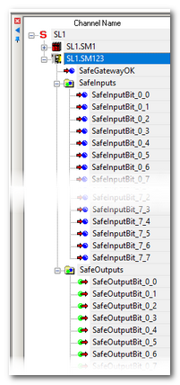

# Reading and Writing ASi Data Bits in EcoStruxure Machine Expert™ – Safety

This topic contains the following information:

* [Data bits read from/written to the ASi Gateway](Gateway_ProcessData_SoSafe.html#Gateway_ProcessData_SoSafe__Gateway_SoSafe_DataBits)
* [Assumptions for this documentation](Gateway_ProcessData_SoSafe.html#Gateway_ProcessData_SoSafe__Gateway_SoSafe_Assumptions)
* [Description of the ASi input/output bits](Gateway_ProcessData_SoSafe.html#Gateway_ProcessData_SoSafe__Gateway_SoSafe_BitDescriptions)
* [How to insert data bits into the safety-related code](Gateway_ProcessData_SoSafe.html#Gateway_ProcessData_SoSafe__Gateway_SoSafe_InsertDataBits)
* [Download of parameterization data to the ASi Gateway](Gateway_ProcessData_SoSafe.html#Gateway_ProcessData_SoSafe__Gateway_SoSafe_Download)

After having [added an ASi Gateway in EcoStruxure Machine Expert™](Gateway_SoMM_Parameterization.html#Gateway_SoMM_Parameterization) and [parameterizing it in EcoStruxure Machine Expert™ – Safety](Gateway_Params_SoSafe.html#Gateway_Params_SoSafe), its data can be used in the safety-related application.

The communication between the SLC (and LMC) and the ASi Gateway via the openSafety over Sercos is accomplished by means of the 'x Bytes Safe Sercos Data' device object (with x = 8 for the BWU2984 and x = 12 for the ASi-5/ASi-3 Gateway) you have [inserted under the gateway node](Gateway_SoMM_Parameterization.html#Gateway_SoMM_Parameterization__Gateway_SoMM_AddDevice). This topic describes how to use the data bits contained in this device object in the safety-related application.

## Data bits read from/written to the ASi Gateway

The ASi Gateway appears as subslot of the SLC in the EcoStruxure Machine Expert™ – Safety Devices tree ('Devices' window), similar to a bus coupler device.

Example: ASi Gateway BWU2984 with device ID SL1.SM2

The data bits provided in the '8 Bytes Safe Sercos Data' device object of this particular ASi Gateway BWU2984 are grouped by input and output bits under the gateway node. 64 input bits as well as 64 output bits are provided per ASi Gateway. Additionally, the SafeGatewayOK signal is provided that indicates the communication status.

Example: ASi Gateway BWU2984

**NOTE:**

Note that the ASi-5/ASi-3 Gateway provides a '12 Bytes Safe Sercos Data' device object with 96 input bits and 96 output bits.

The **meaning of the input and output data bits** and which bits are used in your application depend on the user-defined and project-specific ASi data mapping made in your ASi application (in ASIMON360).

**NOTE:**

The entire bit set is transmitted to/from the ASi Gateway, independently of the ASi data mapping or the number/types of ASi I/Os that are physically connected to the ASi field bus. Input bits that are not used because they are not mapped to any ASi data remain SAFEFALSE permanently. Which data bits are used and have to be read or written in the safety-related SLC application (as they are mapped to a physically connected sensor or actuator) have to be determined in the ASIMON360 application.

By evaluating the relevant input bits coming from the ASi Gateway (delivering status information from ASi sensors and command devices) and writing the output bits transferred to the ASi Gateway (for example, to control ASi actuators), the safety-related SLC application can react on safety-related requests from the ASi field bus.

The input/output bits can be inserted like other process data items into the safety-related FBD/LD code by dragging them from the Devices tree (see following procedure). On insertion into the code, a safety-related global variable is created.

Additionally, each safety-related input/output bit is available as mirrored bit in EcoStruxure Machine Expert™.

Mirrored bits in EcoStruxure Machine Expert™

The safety-related input and output bits are mirrored in EcoStruxure Machine Expert™ in the 'sercos Module I/O Mapping' editor of the device object '`x` Bytes Safe Sercos Data' relating to this ASi Gateway device (with `x` = 8 for the BWU2984 and `x` = 12 for the ASi-5/ASi-3 Gateway). After mapping an input/output bit to a Boolean variable in EcoStruxure Machine Expert™, the safety-related project is updated accordingly and the name of the mapped variable is entered into the 'LogicBuilder Variable' column in EcoStruxure Machine Expert™ – Safety.

Example: ASi Gateway BWU2984

EcoStruxure Machine Expert™: in the 'sercos Module I/O Mapping' editor of the '8 Bytes Safe Sercos Data' device object, the variable 'ASi\_Estop1' is mapped to the input bit 0-1 (number (1) in the figure below).

In EcoStruxure Machine Expert™ – Safety: the 'ASi\_Estop1' variable is visible in the 'LogicBuilder Variable' column in the 'Devices' window (number (2) in the figure below). In this example, input bit 0-1 is already used in the safety-related application under the variable name 'SafeInputBit\_0\_1'. This variable name has automatically been created when dragging the bit into the safety-related application.

## Assumptions for this documentation

For the descriptions given here we assume the following:

* The type ASi Gateway BWU2984 is used which provides an '8 Bytes Safe Sercos Data' device object.
* A direct 1:1 data mapping, that is to say, the address of an ASi device corresponds to the data bit number (input device 1 is mapped to input bit 0-1, etc.).
* The input bits 0 and 32 are configured as diagnostic status bits.
* The output bits 0 and 32 are configured as enable output bits.

**Further Information:**

Refer to the chapter ["Configuration of the ASi functionality in ASIMON360"](Gateway_ASImon.html#Gateway_ASImon) and to section ["Description of the ASi input/output bits"](Gateway_ProcessData_SoSafe.html#Gateway_ProcessData_SoSafe__Gateway_SoSafe_BitDescriptions) for details.

## Description of the ASi input/output bits (type ASi Gateway BWU2984)

The following applies to the '8 Bytes Safe Sercos Data' device object (that is to say, for the BWU2984 ASi-3 Gateway). For the ASi-5/ASi-3 Gateway with its '12 Bytes Safe Sercos Data' device object, other values for the device object size, bit numbers etc. apply accordingly.

SafeGatewayOK status bit

|  |  |
| --- | --- |
| Description | Safety-related status bit coming from the ASi Gateway indicating the status of the communication between the SLC and the ASi Gateway via openSafety over Sercos.  The SafeGatewayOK signal can be evaluated together with the diagnostic signals that indicate the ASi circuit status (also delivered by the ASi Gateway). The present documentation is predicated on the best practice application in which these diagnostic bits are mapped to the input data bits 0 (for circuit 1) and 32 (for circuit 2). Refer to section "Circuit status monitoring: input bits 0 and 32..." below for details.  Representation in the Devices tree: |
| Data type | SAFEBOOL |
| Access type | Variable can be read by the safety-related SLC application. |
| Possible values | **SAFEFALSE:**   * communication between the SLC and the ASi Gateway via openSafety over Sercos is not working properly, or * the ASi Gateway is not available at the Sercos bus.  **SAFETRUE:**   * communication between the SLC and the ASi Gateway via openSafety over Sercos is working properly, and * the ASi Gateway is available at the Sercos bus.  **NOTE:**  Also observe the status display at the ASi Gateway for the error indication. |

Input bits 1 to 31 and 33 to 63

|  |  |
| --- | --- |
| Description | Safety-related input bit coming from the ASi Gateway.  Representation in the Devices tree:  **NOTE:**  The present documentation is predicated on the best practice application in which the input bits 0 and 32 are configured for monitoring the status of the ASi circuits 1 and 2 (see section below).  As we use a direct 1:1 data mapping, the bit number directly corresponds to an ASi device address. Refer to your project documentation of the ASi application (made using ASIMON360) for details of your ASi data mapping. |
| Data type | SAFEBOOL |
| Access type | Variable can be read by the safety-related SLC application. |
| Possible values | SAFEFALSE and SAFETRUE. The meaning of the bit values SAFETRUE and SAFEFALSE depends on the ASi data mapping and your ASi application.  As we use a direct 1:1 data mapping (ASi device address = bit number), the following applies:  **SAFEFALSE:**   * A safety-related request occurred, that is to say, the defined safe-state is active, or * the corresponding ASi device is not working correctly.  **SAFETRUE:**   * The corresponding ASi device works correctly, and * no safety-related request occurred, that is to say, the defined safe-state is not active.  **NOTE:**  A SAFETRUE value is only valid if the SafeGatewayOK signal and the diagnostic status signal for the corresponding ASi circuit are both SAFETRUE. The present documentation is predicated on the best practice application in which the diagnostic signal for circuit 1 is mapped to input data bit 0 and the diagnostic bit for circuit 2 is mapped to input bit 32.  Refer to section "Circuit status monitoring: input bits 0 and 32..." below for details.  **NOTE:**  Also observe the status display at the ASi Gateway for the error indication. |

Output bits 1 to 31 and 33 to 63

|  |  |
| --- | --- |
| Description | Safety-related output bit written to the ASi Gateway.  Representation in the Devices tree:  **NOTE:**  The present documentation is predicated on the best practice application in which the output bits 0 and 32 are configured for enabling the ASi circuits 1 and 2 (see section below).  As we use a direct 1:1 data mapping, the bit number may directly correspond to an ASi actuator ID. Refer to your project documentation of the ASi application (made using ASIMON360) for details of your ASi data mapping. |
| Data type | SAFEBOOL |
| Access type | Variable can be written by the safety-related SLC application. |
| Possible values | SAFEFALSE and SAFETRUE. The meaning of the bit values SAFETRUE and SAFEFALSE depends on the ASi data mapping and your ASi application.  As we use a direct 1:1 data mapping (ASi device address = bit number), the following applies:   * **SAFETRUE** activates the mapped ASi actuator device, if the circuit is enabled (see note below). * **SAFEFALSE** deactivates the mapped ASi actuator device.  **NOTE:**  The present documentation is predicated on the best practice application in which the output bits 0 and 32 are configured for enabling the ASi circuits 1 and 2. This way, the value SAFETRUE written to an output bit can only become effective in the output process data image of the ASi Gateway (and therefore on the addressed ASi field bus circuit) if the related enable output signal (output bit 0 or 32) enables the respective ASi Gateway circuit with the value SAFETRUE. Output data bit 0 controls circuit 1, output bit 32 controls circuit 2 (see section below). |

Circuit status monitoring: input bits 0 and 32 correspond to TM5/TM7 SafeModuleOK signal

If configured in ASIMON360, the ASi Gateway provides diagnostic status signals for both ASi circuits (similar to the SafeModuleOK signal from TM5/TM7 modules). The present documentation is predicated on the best practice application in which you have implemented these diagnostic signals as follows:

* The diagnostic status signals are mapped in ASIMON360 to the input bits 0 and 32 of the '8 Bytes Safe Sercos Data' device object. Input data bit 0 then represents the status of ASi circuit 1, and input bit 32 represents circuit 2.
* The input bits 0 and 32 are evaluated in your safety-related SLC application in a way that the signals coming from the ASi devices are considered as invalid if the related circuit status signal is not SAFETRUE.

**NOTE:**

Additionally, the SafeGatewayOK signal is available to indicate the status of the communication between SLC and ASi Gateway via openSafety over Sercos. SafeGatewayOK = SAFEFALSE indicates that the safety-related communication via openSafety over Sercos is not established correctly.

|  |  |
| --- | --- |
| Description | Indicates the status of the respective ASi circuit and therefore, from safety-related application perspective, the ASi Gateway status itself.  If mapped as described above, input data bit 0 represents circuit 1, and input bit 32 represents circuit 2. |
| Data type | SAFEBOOL |
| Access type | Variable can be read by the safety-related SLC application. |
| Possible values | **SAFEFALSE**: the respective ASi circuit is not available for the SLC. The data bits contained in the '8 Bytes Safe Sercos Data' device object are not valid.  **SAFETRUE**: the respective ASi circuit is available for the SLC. The data bits contained in the '8 Bytes Safe Sercos Data' device object are valid. |

Circuit enabling: output bits 0 and 32 correspond to TM5/TM7 ReleaseOutput signal

The present documentation is predicated on the best practice application in which you have implemented enable output signals for the ASi circuits as follows:

1. Suitable Boolean output variables generated in the safety-related SLC application are provided as enable signals for each of the output ASi circuits.
2. These enable (or release) signals are mapped to the output bits 0 and 32 of the '8 Bytes Safe Sercos Data' device object.
3. These output bits 0 and 32 are processed in the ASIMON360 application using logical AND combinations in a way that a device may only activate its output if the enable signal is SAFETRUE.

This way, the output bits 0 and 32 of the '8 Bytes Safe Sercos Data' device object can be used for enabling the circuits 1 and 2 (similar to the ReleaseOutput signal known from TM5/TM7 modules). Setting an enable bit to SAFETRUE means that the related ASi devices may activate their outputs.

|  |  |
| --- | --- |
| Description | If configured as described above, the output bits 0 and 32 are the release signals for the ASi circuits.  If mapped as described above, output data bit 0 controls circuit 1, and output bit 32 controls circuit 2.  Ensure that setting an output bit to TRUE does not result in any hazards. Refer to the hazard message below this table. |
| Data type | SAFEBOOL |
| Access type | Variable can be written by the safety-related SLC application. |
| Possible values | * **SAFEFALSE**: the bit values in the output bit group are not written to the output process image of the ASi Gateway. Setting an output has no effect on the ASi actuator(s) mapped to this output bit. * **SAFETRUE**: the bit values in the output bit group are written to the output process image of the ASi Gateway. Setting an output activates the ASi actuator(s) mapped to this output bit. |

| WARNING | |
| --- | --- |
|  | **UNINTENDED EQUIPMENT OPERATION**   * Include in your risk analysis the impact of setting/resetting an output bit. * Use appropriate safety interlocks where personnel and/or equipment hazards exist. * Validate the overall safety function and thoroughly test the application.   **Failure to follow these instructions can result in death, serious injury, or equipment damage.** |

## How to insert data bits into the safety-related code

Use the input/output bits provided under the gateway node as follows in the safety-related application in EcoStruxure Machine Expert™ – Safety.

* Read the status information (input bits) coming from the ASi Gateway and evaluate them in the safety-related application. It depends on the ASi I/O mapping defined in the ASi application (ASIMON360 project) to which ASi sensor(s)/command device(s) a bit corresponds. Also evaluate the SafeGatewayOK signal in the safety-related application.
* Write the control signals (output bit) transferred to the ASi Gateway depending on the evaluated status information. It depends on the ASi I/O mapping defined in the ASi application (ASIMON360 project) to which ASi actuator(s) a bit corresponds. The present documentation is predicated on the best practice of a 1:1 data mapping application.

| WARNING | |
| --- | --- |
|  | **UNINTENDED EQUIPMENT OPERATION**  Verify the mapping of ASi I/O data to the '`x` Bytes Safe Sercos Data' device object (with `x` = 8 for the BWU2984 and `x` = 12 for the ASi-5/ASi-3 Gateway) and the use of ASi input/output data bits in the safety-related SLC application.  **Failure to follow these instructions can result in death, serious injury, or equipment damage.** |

The bits have to be inserted into FBD/LD code worksheets as follows:

|  |
| --- |
| 1. Open the code worksheet where you want to insert the process data item and create/use the global variable assigned to it. 2. In the 'Devices' window, open the Devices tree on the left and expand the module (tree node) which contains the process data item to be used. 3. Drag the process data item into the code worksheet. When releasing the mouse button, the 'Variable' dialog box appears.  To insert a Boolean variable as a contact into the graphical code, hold the <CTRL> key down when releasing the mouse button after dragging the variable from the device terminal grid into the code worksheet. 4. In the 'Variable' dialog box, a default name is proposed which is derived from the process data item name. Accept the proposed name, select an existing global variable, or declare a new global variable by entering a new 'Name' and selecting a 'Group'. 5. Confirm the 'Variable' dialog box by clicking 'OK'.  The rectangle shape of the variable is now added to the cursor. It can be dropped at the desired position with a click. You can directly connect the variable to another object (for example, a formal parameter) or drop it at a free position. |

## Download of parameterization/application data to the ASi Gateway

After having parameterized the ASi Gateway and used the ASi data bits in the safety-related code as described above, the related data are part of the safety-related EcoStruxure Machine Expert™ – Safety project which is in turn integrated in the non-safety-related EcoStruxure Machine Expert™ project. These data are included into the project download and then transferred from the LMC to the ASi Gateway. No separate download to the ASi Gateway is required.

The ASi application configuration developed using ASIMON360 has to be commissioned separately as described in the ASIMON360 user documentation.

Observe the following instructions before commissioning the system including the coupled ASi field bus:

| WARNING | |
| --- | --- |
|  | **UNINTENDED EQUIPMENT OPERATION**   * Verify the interaction between the applications programmed for the ASi Gateway (with its connected I/O devices) and the PacDrive 3 application (LMC and SLC programs). * Verify the mapping of ASi I/O data to the 'x Bytes Safe Sercos Data' device object (with x = 8 for the BWU2984 and x = 12 for the ASi-5/ASi-3 Gateway) and the use of ASi input/output data bits in the safety-related SLC application. * Verify that the safety response time of the entire system includes the response time specific to the ASi Gateway with its connected ASi I/Os. * Be sure that the functional testing you perform comprises the entire system including the ASi Gateway and I/O devices, and corresponds to your risk analysis, and considers each possible operating mode and scenario the safety-related application should cover. * Observe the local regulations given by relevant sector standards for the distributed automation system. * Use appropriate safety interlocks where personnel and/or equipment hazards exist.   **Failure to follow these instructions can result in death, serious injury, or equipment damage.** |

EIO0000002594.02