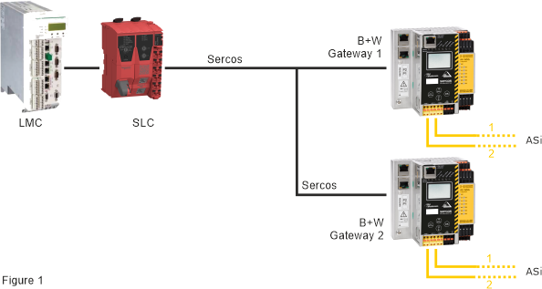
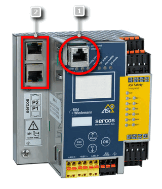
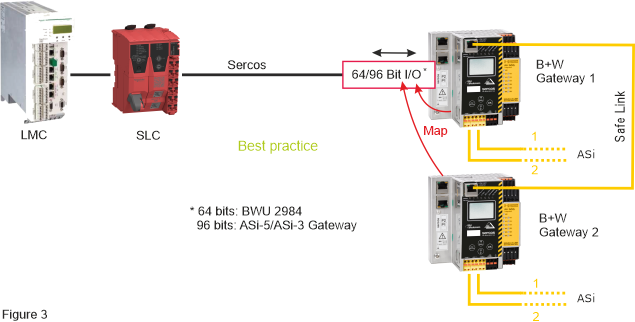
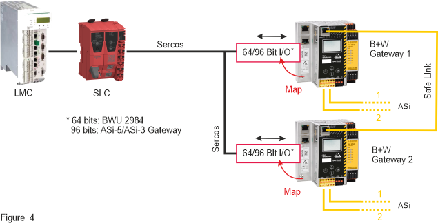

# Use case: Several ASi Gateways in one SLC Safety Architecture

Up to five ASi Gateway devices can be connected per Safety Logic Controller. Each integrated ASi Gateway communicates via a 'x Bytes Safe Sercos Data' device object (with x = 8 for the BWU2984 and x = 12 for the ASi-5/ASi-3 Gateway) with the upstream SLC.

Keep in mind that the extension of your safety-related application by the ASi field bus level may influence the function, performance, and overall response time of your application. You need to ensure that the various logics (Gateway, LMC, SLC) in the distributed controller application interact correctly.

| WARNING | |
| --- | --- |
|  | **UNINTENDED EQUIPMENT OPERATION**   * Verify the interaction between the applications programmed for the ASi Gateway (with its connected I/O devices) and the PacDrive 3 application (LMC and SLC programs). * Verify the mapping of ASi I/O data to the 'x Bytes Safe Sercos Data' device object (with x = 8 for the BWU2984 and x = 12 for the ASi-5/ASi-3 Gateway) and the use of ASi input/output data bits in the safety-related SLC application. * Be sure that the functional testing you perform comprises the entire system including the ASi Gateway and I/O devices, and corresponds to your risk analysis, and considers each possible operating mode and scenario the safety-related application should cover. * Observe the local regulations given by relevant sector standards for the distributed automation system. * Use appropriate safety interlocks where personnel and/or equipment hazards exist.   **Failure to follow these instructions can result in death, serious injury, or equipment damage.** |

The overall response time has to be inspected and verified precisely as the integration of the ASi field bus with connected ASi devices extends the overall response time of the safety function.

| WARNING | |
| --- | --- |
|  | **UNINTENDED EQUIPMENT OPERATION**   * Verify that the safety response time of the entire system includes the response time specific to the ASi Gateway with its connected ASi I/O devices. * Validate the overall safety function with regard to the resulting overall response time and thoroughly test the application.   **Failure to follow these instructions can result in death, serious injury, or equipment damage.** |

**NOTE:**

If several ASi Gateways are used and interlinked in your safety-related application, you have to verify that the mapping of safety-related ASi data to the data bits in one or several 'x Bytes Safe Sercos Data' device objects (with x = 8 for the BWU2984 and x = 12 for the ASi-5/ASi-3 Gateway) are documented in a comprehensible and clear way, thus ensuring the correct mapping and evaluation in the safety-related application.

Figure 1: two ASi Gateways without cross-communication connected to one SLC

ASi Gateways support cross-communication, thus enabling the integration and use of several ASi Gateways in your safety-related application. Cross-communication between ASi Gateways is possible via the openSafety-complying Safe Link protocol. Safe Link by Bihl+Wiedemann provides safety-related communication via Ethernet. This way, subnetworks can be interconnected and evaluated/monitored by the same Safety Logic Controller. The PacDrive 3 safety-related system supports a maximum of 5 ASi Gateways.

Typically, the commissioning/diagnostic interface (RJ45 Ethernet port) of the ASi Gateways is used to establish a Safe Link network (number (1) in figure 2 below). Although Safe Link can also be configured at the Sercos port (2), the use of the commissioning/diagnostic interface reduces the data traffic on the Sercos bus, thus saving bandwidth in the network, reduces the system complexity, and helps improve the cybersecurity protection of the real time network.

Illustration: commissioning/diagnostic interface

Figure 2: commissioning/diagnostic interface of the ASi Gateway

**Further Information:**

**Term definition**: In the following, the term 'x Bytes Safe Sercos Data' designates both, the 8 and 12 bytes object, depending on the gateway type. (x = 8 for the BWU2984 and x = 12 for the ASi-5/ASi-3 Gateway.)

Do not exchange the same data between several ASi Gateways (via Safe Link) and at the same time between SLC and several ASi Gateways (via the 'x Bytes Safe Sercos Data' device object). Figure 3 below shows an example.

* Connect only one ASi Gateway (Gateway 1 in the example below) to the SLC.
* Interconnect the other ASi Gateway(s) (2 to 5) via Safe Link. These ASi Gateways can cross-communicate with Gateway 1 which is connected to the Sercos bus.
* Map the relevant safety-related ASi data of the ASi safety-related architectures (covered by the ASi Gateways involved) to the 'x Bytes Safe Sercos Data' device object of Gateway 1.

This way the safety-relevant information is transferred only once to the SLC.

Figure 3: cross-communication between ASi Gateways

If the architecture of your application combines the direct Sercos connection of several ASi Gateways with Safe Link cross-communication as illustrated in figure 4 below, the bus cycle times for the data exchange between and the processing times in the controllers (ASi Gateways and SLC) must be considered to help avoid deadlock situations in your application.

Figure 4: cross-communication between ASi Gateways via Safe Link **and** Sercos

Due to the potential issues of such an architecture, you may need to reconsider such an implementation in favor of one depicted in figure 3.

EIO0000002594.02