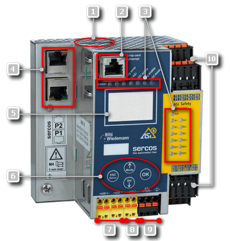

# Technical Information on the ASi Gateway

## Features & Facts

* ASi (short for **A**ctuator-**S**ensor-**I**nterface) is a standardized field bus communication according to EN 50295 and IEC 62026-2. It is mainly used on field device level for connecting sensors/command devices and actuators.
* Each sensor/command device and actuator is considered as ASi I/O device which obtains its address from an ASi Gateway. For the maximum number of connectable devices (safety-related and standard), consult the B+W documentation.

  Safety-related and standard devices can be simultaneously used at the ASi field bus.
* Communication on ASi field bus level: the ASi Gateway sends requests to addressed devices which respond with the requested data.
* Neither the ASi controller program nor the ASi communication is synchronized with the upstream Sercos field bus.
* Cross-communication between several ASi Gateway devices is possible via Safe Link. (Safe Link by Bihl+Wiedemann provides safety-related communication via Ethernet.)

  This way, subnetworks (which are, for example, covering different safety architectures) can be interconnected and evaluated/monitored by the same Safety Logic Controller. The PacDrive 3 safety-related system supports a maximum of 5 ASi Gateways.

  Refer to the topic ["Use case: several ASi Gateways with cross-communication"](Gateway_UseCase_SeveralGateways.html#Gateway_UseCase_SeveralGateways) for details.
* Communication between an ASi Gateway integrated into the PacDrive 3 system and the Schneider Electric SLC and LMC (ASi/Sercos data exchange) is enabled via a 64 or 96-bit device object (depending on the gateway type). From the perspective of the safety-related Safety Logic Controller application, each integrated ASi Gateway device is considered as a 64/96-bit I/O module. Detailed information can be found in the introducing topic to this documentation, section ["ASi/Sercos Data Exchange (I/O mapping of ASi data)"](Gateway_Intro.html#Gateway_Intro__Gateway_IOMapping_Basics).

**Further Information:**

For a detailed description of the ASi Gateway, its interfaces, and connectivity, refer to the product sheets and user manuals provided by the ASi Gateway manufacturer Bihl+Wiedemann.

**System limits for ASi Gateway in PacDrive 3 systems:** when integrated into the Schneider Electric PacDrive 3 Safety System, the functional range of the ASi Gateway is available.

## Hardware: interfaces/connectivity of the ASi/Sercos III Safety Gateway

|  |  |
| --- | --- |
| (1) | Chip card for storing the ASi Gateway configuration (control functionality, configured in ASIMON360) |
| (2) | Diagnostic interface for connecting the PC running ASIMON360 or a Safe Link connection to another ASi Gateway (cross-communication) |
| (3) | LEDs for status indication |
| (4) | Field bus interface for connecting the Sercos field bus |
| (5) | LC display for status indication |
| (6) | Buttons for manual operation |
| (7) | +ASI1-: ASi circuit 1 for connecting safety-related or standard (non-safety-related) devices. For the maximum number of connectable devices (safety-related and standard), consult the B+W documentation. |
| (8) | +ASI2-: ASi circuit 2 for connecting safety-related or standard (non-safety-related) devices. For the maximum number of connectable devices (safety-related and standard), consult the B+W documentation. |
| (9) | ASI+PWR-: supply voltage for the ASi circuits |
| (10) | Terminals for local I/Os |

**NOTE:**

Electrical installation and start-up of ASi Gateway devices is not part of this integration guide. Refer to the appropriate documentation provided by Bihl+Wiedemann.

EIO0000002594.02