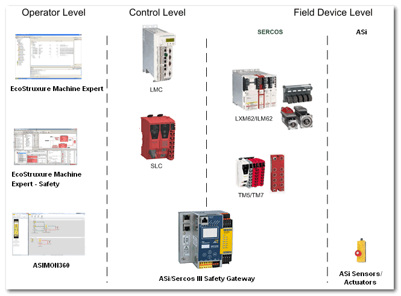

# ASi/Sercos III Safety Gateways by Bihl+Wiedemann - Device Integration

This topic contains the following information:

* [Purpose of the ASi Gateway integration](Gateway_Intro.html#Gateway_Intro__GatewayIntro_Purpose)
* [ASi/Sercos Data Exchange (I/O mapping of ASi data)](Gateway_Intro.html#Gateway_Intro__Gateway_IOMapping_Basics)
* [Notes on distributed automation systems](Gateway_Intro.html#Gateway_Intro__GatewayIntro_NotesDistributedSystem)
* [Diagnosis of the ASi Gateway](Gateway_Intro.html#Gateway_Intro__Gateway_Diagnostics)
* [Use case scenarios](Gateway_Intro.html#Gateway_Intro__Gateway_UseCases_Overview)

**Further Information:**

**Term definitions**:

* In this documentation, the general short name for each ASi/Sercos III Safety Gateway type by Bihl+Wiedemann is ASi Gateway.
* The ASi-3/Sercos III Safety Gateway BWU2984 in particular is referred to as BWU2984 for short.
* The ASi-5/ASi-3 Schneider Sercos Gateway with integrated Safety Monitor is referred to as ASi-5/ASi-3 Gateway for short.

## Purpose of the ASi Gateway integration

The ASi Gateway connected to the Sercos bus enables the communication with the Safety Logic Controller via the provided I/O data object thus enabling the use/control of ASi sensor/actuator data of the ASi subsystem.

The ASi Gateway enables you to:

* integrate ASi sensors/command devices (such as light curtains, emergency stop buttons, etc.) and ASi actuators (for example, contactors) into the safety-related PacDrive 3 system architecture,
* monitor and evaluate ASi sensors/command devices in the safety-related SLC application,
* react on safety-related requests coming from ASi sensors/command devices by switching safety-related Sercos drives as well as ASi actuators to the defined safe-state.

This way, the ASi Gateway integrates ASi as a second field device level besides the Sercos field devices (Lexium 62/Lexium 62 ILM and TM5/TM7 safety-related modules).

Up to five ASi Gateways can be connected per Safety Logic Controller (which can be considered as one machine module or functional safety architecture).

**Further Information:**

Also refer to the topic ["Technical Information on the ASi Gateway"](Gateway_TechBackground.html#Gateway_TechBackground).

## ASi/Sercos Data Exchange (I/O mapping of ASi data)

From the perspective of the Safety Logic Controller application,

* an ASi-3 Gateway BWU2984 device is considered as safety-related 64-bit (8 bytes) I/O data area and
* an ASi-5/ASi-3 Gateway as 96-bit (12 bytes) I/O data area.

These safety-related 64 or 96 I/O bits are exchanged between the ASi Gateway and the SLC via openSAFETY over Sercos. Into this 64/96-bit I/O data area, safety-related ASi data have to be mapped in a user-defined way using the ASIMON360 tool.

In EcoStruxure Machine Expert™ – Safety and EcoStruxure Machine Expert™, these 64/96 I/O bits are represented as a device object referred to as 'x Bytes Safe Sercos Data' (with x = 8 for the BWU2984 and x = 12 for the ASi-5/ASi-3 Gateway).

**Further Information:**

**Term definition**: In the following, the term 'x Bytes Safe Sercos Data' designates both, the 8 and 12 bytes object, depending on the gateway type. (x = 8 for the BWU2984 and x = 12 for the ASi-5/ASi-3 Gateway.)

After inserting this device object into the EcoStruxure Machine Expert™ 'Devices tree' (under the gateway node), it provides access (read-only in EcoStruxure Machine Expert™ and read/write in EcoStruxure Machine Expert™ – Safety) to the safety-related ASi data mapped to the device object and transferred from/to the ASi Gateway.

Composition of safety-related ASi data: by means of a special, device-specific algorithm, the ASi communication telegram of each connected safety-related ASi device is permuted into **one safety-related data bit** per ASi device. This safety-related data bit can be mapped to the 64/96-bit I/O area (device object) in the configuration tool ASIMON360. Standard (non-safety-related) ASi devices cannot be mapped to the '`x` Bytes Safe Sercos Data' device object. Consequently, the device object provides status information of safety-related ASi input devices and control data for safety-related ASi output devices. Furthermore, other safety-related ASi data (such as diagnostic or output enable bits) may be included, depending on the user-defined mapping.

Mapping of safety-related ASi data: the safety-related ASi data must be mapped to the bits of the '`x` Bytes Safe Sercos Data' device object. This mapping is defined by the user in ASIMON360. A clear data mapping is a 1:1 mapping: ASi device 1 connected to ASi circuit 1 is mapped to input or output bit 1 of the device object (depending on whether the device is an input or output device). ASi device 2 is mapped to bit 2, and so on.

The present documentation is predicated on the best practice of a 1:1 data mapping application. Beyond this, the diagnostic status signals for the ASi circuits 1 and 2 provided by the ASi Gateway must be used, as well as enable output signals for the ASi device outputs. See chapter ["Configuration of the ASi functionality in ASIMON360"](Gateway_ASImon.html#Gateway_ASImon) for details.

Via openSafety over Sercos, the '`x` Bytes Safe Sercos Data' device object is exchanged between ASi Gateway, SLC, and LMC. In the SLC, the safety-related data bits can be read and written. This allows monitoring, evaluating and controlling the ASi application in conformance with functional safety standards. In the LMC, the safety-related data bits are mirrored and can be read to inform the standard (non-safety-related) LMC application about the safety-related ASi status.

Illustration of ASi data mapping:

|  |
| --- |
|  |

The following applies to the '8 Bytes Safe Sercos Data' device object (that is to say, for the BWU2984 ASi-3 Gateway). For the ASi-5/ASi-3 Gateway with its '12 Bytes Safe Sercos Data' device object, other values for the device object size, bit numbers etc. apply accordingly.

* The device object consists of 64 input data bits and 64 output data bits regardless of the number of ASi input devices and output devices connected to the ASi bus. Read the last item in this list regarding unused bits.
* The SafeGatewayOK status bit indicates the communication status via openSafety over Sercos. SafeGatewayOK = SAFETRUE means that communication between the SLC and the ASi Gateway is possible.
* ASi circuit status bits: the ASi Gateway provides one diagnostic status signal per ASi circuit. By mapping these status signals to input bits of the '8 Bytes Safe Sercos Data' device object, they can be used as status bits similar to the SafeModuleOK signal from TM5 safety-related modules.

  The present documentation is predicated on the best practice application in which the status signals are mapped to the input bits 0 and 32: bit 0 = SAFETRUE, the ASi Gateway then indicates that ASi circuit 1 is communicating properly. Accordingly, bit 32 = SAFETRUE indicates correct communication on ASi circuit 2.
* Output enable bits: the present documentation is predicated on the best practice application in which you use one separate signal generated in the safety-related SLC application as enable signal for each of the output ASi circuits. Map these enable output signals to the output bits 0 and 32 of the device object and process them accordingly in the ASIMON360 application. This way, the output bits 0 and 32 can be used similar to ReleaseOutput control signals from TM5 safety-related modules: via bit 0 = SAFETRUE, the ASi Gateway enables the ASi circuit 1 and bit 32 = SAFETRUE enables circuit 2.
* After deducting two diagnostic status bits and two enable output control bits as described above, both the input and the output bit group provide 62 data bits each that can be freely mapped in ASIMON360 (to input or output ASi devices).
* Standard (non-safety-related) ASi devices are **not** represented in the device object.
* The entire device object, that is to say, 64 input bits and 64 output bits, plus the SafeGatewayOK signal are transferred from/to the ASi Gateway. The device object may contain **unused** bits, for example, if no ASi data has been mapped to a safety-related bit or, in a 1:1 data mapping, if no ASi device is connected at this bus position. An unused input bit is not written by the ASi Gateway and remains SAFEFALSE. Writing an unused output bit in the SLC application has no effect on ASi side.

The mapping of ASi data to the '8 Bytes Safe Sercos Data' device object has to be done in ASIMON360 and can be determined using the ASIMON360 project documentation. You have to ensure that the correct data bits are used in EcoStruxure Machine Expert™ – Safety. Refer to the topic ["Reading and Writing ASi Data Bits in EcoStruxure Machine Expert™ – Safety"](Gateway_ProcessData_SoSafe.html#Gateway_ProcessData_SoSafe) for details.

## Notes on distributed automation systems

You set up a highly distributed system by implementing:

* an ASi application executed by the ASi Gateway using ASIMON360, and
* a standard LMC application using EcoStruxure Machine Expert™, and
* a safety-related SLC application in EcoStruxure Machine Expert™ – Safety.

By means of a safety-related checksum (ASIMON360 ConfigID), the Safety Logic Controller is able to recognize whether the configuration and loaded application of the gateway corresponds to the ASi configuration stored in the EcoStruxure Machine Expert™ – Safety 'Devices' window.

However, there is no superordinate, controller-spanning verification instance (or compiler) that verifies whether the various logics (ASi Gateway, LMC, SLC) in the distributed controller application interact correctly.

| WARNING | |
| --- | --- |
|  | **UNINTENDED EQUIPMENT OPERATION**   * Verify the interaction between the applications programmed for the ASi Gateway (with its connected I/O devices) and the PacDrive 3 application (LMC and SLC programs). * Verify the mapping of ASi I/O data to the '`x` Bytes Safe Sercos Data' device object (with `x` = 8 for the BWU2984 and `x` = 12 for the ASi-5/ASi-3 Gateway) and the use of ASi input/output data bits in the safety-related SLC application. * Be sure that the functional testing you perform comprises the entire system including the ASi Gateway and I/Os, and corresponds to your risk analysis, and considers each possible operating mode and scenario the safety-related application should cover. * Observe the local regulations given by relevant sector standards for the distributed automation system. * Use appropriate safety interlocks where personnel and/or equipment hazards exist.   **Failure to follow these instructions can result in death, serious injury, or equipment damage.** |

The total safety response time of the entire system has to be inspected and verified precisely as the integration of the ASi field bus with connected ASi I/O devices extends the total safety response time calculated using the 'Response Time Calculator' in EcoStruxure Machine Expert™ – Safety.

| WARNING | |
| --- | --- |
|  | **UNINTENDED EQUIPMENT OPERATION**   * Verify that the safety response time of the entire system includes the response time specific to the ASi Gateway with its connected ASi I/O devices. * Validate the total lag-time of the system and thoroughly test the application controlling for lag-time.   **Failure to follow these instructions can result in death, serious injury, or equipment damage.** |

As the ASi Gateway does not only provide gateway functionality between Sercos and the ASi field bus but also implements control functionality for its connected ASi devices, it can be classified in a PacDrive 3 system between the control level (where LMC and SLC are located) and the field device level.

Illustration of PacDrive 3 system levels

## Diagnosis of the ASi Gateway

**Safe Logger Diagnostics**

As any other safety-related device or Sercos subscriber, the ASi Gateway uploads diagnostic Sercos-compliant messages to the LMC. These diagnostic messages are logged by the Safe Logger and the Message Logger.

The format of ASi Gateway diagnostic messages in the logs slightly differs from the regular Sercos subscriber messages. The code of ASi Gateway messages is `EF01` hex.

In the 'Info 1' field of the Safe Logger, the error number reported by the ASi Gateway is specified. Refer to the Bihl+Wiedemann documentation for details and remedy procedures for the reported error codes.

**Further Information:**

For further details, refer to the Safe Logger for EcoStruxure Machine Expert - Safety User Guide and the corresponding B+W documentation listed in the ["Related Documents" chapter](AboutTheBook.html#AboutTheBook).

**Gateway Diagnostic Bits**

The ASi Gateway provides diagnostic bits which can be read and evaluated in the standard EcoStruxure Machine Expert™ application. Refer to the topic ["ASi Gateway Diagnostics"](Gateway_DiagnosticBits.html#Gateway_DiagnosticBits) for further information.

## Use case scenarios

The following scenarios can be implemented when integrating ASi Gateways into Schneider Electric functional safety systems:

* Modular machine composed of/controlled by one LMC, one SLC, one ASi Gateway (with its ASi I/Os), and bus coupler with connected I/O modules. The SLC covers one safety-related architecture.
* Modular machine composed of/controlled by one LMC, one SLC, several (up to five) ASi Gateways (each with its ASi I/Os), and bus coupler with connected I/O modules.

  If several ASi Gateways are connected to the Sercos bus, one SLC can monitor several ASi safety-related architectures. As a consequence, a safety-related request from one ASi safety-related architecture (coming from, for example, an ASi emergency stop command device) can result in the entire SLC architecture with the contained safety-related drives and the ASi field bus circuits assuming the defined safe-state.

  **Further Information:**

  Refer to the topic ["Use case: several ASi Gateways in one SLC Safety Architecture"](Gateway_UseCase_SeveralGateways.html#Gateway_UseCase_SeveralGateways) for details.

EIO0000002594.02