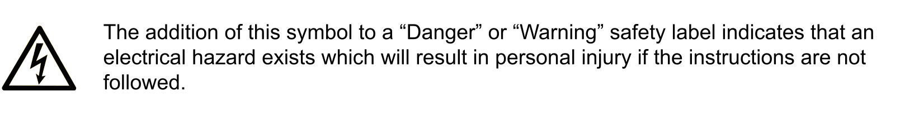

# Safety Information

## Important Information

Read these instructions carefully, and look at the equipment to become familiar with the device before trying to install, operate, service, or maintain it. The following special messages may appear throughout this documentation or on the equipment to warn of potential hazards or to call attention to information that clarifies or simplifies a procedure.

## Please Note

Electrical equipment should be installed, operated, serviced, and maintained only by qualified personnel. No responsibility is assumed by Schneider Electric for any consequences arising out of the use of this material.

A qualified person is one who has skills and knowledge related to the construction and operation of electrical equipment and its installation, and has received safety training to recognize and avoid the hazards involved.

EIO0000005993.00