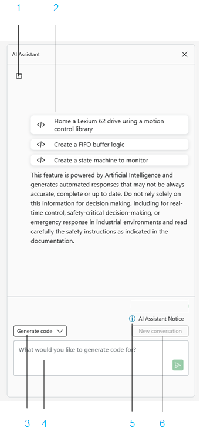

# Overview

The default window for EcoStruxure Machine Expert AI Assistant is the Home screen view:

**1** [Persistent chat history](PersistentChatHistory-4FEF11F4.html).

**2** Prompt examples provide sample prompts to help guide your input.

**3** Allows the selection of one of the following output types:

* Generate code, see [Generate Code](AICopilot-9199DC71.html#AICopilot-9199DC71)
* Explain code, see [Explain Code](Explain-9192A36A.html#Explain-9192A36A)
* Create test case, see [Create Test Case](Test-9192A43E.html#Test-9192A43E)

**4** EcoStruxure Machine Expert AI Assistant window. Use this area to enter your [prompt](ProgrammingPromptGuidelines-D4CD970D.html#ProgrammingPromptGuidelines-D4CD970D).

**5** AI Assistant Notice. This feature is built on artificial intelligence and generates automated responses that may not always be accurate, complete, or up to date. Do not rely solely on this information for decision-making. You had acknowledged interacting with the product and accepted the terms and conditions in the Schneider Electric [End User License Agreement](https://www.seupdate.schneider-electric.com/download/AIAssistant/Eula.EN.pdf) and [Privacy Policy](https://www.seupdate.schneider-electric.com/download/AIAssistant/PrivacyNotice.EN.pdf). If it is not the case that you, as the user of the product, had installed and acknowledged the [End User License Agreement](https://www.seupdate.schneider-electric.com/download/AIAssistant/Eula.EN.pdf) and [Privacy Policy](https://www.seupdate.schneider-electric.com/download/AIAssistant/PrivacyNotice.EN.pdf), click this button and review the terms and conditions set forth.

**6** New conversation. Starts a new conversation.

| WARNING | |
| --- | --- |
|  | UNINTENDED EQUIPMENT OPERATION  * Do not include executable code delivered by AI-Assisted engineering systems in an operational machine or process without thoroughly testing your entire application. * Perform a safety-related analysis for the application and the devices installed. * Ensure that the Program Organization Units (POUs) are compatible with the devices in the system and have no unintended effects on the proper functioning of your machine or process. * Provide independent methods for critical control functions (emergency stop, conditions for limit values being exceeded, etc.) according to a safety-related analysis, respective rules, and regulations.  Failure to follow these instructions can result in death, serious injury, or equipment damage. |

EIO0000005927.01