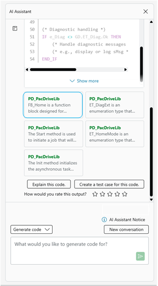
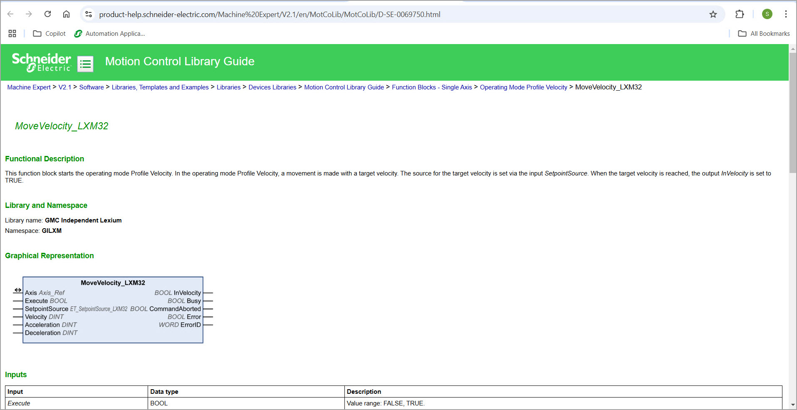

# References

The References window displays additional information related to the generated content:

Clicking a link in the References window opens the corresponding reference in a new browser window, for example:

EIO0000005927.01