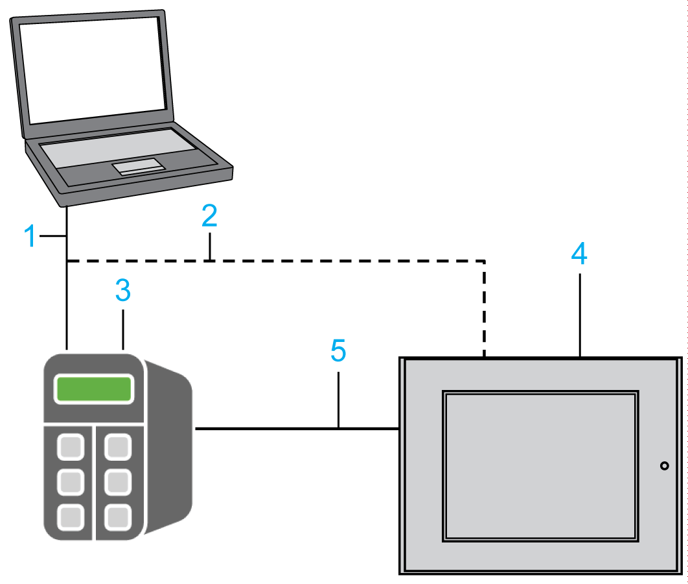

# Machine Transparency

## Machine Expert Protocol

The Machine Expert protocol is the preferred protocol providing a transparent access to your controllers and HMIs.

The Machine Expert protocol is used for any data exchange

* between the EcoStruxure Machine Expert software (PC) and the runtime systems (controller, HMI) configured by Vijeo-Designer
* between controllers and integrated HMIs supporting Machine Expert protocol

## Single Cable Connection

The single connection to the machine provides a gain in simplicity by transferring data using the same cable from the PC to the controller and HMI configured by Vijeo-Designer.

**1** connection between EcoStruxure Machine Expert PC and controller

**2** alternative connection between EcoStruxure Machine Expert PC and HMI

**3** controller

**4** HMI

**5** connection between controller and HMI

The above figure illustrates the equivalent access. Downloading and commissioning to the controller can be performed in two different ways:

* direct connection: directly connecting the EcoStruxure Machine Expert PC to the controller which, in turn, routes the information to the HMI
* alternative connection: connecting the EcoStruxure Machine Expert PC to the HMI which, in turn, routes the information to the controller. In this way, the EcoStruxure Machine Expert PC is connected directly to the HMI (**2**) and, via the HMI, to the controller (**5**).

## One-Shot Variable Definition

The transparent Machine Expert protocol allows you to define variables only once in the project and to make them available to any other HMI or controller by a publisher-subscriber mechanism predicated on symbolic names. Once the variables have been published, they may be subscribed by other HMIs or controllers without the need to re-enter the variable definition.

The publisher-subscriber mechanism affords the following advantages:

* single definition of variables shared between the controller and the HMI
* publishing and subscribing variables by simple selection
* variable exchange definition independent of the medium (serial line, etc.)

EIO0000002836.11