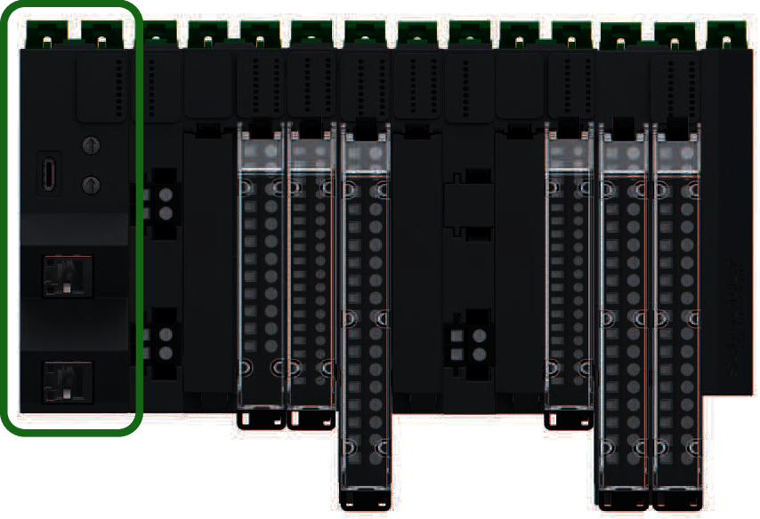

# Modicon Edge I/O NTS Network Interface Modules (NIM)

## Introduction

The first component of a Modicon Edge I/O NTS configuration, on a distributed I/O main cluster, is a network interface module.

This module is the interface between the I/O modules and the fieldbus master. It is the only module on the main cluster that is fieldbus-dependent, different network interface modules are available for each fieldbus.

NOTE: References exist that terminate with a 'K' that are kits which include the base, and in the case of the network interface modules, the cluster termination, with the module. Those references are not mentioned in the following table of references.

The following figure shows the location of the network interface module in a distributed I/O main cluster:

NOTE: References ending with a H are for hardened products, suitable for harsh environments.

For more details, see Modicon Edge I/O NTS Network Interface Modules User Guide.

## Modicon Edge I/O NTS Network Interface Modules

The following table shows the Network Interface Modules supported by EcoStruxure Machine Expert:

| Reference | Port | Communication type | Terminal type |
| --- | --- | --- | --- |
| NTSNEC1200/NTSNEC1200H | 2 isolated switched Ethernet ports | EtherNet/IP  Modbus TCP | RJ45 |
| 1 USB port | USB 2.0 | USB Type-C |
| NTSNSC1200 | 2 isolated switched Sercos III ports | RJ45 | USB Type-C |

EIO0000002836.11