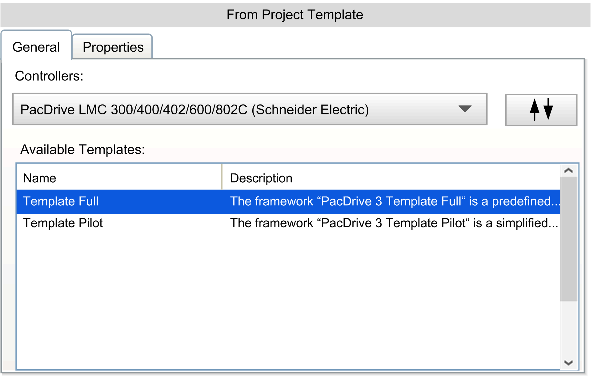
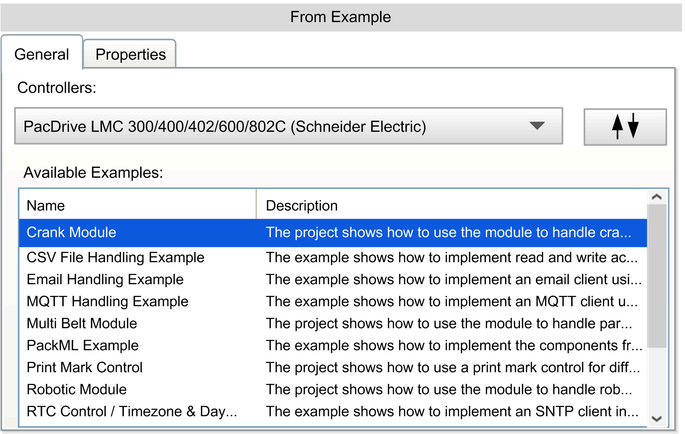

# New Project

## Overview

With the Logic Builder, use the File > New Project command to create a new project.

Alternatively, you can use Machine Expert to create a new project. For more information, refer to the [EcoStruxure  Machine Expert User Guide](../../../../../api/crossBook?lang=en-US&virtualBookName=esmeug&topicID=).

The New Project dialog box allows you to:

* Create a new project or library without template or example.
* Create a project from a project template.
* Create a project from an example.
* Select the project file format.

| Element | Description |
| --- | --- |
| Project type | Select one of the following project types:   * [**Default Project**](#D-SE-0083904__D-SE-0083904.3) * [**Library**](#D-SE-0083904__D-SE-0083904.6) * [**From Project Template**](#D-SE-0083904__D-SE-0083904.7) * [**From Example**](#D-SE-0083904__D-SE-0083904.8) * [**Empty Project**](#D-SE-0083904__D-SE-0083904.5) |
| General tab | The General tab shows typical or required fields for the selected Project type. |
| Properties tab | The Properties tab shows additional project properties of the selected Project type:   * Title * Author * Company * Version * Date * Description   Additionally, you can add a picture. |
| Select project file location | From the list of Storage Format, select the storage format for the file:   * Classic (\*.project / \*.library) stored in classic storage format * File-Based Project (\*.fbsproj | \*.fbslib) stored in file-based storage format   Define the Name of the project file and browse to the Location where you want your project file to be saved.  By default, the file extension is automatically inserted according to the selected type of project (\*.project, \*.lib or \*.fbs). A preview of the file name and the file extension is displayed in the Final Name text box according to your selection. |
| OK | Click OK to create your project. |
| Help | Click Help to open the online help. |
|  | If there are blank or invalid fields detected, a red icon marks the field and, if you move the cursor to the icon, a pop-up provides information on what to do.  NOTE: When a blank or invalid field is being detected, it is not possible to create a project. |

## Default Project

The General tab of a Default Project provides the following entries:

| Element | Description |
| --- | --- |
| Controller | Select the controller from the Controller list.  NOTE: In the drop-down list of the controller firmware you can only select firmware versions that are compatible to the version of Logic Builder. |
| Controller name | Enter the name of the controller. |
| Version | Select the version of the controller. |
| Language for SR\_Main | Select the Language for SR\_Main from a list of the IEC-61131-3 programming languages that are available in Logic Builder. |

## Library

The General tab of a Library provides the following elements:

| Element | Description |
| --- | --- |
| Title | For identification of the library: Enter the title of your library. |
| Company | For identification of the library: Enter the name of the company. |
| Version | For identification of the library: Enter the version of your library. |
| Type of library | From the list, select the type of the library:   * Common library (Refer to the [*Library Types - Common libraries* section of the *Library Development Summary* document](../../../../../api/crossBook?lang=en-US&virtualBookName=LibDevSummary&topicID=library_types).) * Container library (Refer to the [*Library Types - Container libraries* section of the *Library Development Summary* document](../../../../../api/crossBook?lang=en-US&virtualBookName=LibDevSummary&topicID=library_types).) * Interface library (Refer to the [*Library Types - Interface libraries* section of the *Library Development Summary* document](../../../../../api/crossBook?lang=en-US&virtualBookName=LibDevSummary&topicID=library_types).) * End-user library (Refer to the [*Library Types - End User libraries* section of the *Library Development Summary* document](../../../../../api/crossBook?lang=en-US&virtualBookName=LibDevSummary&topicID=library_types).) * Forward compatible library (Refer to the [*Forward Compatible Libraries* chapter of the *Functions and Libraries User Guide*](../../../../../api/crossBook?lang=en-US&virtualBookName=SoLibref&topicID=D_SE_0081226).) |
| Default namespace | Enter the default namespace of your [library.](../../../../../api/crossBook?lang=en-US&virtualBookName=SoLibref&topicID=D_SE_0081219) |
| Enforce use of namespace to access elements of this library option | Select the option to set the `'qualified-access-only'` property of the library. For further information, refer to the [*Functions and Libraries User Guide*](../../../../../api/crossBook?lang=en-US&virtualBookName=SoLibref&topicID=D_SE_0081245). |
| Create placeholder library option  Name of placeholder input field | Select the option to set the `'placeholder'` property of the library and enter a placeholder name in the input field. For further information, refer to the [*Placeholder Mechanism* chapter of the *Functions and Libraries User Guide*](../../../../../api/crossBook?lang=en-US&virtualBookName=SoLibref&topicID=D_SE_0081225). |

The Properties tab allows you to add further information, such as Author, Description and Image.

## From Project Template

When you select From Project Template, the pane on the right-hand side shows the General tab. Since a wide range of project templates is provided, the Toggle Filter button allows you to filter the project templates by controller or template types. Select a controller or a template type from the upper list, and a corresponding template from the lower list, and click OK to create a project based on this project template.

## From Example

When you select From Example, the pane on the right-hand side shows the General tab. Since a wide range of example projects is provided, the Toggle Filter button allows you to filter the examples by controller or example names. Select a controller or an example from the upper list and a corresponding example from the lower list, and click OK to create a project based on this example.

## Empty Project

The Empty Project dialog box helps you to create a project without pre-configuration of devices or logic.

EIO0000002860.10