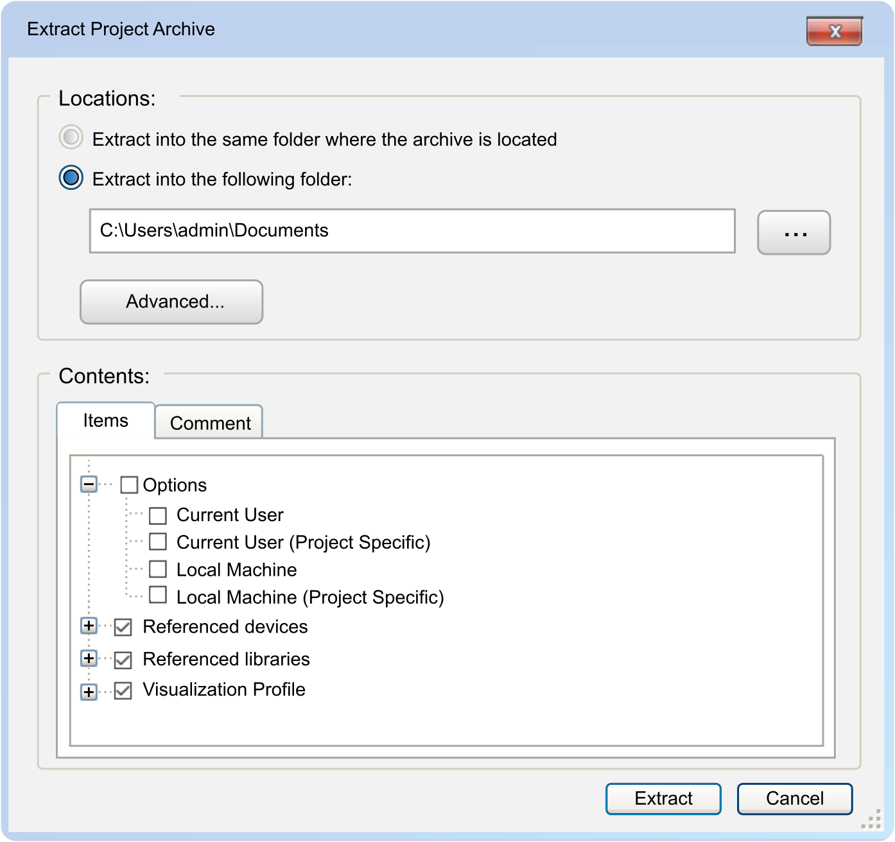
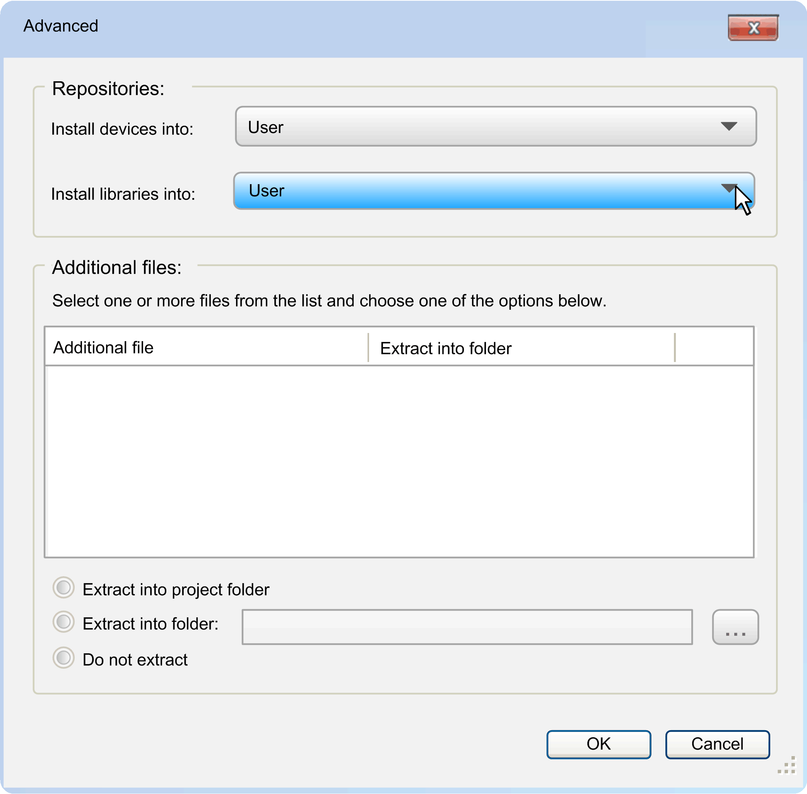

# Creating a Project from a Project Archive

## Overview

To extract an archive file, execute the File > Open Project [command](D-SE-0092075.html#D-SE-0092075) and select the option Project archive files (\*.projectarchive) from the list of supported files. Browse to a project archive file, and click Open. The Extract Project Archive dialog box is displayed that allows you to configure the location to which the archive is extracted, and which files of the archive are extracted.

## Read-only Status of Projects

When you open a project or when you create a project from a project archive, it can happen that the project is assigned the status Read-only. This can have the following reasons:

* A software component is unavailable.

  NOTE: Elements detected in the project that cannot be read or interpreted are marked by a red cross displayed next to the object in the navigator. The objects are classified as either [incomplete] to indicate that the editor still opens or [unknown] to indicate that the editor that corresponds to this object is no longer available. To help avoid overwriting the original project, the Save command is disabled for projects containing such objects. Execute the Save as command and save the legacy project with another file name to avoid unintended modifications.
* The Read-only attribute is set for the project or folder.
* The project has already been opened by another user.

## Locations Area of the Extract Project Archive Dialog Box

In the Locations area of the Extract Project Archive dialog box, choose the folder into which the archive is extracted.

* Extract into the same folder where the archive file is located.
* Extract into the following folder:

  Enter the path of the folder or click the ... button to browse for the folder.

Click the Advanced... button to open the Advanced dialog box. It allows you to determine where to extract specific and additional files of the archive.

Elements of the Advanced dialog box:

| Element | | Description |
| --- | --- | --- |
| Repositories | |  |
|  | Install devices into | Select an available device repository from the list.  The device files of the archive will be installed in the selected repositories. |
|  | Install libraries into | Select an available library repository from the list.  The library files of the archive will be installed in the selected repositories. |
| Additional files | | By default, additional files are preset with the option Do not extract.  You can select one or several file entries in the table and choose one of the options below. The remark in the table is adapted accordingly. |
|  | Extract into project folder | The selected file is extracted to the same directory as the project files. |
|  | Extract into folder | Specify the desired folder on your system or click the ... button to browse for the folder. |
|  | Do not extract | Resets the selected file to the default mode. |

Click the OK button to return to the Extract Project Archive dialog box.

## Contents Area of the Extract Project Archive Dialog Box

The Contents area of the Extract Project Archive dialog box indicates the contents of the archive.

The Items tab displays the object categories in a tree structure. Select the nodes of categories or specific objects of a category to extract them from the archive.

**Note** the following for selecting Options:

If you are extracting a project archive in EcoStruxure Machine Expert that has been created with EcoStruxure Machine Expert and Options are selected, your personal options will be overwritten by those that are saved in the project archive.

The Comment tab indicates the comment that was entered when the project archive was created.

## Extracting the Project Archive

To extract the project archive as configured in this dialog box, click the Extract button.

If a file that needs to be extracted has the same name as an existing file in the target directory, a message is displayed. You are requested to decide whether you want to replace the local file or not. You can apply this choice to the following name conflicts by activating the option Apply to all items and files.

EIO0000002860.10