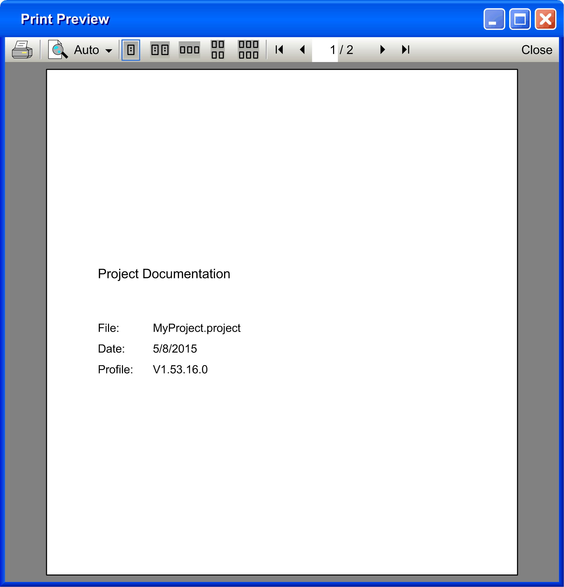
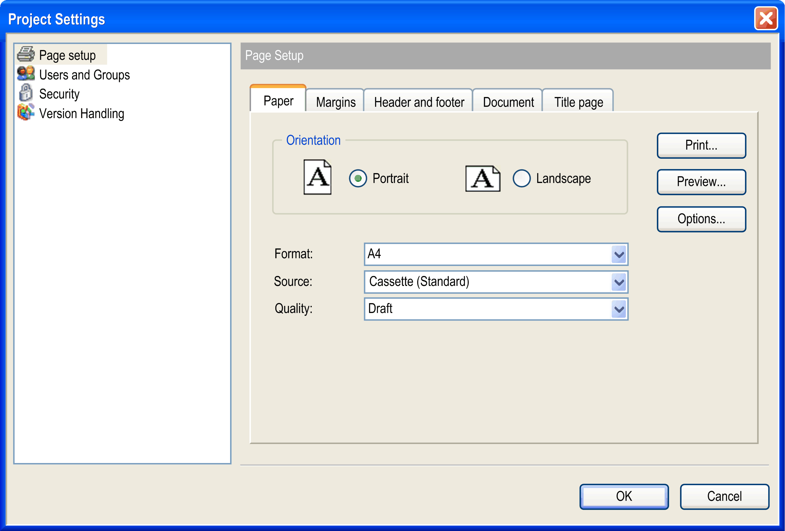
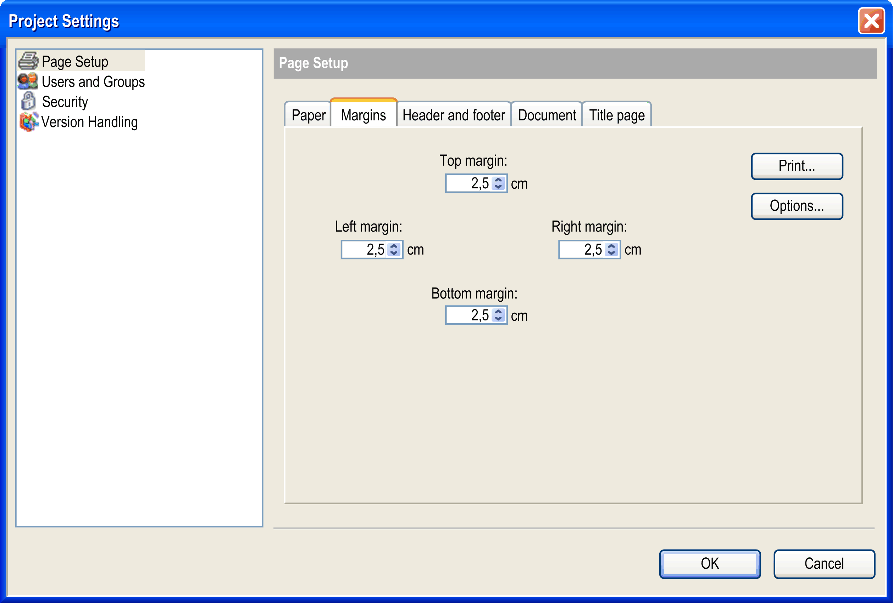
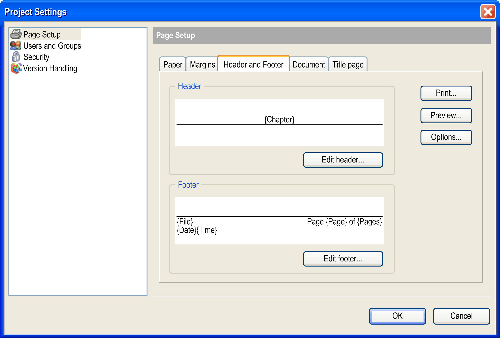
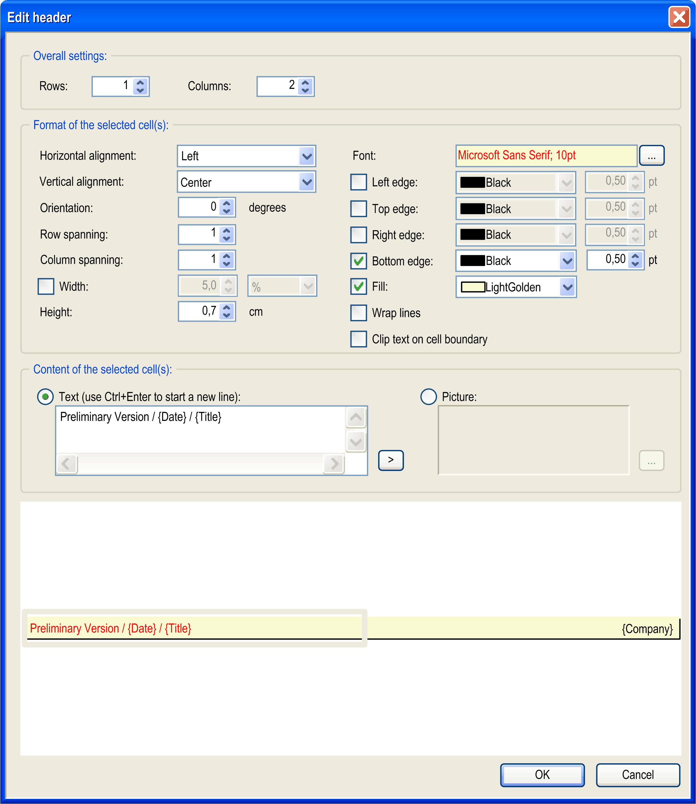
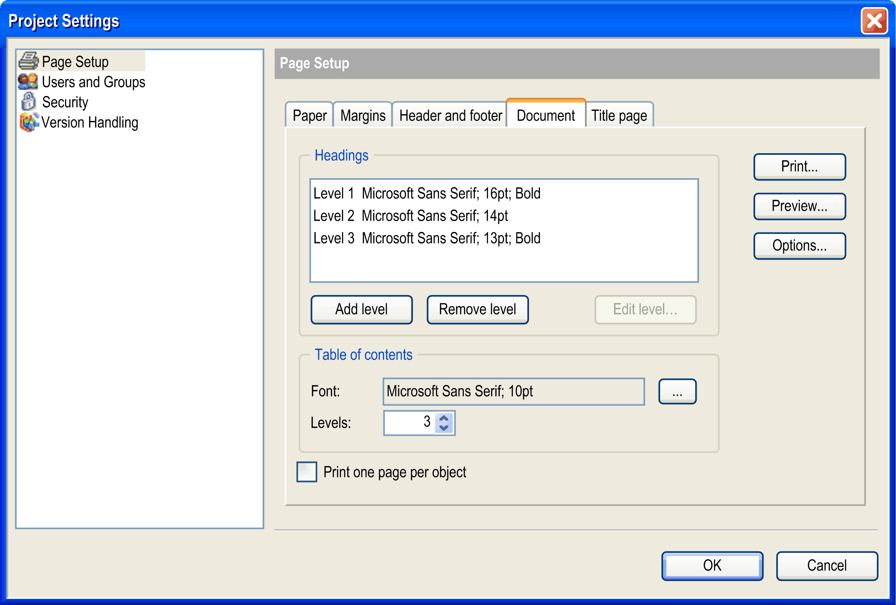
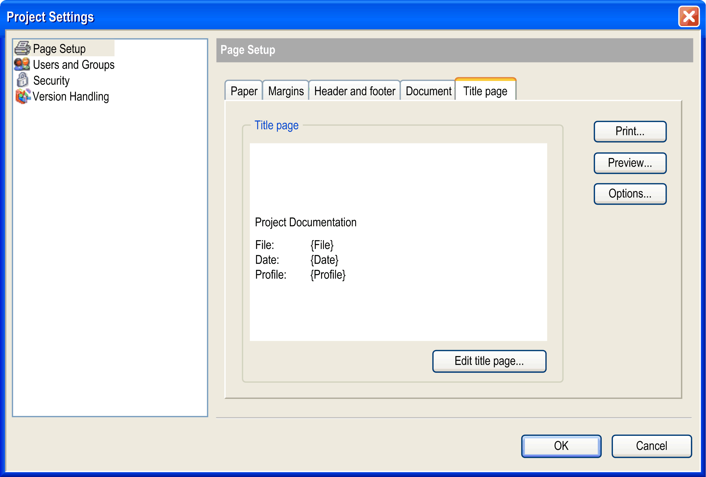

# Page Setup

## Overview

The File > Page Setup command opens the Page Setup dialog box for configuring the layout of a printout page which can be produced via the Project > Document command.

The button Preview is available to verify the configured page setup in a preview. It opens the dialog box Print Preview that allows you to browse through the configured pages.

Select the desired page number in the page field in the upper right corner. Set the desired zoom factor by the zoom list, or choose one of the view modes 1 page, 2 pages, 4 pages, 6 pages (). To print the preview on the default printer, click the button . Click the Close button to close the preview.

The following subdialogs are available on the tabs of the Page Setup dialog box:

## Paper

Paper tab

|  |  |
| --- | --- |
| Orientation | Choose whether the page should be in Portrait or Landscape orientation. |
| Format | Choose from the selection list the desired format, for example, A4. |
| Source | Choose from the selection list which source should be used for the paper feed, for example, Cassette (Standard). |
| Quality | Choose the desired print quality, for example, Draft for preliminary output. |

## Margins

Margins tab

Define here the top, bottom, left, and right page margins of the printout page in centimeters. Use the arrows to set the value down or up in 0.5 cm steps or directly edit the value fields.

## Header and Footer

Header and footer tab

You can define a header and a footer area. Use the Edit header or Edit footer button to open a dialog box where the layout details are configured:

Edit header dialog box (corresponds to Edit footer)

## Overall Settings

Header and footer area are each organized as a table. So particular rows and columns can be configured and the resulting cells be filled with text or picture. A cell is selected by clicking the respective area. A selected cell is indicated by a gray striped frame.

|  |  |
| --- | --- |
| Rows | number of rows  If the number is increased, the additional rows will be inserted below the existing one(s). |
| Columns | number of columns  If the number is increased, the additional columns will be inserted to the right of to the existing one(s). |
| Format of the selected cell(s) | Select the cell to be configured by clicking the layout field in the lower part of the dialog box. |
| Horizontal alignment | Choose whether the content of the currently selected cell horizontally should be aligned right, center or left.  Default setting: Center. |
| Vertical alignment | Choose whether the content of the currently selected cell vertically should be aligned with the top, center, or bottom.  Default setting: Center. |
| Orientation | Enter the number of degrees to which the content of the currently selected cell should be rotated around its base. The base is determined by the horizontal alignment (for example, alignment = left -> the text or image will be rotated around its leftmost, vertically centered point). The rotation is counter-clockwise.  Valid values: 0...359  Default value: 0 |
| Row spanning | Enter the number of rows which should be merged to a single row in the current column.  Example: If you enter `3`, the currently selected cell will be merged with the 2 cells below.  Default value: 1 |
| Column spanning | Enter the number of columns which should be merged to a single column in the current row.  Example: If you enter `3`, the currently selected cell will be merged with the 2 cells to its right.  Default value: 1 |
| Width | If this option is deactivated, all columns automatically obtain the same width and the sum of the column widths corresponds to the currently set page width.  If you want to change the width for a particular column, select any cell of that column, activate the Width option, and enter the desired width in cm or as percentage of the complete header or footer width. |
| Height | Defines the height of the row, where currently any cell is selected, in centimeters.  Default value: 0.5. |
| Font | The name and size of the font currently defined for the text content of the selected cell is displayed. To modify the font parameters, use the standard font configuration dialog box which can be opened by clicking the ... button. |
| Left edge, Top edge, Right edge, Bottom edge | Here the visibility, color, and line width of the borders of the currently selected cell are defined. By default they are black and have a width of 0.5 points. Additionally, by default, headers in the bottom edge and footers in the top edge are activated (set visible). |
| Fill | If this option is activated, a fill color for the currently selected cell can be chosen from the selection list. By default, a cell is not filled. |
| Wrap lines | If this option is activated, the contents of the currently selected cell will be wrapped at the end of a line if they exceed the cell width. Per default, the option is not activated that is the contents will be cut by the cell borders. |
| Content of the selected cell(s) | The currently selected cell can be filled with text or an image. Activate the desired option. |
| Text | In the edit window, enter any text which should be displayed in the currently selected cell. Use CTRL + ENTER to start a new line. Placeholders can be used which will be replaced by the actual values when the page is printed. Button > opens the list of available placeholders. |

## Placeholders for Common Information

|  |  |
| --- | --- |
| {Page} | running page number, for example, `3` |
| {Pages} | total number of pages, for example, `23` |
| {Date} | current date dd-mm-yyyy, for example, `07.07.2006` |
| {Time} | current time hh-mm, for example, `17:55` |

## Placeholders for Information as Defined in the Project Information

|  |  |
| --- | --- |
| {Path} | location of the project file, for example, `D:\projects` |
| {File} | name of the project file, for example, `mach1.project` |
| {Chapter} | chapter number + chapter name: The chapter number results from the position of the object in the tree of the Document Project dialog box. Header level 1 is used for objects which in the navigators are directly positioned below the root. Objects indented thereafter are assigned header levels `2` and below.  Example: 3.1 POU PLC\_PRG.action1  `PLC_PRG` is the third object from the Applications tree to be documented, `action1` is assigned to `PLC_PRG` |
| {Size} | size of the project file, for example, 65,42 KB (66.989 bytes) |
| {MS-DOS Name} | MS-DOS name of the project file, for example, D:\COD~1.0PR\UN2A48~1.PRO |
| {Created} | creation date of project file, for example, 07.07.2006 17:36 |
| {Changed} | date of last modification of project file, for example, 07.07.2006 17:36 |
| {Last Access} | date of last access of project file, for example, 07.07.2006 17:36 |
| {Attributes} | file attributes: R = read only / H = Hidden / A = Archive / S=System |
| {Profile} | name of the current profile |
| {Company} | company name |
| {Title} | project title |
| {Version} | project version number |
| {Default Namespace} | default namespace, relevant if project is used as library |
| {Author} | author name |
| {Description} | description |

|  |  |
| --- | --- |
| Picture | Click the ... button to open the standard dialog for browsing a file. Select the desired image file to get it inserted in the selected cell. |

## Document

Document tab

Here you define the format of the headings and which heading levels are to be presented in the table of contents.

The heading level determines how objects are printed on the page. Attributes are assigned to each level. Objects in the Devices tree or Applications tree are printed according to, and with the attributes assigned to, the heading levels. The objects directly below the root of the tree are assigned to heading level 1 for printing. Successively indented objects in the tree are assigned to successive heading levels.

|  |  |
| --- | --- |
| Headings | By default, heading levels 1...3 are already configured with default font settings (as displayed in the image above). They are shown in the Headings list.  Further levels, which may be used in the project documentation, will be displayed automatically according to the settings defined for the last level described in the list (for example, default case level 4 and further will look like level 3). However, if you want to configure those further levels explicitly, use the Add level button to add them to the heading list. This is because all heading levels shown in the list can be modified concerning their font settings. For this purpose, select the list entry and click the Edit level... button. The standard dialog box for font configuration will open where you can perform the appropriate settings.  The last entry in the heading list can be removed by clicking the Remove level button. |
| Table of contents | Define the font settings (click the Font > ... button to open the font configuration dialog box) and how many heading levels (set the desired number from the Levels list) should be presented in the Contents of the project documentation. |
| Print one page per object | Activate this option if each object should be printed on a separated page. By default, no page breaks are inserted. |

## Title Page

Title page tab

Here you define the layout of the title page of the project documentation. This page will only be added to a printout if the option Title page is activated in the Document Project dialog box.

The button Edit title page... opens the corresponding dialog box for defining the layout. For a description of the dialog box, refer to the paragraph [*Edit Header or Edit Footer*](#D-SE-0083902__D-SE-0083902.4).

EIO0000002860.10