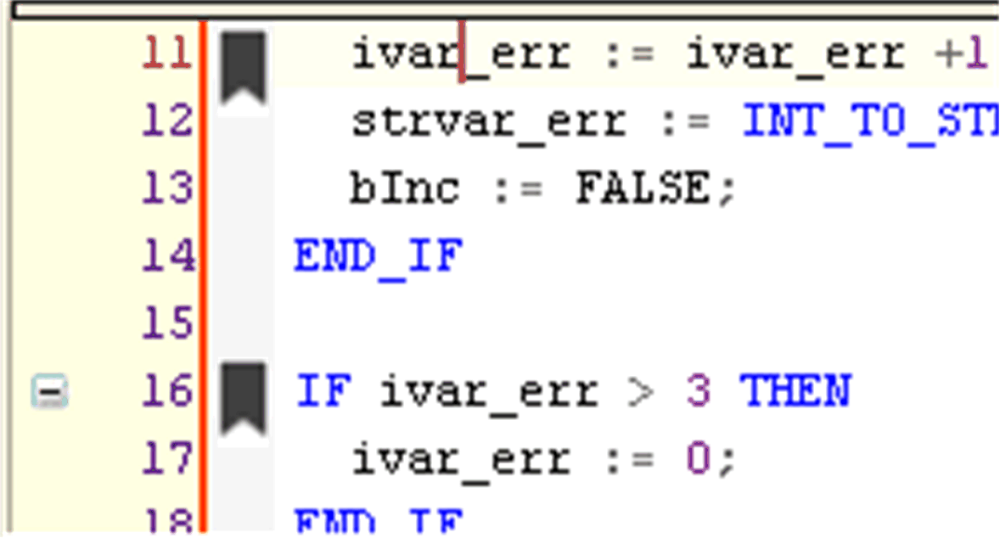

# Commands of the Bookmarks Menu

## Bookmarks Commands

The Bookmarks commands allow you to set bookmarks in text editors. Bookmarks can be assigned to one or multiple lines in an editor to make navigating in long programs easier. Via the appropriate commands you can jump to the next or previous bookmark.

The respective commands for creating bookmarks and navigating via bookmarks by default are available in a submenu of the Edit menu.

To reorganize the menu structures, use the Tools > Customize dialog box.

## Toggle Bookmark

The Toggle Bookmark command is used in a text editor to set a bookmark in the present line or in FBD, LD, IL editor on the selected network and in CFC on the selected element respectively to remove a set bookmark. The bookmark symbol at the left margin indicates that a bookmark is set.

Bookmarks in ST editor

## Next Bookmark (Active Editor)

The Next Bookmark (Active Editor) command is used in a text editor to jump to the next bookmark in the active editor.

## Next Bookmark

The Next Bookmark command is used to jump to the next bookmark in the Bookmarks view and in the project. The corresponding POU opens. The order of accessing bookmarks corresponds to the order of bookmarks in the table of the Bookmarks [view](D-SE-0105562.html#D-SE-0105562).

By default, the command is only available in the Bookmarks view. Alternatively, add this command via the Tools > Customize [menu](D-SE-0084066.html#D-SE-0084066).

## Previous Bookmark (Active Editor)

The Previous Bookmark (Active Editor) command is used in a text editor to jump to the previous bookmark in the active editor.

## Previous Bookmark

The Previous Bookmark command is used to jump to the previous bookmark in the Bookmarks view and in the project. The corresponding POU opens. The order of accessing bookmarks corresponds to the order of bookmarks in the table of the Bookmarks [view](D-SE-0105562.html#D-SE-0105562).

By default, the command is only available in the Bookmarks view. Alternatively, add this command via the Tools > Customize [menu](D-SE-0084066.html#D-SE-0084066).

## Clear All Bookmarks (Active Editor)

The Clear All Bookmarks (Active Editor) command is used to delete all bookmarks in the active editor.

## Clear All Bookmarks

The Clear All Bookmarks command is used to delete all bookmarks in the open project if a POU is open in the editor and the cursor is positioned in the POU.

By default, the command is only available in the Bookmarks view. Alternatively, add this command via the Tools > Customize [menu](D-SE-0084066.html#D-SE-0084066).

## Jumping to Bookmarks of Different Program Lines in a Project

If a project is open with multiple POUs, proceed as follows to jump to bookmarks set in different POUs:

| Step | Action | Comment |
| --- | --- | --- |
| 1 | Execute the command View > Bookmarks. | **Result**: The Bookmarks view opens. It lists all bookmarks available in the project in a table. |
| 2 | Click the Next Bookmark button . | **Result**: In the Bookmarks view, the bookmark in the row below the selected bookmark is selected.  The POU opens that contains the bookmark last selected in the table and the row with the bookmark is selected in the POU. |

As an alternative to step 2, you can also click the Previous Bookmark button  to jump to the bookmark in the project that is displayed in the row above the bookmark selected in the Bookmarks view.

EIO0000002860.10