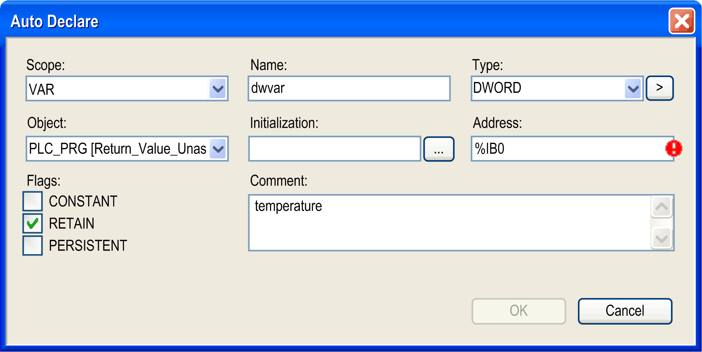

# Auto Declare...

## Overview

Default shortcut: SHIFT + F2

The Edit > Auto Declare... command opens the Auto Declare dialog box for the [declaration of a variable](../../../../../api/crossBook?lang=en-US&virtualBookName=SoMProg&topicID=D_SE_0083599). The command is available when the cursor is placed in the declaration or in the implementation part of the editor. If an already declared variable is selected, the Auto Declare dialog box will show the respective declaration data. If the cursor is placed in a line containing a not yet declared variable, the dialog box primarily just shows the variable name and the default declaration settings.

To display the dialog box automatically as soon as a line containing a not yet declared variable is left, activate the respective option in the Tools > Options > SmartCoding [dialog box](D-SE-0084050.html#D-SE-0084050).

The SmartTag function allows you to access the Declare variable command when you place the cursor over an undeclared variable in the implementation part of the ST editor and click the icon .

## Declaration of Variables

Some fields will be filled automatically with default values, but still can be edited. A red exclamation mark icon indicates fields which contain non-valid settings (for example: combination of RETAIN Flag with address specification, activated PERSISTENT Flag while not having activated the RETAIN Flag).

| Element | Description |
| --- | --- |
| Name | By default, the name of the new variable which you have entered in the editor. |
| Object | By default, the name of the currently edited [object](../../../../../api/crossBook?lang=en-US&virtualBookName=SoMProg&topicID=D_SE_0083407). To define another object where the variable declaration should be performed, select one of the available objects.  For example, if you are going to declare a global variable (Scope: `VAR_GLOBAL`). Here you will get all global variable lists already defined within the project. |
| Type | By default, INT. If this is the first variable in the line: INT. If there is already a declared variable in the line, the type of this variable is preset. For modifying this entry, you can press the > button to open the Input Assistant dialog box. It allows you to select one from all possible data types. In case you want to declare an array variable, you can use the array wizard which is offered also via the arrow button. Refer to the Declaration of Arrays [description](../../../../../api/crossBook?lang=en-US&virtualBookName=SoMProg&topicID=D_SE_0083519). |
| Scope | By default, VAR (local variable). Alternatively, set another scope from the selection list. |
| Initialization | Here you can enter an explicit initialization value for the variable. If the field is left empty, the variable will be initialized with the default value. Use the ... button to get assistance by the Initialization Value dialog box, which can be useful for the initialization of structured variables.  The dialog box lists the names of the variables (Expression), the currently applied Init value and the Data type. Basically, the default values will be displayed as defined in the declaration of the data type. To change a value, enter the desired new value in the edit field below the table, select the respective expressions and click the Apply value to selected lines button. Modified initialization values will be displayed bold. You can restore the default initialization values via the Reset selected lines to default values button.  Example: A variable `struvar` of type `myTestDUT` (which is a structure) is declared. The Initialization Value dialog box shows the default initialization values, except component `wPart3` for which the value has already been modified. Currently a new initialization value `1.5` is prepared to be applied on component `rVoltage2`.    After confirmation with OK, the Initialization Value dialog box is closed and the initialization values are applied to the Auto Declare dialog box. Note that only variables with modified initial values are reinitialized explicitly. |
| Address | By default, empty.  You can add an IEC address of the application for the variable that is being declared ([AT declaration](../../../../../api/crossBook?lang=en-US&virtualBookName=SoMProg&topicID=D_SE_0083604)).  Example: `%IX1.0`  NOTE: You can add an IEC address only for the following validity ranges:  * Local variable (VAR) * Global variable (VAR\_GLOBAL) |
| Comment | If applicable, enter a comment. You can format the comment text with line breaks by using the keyboard shortcut CTRL+ENTER. It will appear in the declaration part of the object in the line above variable declaration. |
| Flags | CONSTANT, RETAIN, PERSISTENT:  Activate the desired option to define the type of [variable](../../../../../api/crossBook?lang=en-US&virtualBookName=SoMProg&topicID=D_SE_0083608). The respective attribute will be added to the keyword set in the Scope field, for example `VAR CONSTANT`.  If the Scope is set to `VAR_GLOBAL` and you set the PERSISTENT flag as long as no persistent variables list exists for the application, the entry <... Create object> is added to the Object list. If you select this entry, the dialog box Add object opens for creating a [persistent variables list](D-SE-0084167.html#D-SE-0084167). |

EIO0000002860.10