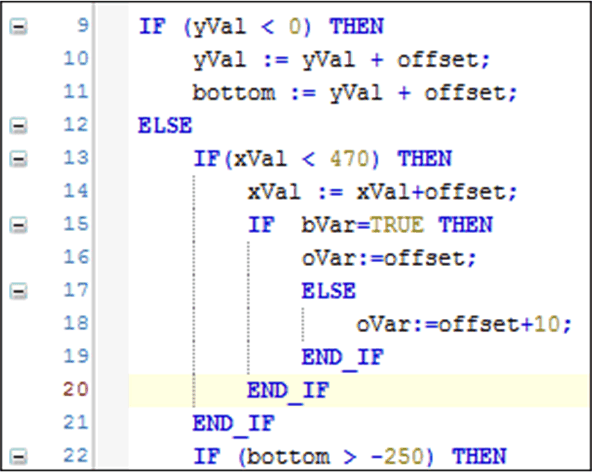

# Commands of the Text Editor

## Overview

Access the commands of the text editor via the menu Edit > Advanced. They are available when the focus is within a text editor.

## Overwrite Mode

Use this command to toggle between overwrite mode (option activated) and insert mode (option deactivated). When editing in overwrite mode, the existing characters will be overwritten; otherwise the new characters will be inserted.

## Go To Line...

Use this command to jump to a certain line within a text editor. The Go To Line dialog box opens where you can insert the desired line number. After closing the dialog box with OK, the cursor will be set to the start of the corresponding line.

## Insert File as Text...

Use the Insert File as Text... command to insert the content of a text file to the open text editor. The standard dialog box for browsing for a file (Insert File) opens. It allows you to search for the desired file, which must be in text format. The file contents will be inserted at the current cursor position.

## Make Uppercase

The Make Uppercase command sets the marked text to uppercase.

## Make Lowercase

The Make Lowercase command sets the currently marked text to lowercase.

## Go to Matching Bracket

The Go to Matching Bracket command sets the cursor at the next matching bracket. This is valid for brackets in program lines as well as for [bracket scopes](D-SE-0084046.html#D-SE-0084046). To display bracket scopes, activate the option Matching brackets in the Text area tab of the Text editor Options dialog box (menu Tools > Options).

## Select to Matching Bracket

The Select to Matching Bracket command selects the code lines up to the next matching bracket. This is valid for brackets in program lines as well as for [bracket scopes](D-SE-0084046.html#D-SE-0084046). To display bracket scopes, activate the option Matching brackets in the Text area tab of the Text editor Options dialog box (menu Tools > Options).

## Collapse All

The Collapse all command collapses the indented code in the text editor. Only the top level of the code remains visible.

Click a minus-symbol at an indented code section to collapse this section.

By default, the command is not available in the menus. You can add this command via the Tools > Customize [menu](D-SE-0084066.html#D-SE-0084066).

## Expand All

The Expand all command expands the collapsed code in the text editor. Thus, the code is displayed.

Click a plus-symbol at an indented code section to expand this section.

By default, the command is not available in the menus. You can add this command via the Tools > Customize [menu](D-SE-0084066.html#D-SE-0084066).

## Comment Out Selected Lines

The Comment Out Selected Lines command inserts comment marks (`//`):

* At the beginning of the line if the cursor is located in a line of the implementation part.
* At the beginning of several lines if multiple lines are selected.

## Uncomment Selected Lines

The Uncomment Selected Lines command removes comment marks (`//`):

* From the beginning of the line if the cursor is located in a line of the implementation part.
* From the beginning of several lines if multiple lines are selected.

## View Whitespace

The View Whitespace command enables you to see non-printable characters in the text editor. This is indicated by the icon in front of the command in the highlighted menu. Tabs are displayed as arrows, spaces are displayed as dots.

## View Indentation Guides

The View Indentation Guides command enables you to see the indentation spans in text editor as vertical dotted lines. This is indicated by a check mark being displayed in front of the command in the menu. Define the Indent width in the Tools > Options > Text editor [dialog box](D-SE-0084046.html#D-SE-0084046__D-SE-0084046.3).

Indentation guides in ST editor:

## Enable Inline Monitoring

The Enable Inline Monitoring command enables or disables the inline monitoring function. It has the same function as the Enable inline monitoring option in the Monitoring tab of the Tools > Options > Text editor [dialog box](D-SE-0084046.html#D-SE-0084046__D-SE-0084046.6).

EIO0000002860.10