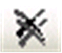

# Messages

## Overview

The View > Messages command opens the Messages view.

Messages describe detected errors , advisories (warnings) , or just information . In the headline of the Messages view, the number of errors and advisories detected, as well as information messages, is displayed.

Messages are categorized after the recognized component or functionality. For example, messages on syntactical checks of the project are generated in categories Precompile. Messages on the compilation of the project are generated in category Build (for example compile errors, code size). There can also be messages on the import of a project, on the library manager, and so on.

You can select the desired message category from the selection list below Messages. Precompile messages are displayed in the field below the messages table.

To delete the messages of a specific category, click the Delete all messages in this category button .

To delete the messages of a all categories, click the Delete all messages in all categories button .

The messages belonging to the chosen category will be listed in the messages table with the following information: Description (message text), Project (project name), Object (name of concerned object within the project), Position (for example line number, network number, and so on, within the object).

If you want to fade out or in a certain type of messages in the table, use the buttons in the upper right corner: error(s), warning(s), message(s). These buttons in each case show the number of available messages. Click a button to toggle the display of the respective message type.

You can navigate between the messages currently shown in the table or jump from a message to the position in the concerned object by using the commands Next message, Previous message and Go To Source Position (for details, refer to [Commands of the Messages View](D-SE-0083911.html#D-SE-0083911)). Double-click a message to navigate to the source position. In order to get to the source position of a precompile message, click the blue and underlined message text.

EIO0000002860.10