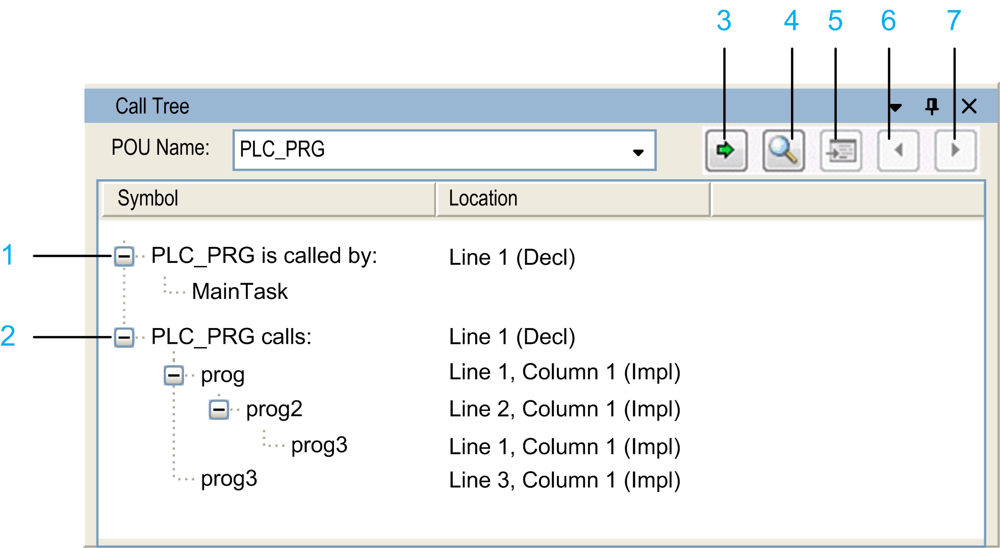

# Call Tree

## Overview

The View > Call Tree command opens the Call Tree view.

The figure provides an example of a call tree for the POU PLC\_PRG:

**1** Root node for the elements that are called by the POU PLC\_PRG

**2** Root node for the elements that call the POU PLC\_PRG

**3** **Find POU** button

**4** **Pick POU from input assistant** button

**5** **Show source position of selected POU** button

**6** **Show source position of next POU** button

**7** **Show source position of previous POU** button

The call tree is available even before compiling the application. It is a static representation of the POUs calling and those called by the POU specified in the POU Name box. It consists of two root nodes, each containing the respective call order as indented nodes. The tree structure allows you to detect recursive calls.

The Call Tree view contains the following elements:

| Element | Description |
| --- | --- |
| Call Tree toolbar | |
| POU Name | Name of the POU.  You can enter the name manually, or drag the name from another view or click the Pick POU from input assistant button.  The list contains the POU names that you already specified. |
| Find POU button | Click the Find POU button to find the POU you entered in the POU Name box. |
| Pick POU from input assistant button | Click the Pick POU from input assistant button to open the Input Assistant dialog box that lists the POUs available in the project. Select a POU and click OK to update the call tree for the selected POU. |
| Show source position of selected POU button | Click the Show source position of selected POU button to jump to the position in the source code of the program where the POU occurs. |
| Show source position of next POU button  F4 key | Click the Show source position of next POU button or hit the F4 key of the keyboard to jump to the next occurrence of the POU in the call structure. The associated source code position opens in the respective editor. |
| Show source position of previous POU button  Shift + F4 key | Click the Show source position of previous POU button or hit the Shift + F4 keys of the keyboard to jump to the previous occurrence of the POU in the call structure. The associated source code position opens in the respective editor. |
| Call Tree table | |
| Symbol column | <POU name> is called by  The call order is displayed below this node. The bottom entry in this tree structure shows the start of the calls.  <POU name> calls  The elements called by this POU are displayed below this node. The bottom entry in this tree structure shows the end of the call chain. |
| Location column | For the root node: This value indicates the line numbers of the declaration (Decl) of the POU.  For the POUs calling and those called below the root node: This value indicates the line number, column number, and network number of the position, depending on the implementation language. |
| Contextual menu for the entry selected in the Call Tree table | |
| Collapse all command | The entries in the call tree are collapsed, except for the two root nodes. |
| Show source position command | Jump to the position in the source code of the program where the POU occurs. |
| Set as new root command | The entry selected in the call tree is converted into the root node and displayed as <POU name>. The tree is refreshed automatically for the new root nodes. |

In contrast to this static Call Tree that provides call information about a POU, the Call Stack [view](D-SE-0083919.html#D-SE-0083919) provides immediate information when stepping through a program. The Call Stack shows the full call path of the current position that is reached.

EIO0000002860.10